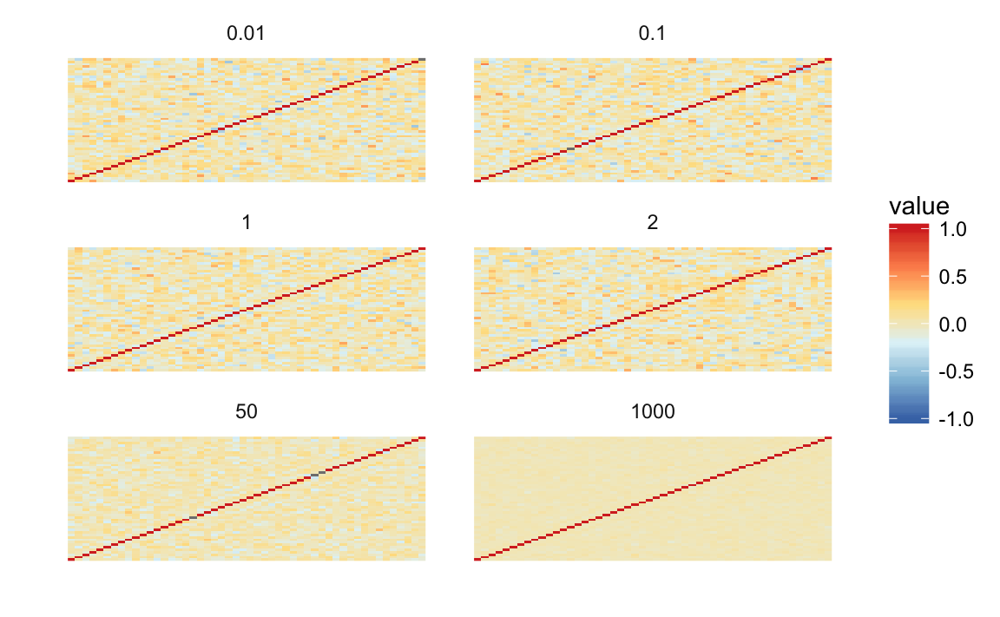
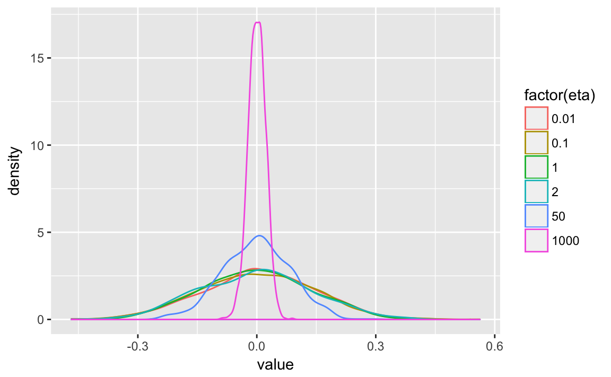

# (PART) Appendix {-}


```r
library("tidyverse")
library("stringr")
```

## Parameters

Category                Description
----------------------- -----------------------------------------------
modeled data            Data, assigned distribution
unmodeled data          Data not given a distribution
modeled parameters      Parameters with an informative prior distribution
unmodeled parameters    Parameters with non-informative prior distribution
derived quantities      Variables defined deterministicically

See @GelmanHill2007a [p. 366]


## Miscellaneous Mathematical Background

### Location-Scale Families

In a [location-scale family]( https://en.wikipedia.org/wiki/Location%E2%80%93scale_family) of distributions, if the random variable $X$ is distributed with mean 0 and standard deviation 1, then the random variable $Y$,
$$
Y = \mu + \sigma X ,
$$
has mean $\mu$ and standard deviation $\sigma$.

**Normal distribution:** Suppose $X \sim \dnorm(0, 1)$, then
$$
Y = \mu + \sigma X,
$$
is equivalent to $Y \sim \dnorm(\mu, \sigma)$ (normal with mean $\mu$ and standard deviation $\sigma$).

** Student-t distribution** (including Cauchy):
$$
\begin{aligned}[t]
X &\sim \dt{\nu}(0, 1) \\
Y &= \mu + \sigma X 
\end{aligned}
$$
implies
$$
Y \sim \dt{\nu}(\mu, \sigma),
$$
i.e. $Y$ is distributed Student-$t$ with location $\mu$ and scale $\sigma$.


In Stan, it can be useful parameterize distributions in terms of a mean 0, scale 1 parameters, and separate parameters for the locations and scales. E.g. with normal distributions,
```
parameters {
  real mu;
  real<lower = 0.0> sigma;
  vector[n] eps;
}
transformed parameters {
  vector[n] y;
  y = mu + sigma * eps;
}
model {
  eps ~ normal(0.0, 1.0);
}
```

### Scale Mixtures of Normal Distributions

Some commonly used distributions can be represented as scale mixtures of normal distributions.
For formal details of scale mixtures of normal distributions see @West1987a.
Distributions that are scale-mixtures of normal distributions can be written as,
$$
Y \sim \dnorm(\mu, \sigma_i^2) \\
\sigma_i \sim \pi(\sigma_i)
$$
As its name suggests, the individual variances (scales) themselves, have a distribution.

Some examples:

- Student-t
- Double Exponential
- Horseshoe or Hierarchical Shrinkage (HS)
- Horseshoe Plus or Hierarchical Shrinkage Plus (HS+)

Even when analytic forms of the distribution are available, representing them as scale mixtures of normal distributions may be convenient in modeling.
In particular, it may allow for drawing samples from the distribution easily. 
And in HMC, it may induce a more tractable posterior density.


### Covariance-Correlation Matrix Decomposition

The suggested method for modeling covariance matrices in Stan is the separation strategy which decomposes a covariance matrix $\Sigma$ can be decomposed into a standard deviation vector $\sigma$,  and a correlation matrix $R$ [@BarnardMcCullochMeng2000a],
$$
\Sigma = \diag(\sigma) R \diag(\sigma) .
$$
This is useful for setting priors on covariance because separate priors can be set 
for the scales of the variables via $\sigma$, and the correlation between them,
via $R$.

The [rstanarm](https://github.com/stan-dev/rstanarm/wiki/Prior-distributions) `decov` prior goes further and decomposes the covariance matrix into a correlation matrix, $\mat{R}$, 
a diagonal variance matrix $\mat{\Omega}$ with trace $n \sigma^2$, a scalar global variance $\sigma^2$, and a simplex $\vec{\pi}$ (proportion of total variance for each variable):
$$
\begin{aligned}[t]
\mat{\Sigma} &= \mat{\Omega} \mat{R}  \\
\diag(\mat{\Omega}) &= n \vec{\pi} \sigma^2
\end{aligned}
$$
Separate and interpretable priors can be put on $\mat{R}$, $\vec{\pi}$, and $\sigma^2$.

The LKJ (Lewandowski, ) distribution is a distribution over correlation coefficients,
$$
R \sim \dlkjcorr(\eta) ,
$$
where
$$
\dlkjcorr(\Sigma | \eta) \propto \det(\Sigma)^{(\eta - 1)} .
$$

This distribution has the following properties:

- $\eta = 1$: uniform correlations
- $\eta \to \infty$: approaches the identity matrix
- $0 < \eta < 1$: there is a trough at the identity matrix with higher probabilities placed on non-zero correlations.
- For all positive $\eta$ ($\eta > 0$), $\E(R) = \mat{I}$.


```r
lkjcorr_df <- function(eta, n = 2) {
  out <- as.data.frame(rlkjcorr(n, eta))
  out$.row <- seq_len(nrow(out))
  out <- gather(out, .col, value, -.row)
  out$.col <- as.integer(str_replace(out$.col, "^V", ""))
  out$eta <- eta
  out  
}

lkjsims <- purrr::map_df(c(0.01, 0.1, 1, 2, 50, 1000), lkjcorr_df, n = 50)
```

This simulates a single matrix from the LKJ distribution with different values of $\eta$. 
As $\eta \to \infty$, the off-diagonal correlations tend towards 0, and the correlation matrix to the identity matrix.

```r
ggplot(lkjsims,
       aes(x = .row, y = .col, fill = value)) +
  facet_wrap(~ eta, ncol = 2) +
  scale_fill_distiller(limits = c(-1, 1), type = "div", palette = "RdYlBu") +
  geom_raster() +
  theme_minimal() +
  theme(panel.grid = element_blank(), axis.text = element_blank()) +
  labs(x = "", y = "")
```



The density of the off-diagonal correlations.

```r
lkjsims %>%
  filter(.row < .col) %>%
  ggplot(aes(x = value, colour = factor(eta))) +
  geom_density()
```



For other discussions of the LKJ correlation distribution, see these:

- https://stats.stackexchange.com/questions/2746/how-to-efficiently-generate-random-positive-semidefinite-correlation-matrices/125017#125017
- http://www.zinkov.com/posts/2015-06-09-where-priors-come-from/
- http://www.psychstatistics.com/2014/12/27/d-lkj-priors/


### QR Factorization

For a full-rank $N \times K$ matrix, the QR factorization is 
$$
\mat{X} = \mat{Q} \mat{R} 
$$
where $\mat{Q}$ is an orthonormal matrix such that $\mat{Q}\T \mat{Q}$ and 
$\mat{R}$ is an upper triangular matrix.

Stan function
@Stan2016a suggest writing it is 
$$
\begin{aligned}[t]
\mat{Q}^* = \mat{Q} \times \sqrt{N - 1} \\
\mat{R}^* = \frac{1}{\sqrt{N - 1}} \mat{R}
\end{aligned}
$$

This is used for solving linear model.

Suppose $\vec{\beta}$  is a $K \times 1$ vector, then
$$
\vec{eta} = \mat{x} \vec{\beta} = \mat{Q} \mat{R} \vec{\beta} = \mat{Q}^* \mat{R}^* \vec{\beta} .
$$
Suppose $\mat{theta} = \mat{R}^* \vec{\beta}$, then $\vec{eta} = \mat{Q}^* \mat{\theta}$ and $\vec{beta} = {\mat{R}^*}^{-1} \mat{\theta}$.

[rstanarm](https://cran.r-project.org/web/packages/rstanarm/vignettes/lm.html) provides a prior for a normal linear model which uses the QR decomposition to parameterize a prior in terms of $R^2$.


Stan functions:

- `qr_Q(matrix A)`
- `qr_R(matrix A)`

See @Stan2016a [Sec 8.2]

### Cholesky Decomposition

The [Cholesky decomposition](https://en.wikipedia.org/wiki/Cholesky_decomposition) of a
positive definite matrix $A$ is,
$$
\mat{A} = \mat{L} \mat{L}\T ,
$$
where $\mat{L}$ is a lower-triangular matrix.

- It is similar to a square root for a matrix.
- It often more numerically stable or efficient to work with the Cholesky decomposition, than with
    a covariance matrix. When working with the covariance matrix, numerical precision can 
    result in a non positive definite matrix. However, working with $\mat{L}$ will ensure
    that $\mat{A} = \mat{L} \mat{L}\T$ will be positive definite.
    
- In Stan

    - Types types  `cholesky_factor_cov`, and `cholesky_factor_corr` represent the Cholesky factor
        of covariance and correlation matrices, respectively.
    - Cholesky decomposition function is `cholesky_decompose(matrix A)`
    
- Multiple functions in Stan are parameterized with Cholesky decompositions instead of or in addition
    to covariance matrices. Use them if possible; they are more numerically stable.
    
    - `lkj_corr_chol_lpdf`
    - `multi_normal_cholesky_lpdf`
    
The Cholesky factor is used for sampling from a multivariate normal distribution using i.i.d. standard normal distributions.
Suppose $X_1, \dots, X_N$ are $N$ i.i.d. standard normal distributions, $\mat{\Omega}$ is an $N \times N$ lower-triangular matrix such that $\mat{\Omega} \mat{Omega}\T = \mat{\Sigma}$, and $\mu$ is an $N \times 1$ vector, then
$$
\vec{\mu} + \mat{\Omega} X \sim \dnorm(\vec{\mu}, \mat{\Sigma})
$$


See @Stan2016a [p. 40, 147, 241, 246]
    
