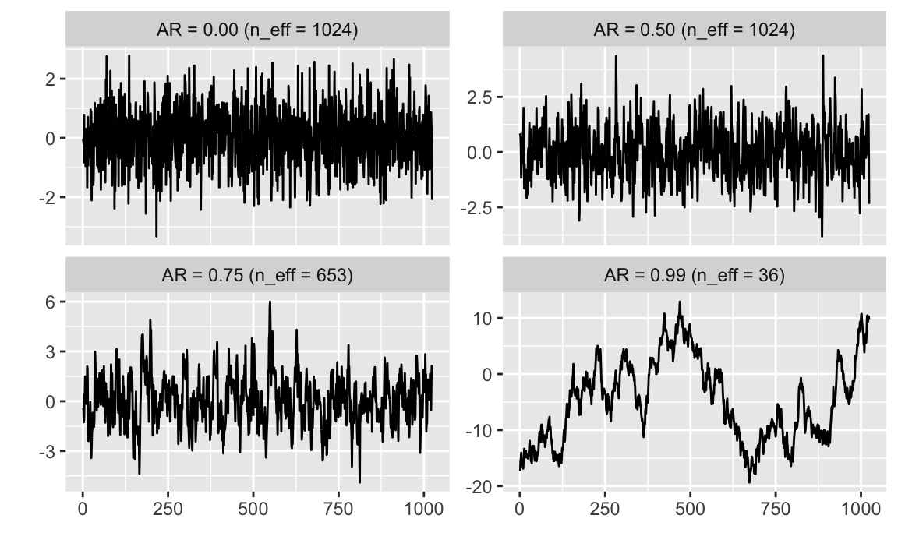

---
output: html_document
editor_options: 
  chunk_output_type: console
---
# MCMC Diagnostics

There are two parts of checking a Bayesian model:

1. diagnostics: Is the sampler working? Is it adequately approximating the specified posterior distribution: $p(\theta | D)$.
2. model fit: Does the model adequately represent the data?

This chapter covers the former.

Also see the **[bayesplot](https://cran.r-project.org/package=bayesplot)** vignette [Visual MCMC diagnostics using the bayesplot package](https://cran.r-project.org/web/packages/bayesplot/vignettes/MCMC-diagnostics.html), which though specific to the provides, provides a good overview of these diagnostics.

## Prerequisites {-}


```r
library("rstan")
library("tidyverse")
```


## Reparameterize Models

1. Reduce correlation between parameters (e.g. see `mcmc_pairs`)
2. Put parameters on the same scale. The samplers work best when all parameters are roughly on the same scale, e.g. $\approx 1$. Try to avoid situations where parameters are orders of magnitude different, e.g. 1e-5 and 1e+10.
3. Increase the informativeness of priors. If parameters are too uninformative, the posterior distribution may have wide tails that hamper sampling. One way of thinking about it is that the model is only "weakly identified" and requires either more data or more informative priors to estimate.

## Convergence Diagnostics

Under certain conditions, MCMC algorithms will draw a sample from the target posterior distribution after it has converged to equilibrium.
However, since in practice, any sample is finite, there is no guarantee about whether its converged, or is close enough to the posterior distribution.

In general there is no way to prove that the sampler has converged [^converge].
However, there are several statistics that indicate that a sampler has not converged.

[^converge]: This is also the case in optimization with non-convex objective functions.

### Potential Scale Reduction ($\hat{R}$)

In equilibrium, the distribution of samples from chains should be the same regardless of the initial starting
values of the chains [@Stan2016a, Sec 28.2].

One way to check this is to compare the distributions of multiple chains---in equilibrium they should all have the same mean.
Additionally, the split $\hat{R}$ tests for convergence by splitting the chain in half, and testing the hypothesis that the means are the same in each half. This tests for non-stationarity within a chain.

See @Stan2016a [Sec 28.2] for the equations to calculate these.

**TODO:** Examples of passing and non-passing $\hat{R}$ chains using fake data generated from known functions with a given autocorrelation.


**Rule of Thumb:** The rule of thumb is that R-hat values for all less than 1.1 [source](https://cran.r-project.org/web/packages/rstanarm/vignettes/rstanarm.html).
Note that **all** parameters must show convergence.
This is a necessary but not sufficient condition for convergence.


### References

- @BDA3 [p. 267]
- @Stan2016a [Ch 28.] for how Stan calculates Hat, autocorrelations, and ESS.
- @GelmanRubin1992a introduce the R-hat statistic

## Autocorrelation, Effective Sample Size, and MCSE

MCMC samples are dependent.  This does not effect the validity of inference on the posterior if the samplers has time to explore the posterior distribution, but it does affect the efficiency of the sampler.

In other words, highly correlated MCMC samplers requires more samples to produce the same level of Monte Carlo error for an estimate.


### Effective Sample Size

The effective sample size (ESS) measures the amount by which autocorrelation in samples increases uncertainty (standard errors) relative to an independent sample.
Suppose that the $\rho^2_t$ is the ACF function of a sample of size $N$, the effective sample size, $N_eff$, is
$$
N_{eff} = \frac{N}{\sum_{t = -\infty}^\infty \rho_t} = \frac{N}{1 + 2 \sum_{t = -\infty}^\infty \rho_t}.
$$
**TODO** show that if $\rho_t = 1$ for all $t$ then $N_eff = 1$, and if $\rho_t = 0$ for all $t$ then $N_eff = N$

Computing the effective sample size requires calculating an autocorrelation.
A multi-chain estimate of the autocorrelation is found by computing the *variogram* with the correlations for all lags,
$$
V_t = \frac{1}{m(n - t)} \sum_{j = 1}^m \sum_{i = t + 1}^n (\psi_{i,j} - \psi_{i - t,j})^2
$$
The estimate of the autocorrelations $\hat{\rho}_t$ is
$$
\hat{\rho}_t = 1 - \frac{V_t}{2 \widehat{\mathrm{var}}^+}
$$
The estimates of the autocorrelations can be noisy, so $\hat{\rho}_t$ are summed from 0, to the last $t$ such that $\rho$ is positive ($T$),
$$
\hat{n}_{eff} = \frac{mn}{1 + 2 \sum_{t = 1}^T \hat{\rho}_t}
$$

- See also @Stan2016a [Sec 28.4], @Geyer2011a, and @BDA3 [Sec 11.5].
- This isn't the only way to calculate the effective sample size. The **[coda](https://cran.r-project.org/package=coda)** package function [coda](https://www.rdocumentation.org/packages/coda/topics/effectiveSize) uses a different method. The differences are due to how the autocorrelation is calculated.

**Example:** Comparison of the effective sample sizes for data generated with various levels of autocorrelation.
The package `rstan` does not directly expose the function it uses to calculate ESS, so this `ess` function does so (for a single chain).

```r
ess <- function(x) {
  N <- length(x)
  V <- map_dbl(seq_len(N - 1),
          function(t) {
             mean(diff(x, lag = t) ^ 2, na.rm = TRUE)
          })
  rho <- head_while(1 - V / var(x), ~ . > 0)
  N / (1 + sum(rho))
}
n <- 1024
sims <- map_df(c(0, 0.5, 0.75, 0.99),
  function(ar) {
    tibble(ar = ar,
           y = if (ar == 0) {
             rnorm(n) 
           } else {
             as.numeric(arima.sim(list(ar = ar), n))
           },
           x = seq_along(y),
           n_eff = ess(y),
           label = sprintf("AR = %.2f (n_eff = %.0f)", ar, n_eff))
  }
)
```


```r
ggplot(sims, aes(x = x, y = y)) +
  geom_line() +
  facet_wrap(~ label, scales = "free_y") +
  labs(x = "", y = "")
```



## Thinning

Since the autocorrelation tends to decrease as the lag increases, thinning samples will reduce the final autocorrelation in the sample while also reducing the total number of samples saved.
Due to the autocorrelation, the reduction in the number of effective samples will often be less than number of samples removed in thinning.

Both of these will produce 1,000 samples from the posterior, but effective sample size of $B$ will be greater than the effective sample size of $A$, since after thinning g the autocorrelation in $B$ will be lower.

- *A* Generating 1,000 samples after convergence and save all of them
- *B* Generating 10,000 samples after convergence and save every 10th sample

In this case, A produces 10,000 samples, and B produces 1,000.
The effective sample size of A will be higher than B.
However, due to autocorrelation, the proportional reduction in the effective sample size in B will be less than the thinning: $N_{eff}(A) / N_{eff}(B) < 10$.

- *A* Generating 10,000 samples after convergence and save all of them
- *B* Generating 10,000 samples after convergence and save every 10th sample

Thinning trades off sample size for memory, and due to autocorrelation in samples, loss in effective sample size is less than the loss in sample size.

Thinning has become less of an issue as memory has become less of a computational constraint, and samplers have become more efficient.

The following example simulates random values from an autocorrelated series, and applies different levels of thinning.
Thinning is always decreasing the effective sample size.
However, the number of effective samples per sample (`n_eff / n`) increases until the thinning is large enough that the thinned samples are uncorrelated.

```r
thin_ess <- function(thin, x) {
  if (thin > 1) {
    # keep only thinned rows
    x_thinned <- x[(seq_len(length(x)) %% thin) == 1]
  } else {
    x_thinned <- x
  }
  tibble(thin = thin,
         n = length(x_thinned),
         n_eff = ess(x_thinned),
         `n_eff / n` = n_eff / n)
}

map_df(c(1, 2, 4, 8, 16, 32), thin_ess,
       x = arima.sim(list(ar = .9), 4096))
#> # A tibble: 6 x 4
#>    thin     n n_eff `n_eff / n`
#>   <dbl> <int> <dbl>       <dbl>
#> 1    1.  4096 1266.       0.309
#> 2    2.  2048 1087.       0.531
#> 3    4.  1024  791.       0.773
#> 4    8.   512  512.       1.00 
#> 5   16.   256  256.       1.00 
#> 6   32.   128  128.       1.00
```

- @BDA3 [p. 282-283]
- @Stan2016a [p. 354-355]

### Traceplots

Trace plots are a time series of sampler iterations, e.g. as produced by [bayesplot](https://www.rdocumentation.org/packages/bayesplot/topics/mcmc_trace).

These can, but **should not**, be used to assess convergence,

- such visual inspection is 'notoriously unreliable' [@BDA3, p. 285]
- it cannot scale to many parameters

Trace plots may be useful for diagnosing convergence problems *after* $\hat{R}$ or or $n_eff$ indicates problems. Some possible issues to check in these plots are

- multimodality (the traceplot jumps between different distributions)
- wide posterior tails (the traceplot shows regions where the sampler will reach and have difficulty returning to the main distribution)

### Monte Carlo Standard Error (MCSE)

The Monte Carlo standard error is the uncertainty about a statistic in the sample due to sampling error.
With a independent sample of size $N$, the MCSE for the sample mean is
$$
MCSE(\bar{\theta}) = \frac{s}{\sqrt{N}}
$$
where $s$ is the sample standard deviation.

However, MCMC are generally not independent, and the MCSE will be higher than that
of an independent sample. One way to calculate the MCSE with autocorrelated samples is to use the effective sample size instead of the sample size,
$$
MCSE(\bar{\theta}) = \frac{s}{\sqrt{N_{eff}}}
$$

An MCSE estimator for the mean is
$$
\mathrm{MCSE}(\hat{\theta}) = \frac{\sd(\theta)}{\sqrt{n_{neff}}}
$$
An MCSE estimator for any posterior probability, where $\hat{p} = \Pr(f(\theta))$, follows from the standard error of a proportion, but using the effective sample size,
$$
MCSE(\hat{p}) = \sqrt{\hat{p} (1 - \hat{p}) / n_{eff}}
$$

See @FlegalHaranJones2008a and the **[mcmcse](https://cran.r-project.org/package=mcmcse)** for methods to calculate MCMC standard errors for means and quantiles using sub-sampling methods.

@FlegalHaranJones2008a argues for using ESS as a stopping rule and convergence diagnostic for Bayesian inference.

The estimation of standard errors for quantiles, as would be used in is more complicated. See the package **[mcmcse](https://cran.r-project.org/package=mcmcse)** for Monte Carlo standard errors of quantiles (though calculated in a different method than **rstan**).

- @BDA3 [Sec. 10.5]
- @FlegalHaranJones2008a
- [Talk by Geyer on MCSE ](http://www.stat.umn.edu/geyer/mcmc/talk/mcmc.pdf)


## HMC-NUT Specific Diagnostics

Hamiltonian Monte Carlo (HMC), and the No-U-Turn Sampler (HMC-NUTS) in particular, produce several diagnostics that indicate that the sampler is breaking and, thus, not sampling from the posterior distribution.
This is unusual, as most Bayesian sampling methods do not give indication of whether they are working well, and all that can be checked are the properties of the samples themselves with methods such $\hat{R}$.

Three specific HMC-NUTS diagnostics are

1. divergent transitions
2. maximum tree-depth
3. Bayesian fraction of missing information

The general way to fix these issues is the manually adjust the HMC-NUTS sampler parameters.n

1. Stepsize: Length of the steps to take
2. Tree-fdepth: Number of steps to take

During the warmup period, Stan tunes these values, however these auto-tuned parameters may not always be optimal.
The other alternative is to reparameterize the models.


### Divergent transitions

**The problem:** The details of the HMC are technical and can be found **TODO**. The gist of the problem is that Stan is using a discrete approximation of a continuous function when integrating.
If the step sizes are too large, the discrete approximation does not work.
Helpfully, when the approximation is poor it does not fail without any indication but will produce "divergent transitions".

*If there are too many divergent transitions, then the sampler is not drawing samples from the entire posterior and inferences will be biased*

**The solution:** Reduce the step size. This can be done by increasing the the `adapt_delta` parameter.
This is the target average proposal acceptance probability in the adaptation, which is used to determine the step size during warmup.
A higher desired acceptance probability (closer to 1) reduces the the step size. A smaller step size means that it will require more steps to explore the posterior distribution.

See @Stan2016a [p. 380]

### Maximum Tree-depth

**The problem:** NUTS is an intelligent method to select the number of steps to take in each iteration. However, there is still a maximum number of steps that NUTS will try.
If the sampler is often hitting the maximum number of steps, it means that the optimal number of steps to take in each iteration is higher than the maximum.
While divergent transitions bias inference, a too-small maximum tree-depth only affects efficiency.
The sampler is still exploring the posterior distribution, but the exploration will be slower and the autocorrelation higher (effective sample size lower) than if the maximum tree-depth were set higher.

**The solution:** Increase the maximum tree-depth.

### Bayesian Fraction of Missing Information

This is rather technical. See @Betancourt2016a.
