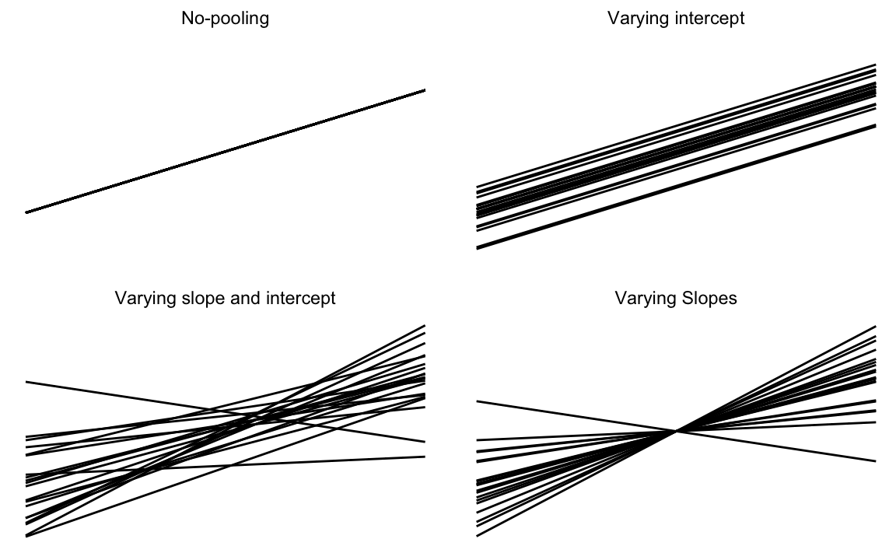
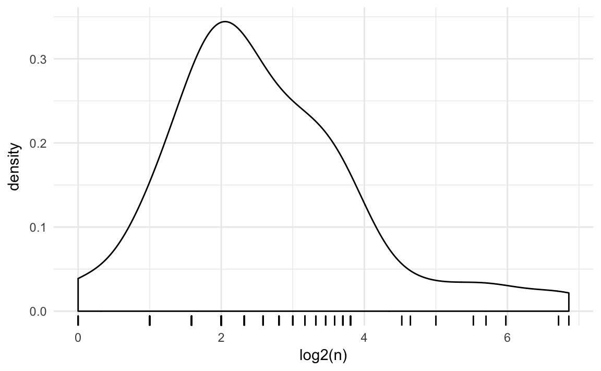
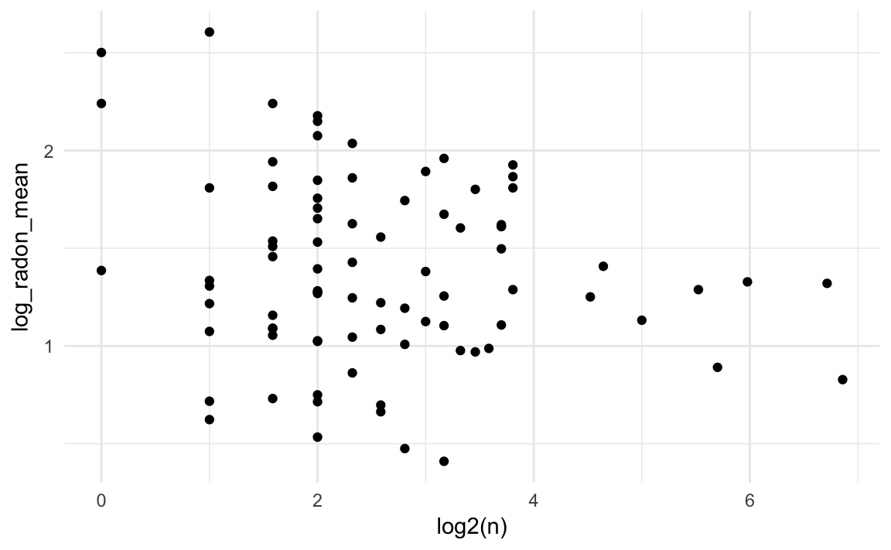
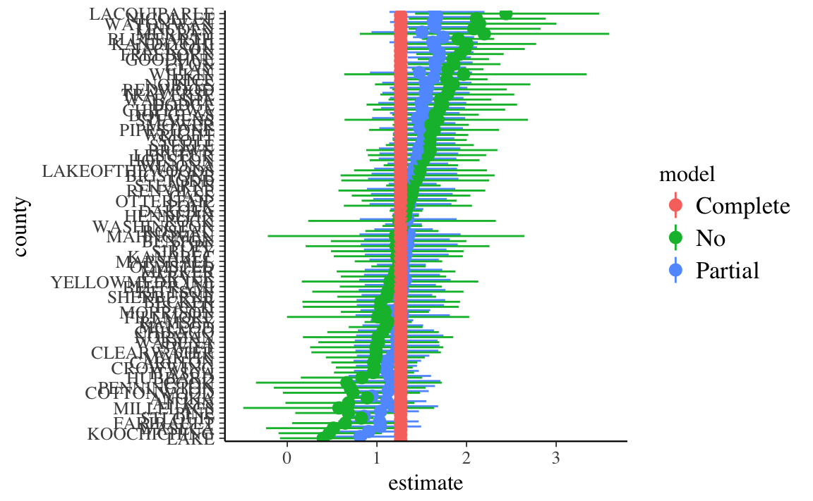
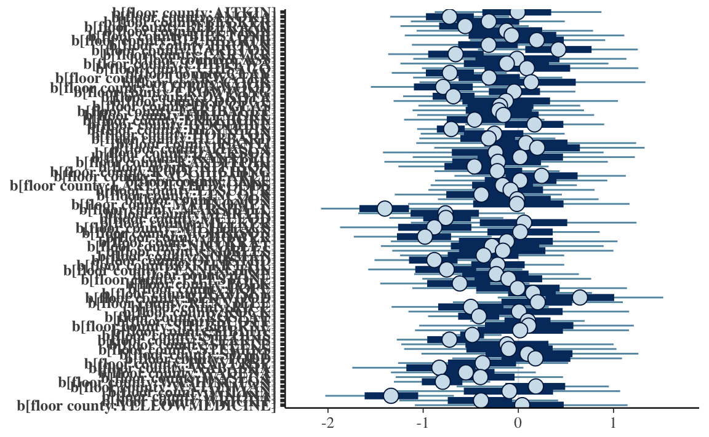

---
output: html_document
editor_options: 
  chunk_output_type: console
---
# Multilevel Models


```r
library("rstan")
library("rstanarm")
library("tidyverse")
library("broom")
```

Multilevel models are a commonly used hierarchical model.
They extend (generalized) linear models to include coefficients that vary by discrete groups.

## Terminology

These models go by different names in different literatures:
*hierarchical (generalized) linear models*, *nested data models*,
*mixed models*, *random coefficients*, *random-effects*,
*random parameter models*,  *split-plot designs* [^mlm-names].
There are further names for specific types of these models including varying-intercept, varying-slope,rando etc. 

In classical statistics there two main approaches to these models:

1.  Maximum likelihood (and variations): See the **lme4** package. This
    is more common in statistics and many social sciences (except economics).
1.  OLS and adjusted standard errors: See the **plm** packge. This is the 
    stanard econometric approach.

See ["Some false friends"](https://cran.r-project.org/web/packages/plm/vignettes/plm.pdf) in the **plm** vignette and @GelmanHill2007a [p. 245, fn. 5] for discussion of the differences between these approaches.


## Normal

Notation:

-   Units: $i = 1, \dots, n$.
-   Outcomes: $y = (y_1, \dots, y_n)$
-   Predictors: $X$ is a $n \times p$ matrix; $x_i$ is the $K \times 1$ 
    column vector of individual $i$'s predictors. 
-   Groups: $j = 1, \dots, m$. Each observation is in a group.
    Let $j[i]$ indicate the group that observation $i$ is in.

Suppose we want to estimate a regression for these data, where thet data generating process is $y_i = \alpha_i + X_i \beta_i$ with normal errors.

Depending on how we model differences between groups we can approach this in
three ways

1.  Pooled model
2.  Individual models
3.  Partially pooled model

In the *pooled model* we ignore differences between groups and use common 
coefficients.
$$
\begin{aligned}[t]
y_i &\sim \dnorm(\alpha + x_i' \beta, \sigma) \\
\end{aligned}
$$
The pooled model estimates one model, with three parameters: $\alpha$, $\beta$, 
and $\sigma$.

In an *individual* or *non-pooled model*, a sepearate model is estimated for each group.
For each $j' \in 1, \dots, m$, estimate the model
$$
\begin{aligned}[t]
y_i &\sim \dnorm(\alpha_{j[i]} + x_i' \beta_{j[i]}, \sigma_{j[i]}) & \text{ where } j[i] = j' .
\end{aligned}
$$
The non-pooled model estimates $m$ separate models with $m \times 3$ parameters, one $\alpha$, $\beta$, and $\sigma$ for each group. 
Note that in this model, no information is shared between groups.
The data from another group and its estimates of $\alpha$ or $\beta$ do not help in the estimation of another group.
However, if these are in any way similar problems we may think that the values of $\alpha$ and $\beta$ differ between groups, but that they should be similar.
We should think that there must be a way to share that information via a prior.
This insight will lead to the partially pooled model.

In a *partially pooled* model, different groups have different parameters, but
these group parameters share common hyperpriors---priors in which the distribution is a function of parameters estimated from the data.
This is an example of a partially pooled model,
$$
\begin{aligned}[t]
y_i &\sim \dnorm(\alpha_{j[i]} + \beta_{j[i]} x_i, \sigma_{j[i]}) \\
  \begin{bmatrix}
  \alpha_j \\
  \beta_j
  \end{bmatrix}
& \sim
\dnorm
\left(
  \begin{bmatrix}
  \mu_\alpha \\
  \mu_\beta
  \end{bmatrix},
\Omega
\right) \\
\sigma_{j[i]} &\sim p(.)
\end{aligned} .
$$
The imporant feature of this model, is that the priors for the parameters $\alpha_j$, $\beta_j$ are functions of other parameters, often called *hyperparmeters*, $\mu_{\alpha}$, $\mu_{\beta}$, and $\Omega$.
This is allows for sharing information between groups.
The observations from one group help to estimate $\mu_{\alpha}$, $\mu_{\beta}$,
and $\Sigma$, which in turn help to estimate the $\alpha_j$ and $\beta_j$ in another group.
If the parameters of the prior distribution of $\alpha$ and $\beta$ were fixed (data) and not themselves parameters, this sharing of information would not occur.

<div class="figure" style="text-align: center">

<p class="caption">(\#fig:unnamed-chunk-4)Visual representation of hierarchical models</p>
</div>

We can also allow some parameters to vary between groups, but pool other parameters.

*Group-heteroskedastic*: Assume that the intercept ($\alpha$) and slope ($\beta$) are the same across groups, but allow the scale of the regression error to vary between groups.
$$
\begin{aligned}[t]
y_i &\sim \dnorm(\alpha + x'_i \beta, \sigma_{j[i]}) \\
\log \sigma_j &\sim \dnorm(\tau, \psi)
\end{aligned}
$$
The prior on the $\log \sigma_j$ has two parameters, $\tau$ (the average log-standard deviation of the errors) and $\psi$, which determines the level of heteroskedasticity.

In a *varying-intercept* model keep the slope coefficients ($\beta$) common between groups, but allow the intercepts ($\alpha_j$) to vary by group.
$$
\begin{aligned}[t]
y_i &\sim \dnorm(\alpha_{j[i]} + \beta x_i, \sigma) \\
\alpha_{j} &\sim \dnorm(\mu_\alpha, \omega_{\alpha})
\end{aligned}
$$

In a *varying-slope model*, the groups share a common intercept, $\alpha$, but the slope coefficient ($\beta$), varies between groups. 

$$
\begin{aligned}[t]
y_i &\sim \dnorm(\alpha + \beta_{j[i]} x_i, \sigma^2) \\
\beta_{j} & \sim \dnorm(\mu_{\beta}, \omega_{\beta})
\end{aligned}
$$
This is less common since it is hard to think of cases when it is appropriate.
More often, if the slope coefficient is allowed to vary between groups,
the the intercepts should as well.
This is the more-general *varying-slope varying-intercept* model,
$$
\begin{aligned}[t]
y_i &\sim \dnorm(\alpha + \beta_{j[i]} x_i, \sigma^2) \\
  \begin{bmatrix}
  \alpha_j \\
  \beta_j
  \end{bmatrix}
& \sim
\dnorm
\left(
  \begin{bmatrix}
  \mu_\alpha \\
  \mu_\beta
  \end{bmatrix},
\Omega
\right)
\end{aligned}
$$

## Example: Radon

This example models the presence of radon in houses in Minnesota which appears in @GelmanHill2007a and @BDA3.
This is partly derived from a [Stan Case Study](http://mc-stan.org/documentation/case-studies/radon.html), which uses `PyStan` instead of **rstan**.

### Data

The [radon](https://www.rdocumentation.org/packages/radon/topics/rstanarm) data is included in the **[rstanarm](https://cran.r-project.org/package=rstanarm)** package.

```r
data("radon", package = "rstanarm")
glimpse(radon)
#> Observations: 919
#> Variables: 4
#> $ floor       <int> 1, 0, 0, 0, 0, 0, 0, 0, 0, 0, 0, 0, 0, 0, 0, 0, 0,...
#> $ county      <fct> AITKIN, AITKIN, AITKIN, AITKIN, ANOKA, ANOKA, ANOK...
#> $ log_radon   <dbl> 0.8329, 0.8329, 1.0986, 0.0953, 1.1632, 0.9555, 0....
#> $ log_uranium <dbl> -0.689, -0.689, -0.689, -0.689, -0.847, -0.847, -0...
```

The data consist of 919  observations of radon levels of houses from 85 counties.


```r
radon_county <- radon %>%
  group_by(county) %>%
  summarise(log_radon_mean = mean(log_radon),
            log_radon_sd = sd(log_radon),
            log_uranium = mean(log_uranium),
            n = length(county)) %>%
  mutate(log_radon_se = log_radon_sd / sqrt(n))
```


```r
ggplot() +
  geom_boxplot(data = radon, 
               mapping = aes(y = log_radon,
                             x = fct_reorder(county, log_radon, mean)),
               colour = "gray") +
  geom_point(data = radon,
             mapping = aes(y = log_radon,
                           x = fct_reorder(county, log_radon, mean)),
             colour = "gray") +
  geom_point(data = radon_county,
             mapping = aes(x = fct_reorder(county, log_radon_mean),
                           y = log_radon_mean),
             colour = "black") +
  coord_flip() +
  labs(y = "log(radon)", x = "")
```


The observations in counties vary in size,

```r
ggplot(radon_county, aes(x = log2(n))) +
         geom_density() + 
         geom_rug()
```



Unsurprisingly, there is more variation in county means among counties with smaller numbers
of observations.

```r
ggplot(radon_county, aes(y = log_radon_mean,
                         x = log2(n))) +
  geom_point()
```


Much of this can be explained simply by sampling error.

## Radon Example

In this example we want to model the amount of radon (log scale) in a home.
Let $y_i$ be the *centered* and *scaled* log amount of radon in home $i$.

The simplest model is a pooled model, where all homes are modeled as iid draws 
from a common distribution.
$$
\begin{aligned}[t]
y_i &\sim \dnorm(\alpha, \sigma) & \text{for } i \in 1, \dots, n \\
\alpha &\sim \dnorm(0, 10) \\
\sigma &\sim \dexp(1)
\end{aligned}
$$
where $\alpha$ and $\sigma$ are given weakly informative priors.
We will estimate these models **rstanarm** functions `stan_glm` and `stan_glmer`.


```r
fit_radon_1 <- stan_glm(log_radon ~ 1, data = radon, refresh = -1)
```

We can extend this to a no-pooling model with a different mean for each county.
Let $j[i] \in 1, \dots, m$ be the county of observation $i$.

$$
\begin{aligned}[t]
y_i &\sim \dnorm(\alpha_{j[i]}, \sigma) & \text{for } i \in 1, \dots, n \\
\alpha_j &\sim \dnorm(0, 10) & \text{for } j \in 1, \dots, m
\end{aligned}
$$
The $\alpha_j$ are all drawn from weakly informative prior distributions.
And although the $\alpha_j$ are drawn from the same prior distribution, 
it has fixed parameters and thus no information is shared between observations in different counties.


```r
fit_radon_2 <- stan_glm(log_radon ~ -1 + county, data = radon, refresh = -1)
```

Finally, consider a partially pooled model.
Like the previous model, each county has its own mean value. 
However, now these county-means share a prior which has its own parameters.
$$
\begin{aligned}[t]
y_i &\sim \dnorm(\alpha_{j[i]}, \sigma) & \text{for } i \in 1, \dots, n \\
\alpha_j &\sim \dnorm(\mu, \tau) & \text{for } j \in 1, \dots, m
\end{aligned}
$$
We could also write the model with the country-level average in the 
mean equation for $y$, and the $\alpha_j$ values distributed around the county
level average, $\gamma$.
$$
\begin{aligned}[t]
y_i &\sim \dnorm(\alpha_{j[i]}, \sigma) & \text{for } i \in 1, \dots, n \\
\alpha_j &\sim \dnorm(\gamma, \tau) & \text{for } j \in 1, \dots, m \\
\tau &\sim \dexp(1)
\end{aligned}
$$

Hierarchical/multi-level generalized linear models can be estimated with 
`stan_glmer`.

```r
fit_radon_3 <- stan_glmer(log_radon ~ (1 | county), data = radon,
                          refresh = -1)
```

For each of these models extract the county means.

```r
alpha_1 <- tidyMCMC(fit_radon_1, conf.int = TRUE) %>%
  filter(term == "(Intercept)") %>%
  # add county
  mutate(county = list(unique(as.character(radon[["county"]])))) %>%
  unnest(county) %>%
  select(-term) %>%
  mutate(model = "Complete")
```


```r
alpha_2 <- tidyMCMC(fit_radon_2, conf.int = TRUE) %>%
  filter(str_detect(term, "^county")) %>%
  mutate(county = str_replace(term, "^county", "")) %>%
  select(-term) %>%
  mutate(model = "No")
```

See this [vignette](http://mc-stan.org/rstanarm/articles/pooling.html) for
extracting the random intercepts.

```r
alphas <- as.matrix(fit_radon_3, regex_pars = "^b\\[")
alpha_mean <- as.matrix(fit_radon_3, pars = "(Intercept)")
alpha_3 <- sweep(alphas, 1, alpha_mean, FUN = "+") %>%
  as_tibble() %>%
  gather(term, value) %>%
  group_by(term) %>%
  summarise(estimate = mean(value), conf.low = quantile(value, 0.025),
            conf.high = quantile(value, 0.975)) %>%
  ungroup() %>%
  mutate(county = str_match(term, "county:(.*)\\]")[ , 2]) %>%
  select(-term) %>%
  mutate(model = "Partial")
```


```r
all_models <- 
  bind_rows(alpha_1, alpha_2, alpha_3) %>%
  # reorder county by size
  mutate(county = fct_reorder(county, estimate, mean))
```


```r
ggplot(all_models, aes(x = county, y = estimate, ymin = conf.low, ymax = conf.high,
             color = model)) +
  geom_pointrange(position = position_dodge(width = 1)) +
  coord_flip()
```



## With Individual Covariates

Individual covariates can also be added.
$$
\begin{aligned}
y_i &\sim  N(\mu_i, \sigma^2) \\
\mu_i &= \alpha_{j[i]} + \beta~\mathtt{floor}_i  \\
\alpha_j &\sim \dnorm(\gamma, \tau) & \text{for } j \in 1, \dots, m \\
\beta &\sim \dnorm(0, 2.5)\\
\tau &\sim \dexp(1) \\
\gamma &\sim \dnorm(0, 10)
\end{aligned}
$$
This is often called a *varying intercept* model or the *random effects* model.
Each county has a different intercept, but a common value of $\beta$.
Note that the prior on $\beta$ assumes that $y$ and $\mathtt{floor}$ are centered and scaled.

We can estimate this with `stan_glmer` as follows:

```r
fit_radon_4 <- stan_glmer(log_radon ~ (1 | county) + floor,
                          data = radon,
                          refresh = -1)
```

We could also allow the parameter of $\beta$ to vary between counties and give it a prior distribution.
$$
\begin{aligned}
y_i &\sim  N(\mu_i, \sigma^2) \\
\mu_i &= \alpha_{j[i]} + \beta_{j[i]}~\mathtt{floor}_i 
\end{aligned}
$$
Both $\alpha_j$ and $\beta_j$ need to be given hierarchical priors.
Since there are features common to each group, it is common to specify a prior 
that allows these parameters to be correlated, such as a multivariate normal
distribution with mean $\gamma$ and covariance $\Sigma$,
$$
\begin{aligned}[t]
\begin{bmatrix}
\alpha_j \\
\beta_j
\end{bmatrix} &\sim
\dnorm\left(\begin{bmatrix}\gamma_{\alpha} \\ \gamma_{\beta} \end{bmatrix}, \Sigma\right) \\
\end{aligned}
$$
The vector of locations of $\alpha$ and $\beta$ can be given weakly informative
priors, which can be the same as the pooled parameters would be given,
$$
\begin{aligned}
\gamma_{\alpha} &\sim \dnorm(0, 10) \\
\gamma_{\beta} &\sim \dnorm(0, 2.5) \\
\end{aligned}
$$
The prior distribution for the covariance matrix is more complicated.
See the section [Priors for Covariances] for a discussion of appropriate prior
distirbutions.

If instead, $\alpha_j$ and $\beta_j$ were given inproper priors, or
alternatively, $\Sigma \to \tau I$ where $\tau \to \infty$, then this model
would be equivalent to an MLE model in with county fixed effects, and with
`county` interacted with `floor`, e.g. `log_radon ~ county * floor`.

This model is often called a *(varying-intercept) varying-slope* model, or
a *random coefficients* model.
It can be estimated as:

```r
fit_radon_5 <- stan_glmer(log_radon ~ (1 + floor | county),
                          data = radon,
                          refresh = -1)
```


```r
plot(fit_radon_5, regex_pars = c("^b\\[floor"))
```




## With Group-Level Covariates

Group-level covariates could also be added as predictors.
$$
\begin{aligned}
y_i &\sim  N(\mu_i, \sigma^2) \\
\mu_i &= \alpha_{j[i]} + \beta~\mathtt{log\_uranium}_{j[i]}  \\
\alpha_j &\sim \dnorm(\gamma, \tau) & \text{for } j \in 1, \dots, m \\
\beta &\sim \dnorm(0, 2.5)\\
\tau &\sim \dexp(1) \\
\gamma &\sim \dnorm(0, 10)
\end{aligned}
$$

We could also write that model with group-level predictors included in the prior fthe group level intercepts as 
$$
\begin{aligned}
y_i &\sim  N(\mu_i, \sigma^2) \\
\mu_i &= \alpha_{j[i]} \\
\alpha_j &\sim \dnorm(\gamma +  \beta~\mathtt{log\_uranium}_j, \tau) & \text{for } j \in 1, \dots, m \\
\end{aligned}
$$
These two models are equivalent.
However, they may have different sampling efficiencies.
Generally, in estimation, the first form in which the group-level predictors are included in the top level is used.

To estimate this model with `stan_glmer` run the following.

```r
fit_radon_6 <- stan_glmer(log_radon ~ (1 | county) + log_uranium,
                          data = radon,
                          refresh = -1)
```

## Pooling of Hierarchical Parameters

What does partial pooling do?  
This is easiest to understand in a simple mean-model with normal errors.
$$
\begin{aligned}[t]
y &\sim \dnorm(\mu_{j[i]}, \sigma) \\
\mu_{j} &\sim \dnorm(\gamma, \tau) .
\end{aligned}
$$
If the hyperparameters were known, the posterior of $\mu_j$ is
$$
\mu_j | y, \gamma, \sigma, \tau \sim \dnorm(\hat{\mu}_j, V_j)
$$
where
$$
\begin{aligned}[t]
\hat{\mu}_j &= \frac{\frac{n_j}{\sigma^2} \bar{y}_j + \frac{1}{\tau^2} \gamma}{\frac{n_j}{\sigma^2} + \frac{1}{\tau^2}} \\
V_j &= \frac{1}{\frac{n_j}{\sigma^2} + \frac{1}{\tau^2}}
\end{aligned}
$$

How does this vary depending on the size of the group, $n_j$? 

| Sample size, $n_j$              | Estimate of $\hat{\mu}_j$                                       |
| ------------------------------- | --------------------------------------------------------------- |
| $n_j = 0$                       | $\hat{\mu}_j = \gamma$ (complete pooling)                       |
| $n_j < \frac{\sigma^2}{\tau^2}$ | $\hat{\mu}_j$ closer to $\gamma$                                |
| $n_j = \frac{\sigma^2}{\tau^2}$ | $\hat{\mu}_j = \frac{1}{2} \bar{y}_j + \frac{1}{2} \gamma$      |
| $n_j > \frac{\sigma^2}{\tau^2}$ | $\hat{\mu}_j$ closer to $\bar{y}_j$                             |
| $n_j = \infty$                  | $\hat{\mu}_j = \bar{y}_j$ (no pooling)                          |

When the sample size of the group is large, the prior data from other groups provides little additional informiation and the posterior is dominated by the observations in that group.
However, when the sample size of the group is small, there is little information coming from the groups own observations and prior data from other groups can have a big influence on the posterior.
We even have posterior estimates of groups and observations from groups we have not seen before due to the estimated distribution of group means.

This is a good reason to use partial pooling. 
If there is enough data it will converge to the no-pooling case, but if there is not it will degrade to the full-pooling case.

If instead the group means $\mu_j$ were known, we can calculate some crude estimates.
The *data variance*, $\sigma^2$, is the residual variance,
$$
\E(\sigma^2 | y, \mu)  = \frac{1}{n} \sum_{i = 1}^n (y - \mu_{j[i]})^2 .
$$
The global mean is approximately the average of the group-level means,
$$
\begin{aligned}[t]
\E(\gamma | y, \mu) &= \frac{1}{J} \sum_{i = 1}^n \mu_j \\
\Var(\gamma | y, \mu) &= \frac{1}{J} \tau^2
\end{aligned}
$$
The group level variance is $\tau^2$ is,
$$
\E(\tau^2 | y, \mu) = \frac{1}{J} \sum_{j = 1}^J (\mu_j - \gamma)^2
$$

## lme4

In R, the most widely used package to estimate mixed-effects models is **lme4**.
This estimates models using maximum likelihood or restricted maximum likelihood methods (REML).
This will be faster than using full-Bayesian methods but also underestimate the uncertainty, as well as being a worse approximation of the posterior.
Additionally, in frequentist inference, the meaning of the random effects is different; they are nuisance parameters and not given standard errors.

See @Bates2010a and @BatesMaechlerBolkerEtAl2014a for introductions to mixed-effects models with **lme4**.
These are also good introductions to classical approaches to mixed effects models.


```r
library("lme4")
```

Complete pooling

```r
fit_pooled <- lm(log_radon ~ county + floor, data = radon)
```
County-varying intercepts with no-pooling

```r
fit_intercept_nopool <- lm(log_radon ~ floor, data = radon)
```
County-varying intercepts with partial-pooling

```r
fit_intercept_partial <- lmer(log_radon ~ (1 | county) + floor, data = radon)
```
Varying slopes with no pooling:

```r
fit_slope_nopool <- lm(log_radon ~ county * floor, data = radon)
```
Varying slopes with partial pooling:

```r
fit_slope_partial <- lmer(log_radon ~ (1 + floor | county), data = radon)
```

We can also include a county-level variable (`log_uranium`) in various models:
With no-pooling,

```r
fit_slope_partial <- lm(log_radon ~ floor + log_uranium, data = radon)
```
With varying-intercepts

```r
fit_slope_partial <- lmer(log_radon ~ (1 | county) + floor + log_uranium,
                          data = radon)
```
With varying-intercepts and slopes,

```r
fit_slope_partial <- lmer(log_radon ~ (1 + floor | county) +  log_uranium,
                          data = radon)
```

## Priors for Covariances {#covariance-priors}

Traditinally the Wishart and inverse Wishart distributions have been used for modeling covariance  distributions. This was largely because they were in some cases conjugate
distributions. However, they have several poor properties.
See <https://github.com/pymc-devs/pymc3/issues/538#issuecomment-94153586>

A preferred approach is to first decompose the covariance matrix ($\Sigma$) into
a vector of standard deviations ($\omega$) and a correlation matrix ($R$),
$$
\Sigma = \diag(\omega) R \diag(\omega) ,
$$
and then place priors on each of those.

The preferred distribution for a  correlation distribution is
the LKJ distribution.
This distribution is proportional to a product of the determinant of the correlation matrix.
The LKJ distribution takes a single parameter $\eta > 0$. 
It can be interpreted similarly to the the shape parameter of a symmetric Beta distribution.
When $\eta = 1$, then there is a uniform distribution over all correlation matrices.
As $\eta \to 1$, the correlation matrix approaches the identity matrix.
As $\eta \to 0$, the density has a trough at the identity matrix.
$$
\mathsf{LKJ}(R | \eta) \propto |R|^{\eta - 1}
$$

There are a few ways to assign prior distributions to the standard deviation vector, $\omega$.

The `lkj()` prior used by `stan_mvmer()` and `stan_jm()` assigns independent Half Student-t priors, with degrees of freedom $d$, and scale, $s_j$,
$$
\omega_j \sim \HalfStudentT(d, 0, s_j) .
$$

The `deconv()` prior used by `stan_glmer` decomposes the standard deviation vector further.
It notes that the trace of a covariance matrix is equal to the sum of the variances.
This suggests decomposing the variance vector ($\omega^2$) into the product of the 
trace ($\psi^2$) and a simplex ($\pi$) which allocates how much of the total variance
is associated with each element.
$$
\begin{aligned}
\omega &= \psi \sqrt{\pi}
\end{aligned}
$$
The simplex is given a symmetric Dirichlet prior with concentration parameter $k$,
$$
\pi &\sim \ddirchlet(k, 1 / p).
$$
The default for `deconv()` is 1, for a uniform distribution over the space of simplex vectors of that size.

The square root of the trace ($\psi$) is given a gamma prior with shape parameter $a$ 
and scale parameter $b$,
$$
\psi &\sim \dgamma(a, b) .
$$
The default for `deconv()` is $a = 1$ and $b = 1$, which is equal to $\dexp(\psi | 1)$.

## Cetered and Non-centered Parameterizations

The natural way to write a hiearchical model is with a centered parameterization:
$$
\begin{aligned}[t]
y_i &\sim \dnorm(\alpha_{j[i]}, \sigma) \\
\alpha_{j} &\sim \dnorm(\mu_\alpha, \omega_{\alpha})
\end{aligned}
$$
However, this can be difficult to sample from. In particular, by construction, 
the values of $\mu_{\alpha}$, $\omega_{\alpha}$, and $\alpha_j$ are going to be highly correlated.
This results in a posterior pattern called a "funnel" which is difficult for HMC
to sample due to the changes in the posterior curvature.

The centered paramerization centers and scales the distribution of the intercepts.
$$
\begin{aligned}[t]
y_i &\sim \dnorm(\alpha_{j[i]}, \sigma) \\
\alpha_{j} &\sim \mu_{\alpha} + \omega_{\alpha} \alpha^* \\
\alpha^*_{j} &\sim \dnorm(0, 1)
\end{aligned}
$$

These are two ways of writing the *same* model.
However, they change the parameters that the HMC algorithm is actively sampling
and thus can have different sampling performance.

However, neither is universally better.

-   If much data, the non-centered parameterization works better
-   If less data, the centered parameterization works better

And there is currently no ex-ante way to know which will work better, and at 
what amount of "data" that the performance of one or the other is better.
However, one other reason to use the centered parameterization (if it is also scaled),
is that the Stan HMC implementation tends to be more efficient if all parameters
are on the scale.

See also

-   Stan Ref Ch 9 "Regression" has sections on hierarchical/multi-level models
-   Stan Ref Ch 22 "Reparameterizations & Change of Variables"
-   <http://twiecki.github.io/blog/2017/02/08/bayesian-hierchical-non-centered/>
-   <https://arxiv.org/pdf/1312.0906.pdf>
-   <https://www.youtube.com/watch?v=pHsuIaPbNbY&t=8s

## Extensions

-   Including group-level covariates

-   Prior distributions for hierarchical scale

-   Prediction. Hierarchical models can be use

    -   new obs in existing groups
    -   new group
    -   new obs in new group

-   Modeling correlation between intercept and slopes

-   Non-nested models

## Miscellaneous

### How many groups?

In classical discussions of multi-level or hierarchical models,
a common question is how many groups are required to be able to use random effects vs. fixed effects.

As noted earlier, random effects estimates the variance between group means. If there are few groups, there is not much information available to estimate this variance.
As such, random effects is not much different than fixed effects.

This literature provides many different rules of thumb for the number of groups necessary to be able to use random effects: 8, 10, 30, 50, or 100 [@Stegmueller2013a, p. 749].

@Stegmueller2013a finds that Bayesian method produces better multi-level-models than maximum likelihood methods for all numbers of groups.
ML methods do not suffer severe bias above 10-15 groups.
Bayesian point estimates are biased for smaller numbers of groups, but less than the ML.
Additionally, the Bayesian methods have better frequentist coverage than ML methods.

@BeckKatz2007a show that ML random coefficient models are superior in terms of efficiency to many types of pooled and un-pooled estimators in small samples.

### Correlation between Predictors and Errors

@BafumiGelman2006a analyze this case.

The standard suggestion in frequentist literature is to use a Hausman test
where the null hypothesis is that random effects are consistent. However,
@ClarkLinzer2014a note that in small samples this is likely to fail to reject
random effects; and in large samples, random effects behave like fixed effects
anyways.

## References

Texts and chapters on multi-level analysis:

-   Bayesian

    -   @GelmanHill2007a [Ch. 11-17].
    -   @BDA3 [Ch 5] "Hierarchical Models"
    -   @BDA3 [Ch 15] "Hierarchical Linear Models"
    -   @Jackman2009a [CHh. 7]
    -   @Draper2008a

-   Frequentist

    -   @Goldstein2011a
    -   @SnijdersBosker2011a
    -   @Rabe-HeskethSkrondal2012a
    -   @Jiang2007a

Stan model examples:

-   Stan models for [ARM](https://github.com/stan-dev/example-models/wiki/ARM-Models)
-   <http://mc-stan.org/documentation/case-studies/radon.html>
-   <https://biologyforfun.wordpress.com/2016/12/08/crossed-and-nested-hierarchical-models-with-stan-and-r/>

Examples of multilevel models

-   @Western1998a: economic growth for OECD countries

-   @GelmanKing1993a: US election polling

-   @ParkGelmanBafumi2004a: multi-level models of opinion polls combined with post-stratification to extrapolate national opinion surveys to regions.

-   @SteenbergenJones2002a: mostly an intro/review of MLM, but uses the
    cross-country Eurobarometer to model support for the EU

-   @GelmanShorBafumiEtAl2007a: state-level opinion polls

-   @RaudenbushBryk2001a: student performance with student and school-level indicators

-   @Gilardi2010a: policy diffusion

-   @ORourkeSinnott2006a: attitudes toward immigration

-   @AndersenFetner2008a: ethnic and social tolerance

-   @Weldon2006a: ethnic and social tolerance

-   @Arzheimer2009a: right-wing voting

-   @HoogheReeskensStolleEtAl2009a: social and political trust

-   @AndersonSinger2008a: satisfaction with democracy

-   @MeerDethScheepers2009a: political participation

-   @IversenRosenbluth2006a: political economy of the gender wage gap

-   @HoogheMarks2004a: support for European integration

-   @LaxPhillips2009a: American politics using states and neighborhoods

-   @Voeten2008a: judicial decision making

-   @FranchinoHoeyland2009a: legislative politics

-   @DenisovaEllerFryeEtAl2009a: politics of economic reforms

-   @AitkinLongford1986a, @GoldsteinYangOmarEtAl2000a,
    @GoldsteinRasbashYangEtAl1993a: education

-   @GoldsteinYangOmarEtAl2000a: medicine

[^mlm-names]: <https://en.wikipedia.org/wiki/Multilevel_model>
