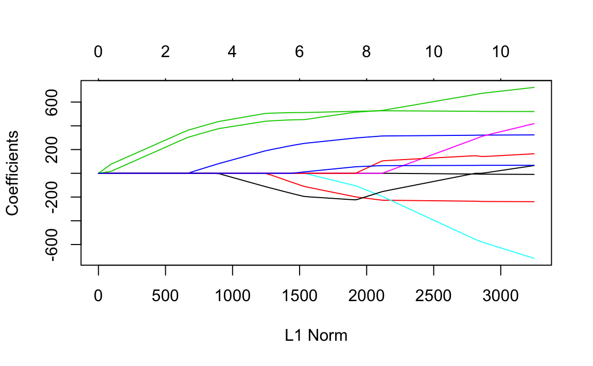
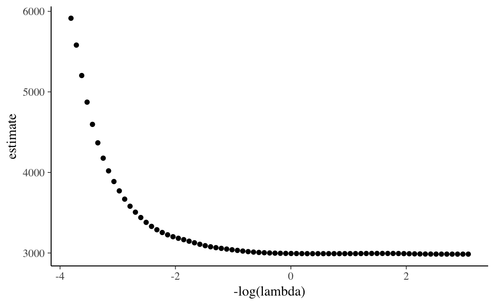
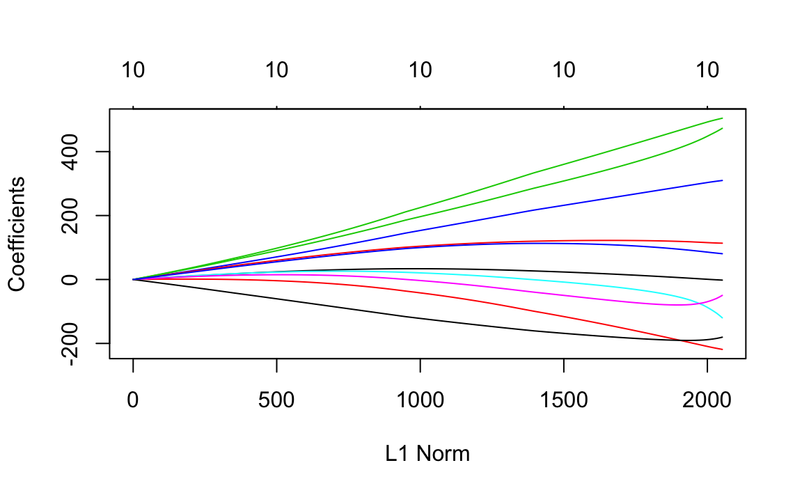
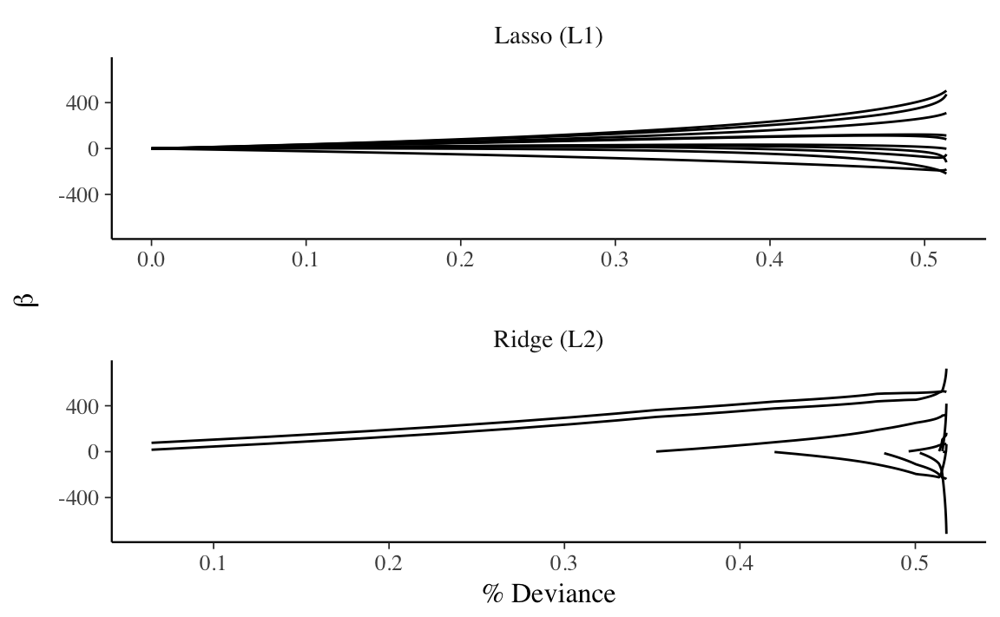

# Shrinkage and Regularized Regression

## Prerequisites {-}


```r
library("rstan")
library("rstanarm")
library("bayz")
library("tidyverse")
library("broom")
library("glmnet")
```


## Introduction

*Shrinkage estimation* deliberately introduces biases into the model to improve
*overall performance, often at the cost of individual estimates
*[@EfronHastie2016a, p. 91].

This is opposed to MLE, which produces unbiased estimates (asymptotically,
given certain regularity conditions). Likewise, the Bayesian estimates with
non- or weakly-informative priors will produce estimates similar to the MLE.
With shrinkage, the priors are used to produce estimates *different* than the
MLE case.

*Regularization* describes any method that reduces variability in high
dimensional estimation or prediction problems [@EfronHastie2016a].


## Penalized Maximum Likelihood Regression

Penalized regressions are regressions of the form:
$$
\hat{\beta}_{penalized} = \argmin_{\beta} \sum_{i = 1}^n (\vec{x}_i\T \vec{\beta} - y_i)^2 + f(\beta)
$$
where $f$ is some sort of penalty function on $\beta$ that penalizes larger (in magnitude) values of $\beta$.

Two common forms

-   Ridge: uses an $\ell_2$ penalty: $\vec{beta}^2$
-   Lasso: uses an $\ell_1$ penalty: $|\vec{\beta}|$

### Ridge Regression

Ridge regression uses the following penalty [@HoerlKennard1970a]:
$$
\hat{\beta}_{\text{ridge}} = \argmin_{\beta} \sum_{i = 1}^n (\vec{x}_i\T \vec{\beta} - y_i)^2 + \lambda \sum_{k} \beta_k^2
$$
This penalty produces smaller in magnitude coefficients, $|\hat{\beta}_{ridge}| < |\hat{\beta}_{OLS}|$.
However, this "bias" in the coefficients can be offset by a lower variance, better MSE, and better out-of-sample performance than the OLS estimates.

The point estimate for ridge regression coefficients is:
$$
\hat{\vec{\beta}}_{\text{ridge}} = {(\mat{X}\T \mat{X} + \lambda \mat{I}_p)}^{-1} \mat{X}\T \vec{y}
$$
The variance-covariance matrix of the point estimate is,
$$
\mathrm{df}(\lambda) = \tr(\mat{X}(\mat{X}\T \mat{X} + \lambda \mat{I}_p)^{-1} \mat{X}\T) = \sum_{j = 1}^p \frac{d_j^2}{d_j^2 + \lambda}
$$
where $d_j$ are the singular values of $X$

Some implications:

-   $\hat{\vec{\beta}}$ exists even if $\hat{\vec{\beta}}_{\text{OLS}}$
    ($(\mat{X}\T\mat{X})^{-1}$), i.e. cases of $n > p$ and collinearity, does
    not exist.

-   If $\mat{X}$ is orthogonal (mean 0, unit variance, zero correlation),
    $\mat{X}\T \mat{X} = n \mat{I}_p$ then
    $$
    \hat{\vec{\beta}}_{\text{ridge}} = \frac{n}{n + \lambda}
    \hat{\vec{\beta}}_{\text{ols}}
    $$
    meaning,
    $$
    |\hat{\vec{\beta}}_{\text{ols}}| >
    |\hat{\vec{\beta}}_{\text{ridge}}| \geq 0
    $$

-   Ridge does not produce sparse estimates, since
    $(n / (n + \lambda)) \vec{\vec{\beta}}_{ols} = 0$ iff $\vec{\vec{\beta}}_{ols} = 0$

-   $\lambda = 0$, then there is no shrinkage

-   $\lambda \to \infty$, then there is complete shrinkage and all
    coefficients are tend to 0.

### Lasso

The Lasso or LASSO (least absolute shrinkage and selection operator) replaces squared the penalty on $\beta$ with an absolute value penalty [@Tibshirani1996a]:
$$
\hat{\beta}_{\text{lasso}} = \argmin_{\beta} \frac{1}{2 \sigma} \sum_{i = 1}^n (\vec{x}_i\T \vec{\beta} - y_i)^2 + \lambda \sum_{k} |\beta_k|
$$
The absolute value penalty will put some $\hat{\beta}_k = 0$, producing a "sparse" solution.

Properties:

-   Unlike ridge regression, it sets some coefficients to exactly 0

-   If variables are perfectly correlated, there is no unique solution
    (unlike the ridge regression)

-   Used as the best convex approximation of the "best subset selection"
    regression problem, which finds the number of nonzero entries in a vector.


```r
data("diabetes", package = "lars")
```


```r
fit_lasso <- glmnet(diabetes$x, diabetes$y, alpha = 1)
```

```r
plot(fit_lasso)
```



Choice of an optimal lambda:

```r
fit_lasso_cv <- cv.glmnet(diabetes$x, diabetes$y, parallel = TRUE)
#> Warning: executing %dopar% sequentially: no parallel backend registered
```


```r
ggplot(tidy(fit_lasso_cv), aes(x = -log(lambda), y = estimate)) +
  geom_point()
```




```r
cv.glmnet(diabetes$x, diabetes$y, parallel = TRUE)
#> Warning: executing %dopar% sequentially: no parallel backend registered
#> $lambda
#>  [1] 45.1600 41.1481 37.4927 34.1619 31.1271 28.3618 25.8422 23.5465
#>  [9] 21.4547 19.5487 17.8120 16.2297 14.7879 13.4742 12.2772 11.1865
#> [17] 10.1927  9.2872  8.4622  7.7104  7.0254  6.4013  5.8326  5.3145
#> [25]  4.8424  4.4122  4.0202  3.6631  3.3377  3.0411  2.7710  2.5248
#> [33]  2.3005  2.0961  1.9099  1.7403  1.5857  1.4448  1.3164  1.1995
#> [41]  1.0929  0.9958  0.9074  0.8268  0.7533  0.6864  0.6254  0.5699
#> [49]  0.5192  0.4731  0.4311  0.3928  0.3579  0.3261  0.2971  0.2707
#> [57]  0.2467  0.2248  0.2048  0.1866  0.1700  0.1549  0.1412  0.1286
#> [65]  0.1172  0.1068  0.0973  0.0887  0.0808  0.0736  0.0671  0.0611
#> [73]  0.0557  0.0507  0.0462  0.0421  0.0384
#> 
#> $cvm
#>  [1] 5919 5600 5209 4874 4596 4366 4175 4019 3889 3775 3673 3587 3513 3449
#> [15] 3393 3342 3299 3263 3233 3209 3188 3171 3152 3131 3110 3092 3080 3070
#> [29] 3062 3055 3047 3039 3032 3027 3021 3015 3010 3007 3004 3003 3003 3003
#> [43] 3003 3003 3003 3003 3003 3003 3003 3003 3003 3003 3003 3003 3005 3006
#> [57] 3007 3007 3007 3006 3005 3004 3003 3002 3001 3000 3000 3000 3000 2999
#> [71] 2999 3000 3000 3000 3000 3000 3000
#> 
#> $cvsd
#>  [1] 284 278 247 222 203 187 175 166 159 156 155 153 151 149 149 149 149
#> [18] 149 149 149 149 149 150 151 152 152 152 152 152 152 152 153 154 155
#> [35] 156 156 157 157 158 158 159 159 160 160 161 161 162 162 162 163 163
#> [52] 163 164 164 164 165 165 165 166 166 166 166 166 166 166 167 167 167
#> [69] 168 168 168 168 168 169 169 169 169
#> 
#> $cvup
#>  [1] 6203 5878 5456 5097 4799 4553 4350 4185 4048 3931 3828 3740 3664 3599
#> [15] 3542 3490 3447 3412 3382 3357 3337 3320 3302 3282 3262 3244 3231 3222
#> [29] 3214 3207 3199 3192 3186 3181 3176 3171 3167 3164 3162 3162 3162 3162
#> [43] 3163 3164 3164 3165 3165 3165 3165 3166 3166 3166 3167 3168 3169 3171
#> [57] 3172 3173 3173 3172 3171 3170 3169 3168 3167 3167 3167 3167 3167 3167
#> [71] 3167 3168 3168 3168 3169 3169 3169
#> 
#> $cvlo
#>  [1] 5635 5322 4961 4652 4394 4179 4000 3853 3729 3619 3519 3434 3363 3300
#> [15] 3244 3193 3150 3114 3085 3060 3039 3021 3002 2980 2958 2940 2928 2918
#> [29] 2910 2902 2895 2887 2879 2872 2865 2859 2853 2850 2847 2845 2844 2844
#> [43] 2843 2843 2842 2842 2842 2841 2841 2840 2840 2839 2839 2839 2840 2841
#> [57] 2842 2842 2841 2841 2839 2838 2837 2836 2835 2834 2833 2832 2832 2832
#> [71] 2832 2831 2831 2831 2831 2831 2831
#> 
#> $nzero
#>  s0  s1  s2  s3  s4  s5  s6  s7  s8  s9 s10 s11 s12 s13 s14 s15 s16 s17 
#>   0   2   2   2   2   2   2   2   3   3   3   3   4   4   4   4   4   4 
#> s18 s19 s20 s21 s22 s23 s24 s25 s26 s27 s28 s29 s30 s31 s32 s33 s34 s35 
#>   4   4   4   4   5   5   5   5   6   6   6   7   7   7   7   7   7   7 
#> s36 s37 s38 s39 s40 s41 s42 s43 s44 s45 s46 s47 s48 s49 s50 s51 s52 s53 
#>   7   7   7   7   7   7   8   8   8   8   8   8   8   8   8   8   8   8 
#> s54 s55 s56 s57 s58 s59 s60 s61 s62 s63 s64 s65 s66 s67 s68 s69 s70 s71 
#>   8   8   9  10  10  10  10  10  10  10  10  10  10   9   9   9   9   9 
#> s72 s73 s74 s75 s76 
#>   9  10  10  10  10 
#> 
#> $name
#>                  mse 
#> "Mean-Squared Error" 
#> 
#> $glmnet.fit
#> 
#> Call:  glmnet(x = diabetes$x, y = diabetes$y, parallel = TRUE) 
#> 
#>       Df   %Dev  Lambda
#>  [1,]  0 0.0000 45.2000
#>  [2,]  2 0.0646 41.1000
#>  [3,]  2 0.1320 37.5000
#>  [4,]  2 0.1870 34.2000
#>  [5,]  2 0.2340 31.1000
#>  [6,]  2 0.2720 28.4000
#>  [7,]  2 0.3040 25.8000
#>  [8,]  2 0.3300 23.5000
#>  [9,]  3 0.3520 21.5000
#> [10,]  3 0.3740 19.5000
#> [11,]  3 0.3920 17.8000
#> [12,]  3 0.4070 16.2000
#> [13,]  4 0.4200 14.8000
#> [14,]  4 0.4320 13.5000
#> [15,]  4 0.4420 12.3000
#> [16,]  4 0.4500 11.2000
#> [17,]  4 0.4570 10.2000
#> [18,]  4 0.4630  9.2900
#> [19,]  4 0.4680  8.4600
#> [20,]  4 0.4720  7.7100
#> [21,]  4 0.4750  7.0300
#> [22,]  4 0.4780  6.4000
#> [23,]  5 0.4820  5.8300
#> [24,]  5 0.4870  5.3100
#> [25,]  5 0.4900  4.8400
#> [26,]  5 0.4940  4.4100
#> [27,]  6 0.4960  4.0200
#> [28,]  6 0.4980  3.6600
#> [29,]  6 0.5000  3.3400
#> [30,]  7 0.5030  3.0400
#> [31,]  7 0.5050  2.7700
#> [32,]  7 0.5060  2.5200
#> [33,]  7 0.5080  2.3000
#> [34,]  7 0.5090  2.1000
#> [35,]  7 0.5100  1.9100
#> [36,]  7 0.5110  1.7400
#> [37,]  7 0.5110  1.5900
#> [38,]  7 0.5120  1.4400
#> [39,]  7 0.5120  1.3200
#> [40,]  7 0.5130  1.2000
#> [41,]  7 0.5130  1.0900
#> [42,]  7 0.5130  0.9960
#> [43,]  8 0.5140  0.9070
#> [44,]  8 0.5140  0.8270
#> [45,]  8 0.5140  0.7530
#> [46,]  8 0.5140  0.6860
#> [47,]  8 0.5150  0.6250
#> [48,]  8 0.5150  0.5700
#> [49,]  8 0.5150  0.5190
#> [50,]  8 0.5150  0.4730
#> [51,]  8 0.5150  0.4310
#> [52,]  8 0.5150  0.3930
#> [53,]  8 0.5150  0.3580
#> [54,]  8 0.5150  0.3260
#> [55,]  8 0.5150  0.2970
#> [56,]  8 0.5150  0.2710
#> [57,]  9 0.5150  0.2470
#> [58,] 10 0.5160  0.2250
#> [59,] 10 0.5160  0.2050
#> [60,] 10 0.5160  0.1870
#> [61,] 10 0.5170  0.1700
#> [62,] 10 0.5170  0.1550
#> [63,] 10 0.5170  0.1410
#> [64,] 10 0.5170  0.1290
#> [65,] 10 0.5170  0.1170
#> [66,] 10 0.5170  0.1070
#> [67,] 10 0.5170  0.0973
#> [68,]  9 0.5170  0.0887
#> [69,]  9 0.5170  0.0808
#> [70,]  9 0.5170  0.0736
#> [71,]  9 0.5170  0.0671
#> [72,]  9 0.5170  0.0611
#> [73,]  9 0.5170  0.0557
#> [74,] 10 0.5170  0.0507
#> [75,] 10 0.5180  0.0462
#> [76,] 10 0.5180  0.0421
#> [77,] 10 0.5180  0.0384
#> [78,] 10 0.5180  0.0350
#> [79,] 10 0.5180  0.0319
#> [80,] 10 0.5180  0.0290
#> [81,] 10 0.5180  0.0265
#> [82,] 10 0.5180  0.0241
#> [83,] 10 0.5180  0.0220
#> [84,] 10 0.5180  0.0200
#> [85,] 10 0.5180  0.0182
#> [86,] 10 0.5180  0.0166
#> [87,] 10 0.5180  0.0151
#> [88,] 10 0.5180  0.0138
#> 
#> $lambda.min
#> [1] 0.0736
#> 
#> $lambda.1se
#> [1] 5.83
#> 
#> attr(,"class")
#> [1] "cv.glmnet"
```


```r
fit_ridge <- glmnet(diabetes$x, diabetes$y, alpha = 0)
```

```r
plot(fit_ridge)
```



Comparison of coefficients

```r
beta_lm <- lm(y ~ x, data = diabetes)
```

## Bayesian Shrinkage

Consider the single output linear Gaussian regression model with several input variables, given by
$$
\begin{aligned}[t]
y_i \sim \dnorm(\vec{x}_i' \vec{\beta}, \sigma^2)
\end{aligned}
$$
where $\vec{x}$ is a $k$-vector of predictors, and $\vec{\beta}$ are the coefficients.

What priors do we put on $\beta$?

-   **Improper priors:** $\beta_k \propto 1$ This produces the equivalent of
    MLE estimates.

-   **Non-informative priors:** These are priors which have such wide variance
    that they have little influence on the posterior, e.g.
    $\beta_k \sim \dnorm(0, 1e6)$. The primary reason for these (as opposed to
    simply using an improper prior) is that some MCMC methods, e.g. Gibbs sampling
    as used in JAGS or BUGS, require proper prior distributions for all parameters.

**Shrinkage priors** have a couple characteristics

-   they push $\beta_k \to 0$

-   while in the other cases, the scale of the prior on $\beta$ is fixed, in
    shrinkage priors there is often a hyperprior on it, e.g.,
    $\beta_k \sim \dnorm(0, \tau)$, where $\tau$ is also a parameter to be estimated.


### Priors

Consider the regression:
$$
y_i \sim \dnorm(\alpha + x_i' \beta, \sigma)
$$

It is assumed that the outcome and predictor variables are standardized such that
$$
\begin{aligned}[t]
\E[y_i] &= 0 & \V[y_i] &= 1 \\
\E[x_i] &= 0 & \V[x_i] &= 1. 
\end{aligned}
$$
Then, the default weakly informative priors are,
$$
\begin{aligned}[t]
\alpha &\sim \dnorm(0, 10) \\
\beta_k &\sim \dnorm(0, 2.5) & k \in \{1, \dots, K\}
\end{aligned}
$$

The weakly informative priors will shrink all the coefficients towards zero.

The amount of shrinkage depends on the amount of data as the likelihood dominates the prior as the amount of data increases.
However, the amount of shrinkage is not estimated from the data.
The prior on each coefficient is independent, and its scale is a constant (2.5 in this example).

Regularization/shrinkage methods estimate the amount of shrinkage. The scale of the priors on the coefficients are hyperparameters, which are estimated from the data.

### Hiearchical Coefficient Priors

#### Normal Distribution

We can apply a normal prior to each $\beta_k$. 
Unlike the weakly informative priors, the prior distributions all share a scale parameter $\tau$.
$$
\beta_k | \tau \sim \dnorm(0, \tau)
$$
We need to assign a prior to $\tau$.

In MAP estimation this is often set to be an inmproper uniform distribution.
Since in the weakly informative prior, $\beta_k \sim \dnorm(0, 2.5$ for all $k$, a prior on $\tau$ in which the central tendency is the same as the weakly informative prior makes sense.
One such prior is
$$
\tau \sim \dexp(2.5)
$$
TODO: look for better guidance for the prior of $\tau$.

-   This is equivalent to Ridge regression.
-   Unlike most shrinkage estimators, there is a closed form solution to the posterior distribution

### Laplace Distribution

We can also use the Laplace distribution as a prior for the coefficients.
This is called Bayesian Lasso, because the MAP estimator of this model is equivalent to the Lasso estimator.

The prior distribution for each coefficient $\beta_k$ is a Laplace (or double exponential) distribution with scale parameter ($\tau$).
$$
\beta_k | \tau \sim \dlaplace(0, \tau)
$$
Like many priors that have been proposed and used for coefficient shrinkage, this can be represented as a local-global scale-mixture of normal distributions.
$$
\begin{aligned}
\beta_k | \tau &\sim \dnorm(0, \tau \lambda_k) \\
\lambda_k^{-2} &\sim \dexp(1/2)
\end{aligned}
$$
The global scale $\tau$ determines the overall amount of shrinkage.
The local scales, $\lambda_1, \dots, \lambda_K$, allow the amount of shrinkage to vary among coefficients.

## Student-t and Cauchy Distributions

We can also use the Student-t distribution as a prior for the coefficients.
The Cauchy distribution is a special case of the Student t distribution where the degrees of freedom is zero.

The prior distribution for each coefficient $\beta_k$ is a Student-t distribution with degrees of freedom $\nu$, location 0, and scale $\tau$,
$$
\beta_k | \tau \sim \dt(\nu, 0, \tau) .
$$
Like many priors that have been proposed and used for coefficient shrinkage, this can be represented as a local-global scale-mixture of normal distributions.
$$
\begin{aligned}
\beta_k | \tau, \lambda &\sim \dnorm(0, \tau \lambda_k) \\
\lambda_k^{-2} &\sim \dgamma(\nu/2, \nu/2)
\end{aligned}
$$

The degrees of freedom parameter $\nu$ can be fixed to a particular value or estimated.
If fixed, then common values are 1 for a Cauchy distribution, 2 to ensure that there is a finite mean, 3 to ensure that there is a finite variance, and 4 ensure that there is a finite kurtosis.

If estimated, then the 
$$
\nu \sim \dgamma(2, 0.1)
$$
Additionally, it may be useful to truncate the values of $\nu$ to be greater
than 2 to ensure a finite variance of the Student t distribution.

## Horseshore and Hierarchical Priors

The Horseshoe prior is defined solely in terms of a global-local mixture.
$$
\begin{aligned}
\beta_k | \tau, \lambda &\sim \dnorm(0, \tau \lambda_k) \\
\lambda_k &\sim \dhalfcauchy(1)
\end{aligned}
$$

The Hierarchical Shrinkage prior originally implemented in rstanarm and proposed by ... replaces the half-Cauchy prior on $\lambda_k$ with a half-Student-t distribution with degrees of freedom $\nu$.
$$
\lambda_k \sim \dt(\nu, 0, 1)
$$
The $\nu$ parameter is generally not estimated and fixed to a low value, with $\nu = 4$ being suggested.
The problem with estimating the Horseshoe prior is that the wide tails of the Cauchy prior produced a posterior distribution with problematic geometry that was hard to sample.
Increasing the degrees of freedom helped to regularize the posterior.
The downside of this method is that by increasing the degrees of freedom of the Student-t distribution it would also shrink large parameters, which the 
Horseshoe prior was designed to avoid.

Regularized horseshoe prior
$$
\begin{aligned}
\beta_k | \tau, \lambda &\sim \dnorm(0, \tau \tilde{\lambda}_k) \\
\tilde{\lambda}^2_k &= \frac{c^2 \lambda^2}{c^2 + \lambda^2} \\
\lambda_k &\sim \dhalfcauchy(1)
\end{aligned}
$$
where $c > 0$ is a constant.
Like using a Student-t distribution, this regularizes the posterior distribution of a Horseshoe prior.
However, it is less problematic in terms of shrinking large coefficients.

## Understanding Shrinkage Models

Two-group model


$$
\begin{aligned}[t]
p(\beta | \Lambda, \tau, \sigma^2, D) &= \dnorm(\beta | \bar{\beta}, \Sigma) \\
\bar{\beta} &= \tau^2 \Lambda (\tau^2 \Lambda + \sigma^2 (X'X)^{-1})^{-1} \hat{\beta} \\
\Sigma &= (\tau^{-2} \Lambda^{-1} + \frac{1}{\sigma^{2}} X'X)^{-1} \\
\Lambda &= \diag(\lambda_1^{2}, \dots, \lambda^{2}_D) \\
\hat{\beta} &= (X'X)^{-1} X'y
\end{aligned}
$$
If the predictors are uncorrelated with zero mean and variances $\Var(x_j) = s_j^2$, then
$$
X'X \approx n \diag(s_1^2, \dots, s^2_D) ,
$$
and we can use the approximations,
$$
\hat{\beta}_j = (1 - \kappa_j) \hat{\beta}_j \\
\kappa_j = \frac{1}{1 + n \sigma^{-2} \tau^2 s_j^2 \lambda_j^2}
$$

## Spike and Slab prior

$$
\begin{aligned}[t]
\beta_k | \lambda_k, c, \epsilon  &\sim \lambda_k N(0, c^2) + (1 - \lambda_j) N(0, \epsilon^2) \\
\lambda_k &\sim \dbern(\pi)
\end{aligned}
$$

In the case of the linear regression, an alternative to BMA is to use a
spike-and-slab prior [@MitchellBeauchamp1988a, @GeorgeMcCulloch1993a, @IshwaranRao2005a],
which is a prior that is a discrete mixture of a point mass at 0 and a
non-informative distribution.

The spike and slab prior is a "two-group" solution

$$
p(\beta_k) = (1 - w) \delta_0 + w \pi(\beta_k)
$$
where $\delta_0$ is a Dirac delta function putting a point mass at 0, and $\pi(\beta_k)$ is an uninformative distribution, e.g. $\pi(\beta_k) = \dnorm(\beta_k | 0, \sigma^2)$ where $\sigma$ is large.

The posterior distribution of $w$ is the probability that $\beta_k \neq 0$, and the conditional posterior distribution $p(\beta_k | y, w = 1)$ is the distribution of $\beta_k$ given that $\beta_k \neq 0$.

See the R package **[spikeslab](https://cran.r-project.org/package=spikeslab)** and he accompanying article [@IshwaranKogalurRao2010a] for an implementation and review of spike-and-slab regressions.


## Number of effective zeros


## Choice of Hyperparameter on $\tau$

The value of $\tau$ and the choice of its hyper-parameter has a big influence on the sparsity of the coefficients.

@CarvalhoPolsonScott2009a suggest
$$
\tau \sim \dhalfcauchy(0, \sigma),
$$
while @PolsonScott2011a suggest,
$$
\tau \sim \dhalfcauchy(0, 1) .
$$

@PasKleijnVaart2014a suggest
$$
\tau \sim \dhalfcauchy(0, p^{*} / n)
$$
where $p^*$ is the true number of non-zero parameters,
and $n$ is the number of observations.
They suggest $\tau = p^{*} / n$ or $\tau p^{*}  / n \sqrt{log(n / p^{*})}$.
Additionally, they suggest restricting $\tau$ to $[0, 1]$.

@PiironenVehtari2016a understand the choice of the prior on $\tau$ as the implied prior on the number of effective parameters.
The shrinkage can be understood as its influence on the number of effective parameters, $m_{eff}$,
$$
m_{eff} = \sum_{j = 1}^K (1 - \kappa_j) .
$$
This is a measure of effective model size.

The mean and variance of $m_{eff}$ given $\tau$ and $\sigma$ are,
$$
\begin{aligned}[t]
\E[m_{eff} | \tau, \sigma] &= \frac{\sigma^{-1} \tau \sqrt{n}}{1 + \sigma^{-1} \tau \sqrt{n}} K , \\
\Var[m_{eff} | \tau, \sigma] &= \frac{\sigma^{-1} \tau \sqrt{n}}{2 (1 + \sigma^{-1} \tau \sqrt{n})2} K .
\end{aligned}
$$

Based on this, a prior should be chosen so that the prior mass is located near,
$$
\tau_0 = \frac{p_0}{K - p_0}\frac{\sigma}{\sqrt{n}}
$$

Densities of the shrinkage parameter, $\kappa$, for various shrinkage distributions where $\sigma^2 = 1$, $\tau = 1$, for $n = 1$.

@DattaGhosh2013a warn against empirical Bayes estimators of $\tau$ for the horseshoe prior as it can collapse to 0.
@ScottBerger2010a consider marginal maximum likelihood estimates of $\tau$.
@PasKleijnVaart2014a suggest that an empirical Bayes estimator truncated below at $1 / n$.




## All Coefficients

TODO

### Zellner's g-prior

An alternative prior is the Zellner's g-prior.
Consider the regression,
$$
y_i | \alpha, \vec{\beta}, \sigma \sim \dnorm(\alpha + \mat{X} \vec{\beta}, \sigma^2)
$$
The $g$-prior is a non-informative, data-dependent prior,
$$
\vec{\beta} \sim \dnorm(0, \sigma^2 g \mat{X}\T \mat{X})
$$
It depends on only a single parameter $g$.
The prior for $g$ must be proper. Some common choices include,
$$
\begin{aligned}
g &= n \\
g &= k^2 \\
g &= \max(n, k^2)
\end{aligned}
$$
or putting a hyperprior on $g$.

See @LeySteel2012a for a recent overview of g-priors.


### Q-R Prior

The QR decomposition of a the design matrix is 
$$
X = QR
$$
where $Q'Q = I$ and $R$ is upper-triangular.
The OLS solution to linear regression is
$$
(X'X)^{-1} X'y = R^{-1} Q' y
$$

What is a prior distribution of $\theta = Q' y$ ? 
THe prior distirbution of the $k$-th element is
$$
\theta_k = \rho_k \sigma_y \sqrt{N - 1},
$$
where $\rho_k$ is the correlation between the $k$th column of $Q$ and teh outcome.
Let $\rho = \sqrt{R^2}u$ where $u$ is a unit vector uniformly distributed on the surface of a hypersphere.
Then $R^2 = \rho' \rho$ is the coefficient of determiniation of a linear model.
An informative prior on $R^2$ penalizes $\rho' \rho$, and encourages $\beta = R^{-1}\theta$ to be closer to the origin.

The distribution of $R^2$ is,
$$
R^2 \sim \dbeta(K / 2, \eta)
$$
The prior distribution of $\sigma$ is set to Jeffrey's prior,
$$
p(\sigma) \propto 1 / \sigma.
$$

The prior for the intercept, $\alpha = \bar{y} - \bar{x}' R^{-1} \theta is
$$
\alpha \sim \dnorm(0, 1 / \sqrt{N}) .
$$

Then,
$$
\sigma_y = \omega s_y \\
\sigma_\epsilon = \sigma_y \sqrt{1 - R^2} \\
\beta = R^{-1} u \sigma_y \sqrt{R^{2} (N - 1)}
$$


## Differences between Bayesian and Penalized ML

$$
\log p(\theta|y, x) \propto \frac{1}{2 \sigma} \sum_{i = 1}^n (\vec{x}_i\T \vec{\beta} - y_i)^2 + \lambda \sum_{k} \beta_k^2
$$
In the first case, the log density of a normal distribution is,
$$
\log p(y | \mu, x) \propto \frac{1}{2 \sigma} (x - \mu)^2
$$
The first regression term is the produce of normal distributions (sum of their log probabilities),
$$
y_i \sim \dnorm(\vec{x}_i\T \vec{\beta}, \sigma)
$$
The second term, $\lambda \sum_{k} \beta_k^2$ is also the sum of the log of densities of i.i.d. normal densities, with mean 0, and scale $\tau = 1 / 2 \lambda$,
$$
\beta_k \sim \dnorm(0, \tau^2)
$$

The only difference in the LASSO is the penalty term, which uses an absolute value penalty for $\beta_k$.
That term corresponds to a sum of log densities of i.i.d. double exponential (Laplace) distributions.
The double exponential distribution density is similar to a normal distribution,
$$
\log p(y | \mu, \sigma) \propto - \frac{|y - \mu|}{\sigma}
$$
So the LASSO penalty is equivalent to the log density of a double exponential distribution with location $0$, and scale $1 / \lambda$.
$$
\beta_k \sim \dlaplace(0, \tau)
$$


There are several differences between Bayesian approaches to shrinkage and penalized ML approaches.

The point estimates:

-   ML: mode
-   Bayesian: posterior mean (or median)

In Lasso

-   ML: the mode produces exact zeros and sparsity
-   Bayesian: posterior mean is not sparse (zero)

Choosing the shrinkage penalty:

-   ML: cross-validation
-   Bayesian: a prior is placed on the shrinkage penalty, and it is estimated as part of the posterior.


## References

-   **[rstanarm](https://cran.r-project.org/package=rstanarm)**: estimates GLM regressions with various priors
-   **[rmonomvn](https://cran.r-project.org/package=rmonomvn)**: estimates Bayesian ridge, lasso, horseshoe, and ridge regression.
-   **[bayesreg](https://cran.r-project.org/package=bayesreg)**: See @MakalicSchmidt2016a for documentation and a good review of Bayesian regularized regression.
-   [fastHorseshoe]( http://jingyuhe.com/fastHorseshoe.html)
