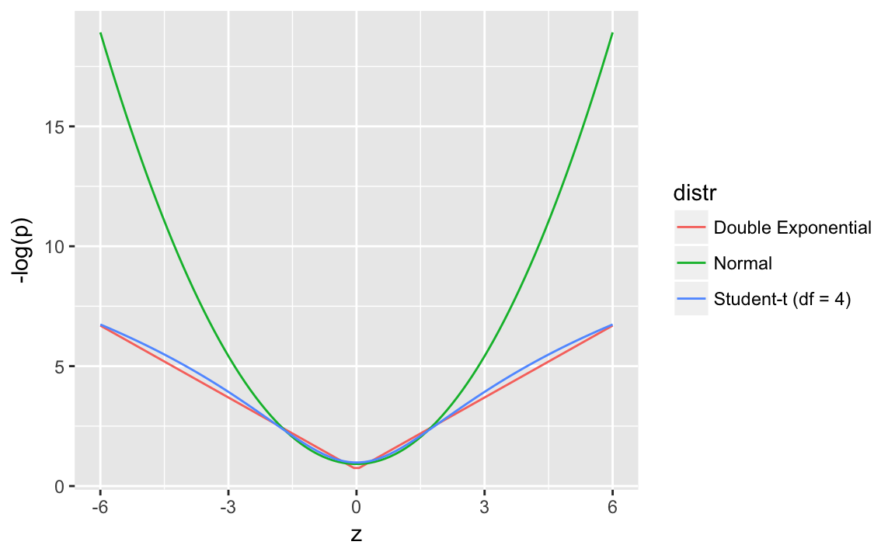
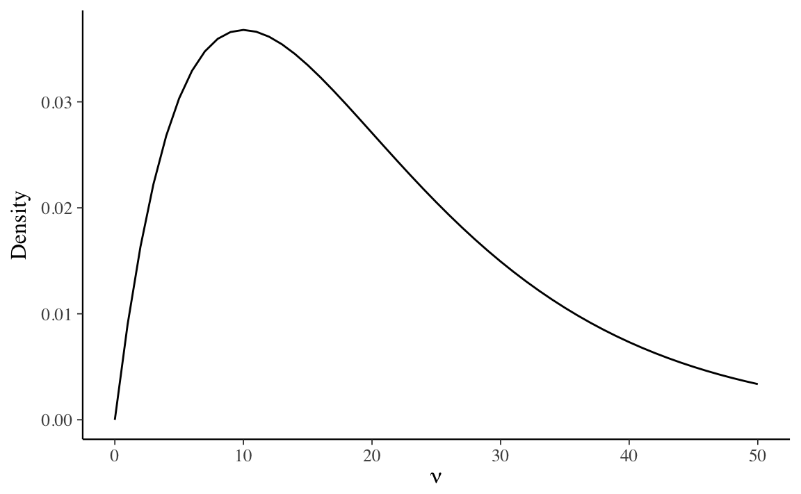

# Heteroskedasticity and Robust Regression

## Prerequisites

**[VGAM](https://cran.r-project.org/package=VGAM)** is needed for the Laplace distribution.

```r
library("VGAM")
```


## Linear Regression with Student t distributed errors


Like OLS, Bayesian linear regression with normally distributed errors is sensitive to outliers.
The normal distribution has narrow tail probabilities.

This plots the normal, Double Exponential (Laplace), and Student-t (df = 4) distributions all with mean 0 and scale 1, and the surprise ($- log(p)$) at each point.
Higher surprise is a lower log-likelihood.
Both the Student-t and Double Exponential distributions have surprise values well below the normal in the ranges (-6, 6). [^tailareas]
This means that outliers impose less of a penalty on the log-posterior models using these distributions, and the regression line would need to move less to incorporate those observations since the error distribution will not consider them as unusual.


```r
z <- seq(-6, 6, length.out = 100)
bind_rows(
  tibble(z = z,
         p = dnorm(z, 0, 1),
         distr = "Normal"),
  tibble(z = z,
         p = dt(z, 4),
         distr = "Student-t (df = 4)"),
  tibble(z = z,
         p = VGAM::dlaplace(z, 0, 1),
         distr = "Double Exponential")) %>%
  mutate(`-log(p)` = -log(p)) %>%
  ggplot(aes(x = z, y = `-log(p)`, colour = distr)) + 
  geom_line()
      
```




```r
z <- seq(-6, 6, length.out = 100)
bind_rows(
  tibble(z = z,
         p = dnorm(z, 0, 1),
         distr = "Normal"),
  tibble(z = z,
         p = dt(z, 4),
         distr = "Student-t (df = 4)"),
  tibble(z = z,
         p = VGAM::dlaplace(z, 0, 1),
         distr = "Double Exponential")) %>%
  mutate(`-log(p)` = -log(p)) %>%
  ggplot(aes(x = z, y = p, colour = distr)) + 
  geom_line()
      
```




[^tailareas]: The Double Exponential distribution still has a thinner tail than the Student-t at higher values.


```r
mod_t
```

<pre>
  <code class="stan">data {
  // number of observations
  int n;
  // response vector
  vector[n] y;
  // number of columns in the design matrix X
  int k;
  // design matrix X
  matrix [n, k] X;
  // beta prior
  real b_loc;
  real<lower = 0.0> b_scale;
  // sigma prior
  real sigma_scale;
}
parameters {
  // regression coefficient vector
  vector[k] b;
  // scale of the regression errors
  real<lower = 0.0> sigma;
  real<lower = 1.0> nu;
}
transformed parameters {
  // mu is the observation fitted/predicted value
  // also called yhat
  vector[n] mu;
  mu = X * b;
}
model {
  // priors
  b ~ normal(b_loc, b_scale);
  sigma ~ cauchy(0, sigma_scale);
  nu ~ gamma(2, 0.1);
  // likelihood
  y ~ student_t(nu, mu, sigma);
}
generated quantities {
  // simulate data from the posterior
  vector[n] y_rep;
  // log-likelihood values
  vector[n] log_lik;
  for (i in 1:n) {
    y_rep[i] = student_t_rng(nu, mu[i], sigma);
    log_lik[i] = student_t_lpdf(y[i] | nu, mu[i], sigma);
  }

}</code>
</pre>


```r
unionization <- read_tsv("data/western1995/unionization.tsv",
         col_types = cols(
              country = col_character(),
              union_density = col_double(),
              left_government = col_double(),
              labor_force_size = col_number(),
              econ_conc = col_double()
            ))
mod_data <- preprocess_lm(union_density ~ left_government + log(labor_force_size) + econ_conc, data = unionization)
                                   
mod_data <- within(mod_data, {
  b_loc <- 0
  b_scale <- 1000
  sigma_scale <- sd(y)
})
```

The `max_treedepth` parameter needed to be increased because in some runs it was hitting the maximum tree depth.
This is likely due to the wide tails of the Student t distribution.

```r
mod_t_fit <- sampling(mod_t, data = mod_data, control = list(max_treedepth = 11))
#> 
#> SAMPLING FOR MODEL 'lm_student_t' NOW (CHAIN 1).
#> 
#> Gradient evaluation took 4e-05 seconds
#> 1000 transitions using 10 leapfrog steps per transition would take 0.4 seconds.
#> Adjust your expectations accordingly!
#> 
#> 
#> Iteration:    1 / 2000 [  0%]  (Warmup)
#> Iteration:  200 / 2000 [ 10%]  (Warmup)
#> Iteration:  400 / 2000 [ 20%]  (Warmup)
#> Iteration:  600 / 2000 [ 30%]  (Warmup)
#> Iteration:  800 / 2000 [ 40%]  (Warmup)
#> Iteration: 1000 / 2000 [ 50%]  (Warmup)
#> Iteration: 1001 / 2000 [ 50%]  (Sampling)
#> Iteration: 1200 / 2000 [ 60%]  (Sampling)
#> Iteration: 1400 / 2000 [ 70%]  (Sampling)
#> Iteration: 1600 / 2000 [ 80%]  (Sampling)
#> Iteration: 1800 / 2000 [ 90%]  (Sampling)
#> Iteration: 2000 / 2000 [100%]  (Sampling)
#> 
#>  Elapsed Time: 0.923841 seconds (Warm-up)
#>                0.81027 seconds (Sampling)
#>                1.73411 seconds (Total)
#> The following numerical problems occurred the indicated number of times on chain 1
#>                                                                                          count
#> Exception thrown at line 35: student_t_lpdf: Scale parameter is inf, but must be finite!     1
#> When a numerical problem occurs, the Hamiltonian proposal gets rejected.
#> See http://mc-stan.org/misc/warnings.html#exception-hamiltonian-proposal-rejected
#> If the number in the 'count' column is small, there is no need to ask about this message on stan-users.
#> 
#> SAMPLING FOR MODEL 'lm_student_t' NOW (CHAIN 2).
#> 
#> Gradient evaluation took 1.4e-05 seconds
#> 1000 transitions using 10 leapfrog steps per transition would take 0.14 seconds.
#> Adjust your expectations accordingly!
#> 
#> 
#> Iteration:    1 / 2000 [  0%]  (Warmup)
#> Iteration:  200 / 2000 [ 10%]  (Warmup)
#> Iteration:  400 / 2000 [ 20%]  (Warmup)
#> Iteration:  600 / 2000 [ 30%]  (Warmup)
#> Iteration:  800 / 2000 [ 40%]  (Warmup)
#> Iteration: 1000 / 2000 [ 50%]  (Warmup)
#> Iteration: 1001 / 2000 [ 50%]  (Sampling)
#> Iteration: 1200 / 2000 [ 60%]  (Sampling)
#> Iteration: 1400 / 2000 [ 70%]  (Sampling)
#> Iteration: 1600 / 2000 [ 80%]  (Sampling)
#> Iteration: 1800 / 2000 [ 90%]  (Sampling)
#> Iteration: 2000 / 2000 [100%]  (Sampling)
#> 
#>  Elapsed Time: 0.923295 seconds (Warm-up)
#>                0.833066 seconds (Sampling)
#>                1.75636 seconds (Total)
#> The following numerical problems occurred the indicated number of times on chain 2
#>                                                                                          count
#> Exception thrown at line 35: student_t_lpdf: Scale parameter is inf, but must be finite!     1
#> When a numerical problem occurs, the Hamiltonian proposal gets rejected.
#> See http://mc-stan.org/misc/warnings.html#exception-hamiltonian-proposal-rejected
#> If the number in the 'count' column is small, there is no need to ask about this message on stan-users.
#> 
#> SAMPLING FOR MODEL 'lm_student_t' NOW (CHAIN 3).
#> 
#> Gradient evaluation took 1.4e-05 seconds
#> 1000 transitions using 10 leapfrog steps per transition would take 0.14 seconds.
#> Adjust your expectations accordingly!
#> 
#> 
#> Iteration:    1 / 2000 [  0%]  (Warmup)
#> Iteration:  200 / 2000 [ 10%]  (Warmup)
#> Iteration:  400 / 2000 [ 20%]  (Warmup)
#> Iteration:  600 / 2000 [ 30%]  (Warmup)
#> Iteration:  800 / 2000 [ 40%]  (Warmup)
#> Iteration: 1000 / 2000 [ 50%]  (Warmup)
#> Iteration: 1001 / 2000 [ 50%]  (Sampling)
#> Iteration: 1200 / 2000 [ 60%]  (Sampling)
#> Iteration: 1400 / 2000 [ 70%]  (Sampling)
#> Iteration: 1600 / 2000 [ 80%]  (Sampling)
#> Iteration: 1800 / 2000 [ 90%]  (Sampling)
#> Iteration: 2000 / 2000 [100%]  (Sampling)
#> 
#>  Elapsed Time: 1.03297 seconds (Warm-up)
#>                0.873838 seconds (Sampling)
#>                1.90681 seconds (Total)
#> The following numerical problems occurred the indicated number of times on chain 3
#>                                                                                     count
#> Exception thrown at line 35: student_t_lpdf: Scale parameter is 0, but must be > 0!     1
#> When a numerical problem occurs, the Hamiltonian proposal gets rejected.
#> See http://mc-stan.org/misc/warnings.html#exception-hamiltonian-proposal-rejected
#> If the number in the 'count' column is small, there is no need to ask about this message on stan-users.
#> 
#> SAMPLING FOR MODEL 'lm_student_t' NOW (CHAIN 4).
#> 
#> Gradient evaluation took 1.4e-05 seconds
#> 1000 transitions using 10 leapfrog steps per transition would take 0.14 seconds.
#> Adjust your expectations accordingly!
#> 
#> 
#> Iteration:    1 / 2000 [  0%]  (Warmup)
#> Iteration:  200 / 2000 [ 10%]  (Warmup)
#> Iteration:  400 / 2000 [ 20%]  (Warmup)
#> Iteration:  600 / 2000 [ 30%]  (Warmup)
#> Iteration:  800 / 2000 [ 40%]  (Warmup)
#> Iteration: 1000 / 2000 [ 50%]  (Warmup)
#> Iteration: 1001 / 2000 [ 50%]  (Sampling)
#> Iteration: 1200 / 2000 [ 60%]  (Sampling)
#> Iteration: 1400 / 2000 [ 70%]  (Sampling)
#> Iteration: 1600 / 2000 [ 80%]  (Sampling)
#> Iteration: 1800 / 2000 [ 90%]  (Sampling)
#> Iteration: 2000 / 2000 [100%]  (Sampling)
#> 
#>  Elapsed Time: 0.897787 seconds (Warm-up)
#>                0.745622 seconds (Sampling)
#>                1.64341 seconds (Total)
#> The following numerical problems occurred the indicated number of times on chain 4
#>                                                                                          count
#> Exception thrown at line 35: student_t_lpdf: Scale parameter is inf, but must be finite!     1
#> When a numerical problem occurs, the Hamiltonian proposal gets rejected.
#> See http://mc-stan.org/misc/warnings.html#exception-hamiltonian-proposal-rejected
#> If the number in the 'count' column is small, there is no need to ask about this message on stan-users.
```


```r
summary(mod_t_fit, pars = c("b"))$summary
#>        mean se_mean     sd    2.5%    25%    50%     75%  97.5% n_eff Rhat
#> b[1] 90.924 2.19841 66.781 -44.196  47.81 91.762 133.164 223.22   923    1
#> b[2]  0.273 0.00162  0.083   0.103   0.22  0.275   0.328   0.43  2626    1
#> b[3] -6.082 0.13953  4.322 -14.791  -8.92 -6.101  -3.263   2.57   959    1
#> b[4]  2.763 0.74224 22.668 -43.434 -11.60  2.445  17.292  48.50   933    1
```

Compare those results when using a model with 


```r
mod_normal
```

<pre>
  <code class="stan">data {
  // number of observations
  int n;
  // response vector
  vector[n] y;
  // number of columns in the design matrix X
  int k;
  // design matrix X
  matrix [n, k] X;
  // beta prior
  real b_loc;
  real<lower = 0.0> b_scale;
  // sigma prior
  real sigma_scale;
}
parameters {
  // regression coefficient vector
  vector[k] b;
  // scale of the regression errors
  real<lower = 0.0> sigma;
}
transformed parameters {
  // mu is the observation fitted/predicted value
  // also called yhat
  vector[n] mu;
  mu = X * b;
}
model {
  // priors
  b ~ normal(b_loc, b_scale);
  sigma ~ cauchy(0, sigma_scale);
  // likelihood
  y ~ normal(mu, sigma);
}
generated quantities {
  // simulate data from the posterior
  vector[n] y_rep;
  // log-likelihood posterior
  vector[n] log_lik;
  for (i in 1:n) {
    y_rep[i] = normal_rng(mu[i], sigma);
    log_lik[i] = normal_lpdf(y[i] | mu[i], sigma);
  }
}</code>
</pre>


```r
mod_normal_fit <- sampling(mod_normal, data = mod_data)
#> 
#> SAMPLING FOR MODEL 'lm' NOW (CHAIN 1).
#> 
#> Gradient evaluation took 3.2e-05 seconds
#> 1000 transitions using 10 leapfrog steps per transition would take 0.32 seconds.
#> Adjust your expectations accordingly!
#> 
#> 
#> Iteration:    1 / 2000 [  0%]  (Warmup)
#> Iteration:  200 / 2000 [ 10%]  (Warmup)
#> Iteration:  400 / 2000 [ 20%]  (Warmup)
#> Iteration:  600 / 2000 [ 30%]  (Warmup)
#> Iteration:  800 / 2000 [ 40%]  (Warmup)
#> Iteration: 1000 / 2000 [ 50%]  (Warmup)
#> Iteration: 1001 / 2000 [ 50%]  (Sampling)
#> Iteration: 1200 / 2000 [ 60%]  (Sampling)
#> Iteration: 1400 / 2000 [ 70%]  (Sampling)
#> Iteration: 1600 / 2000 [ 80%]  (Sampling)
#> Iteration: 1800 / 2000 [ 90%]  (Sampling)
#> Iteration: 2000 / 2000 [100%]  (Sampling)
#> 
#>  Elapsed Time: 0.71357 seconds (Warm-up)
#>                0.540196 seconds (Sampling)
#>                1.25377 seconds (Total)
#> 
#> 
#> SAMPLING FOR MODEL 'lm' NOW (CHAIN 2).
#> 
#> Gradient evaluation took 1.3e-05 seconds
#> 1000 transitions using 10 leapfrog steps per transition would take 0.13 seconds.
#> Adjust your expectations accordingly!
#> 
#> 
#> Iteration:    1 / 2000 [  0%]  (Warmup)
#> Iteration:  200 / 2000 [ 10%]  (Warmup)
#> Iteration:  400 / 2000 [ 20%]  (Warmup)
#> Iteration:  600 / 2000 [ 30%]  (Warmup)
#> Iteration:  800 / 2000 [ 40%]  (Warmup)
#> Iteration: 1000 / 2000 [ 50%]  (Warmup)
#> Iteration: 1001 / 2000 [ 50%]  (Sampling)
#> Iteration: 1200 / 2000 [ 60%]  (Sampling)
#> Iteration: 1400 / 2000 [ 70%]  (Sampling)
#> Iteration: 1600 / 2000 [ 80%]  (Sampling)
#> Iteration: 1800 / 2000 [ 90%]  (Sampling)
#> Iteration: 2000 / 2000 [100%]  (Sampling)
#> 
#>  Elapsed Time: 0.544024 seconds (Warm-up)
#>                0.530679 seconds (Sampling)
#>                1.0747 seconds (Total)
#> 
#> 
#> SAMPLING FOR MODEL 'lm' NOW (CHAIN 3).
#> 
#> Gradient evaluation took 1e-05 seconds
#> 1000 transitions using 10 leapfrog steps per transition would take 0.1 seconds.
#> Adjust your expectations accordingly!
#> 
#> 
#> Iteration:    1 / 2000 [  0%]  (Warmup)
#> Iteration:  200 / 2000 [ 10%]  (Warmup)
#> Iteration:  400 / 2000 [ 20%]  (Warmup)
#> Iteration:  600 / 2000 [ 30%]  (Warmup)
#> Iteration:  800 / 2000 [ 40%]  (Warmup)
#> Iteration: 1000 / 2000 [ 50%]  (Warmup)
#> Iteration: 1001 / 2000 [ 50%]  (Sampling)
#> Iteration: 1200 / 2000 [ 60%]  (Sampling)
#> Iteration: 1400 / 2000 [ 70%]  (Sampling)
#> Iteration: 1600 / 2000 [ 80%]  (Sampling)
#> Iteration: 1800 / 2000 [ 90%]  (Sampling)
#> Iteration: 2000 / 2000 [100%]  (Sampling)
#> 
#>  Elapsed Time: 0.5235 seconds (Warm-up)
#>                0.615163 seconds (Sampling)
#>                1.13866 seconds (Total)
#> 
#> 
#> SAMPLING FOR MODEL 'lm' NOW (CHAIN 4).
#> 
#> Gradient evaluation took 1.2e-05 seconds
#> 1000 transitions using 10 leapfrog steps per transition would take 0.12 seconds.
#> Adjust your expectations accordingly!
#> 
#> 
#> Iteration:    1 / 2000 [  0%]  (Warmup)
#> Iteration:  200 / 2000 [ 10%]  (Warmup)
#> Iteration:  400 / 2000 [ 20%]  (Warmup)
#> Iteration:  600 / 2000 [ 30%]  (Warmup)
#> Iteration:  800 / 2000 [ 40%]  (Warmup)
#> Iteration: 1000 / 2000 [ 50%]  (Warmup)
#> Iteration: 1001 / 2000 [ 50%]  (Sampling)
#> Iteration: 1200 / 2000 [ 60%]  (Sampling)
#> Iteration: 1400 / 2000 [ 70%]  (Sampling)
#> Iteration: 1600 / 2000 [ 80%]  (Sampling)
#> Iteration: 1800 / 2000 [ 90%]  (Sampling)
#> Iteration: 2000 / 2000 [100%]  (Sampling)
#> 
#>  Elapsed Time: 0.593937 seconds (Warm-up)
#>                0.559731 seconds (Sampling)
#>                1.15367 seconds (Total)
```


```r
summary(mod_normal_fit, pars = c("b"))$summary
#>        mean se_mean      sd     2.5%     25%    50%     75%   97.5% n_eff
#> b[1] 95.987 2.41105 63.9174 -27.7095  53.147 95.592 137.966 223.008   703
#> b[2]  0.270 0.00194  0.0842   0.0979   0.217  0.273   0.326   0.434  1891
#> b[3] -6.356 0.15521  4.2031 -14.8646  -9.116 -6.339  -3.532   1.768   733
#> b[4]  0.858 0.80219 21.5103 -41.1619 -13.309  0.972  15.252  43.658   719
#>      Rhat
#> b[1] 1.01
#> b[2] 1.00
#> b[3] 1.01
#> b[4] 1.01
```


### Double Exponential (Laplace) Errors

An alternative form of "robust" regression is to use the Double Exponential (Laplace) distributions for the errors.

This is the equivalent to least median regression, where the regression line is the median (50% quantile)


```r
mod_dbl_exp
```

<pre>
  <code class="stan">data {
  // number of observations
  int n;
  // response vector
  vector[n] y;
  // number of columns in the design matrix X
  int k;
  // design matrix X
  matrix [n, k] X;
  // beta prior
  real b_loc;
  real<lower = 0.0> b_scale;
  // sigma prior
  real sigma_scale;
}
parameters {
  // regression coefficient vector
  vector[k] b;
  // scale of the regression errors
  real<lower = 0.0> sigma;
}
transformed parameters {
  // mu is the observation fitted/predicted value
  vector[n] mu;
  // tau are obs-level scale params
  mu = X * b;
}
model {
  // priors
  b ~ normal(b_loc, b_scale);
  sigma ~ cauchy(0, sigma_scale);
  // likelihood
  y ~ double_exponential(mu, sigma);
}
generated quantities {
  // simulate data from the posterior
  vector[n] y_rep;
  // log-likelihood values
  vector[n] log_lik;
  // use a single loop since both y_rep and log_lik are elementwise
  for (i in 1:n) {
    y_rep[i] = double_exponential_rng(mu[i], sigma);
    log_lik[i] = double_exponential_lpdf(y[i] | mu[i], sigma);
  }

}</code>
</pre>


```r
summary(mod_dbl_exp_fit, par = c("b"))$summary
#>        mean se_mean      sd    2.5%    25%    50%     75%   97.5% n_eff
#> b[1] 60.671 2.58294 72.5324 -84.418 15.896 56.321 105.938 207.022   789
#> b[2]  0.298 0.00217  0.0815   0.126  0.248  0.304   0.354   0.442  1415
#> b[3] -4.303 0.15685  4.4911 -13.482 -7.160 -4.100  -1.555   4.641   820
#> b[4] 13.381 0.91373 25.6984 -38.570 -2.215 14.588  29.270  64.348   791
#>      Rhat
#> b[1]    1
#> b[2]    1
#> b[3]    1
#> b[4]    1
```


Model comparison

```r
loo_t <- loo(extract_log_lik(mod_normal_fit, "log_lik"))
#> Warning: Some Pareto k diagnostic values are too high. See help('pareto-k-
#> diagnostic') for details.
loo_normal <- loo(extract_log_lik(mod_t_fit, "log_lik"))
#> Warning: Some Pareto k diagnostic values are too high. See help('pareto-k-
#> diagnostic') for details.
loo_dbl_exp <- loo(extract_log_lik(mod_dbl_exp_fit, "log_lik"))
```


## Heteroskedasticity

In applied regression, heteroskedasticity consistent (HC) or robust standard errors are often used.

However, there is straightforwardly direct translation of HC standard error to regression model this in a Bayesian setting. The sandwich method of estimating HC errors uses the same point estimates for the regression coefficients as OLS, but estimates the standard errors of those coefficients in a second stage from the OLS residuals. 
Disregarding differences in frequentist vs. Bayesian inference, it is clear that a direct translation of that method could not be fully Bayesian since the coefficients and errors are not estimated jointly.

In a linear normal regression model with heteroskedasticity, each observation has its own scale parameter, $\sigma_i$,
$$
\begin{aligned}[t]
y_i &\sim \dnorm(X \beta, \sigma_i) .
\end{aligned}
$$
It should be clear that without proper priors this model is not identified, meaning that the posterior distribution is improper.
To estimate this model we have to apply some model to the scale terms, $\sigma_i$.
In fact, you can think of homoskedasticity as the simplest such model; assuming that all $\sigma_i = \sigma$.
A more general model of $\sigma_i$ should encode any information the analyst has about the scale terms.
This can be a distribution or functions of covariates for how we think observations may have different values.

### Covariates

A simple model of heteroskedasticity is if the observations can be split into groups. Suppose the observations are partitioned into $k = 1, \dots, K$ groups, and $k[i]$ is the group of observation $i$,
$$
\sigma_i = \sigma_{k[i]}
$$

Another choice would be to model the scale term with a regression model, for example,
$$
\log(\sigma_i) \sim \dnorm(X \gamma, \tau)
$$


### Student-t Error

The Student-t distribution of error terms from the [Robust Regression] chapter is also model of heteroskedasticity.

A reparameterization that will be used quite often is to rewrite a normal distributions with unequal scale parameters as the product of a common global scale parameter ($\sigma$), and observation specific local scale parameters, $\lambda_i$,[^globalmixture]
$$
y_i \sim \dnorm(X\beta, \lambda_i \sigma) .
$$
If the local variance parameters are distributed inverse-gamma,
$$
\lambda^2 \sim \dinvgamma(\nu / 2, \nu / 2)
$$
then the above is equivalent to a regression with errors distributed Student-t errors with $\nu$ degrees of freedom,
$$
y_i \sim \dt{\nu}(X \beta, \sigma) .
$$


[^globalmixture] See [this](http://www.sumsar.net/blog/2013/12/t-as-a-mixture-of-normals/) for a visualization of a Student-t distribution a mixture of Normal distributions, and [this](https://www.johndcook.com/t_normal_mixture.pdf) for a derivation of the Student t distribution as a mixture of normal distributions. This scale mixture of normal representation will also be used with shrinkage priors on the regression coefficients.


**Example:** Simulate Student-t distribution with $\nu$ degrees of freedom as a scale mixture of normal. For *s in 1:S$,

1. Simulate $z_s \sim \dgamma(\nu / 2, \nu / 2)$
2. $x_s = 1 / \sqrt{z_s}2$ is draw from $\dt{\nu}(0, 1)$.

When using R, ensure that you are using the correct parameterization of the gamma distribution. **Left to reader**


## References

### Robust regression 

- See @GelmanHill2007a [sec 6.6], @BDA3 [ch 17]
- @Stan2016a [Sec 8.4] for the Stan example using a Student-t distribution

### Heteroskedasticity

- @BDA3 [Sec. 14.7] for models with unequal variances and correlations.
- @Stan2016a reparameterizes the Student t distribution as a mixture of gamma distributions in Stan.

### Qunatile regression

- @BenoitPoel2017a
- @YuZhang2005a for the three-parameter asymmetric Laplace distribution
