# Shrinkage and Regularization {#shrinkage-regularization}

*Shrinkage estimation* deliberately introduces biases into the model to improve overall performance, often at the cost of individual estimates [@EfronHastie2016a, p. 91].

This is opposed to MLE, which produces unbiased estimates (asymptotically, given certain regularity conditions). Likewise, the Bayesian estimates with non- or weakly-informative priors will produce estimates similar to the MLE.
With shrinkage, the priors are used to produce estimates *different* than the MLE case.

*Regularization* describes any method that reduces variability in high dimensional estimation or prediction problems [@EfronHastie2016a].

## Normal Linear Regression Model

Consider the single output linear Gaussian regression model with several input variables, given by
$$
\begin{aligned}[t]
y_i \sim \dnorm(\vec{x}_i' \vec{\beta}, \sigma^2)
\end{aligned}
$$
where $\vec{x}$ is a $k$-vector of predictors, and $\vec{\beta}$ are the coefficients.

What priors do we put on $\beta$? 

- **Improproper priors:** $\beta_k \propto 1$ This produces the equivalent of MLE estimates.
- **Non-informative priors:** These are priors which have such wide variance that they have little influence on the posterior, e.g. $\beta_k \sim \dnorm(0, 1e6)$. The primary reason for these (as opposed to simply using an improper prior) is that some MCMC methods, e.g. Gibbs sampling as used in JAGS or BUGS, require proper prior distributions for all parameters.

**Shrinkage priors** have a couple characteristics

- they push $\beta_k \to 0$
- while in the other cases, the scale of the prior on $\beta$ is fixed, in shrinkage priors there is often a hyperprior on it. E.g. $\beta_k \sim \dnorm(0, \tau)$, where $\tau$ is also a parameter to be estimated.

## Penalized Regression

Penalized regressions are regressions of the form:
$$
\hat{\beta}_{penalized} = \argmin_{\beta} \sum_{i = 1}^n (\vec{x}_i\T \vec{\beta} - y_i)^2 + f(\beta)
$$
where $f$ is some sort of penalty function on $\beta$ that penalizes larger (in magnitude) values of $\beta$.

Two common forms

- Ridge: uses an $\ell_2$ penalty: $\vec{beta}^2$
- Lasso: uses an $\ell_1$ penalty: $|\vec{\beta}|$

### Ridge Regression

Ridge regression uses the following penalty [@HoerlKennard1970a]:
$$
\hat{\beta}_{\text{ridge}} = \argmin_{\beta} \sum_{i = 1}^n (\vec{x}_i\T \vec{\beta} - y_i)^2 + \lambda \sum_{k} \beta_k^2
$$
This penalty produces smaller in magnitude coefficients, $|\hat{\beta}_{ridge}| < |\hat{\beta}_{OLS}|$.
However, this "bias" in the coefficients can be offset by a lower variance, better MSE, and better out-of-sample performance than the OLS estimates.

The point estimate for ridge regression coefficients is:
$$
\hat{\vec{\beta}}_{\text{ridge}} = {(\mat{X}\T \mat{X} + \lambda \mat{I}_p)}^{-1} \mat{X}\T \vec{y}
$$
The variance-covariance matrix of the point estimate is,
$$
\mathrm{df}(\lambda) = \tr(\mat{X}(\mat{X}\T \mat{X} + \lambda \mat{I}_p)^{-1} \mat{X}\T) = \sum_{j = 1}^p \frac{d_j^2}{d_j^2 + \lambda}
$$
where $d_j$ are the singular values of $X$

Some implications:

- $\hat{\vec{\beta}}$ exists even if $\hat{\vec{\beta}}_{\text{OLS}}$ ($(\mat{X}\T\mat{X})^{-1}$), i.e. cases of $n > p$ and collinearity, does not exist.
- If $\mat{X}$ is orthogonal (mean 0, unit variance, zero correlation), $\mat{X}\T \mat{X} = n \mat{I}_p$ then
  $$
  \hat{\vec{\beta}}_{\text{ridge}} = \frac{n}{n + \lambda} \hat{\vec{\beta}}_{\text{ols}}
  $$
  meaning 
  $$
  |\hat{\vec{\beta}}_{\text{ols}}| > 
  |\hat{\vec{\beta}}_{\text{ridge}}| \geq 0
  $$
- Ridge does not produce sparse estimates, since $(n / (n + \lambda)) \vec{\vec{\beta}}_{ols} = 0$ iff $\vec{\vec{\beta}}_{ols} = 0$
- $\lambda = 0$, then there is no shrinkage
- $\lambda \to \infty$, then there is complete shrinkage and all coefficients are tend to 0.
  
### Lasso

The Lasso or LASSO (least absolute shrinkage and selection operator) replaces squared the penalty on $\beta$ with an absolute value penalty [@Tibshirani1996a]:
$$
\hat{\beta}_{\text{lasso}} = \argmin_{\beta} \frac{1}{2 \sigma} \sum_{i = 1}^n (\vec{x}_i\T \vec{\beta} - y_i)^2 + \lambda \sum_{k} |\beta_k|
$$
The absolute value penalty will put some $\hat{\beta}_k = 0$, producing a "sparse" solution.


Properties:

- Unlike ridge regression, it sets some coefficients to exactly 0
- If variables are perfectly correlated, there is no unique solution (unlike the ridge regression)
- Used as the best convex approximation of the "best subset selection" regression problem, which finds the number of nonzero entries in a vector.


## Bayesian Shrinkage Priors

$$
\log p(\theta|y, x) \propto \frac{1}{2 \sigma} \sum_{i = 1}^n (\vec{x}_i\T \vec{\beta} - y_i)^2 + \lambda \sum_{k} \beta_k^2
$$
In the first case, the log density of a normal distribution is,
$$
\log p(y | \mu, x) \propto \frac{1}{2 \sigma} (x - \mu)^2
$$
The first regression term is the produce of normal distributions (sum of their log probabilities),
$$
y_i \sim \dnorm(\vec{x}_i\T \vec{\beta}, \sigma) 
$$
The second term, $\lambda \sum_{k} \beta_k^2$ is also the sum of the log of densities of i.i.d. normal densities, with mean 0, and scale $\tau = 1 / 2 \lambda$,
$$
\beta_k \sim \dnorm(0, \tau^2)
$$

The only difference in the LASSO is the penalty term, which uses an absolute value penalty for $\beta_k$.
That term corresponds to a sum of log densities of i.i.d. double exponential (Laplace) distributions.
The double exponential distribution density is similar to a normal distribution,
$$
\log p(y | \mu, \sigma) \propto - \frac{|y - \mu|}{\sigma}
$$
So the LASSO penalty is equivalent to the log density of a double exponential distribution with location $0$, and scale $1 / \lambda$.
$$
\beta_k \sim \dlaplace(0, \tau)
$$

## Differences between Bayesian Shrinkage and Penalized Likelihood

There are several differences between Bayesian approaches to shrinkage and penalized ML approaches.

The point estimates:

- ML: mode
- Bayesian: posterior mean (or median)

In Lasso

- ML: the mode produces exact zeros and sparsity
- Bayesian: posterior mean is not sparse (zero)

Choosing the shrinkage penalty:

- ML: cross-validation
- Bayesian: a prior is placed on the shrinkage penalty, and it is estimated as part of the posterior.  


## Hierarchical Shrinkage Priors

$$
\begin{aligned}
\beta_k &\sim \dnorm(0, \lambda_i^2 \tau^2) \\
\lambda_i &\sim \dt{\nu}^{+}(0, 1)
\end{aligned}
$$
If $\nu = 1$, then this is the Horseshoe prior
[@CarvalhoPolsonScott2010a, @CarvalhoPolsonScott2009a, @PasKleijnVaart2014a, @DattaGhosh2013a, @PolsonScott2011a, @PiironenVehtari2016a]

Hierarchical Shrinkage Plus (HS-$t_{\nu}$+)

$$
\begin{aligned}
\beta_k &\sim \dnorm(0, \lambda_i^2 \eta_i^2 \tau^2) \\
\lambda_i &\sim \dt{\nu}^{+}(0, 1) \\
\eta_i &\sim \dt{\nu}^{+}(0, 1)
\end{aligned}
$$
This induces even more shrinkage towards zero than the 

If $\nu = 1$, then this is the Horseshoe+ prior as introduced by @BhadraDattaPolsonEtAl2015a.


In linear regression
$$
\begin{aligned}[t]
p(\beta | \Lambda, \tau, \sigma^2, D) &= \dnorm(\beta, \bar{\beta}, \Sigma) \\
\bar{\beta} &= \tau^2 \Lambda (\tau^2 \Lambda + \sigma^2 (X'X)^{-1})^{-1} \hat{\beta} \\
\Sigma &= (\tau^{-2} \Lambda^{-1} + \frac{1}{\sigma^2} X'X)^{-1}
\end{aligned}
$$
where $\Lambda = \diag(\lambda_1^2, \dots, \lambda_D^2)$, and $\hat{\beta}$ is the MLE estimate, $(X'X)^{-1} X' y$.
If predictors are uncorrelated with mean zero and unit variance, then 
$$
X'X \approx n I
$$
and
$$
\bar{\beta}_j = (1 - \kappa_j) \hat{\beta}_j
$$
where
$$
\kappa_j = \frac{1}{1 + n \sigma^{-2} \tau^2 \lambda_j^2}
$$
where $\kappa_j$ is the *shrinkage factor* for the coefficient $\beta_j$, which is how much it is shrunk towards zero from the MLE.
$\kappa_j = 1$ is complete shrinkage, and $\kappa_j = 0$ is no shrinkage.
So $\bar{\beta} \to 0$ as $\tau \to 0$ and $\bar{\beta} \to \hat{\beta}$ as $\tau \to \infty$.

Using a plug-in estimate of $\tau$ using cross-validation or the maximum marginal likelihood. 
The danger is that $\hat{\tau} = 0$ if it is very sparse.

van de Pas et al (2014) show that the optimal value (up to a log factor) in terms of MSE and posterior contraction rates compared to the true $\beta^*$ is
$$
\tau^* = \frac{p^*}{n}
$$
where $p^*$ is the number of non-zero coefficients in the true coefficient vector $\beta^*$.

The effective number of nonzero coefficients is,
$$
m_{\mathrm{eff}} = \sum_{j = 1}^D (1 - \kappa_j)
$$

Some other notes

To calculate the distribution of $\kappa_j$ given a distribution of $\lambda$.
Note that
$$
\kappa_j(\lambda_j) = \frac{1}{1 + n \sigma^{-2} \tau^2 \lambda_j^2}
$$
is monotonically decreasing in $\lambda_j$.
It is also invertible,
$$
\lambda_j(\kappa_j) = \sqrt{\frac{1}{(1 + n \sigma^{-2} \tau^2) \kappa_j}}
$$
The derivative of this with respect to $\kappa_j$ is
$$
\frac{\partial \lambda_j(\kappa_j)}{\partial \kappa_j} = - \sqrt{\frac{1}{(1 + n \sigma^{-2} \tau^2)}} \kappa_j^{-\frac{3}{2}}
$$
The distribution of $\kappa$, given the distribution $f_\lambda$ for lambda is,
$$
\begin{aligned}[t]
f_\kappa(\kappa_j) &= f_\lambda(\lambda_j(\kappa_j)) \left| \frac{\partial \lambda_j(\kappa_j)}{\partial \kappa_j} \right| \\
&= f_\lambda\left(\sqrt{\frac{1}{(1 + n \sigma^{-2} \tau^2) \kappa_j}}\right) \left| (1 + n \sigma^{-2} \tau^2)^{-\frac{1}{2}} \kappa_j^{-\frac{3}{2}} \right| \\
\end{aligned}
$$

Suppose that the distribution is given for precision, $\lambda_j^{-2}$.
Then the inverse is,
$$
\lambda_j^{-2}(\kappa_j) = (1 + n \sigma^{-2} \tau^2) \kappa_j
$$
with derivative,
$$
\frac{\partial \lambda_j^{-2}(\kappa_j)}{\partial \kappa_j} = (1 + n \sigma^{-2} \tau^2)
$$
Thus,
$$
\begin{aligned}[t]
f_\kappa(\kappa_j) &= f_{\lambda^{-2}}(\lambda_j^{-2}(\kappa_j)) \left| \frac{\partial \lambda_j^{-2}(\kappa_j)}{\partial \kappa_j} \right| \\
&= f_{\lambda^{-2}}\left((1 + n \sigma^{-2} \tau^2) \kappa_j \right) \left| (1 + n \sigma^{-2} \tau^2)  \right| \\
\end{aligned}
$$

Suppose that the distribution is given for variance $\lambda_j^2$.
Then the inverse is,
$$
\lambda_j^2(\kappa_j) = \frac{1}{(1 + n \sigma^{-2} \tau^2) \kappa_j}
$$
with derivative,
$$
\frac{\partial \lambda_j^2(\kappa_j)}{\partial \kappa_j} = -(1 + n \sigma^{-2} \tau^2)^{-1} \kappa_j^{-2}
$$
Thus,
$$
\begin{aligned}[t]
f_\kappa(\kappa_j) &= f_{\lambda^2}(\lambda_j^2(\kappa_j)) \left| \frac{\partial \lambda_j^2(\kappa_j)}{\partial \kappa_j} \right| \\
&= f_{\lambda^2}\left(\frac{1}{(1 + n \sigma^{-2} \tau^2) \kappa_j}\right) \left| (1 + n \sigma^{-2} \tau^2)^{-1} \kappa_j^{-2} \right| \\
\end{aligned}
$$


I may also be useful to consider the distribution of $\kappa$ given the distribution of $\tau$.
Note that
$$
\kappa_j(\tau) = \frac{1}{1 + n \sigma^{-2} \tau^2 \lambda_j^2}
$$
is monotonically decreasing in $\tau$.
It is also invertible,
$$
\tau(\kappa_j) = \sqrt{\frac{1}{(1 + n \sigma^{-2} \lambda_j^2) \kappa_j}}
$$
The derivative of this with respect to $\kappa_j$ is
$$
\frac{\partial \tau(\kappa_j)}{\partial \kappa_j} = - {(1 + n \sigma^{-2} \lambda_j^2)}^{-\frac{1}{2}} \kappa_j^{-\frac{3}{2}}
$$
The distribution of $\kappa$, given the distribution $f_\lambda$ for lambda is,
$$
\begin{aligned}[t]
f_\kappa(\kappa_j) &= f_\tau(\tau(\kappa_j)) \left| \frac{\partial \tau(\kappa_j)}{\partial \kappa_j} \right| \\
&= f_\tau\left(\frac{1}{(1 + n \sigma^{-2} \lambda_j^2) \kappa_j} \right) \left| {(1 + n \sigma^{-2} \lambda_j^2)}^{-\frac{1}{2}} \kappa_j^{-\frac{3}{2}} \right| \\
\end{aligned}
$$

- Allan Riddell. [Epistemology of the corral: regression and variable selection with Stan and the Horseshoe prior](https://www.ariddell.org/horseshoe-prior-with-stan.html) March 10, 2014.

## Example

See the [documentation](https://statweb.stanford.edu/~tibs/ElemStatLearn/datasets/prostate.info.txt).


```r
library("rstan")
library("loo")
library("glmnet")
library("tidyverse")
library("forcats")
library("rubbish")
```


```r
URL <- "https://statweb.stanford.edu/~tibs/ElemStatLearn/datasets/prostate.data"

col_types <- cols(
  X1 = col_integer(),
  lcavol = col_double(),
  lweight = col_double(),
  age = col_integer(),
  lbph = col_double(),
  svi = col_integer(),
  lcp = col_double(),
  gleason = col_integer(),
  pgg45 = col_integer(),
  lpsa = col_double(),
  train = col_logical()
)
prostate <- read_tsv(URL, col_types = col_types,
                     skip = 1,
                     col_names = names(col_types$cols))
```

Recall the prostate data example: we are interested in the level of prostate-specific antigen (PSA), elevated in men who have prostate cancer. 
The data `prostate` has data on on the level of prostate-specific antigen (PSA), which is elevated in men with prostate cancer, for 97 men with
prostate cancer, and clinical predictors. 


```r
f <- lpsa ~ lcavol + lweight + age + lbph + svi + lcp + gleason + pgg45 - 1L
```


```r
prostate_data <- lm_preprocess(f, data = prostate)[c("y", "X")] %>%
  within({
    X <- scale(X)
    K <- ncol(X)
    N <- nrow(X)  
  })
```


```r
run_with_tau <- function(tau, mod, data, ...) {
  cat("Tau = ", tau)
  data$tau <- tau
  fit <- sampling(mod, data = data, refresh = -1, verbose = FALSE, ...)
  out <- list()
  out$summary <- summary(fit, par = "b")$summary %>%
    as.data.frame() %>%
    rownames_to_column("parameter")
  
  ## calculate posterior modes
  out$summary$mode <- apply(rstan::extract(fit, "b")[[1]], 2, LaplacesDemon::Mode)
  
  out$summary$tau <- tau
  out$loo <- loo(extract_log_lik(fit))
  out$lppd <- mean(extract_log_lik(fit))
  out$tau <- tau
  out
}
```


```r
mod_lm_coef_normal_1 <- stan_model("stan/lm-coef-normal-1.stan")
```

```r
mod_lm_coef_normal_1
```

<pre>
  <code class="stan">data {
  // number of observations
  int N;
  // response vector
  vector[N] y;
  // number of columns in the design matrix X
  int K;
  // design matrix X
  matrix [N, K] X;
  //
  real<lower = 0.> tau;
}
transformed data {
  real<lower = 0.> y_sd;
  real a_pr_scale;
  real sigma_pr_scale;
  real tau_pr_scale;
  y_sd = sd(y);
  sigma_pr_scale = y_sd * 5.;
  a_pr_scale = 10.;
}
parameters {
  // regression coefficient vector
  real a;
  vector[K] b;
  // scale of the regression errors
  real<lower = 0.> sigma;
}
transformed parameters {
  // mu is the observation fitted/predicted value
  // also called yhat
  vector[N] mu;
  mu = X * b;
}
model {
  // priors
  a ~ normal(0., a_pr_scale);
  b ~ normal(0., tau);
  sigma ~ cauchy(0., sigma_pr_scale);
  // likelihood
  y ~ normal(mu, sigma);
}
generated quantities {
  // simulate data from the posterior
  vector[N] y_rep;
  // log-likelihood posterior
  vector[N] log_lik;
  // mean log likelihood
  for (n in 1:N) {
    y_rep[n] = normal_rng(mu[n], sigma);
    log_lik[n] = normal_lpdf(y[n] | mu[n], sigma);
  }
}</code>
</pre>


```r
tau_values <- 2 ^ seq(2, -5, by = -.5)
coefpath_normal <-
  map(tau_values, run_with_tau,
      mod = mod_lm_coef_normal_1, data = prostate_data)
#> Tau =  4
#> SAMPLING FOR MODEL 'lm-coef-normal-1' NOW (CHAIN 1).
#> 
#> Gradient evaluation took 5.6e-05 seconds
#> 1000 transitions using 10 leapfrog steps per transition would take 0.56 seconds.
#> Adjust your expectations accordingly!
#> 
#> 
#> Iteration:    1 / 2000 [  0%]  (Warmup)
#> Iteration:  200 / 2000 [ 10%]  (Warmup)
#> Iteration:  400 / 2000 [ 20%]  (Warmup)
#> Iteration:  600 / 2000 [ 30%]  (Warmup)
#> Iteration:  800 / 2000 [ 40%]  (Warmup)
#> Iteration: 1000 / 2000 [ 50%]  (Warmup)
#> Iteration: 1001 / 2000 [ 50%]  (Sampling)
#> Iteration: 1200 / 2000 [ 60%]  (Sampling)
#> Iteration: 1400 / 2000 [ 70%]  (Sampling)
#> Iteration: 1600 / 2000 [ 80%]  (Sampling)
#> Iteration: 1800 / 2000 [ 90%]  (Sampling)
#> Iteration: 2000 / 2000 [100%]  (Sampling)
#> 
#>  Elapsed Time: 0.17799 seconds (Warm-up)
#>                0.126119 seconds (Sampling)
#>                0.304109 seconds (Total)
#> 
#> 
#> SAMPLING FOR MODEL 'lm-coef-normal-1' NOW (CHAIN 2).
#> 
#> Gradient evaluation took 1.7e-05 seconds
#> 1000 transitions using 10 leapfrog steps per transition would take 0.17 seconds.
#> Adjust your expectations accordingly!
#> 
#> 
#> Iteration:    1 / 2000 [  0%]  (Warmup)
#> Iteration:  200 / 2000 [ 10%]  (Warmup)
#> Iteration:  400 / 2000 [ 20%]  (Warmup)
#> Iteration:  600 / 2000 [ 30%]  (Warmup)
#> Iteration:  800 / 2000 [ 40%]  (Warmup)
#> Iteration: 1000 / 2000 [ 50%]  (Warmup)
#> Iteration: 1001 / 2000 [ 50%]  (Sampling)
#> Iteration: 1200 / 2000 [ 60%]  (Sampling)
#> Iteration: 1400 / 2000 [ 70%]  (Sampling)
#> Iteration: 1600 / 2000 [ 80%]  (Sampling)
#> Iteration: 1800 / 2000 [ 90%]  (Sampling)
#> Iteration: 2000 / 2000 [100%]  (Sampling)
#> 
#>  Elapsed Time: 0.153112 seconds (Warm-up)
#>                0.128688 seconds (Sampling)
#>                0.2818 seconds (Total)
#> 
#> 
#> SAMPLING FOR MODEL 'lm-coef-normal-1' NOW (CHAIN 3).
#> 
#> Gradient evaluation took 1.6e-05 seconds
#> 1000 transitions using 10 leapfrog steps per transition would take 0.16 seconds.
#> Adjust your expectations accordingly!
#> 
#> 
#> Iteration:    1 / 2000 [  0%]  (Warmup)
#> Iteration:  200 / 2000 [ 10%]  (Warmup)
#> Iteration:  400 / 2000 [ 20%]  (Warmup)
#> Iteration:  600 / 2000 [ 30%]  (Warmup)
#> Iteration:  800 / 2000 [ 40%]  (Warmup)
#> Iteration: 1000 / 2000 [ 50%]  (Warmup)
#> Iteration: 1001 / 2000 [ 50%]  (Sampling)
#> Iteration: 1200 / 2000 [ 60%]  (Sampling)
#> Iteration: 1400 / 2000 [ 70%]  (Sampling)
#> Iteration: 1600 / 2000 [ 80%]  (Sampling)
#> Iteration: 1800 / 2000 [ 90%]  (Sampling)
#> Iteration: 2000 / 2000 [100%]  (Sampling)
#> 
#>  Elapsed Time: 0.172674 seconds (Warm-up)
#>                0.138926 seconds (Sampling)
#>                0.3116 seconds (Total)
#> 
#> 
#> SAMPLING FOR MODEL 'lm-coef-normal-1' NOW (CHAIN 4).
#> 
#> Gradient evaluation took 1.6e-05 seconds
#> 1000 transitions using 10 leapfrog steps per transition would take 0.16 seconds.
#> Adjust your expectations accordingly!
#> 
#> 
#> Iteration:    1 / 2000 [  0%]  (Warmup)
#> Iteration:  200 / 2000 [ 10%]  (Warmup)
#> Iteration:  400 / 2000 [ 20%]  (Warmup)
#> Iteration:  600 / 2000 [ 30%]  (Warmup)
#> Iteration:  800 / 2000 [ 40%]  (Warmup)
#> Iteration: 1000 / 2000 [ 50%]  (Warmup)
#> Iteration: 1001 / 2000 [ 50%]  (Sampling)
#> Iteration: 1200 / 2000 [ 60%]  (Sampling)
#> Iteration: 1400 / 2000 [ 70%]  (Sampling)
#> Iteration: 1600 / 2000 [ 80%]  (Sampling)
#> Iteration: 1800 / 2000 [ 90%]  (Sampling)
#> Iteration: 2000 / 2000 [100%]  (Sampling)
#> 
#>  Elapsed Time: 0.168585 seconds (Warm-up)
#>                0.13534 seconds (Sampling)
#>                0.303925 seconds (Total)
#> 
#> Tau =  2.83
#> SAMPLING FOR MODEL 'lm-coef-normal-1' NOW (CHAIN 1).
#> 
#> Gradient evaluation took 3.2e-05 seconds
#> 1000 transitions using 10 leapfrog steps per transition would take 0.32 seconds.
#> Adjust your expectations accordingly!
#> 
#> 
#> Iteration:    1 / 2000 [  0%]  (Warmup)
#> Iteration:  200 / 2000 [ 10%]  (Warmup)
#> Iteration:  400 / 2000 [ 20%]  (Warmup)
#> Iteration:  600 / 2000 [ 30%]  (Warmup)
#> Iteration:  800 / 2000 [ 40%]  (Warmup)
#> Iteration: 1000 / 2000 [ 50%]  (Warmup)
#> Iteration: 1001 / 2000 [ 50%]  (Sampling)
#> Iteration: 1200 / 2000 [ 60%]  (Sampling)
#> Iteration: 1400 / 2000 [ 70%]  (Sampling)
#> Iteration: 1600 / 2000 [ 80%]  (Sampling)
#> Iteration: 1800 / 2000 [ 90%]  (Sampling)
#> Iteration: 2000 / 2000 [100%]  (Sampling)
#> 
#>  Elapsed Time: 0.168349 seconds (Warm-up)
#>                0.137366 seconds (Sampling)
#>                0.305715 seconds (Total)
#> 
#> 
#> SAMPLING FOR MODEL 'lm-coef-normal-1' NOW (CHAIN 2).
#> 
#> Gradient evaluation took 1.7e-05 seconds
#> 1000 transitions using 10 leapfrog steps per transition would take 0.17 seconds.
#> Adjust your expectations accordingly!
#> 
#> 
#> Iteration:    1 / 2000 [  0%]  (Warmup)
#> Iteration:  200 / 2000 [ 10%]  (Warmup)
#> Iteration:  400 / 2000 [ 20%]  (Warmup)
#> Iteration:  600 / 2000 [ 30%]  (Warmup)
#> Iteration:  800 / 2000 [ 40%]  (Warmup)
#> Iteration: 1000 / 2000 [ 50%]  (Warmup)
#> Iteration: 1001 / 2000 [ 50%]  (Sampling)
#> Iteration: 1200 / 2000 [ 60%]  (Sampling)
#> Iteration: 1400 / 2000 [ 70%]  (Sampling)
#> Iteration: 1600 / 2000 [ 80%]  (Sampling)
#> Iteration: 1800 / 2000 [ 90%]  (Sampling)
#> Iteration: 2000 / 2000 [100%]  (Sampling)
#> 
#>  Elapsed Time: 0.166031 seconds (Warm-up)
#>                0.139874 seconds (Sampling)
#>                0.305905 seconds (Total)
#> 
#> 
#> SAMPLING FOR MODEL 'lm-coef-normal-1' NOW (CHAIN 3).
#> 
#> Gradient evaluation took 1.7e-05 seconds
#> 1000 transitions using 10 leapfrog steps per transition would take 0.17 seconds.
#> Adjust your expectations accordingly!
#> 
#> 
#> Iteration:    1 / 2000 [  0%]  (Warmup)
#> Iteration:  200 / 2000 [ 10%]  (Warmup)
#> Iteration:  400 / 2000 [ 20%]  (Warmup)
#> Iteration:  600 / 2000 [ 30%]  (Warmup)
#> Iteration:  800 / 2000 [ 40%]  (Warmup)
#> Iteration: 1000 / 2000 [ 50%]  (Warmup)
#> Iteration: 1001 / 2000 [ 50%]  (Sampling)
#> Iteration: 1200 / 2000 [ 60%]  (Sampling)
#> Iteration: 1400 / 2000 [ 70%]  (Sampling)
#> Iteration: 1600 / 2000 [ 80%]  (Sampling)
#> Iteration: 1800 / 2000 [ 90%]  (Sampling)
#> Iteration: 2000 / 2000 [100%]  (Sampling)
#> 
#>  Elapsed Time: 0.162088 seconds (Warm-up)
#>                0.127644 seconds (Sampling)
#>                0.289732 seconds (Total)
#> 
#> 
#> SAMPLING FOR MODEL 'lm-coef-normal-1' NOW (CHAIN 4).
#> 
#> Gradient evaluation took 3e-05 seconds
#> 1000 transitions using 10 leapfrog steps per transition would take 0.3 seconds.
#> Adjust your expectations accordingly!
#> 
#> 
#> Iteration:    1 / 2000 [  0%]  (Warmup)
#> Iteration:  200 / 2000 [ 10%]  (Warmup)
#> Iteration:  400 / 2000 [ 20%]  (Warmup)
#> Iteration:  600 / 2000 [ 30%]  (Warmup)
#> Iteration:  800 / 2000 [ 40%]  (Warmup)
#> Iteration: 1000 / 2000 [ 50%]  (Warmup)
#> Iteration: 1001 / 2000 [ 50%]  (Sampling)
#> Iteration: 1200 / 2000 [ 60%]  (Sampling)
#> Iteration: 1400 / 2000 [ 70%]  (Sampling)
#> Iteration: 1600 / 2000 [ 80%]  (Sampling)
#> Iteration: 1800 / 2000 [ 90%]  (Sampling)
#> Iteration: 2000 / 2000 [100%]  (Sampling)
#> 
#>  Elapsed Time: 0.177064 seconds (Warm-up)
#>                0.131347 seconds (Sampling)
#>                0.308411 seconds (Total)
#> Warning: Some Pareto k diagnostic values are slightly high. See
#> help('pareto-k-diagnostic') for details.
#> Tau =  2
#> SAMPLING FOR MODEL 'lm-coef-normal-1' NOW (CHAIN 1).
#> 
#> Gradient evaluation took 3.2e-05 seconds
#> 1000 transitions using 10 leapfrog steps per transition would take 0.32 seconds.
#> Adjust your expectations accordingly!
#> 
#> 
#> Iteration:    1 / 2000 [  0%]  (Warmup)
#> Iteration:  200 / 2000 [ 10%]  (Warmup)
#> Iteration:  400 / 2000 [ 20%]  (Warmup)
#> Iteration:  600 / 2000 [ 30%]  (Warmup)
#> Iteration:  800 / 2000 [ 40%]  (Warmup)
#> Iteration: 1000 / 2000 [ 50%]  (Warmup)
#> Iteration: 1001 / 2000 [ 50%]  (Sampling)
#> Iteration: 1200 / 2000 [ 60%]  (Sampling)
#> Iteration: 1400 / 2000 [ 70%]  (Sampling)
#> Iteration: 1600 / 2000 [ 80%]  (Sampling)
#> Iteration: 1800 / 2000 [ 90%]  (Sampling)
#> Iteration: 2000 / 2000 [100%]  (Sampling)
#> 
#>  Elapsed Time: 0.157295 seconds (Warm-up)
#>                0.12598 seconds (Sampling)
#>                0.283275 seconds (Total)
#> 
#> 
#> SAMPLING FOR MODEL 'lm-coef-normal-1' NOW (CHAIN 2).
#> 
#> Gradient evaluation took 1.4e-05 seconds
#> 1000 transitions using 10 leapfrog steps per transition would take 0.14 seconds.
#> Adjust your expectations accordingly!
#> 
#> 
#> Iteration:    1 / 2000 [  0%]  (Warmup)
#> Iteration:  200 / 2000 [ 10%]  (Warmup)
#> Iteration:  400 / 2000 [ 20%]  (Warmup)
#> Iteration:  600 / 2000 [ 30%]  (Warmup)
#> Iteration:  800 / 2000 [ 40%]  (Warmup)
#> Iteration: 1000 / 2000 [ 50%]  (Warmup)
#> Iteration: 1001 / 2000 [ 50%]  (Sampling)
#> Iteration: 1200 / 2000 [ 60%]  (Sampling)
#> Iteration: 1400 / 2000 [ 70%]  (Sampling)
#> Iteration: 1600 / 2000 [ 80%]  (Sampling)
#> Iteration: 1800 / 2000 [ 90%]  (Sampling)
#> Iteration: 2000 / 2000 [100%]  (Sampling)
#> 
#>  Elapsed Time: 0.165807 seconds (Warm-up)
#>                0.128247 seconds (Sampling)
#>                0.294054 seconds (Total)
#> 
#> 
#> SAMPLING FOR MODEL 'lm-coef-normal-1' NOW (CHAIN 3).
#> 
#> Gradient evaluation took 1.6e-05 seconds
#> 1000 transitions using 10 leapfrog steps per transition would take 0.16 seconds.
#> Adjust your expectations accordingly!
#> 
#> 
#> Iteration:    1 / 2000 [  0%]  (Warmup)
#> Iteration:  200 / 2000 [ 10%]  (Warmup)
#> Iteration:  400 / 2000 [ 20%]  (Warmup)
#> Iteration:  600 / 2000 [ 30%]  (Warmup)
#> Iteration:  800 / 2000 [ 40%]  (Warmup)
#> Iteration: 1000 / 2000 [ 50%]  (Warmup)
#> Iteration: 1001 / 2000 [ 50%]  (Sampling)
#> Iteration: 1200 / 2000 [ 60%]  (Sampling)
#> Iteration: 1400 / 2000 [ 70%]  (Sampling)
#> Iteration: 1600 / 2000 [ 80%]  (Sampling)
#> Iteration: 1800 / 2000 [ 90%]  (Sampling)
#> Iteration: 2000 / 2000 [100%]  (Sampling)
#> 
#>  Elapsed Time: 0.17434 seconds (Warm-up)
#>                0.137339 seconds (Sampling)
#>                0.311679 seconds (Total)
#> 
#> 
#> SAMPLING FOR MODEL 'lm-coef-normal-1' NOW (CHAIN 4).
#> 
#> Gradient evaluation took 1.6e-05 seconds
#> 1000 transitions using 10 leapfrog steps per transition would take 0.16 seconds.
#> Adjust your expectations accordingly!
#> 
#> 
#> Iteration:    1 / 2000 [  0%]  (Warmup)
#> Iteration:  200 / 2000 [ 10%]  (Warmup)
#> Iteration:  400 / 2000 [ 20%]  (Warmup)
#> Iteration:  600 / 2000 [ 30%]  (Warmup)
#> Iteration:  800 / 2000 [ 40%]  (Warmup)
#> Iteration: 1000 / 2000 [ 50%]  (Warmup)
#> Iteration: 1001 / 2000 [ 50%]  (Sampling)
#> Iteration: 1200 / 2000 [ 60%]  (Sampling)
#> Iteration: 1400 / 2000 [ 70%]  (Sampling)
#> Iteration: 1600 / 2000 [ 80%]  (Sampling)
#> Iteration: 1800 / 2000 [ 90%]  (Sampling)
#> Iteration: 2000 / 2000 [100%]  (Sampling)
#> 
#>  Elapsed Time: 0.155348 seconds (Warm-up)
#>                0.12996 seconds (Sampling)
#>                0.285308 seconds (Total)
#> 
#> Tau =  1.41
#> SAMPLING FOR MODEL 'lm-coef-normal-1' NOW (CHAIN 1).
#> 
#> Gradient evaluation took 2.1e-05 seconds
#> 1000 transitions using 10 leapfrog steps per transition would take 0.21 seconds.
#> Adjust your expectations accordingly!
#> 
#> 
#> Iteration:    1 / 2000 [  0%]  (Warmup)
#> Iteration:  200 / 2000 [ 10%]  (Warmup)
#> Iteration:  400 / 2000 [ 20%]  (Warmup)
#> Iteration:  600 / 2000 [ 30%]  (Warmup)
#> Iteration:  800 / 2000 [ 40%]  (Warmup)
#> Iteration: 1000 / 2000 [ 50%]  (Warmup)
#> Iteration: 1001 / 2000 [ 50%]  (Sampling)
#> Iteration: 1200 / 2000 [ 60%]  (Sampling)
#> Iteration: 1400 / 2000 [ 70%]  (Sampling)
#> Iteration: 1600 / 2000 [ 80%]  (Sampling)
#> Iteration: 1800 / 2000 [ 90%]  (Sampling)
#> Iteration: 2000 / 2000 [100%]  (Sampling)
#> 
#>  Elapsed Time: 0.151035 seconds (Warm-up)
#>                0.122661 seconds (Sampling)
#>                0.273696 seconds (Total)
#> 
#> 
#> SAMPLING FOR MODEL 'lm-coef-normal-1' NOW (CHAIN 2).
#> 
#> Gradient evaluation took 1.6e-05 seconds
#> 1000 transitions using 10 leapfrog steps per transition would take 0.16 seconds.
#> Adjust your expectations accordingly!
#> 
#> 
#> Iteration:    1 / 2000 [  0%]  (Warmup)
#> Iteration:  200 / 2000 [ 10%]  (Warmup)
#> Iteration:  400 / 2000 [ 20%]  (Warmup)
#> Iteration:  600 / 2000 [ 30%]  (Warmup)
#> Iteration:  800 / 2000 [ 40%]  (Warmup)
#> Iteration: 1000 / 2000 [ 50%]  (Warmup)
#> Iteration: 1001 / 2000 [ 50%]  (Sampling)
#> Iteration: 1200 / 2000 [ 60%]  (Sampling)
#> Iteration: 1400 / 2000 [ 70%]  (Sampling)
#> Iteration: 1600 / 2000 [ 80%]  (Sampling)
#> Iteration: 1800 / 2000 [ 90%]  (Sampling)
#> Iteration: 2000 / 2000 [100%]  (Sampling)
#> 
#>  Elapsed Time: 0.168477 seconds (Warm-up)
#>                0.138765 seconds (Sampling)
#>                0.307242 seconds (Total)
#> 
#> 
#> SAMPLING FOR MODEL 'lm-coef-normal-1' NOW (CHAIN 3).
#> 
#> Gradient evaluation took 1.7e-05 seconds
#> 1000 transitions using 10 leapfrog steps per transition would take 0.17 seconds.
#> Adjust your expectations accordingly!
#> 
#> 
#> Iteration:    1 / 2000 [  0%]  (Warmup)
#> Iteration:  200 / 2000 [ 10%]  (Warmup)
#> Iteration:  400 / 2000 [ 20%]  (Warmup)
#> Iteration:  600 / 2000 [ 30%]  (Warmup)
#> Iteration:  800 / 2000 [ 40%]  (Warmup)
#> Iteration: 1000 / 2000 [ 50%]  (Warmup)
#> Iteration: 1001 / 2000 [ 50%]  (Sampling)
#> Iteration: 1200 / 2000 [ 60%]  (Sampling)
#> Iteration: 1400 / 2000 [ 70%]  (Sampling)
#> Iteration: 1600 / 2000 [ 80%]  (Sampling)
#> Iteration: 1800 / 2000 [ 90%]  (Sampling)
#> Iteration: 2000 / 2000 [100%]  (Sampling)
#> 
#>  Elapsed Time: 0.166347 seconds (Warm-up)
#>                0.119069 seconds (Sampling)
#>                0.285416 seconds (Total)
#> 
#> 
#> SAMPLING FOR MODEL 'lm-coef-normal-1' NOW (CHAIN 4).
#> 
#> Gradient evaluation took 1.6e-05 seconds
#> 1000 transitions using 10 leapfrog steps per transition would take 0.16 seconds.
#> Adjust your expectations accordingly!
#> 
#> 
#> Iteration:    1 / 2000 [  0%]  (Warmup)
#> Iteration:  200 / 2000 [ 10%]  (Warmup)
#> Iteration:  400 / 2000 [ 20%]  (Warmup)
#> Iteration:  600 / 2000 [ 30%]  (Warmup)
#> Iteration:  800 / 2000 [ 40%]  (Warmup)
#> Iteration: 1000 / 2000 [ 50%]  (Warmup)
#> Iteration: 1001 / 2000 [ 50%]  (Sampling)
#> Iteration: 1200 / 2000 [ 60%]  (Sampling)
#> Iteration: 1400 / 2000 [ 70%]  (Sampling)
#> Iteration: 1600 / 2000 [ 80%]  (Sampling)
#> Iteration: 1800 / 2000 [ 90%]  (Sampling)
#> Iteration: 2000 / 2000 [100%]  (Sampling)
#> 
#>  Elapsed Time: 0.165977 seconds (Warm-up)
#>                0.13783 seconds (Sampling)
#>                0.303807 seconds (Total)
#> 
#> Tau =  1
#> SAMPLING FOR MODEL 'lm-coef-normal-1' NOW (CHAIN 1).
#> 
#> Gradient evaluation took 2.6e-05 seconds
#> 1000 transitions using 10 leapfrog steps per transition would take 0.26 seconds.
#> Adjust your expectations accordingly!
#> 
#> 
#> Iteration:    1 / 2000 [  0%]  (Warmup)
#> Iteration:  200 / 2000 [ 10%]  (Warmup)
#> Iteration:  400 / 2000 [ 20%]  (Warmup)
#> Iteration:  600 / 2000 [ 30%]  (Warmup)
#> Iteration:  800 / 2000 [ 40%]  (Warmup)
#> Iteration: 1000 / 2000 [ 50%]  (Warmup)
#> Iteration: 1001 / 2000 [ 50%]  (Sampling)
#> Iteration: 1200 / 2000 [ 60%]  (Sampling)
#> Iteration: 1400 / 2000 [ 70%]  (Sampling)
#> Iteration: 1600 / 2000 [ 80%]  (Sampling)
#> Iteration: 1800 / 2000 [ 90%]  (Sampling)
#> Iteration: 2000 / 2000 [100%]  (Sampling)
#> 
#>  Elapsed Time: 0.155363 seconds (Warm-up)
#>                0.135929 seconds (Sampling)
#>                0.291292 seconds (Total)
#> 
#> 
#> SAMPLING FOR MODEL 'lm-coef-normal-1' NOW (CHAIN 2).
#> 
#> Gradient evaluation took 1.8e-05 seconds
#> 1000 transitions using 10 leapfrog steps per transition would take 0.18 seconds.
#> Adjust your expectations accordingly!
#> 
#> 
#> Iteration:    1 / 2000 [  0%]  (Warmup)
#> Iteration:  200 / 2000 [ 10%]  (Warmup)
#> Iteration:  400 / 2000 [ 20%]  (Warmup)
#> Iteration:  600 / 2000 [ 30%]  (Warmup)
#> Iteration:  800 / 2000 [ 40%]  (Warmup)
#> Iteration: 1000 / 2000 [ 50%]  (Warmup)
#> Iteration: 1001 / 2000 [ 50%]  (Sampling)
#> Iteration: 1200 / 2000 [ 60%]  (Sampling)
#> Iteration: 1400 / 2000 [ 70%]  (Sampling)
#> Iteration: 1600 / 2000 [ 80%]  (Sampling)
#> Iteration: 1800 / 2000 [ 90%]  (Sampling)
#> Iteration: 2000 / 2000 [100%]  (Sampling)
#> 
#>  Elapsed Time: 0.156522 seconds (Warm-up)
#>                0.12641 seconds (Sampling)
#>                0.282932 seconds (Total)
#> 
#> 
#> SAMPLING FOR MODEL 'lm-coef-normal-1' NOW (CHAIN 3).
#> 
#> Gradient evaluation took 2e-05 seconds
#> 1000 transitions using 10 leapfrog steps per transition would take 0.2 seconds.
#> Adjust your expectations accordingly!
#> 
#> 
#> Iteration:    1 / 2000 [  0%]  (Warmup)
#> Iteration:  200 / 2000 [ 10%]  (Warmup)
#> Iteration:  400 / 2000 [ 20%]  (Warmup)
#> Iteration:  600 / 2000 [ 30%]  (Warmup)
#> Iteration:  800 / 2000 [ 40%]  (Warmup)
#> Iteration: 1000 / 2000 [ 50%]  (Warmup)
#> Iteration: 1001 / 2000 [ 50%]  (Sampling)
#> Iteration: 1200 / 2000 [ 60%]  (Sampling)
#> Iteration: 1400 / 2000 [ 70%]  (Sampling)
#> Iteration: 1600 / 2000 [ 80%]  (Sampling)
#> Iteration: 1800 / 2000 [ 90%]  (Sampling)
#> Iteration: 2000 / 2000 [100%]  (Sampling)
#> 
#>  Elapsed Time: 0.152098 seconds (Warm-up)
#>                0.117134 seconds (Sampling)
#>                0.269232 seconds (Total)
#> 
#> 
#> SAMPLING FOR MODEL 'lm-coef-normal-1' NOW (CHAIN 4).
#> 
#> Gradient evaluation took 1.4e-05 seconds
#> 1000 transitions using 10 leapfrog steps per transition would take 0.14 seconds.
#> Adjust your expectations accordingly!
#> 
#> 
#> Iteration:    1 / 2000 [  0%]  (Warmup)
#> Iteration:  200 / 2000 [ 10%]  (Warmup)
#> Iteration:  400 / 2000 [ 20%]  (Warmup)
#> Iteration:  600 / 2000 [ 30%]  (Warmup)
#> Iteration:  800 / 2000 [ 40%]  (Warmup)
#> Iteration: 1000 / 2000 [ 50%]  (Warmup)
#> Iteration: 1001 / 2000 [ 50%]  (Sampling)
#> Iteration: 1200 / 2000 [ 60%]  (Sampling)
#> Iteration: 1400 / 2000 [ 70%]  (Sampling)
#> Iteration: 1600 / 2000 [ 80%]  (Sampling)
#> Iteration: 1800 / 2000 [ 90%]  (Sampling)
#> Iteration: 2000 / 2000 [100%]  (Sampling)
#> 
#>  Elapsed Time: 0.169239 seconds (Warm-up)
#>                0.126917 seconds (Sampling)
#>                0.296156 seconds (Total)
#> 
#> Tau =  0.707
#> SAMPLING FOR MODEL 'lm-coef-normal-1' NOW (CHAIN 1).
#> 
#> Gradient evaluation took 2.4e-05 seconds
#> 1000 transitions using 10 leapfrog steps per transition would take 0.24 seconds.
#> Adjust your expectations accordingly!
#> 
#> 
#> Iteration:    1 / 2000 [  0%]  (Warmup)
#> Iteration:  200 / 2000 [ 10%]  (Warmup)
#> Iteration:  400 / 2000 [ 20%]  (Warmup)
#> Iteration:  600 / 2000 [ 30%]  (Warmup)
#> Iteration:  800 / 2000 [ 40%]  (Warmup)
#> Iteration: 1000 / 2000 [ 50%]  (Warmup)
#> Iteration: 1001 / 2000 [ 50%]  (Sampling)
#> Iteration: 1200 / 2000 [ 60%]  (Sampling)
#> Iteration: 1400 / 2000 [ 70%]  (Sampling)
#> Iteration: 1600 / 2000 [ 80%]  (Sampling)
#> Iteration: 1800 / 2000 [ 90%]  (Sampling)
#> Iteration: 2000 / 2000 [100%]  (Sampling)
#> 
#>  Elapsed Time: 0.144612 seconds (Warm-up)
#>                0.125574 seconds (Sampling)
#>                0.270186 seconds (Total)
#> 
#> 
#> SAMPLING FOR MODEL 'lm-coef-normal-1' NOW (CHAIN 2).
#> 
#> Gradient evaluation took 1.2e-05 seconds
#> 1000 transitions using 10 leapfrog steps per transition would take 0.12 seconds.
#> Adjust your expectations accordingly!
#> 
#> 
#> Iteration:    1 / 2000 [  0%]  (Warmup)
#> Iteration:  200 / 2000 [ 10%]  (Warmup)
#> Iteration:  400 / 2000 [ 20%]  (Warmup)
#> Iteration:  600 / 2000 [ 30%]  (Warmup)
#> Iteration:  800 / 2000 [ 40%]  (Warmup)
#> Iteration: 1000 / 2000 [ 50%]  (Warmup)
#> Iteration: 1001 / 2000 [ 50%]  (Sampling)
#> Iteration: 1200 / 2000 [ 60%]  (Sampling)
#> Iteration: 1400 / 2000 [ 70%]  (Sampling)
#> Iteration: 1600 / 2000 [ 80%]  (Sampling)
#> Iteration: 1800 / 2000 [ 90%]  (Sampling)
#> Iteration: 2000 / 2000 [100%]  (Sampling)
#> 
#>  Elapsed Time: 0.141649 seconds (Warm-up)
#>                0.119192 seconds (Sampling)
#>                0.260841 seconds (Total)
#> 
#> 
#> SAMPLING FOR MODEL 'lm-coef-normal-1' NOW (CHAIN 3).
#> 
#> Gradient evaluation took 1.6e-05 seconds
#> 1000 transitions using 10 leapfrog steps per transition would take 0.16 seconds.
#> Adjust your expectations accordingly!
#> 
#> 
#> Iteration:    1 / 2000 [  0%]  (Warmup)
#> Iteration:  200 / 2000 [ 10%]  (Warmup)
#> Iteration:  400 / 2000 [ 20%]  (Warmup)
#> Iteration:  600 / 2000 [ 30%]  (Warmup)
#> Iteration:  800 / 2000 [ 40%]  (Warmup)
#> Iteration: 1000 / 2000 [ 50%]  (Warmup)
#> Iteration: 1001 / 2000 [ 50%]  (Sampling)
#> Iteration: 1200 / 2000 [ 60%]  (Sampling)
#> Iteration: 1400 / 2000 [ 70%]  (Sampling)
#> Iteration: 1600 / 2000 [ 80%]  (Sampling)
#> Iteration: 1800 / 2000 [ 90%]  (Sampling)
#> Iteration: 2000 / 2000 [100%]  (Sampling)
#> 
#>  Elapsed Time: 0.152489 seconds (Warm-up)
#>                0.131134 seconds (Sampling)
#>                0.283623 seconds (Total)
#> 
#> 
#> SAMPLING FOR MODEL 'lm-coef-normal-1' NOW (CHAIN 4).
#> 
#> Gradient evaluation took 1.6e-05 seconds
#> 1000 transitions using 10 leapfrog steps per transition would take 0.16 seconds.
#> Adjust your expectations accordingly!
#> 
#> 
#> Iteration:    1 / 2000 [  0%]  (Warmup)
#> Iteration:  200 / 2000 [ 10%]  (Warmup)
#> Iteration:  400 / 2000 [ 20%]  (Warmup)
#> Iteration:  600 / 2000 [ 30%]  (Warmup)
#> Iteration:  800 / 2000 [ 40%]  (Warmup)
#> Iteration: 1000 / 2000 [ 50%]  (Warmup)
#> Iteration: 1001 / 2000 [ 50%]  (Sampling)
#> Iteration: 1200 / 2000 [ 60%]  (Sampling)
#> Iteration: 1400 / 2000 [ 70%]  (Sampling)
#> Iteration: 1600 / 2000 [ 80%]  (Sampling)
#> Iteration: 1800 / 2000 [ 90%]  (Sampling)
#> Iteration: 2000 / 2000 [100%]  (Sampling)
#> 
#>  Elapsed Time: 0.161852 seconds (Warm-up)
#>                0.13558 seconds (Sampling)
#>                0.297432 seconds (Total)
#> 
#> Tau =  0.5
#> SAMPLING FOR MODEL 'lm-coef-normal-1' NOW (CHAIN 1).
#> 
#> Gradient evaluation took 1.9e-05 seconds
#> 1000 transitions using 10 leapfrog steps per transition would take 0.19 seconds.
#> Adjust your expectations accordingly!
#> 
#> 
#> Iteration:    1 / 2000 [  0%]  (Warmup)
#> Iteration:  200 / 2000 [ 10%]  (Warmup)
#> Iteration:  400 / 2000 [ 20%]  (Warmup)
#> Iteration:  600 / 2000 [ 30%]  (Warmup)
#> Iteration:  800 / 2000 [ 40%]  (Warmup)
#> Iteration: 1000 / 2000 [ 50%]  (Warmup)
#> Iteration: 1001 / 2000 [ 50%]  (Sampling)
#> Iteration: 1200 / 2000 [ 60%]  (Sampling)
#> Iteration: 1400 / 2000 [ 70%]  (Sampling)
#> Iteration: 1600 / 2000 [ 80%]  (Sampling)
#> Iteration: 1800 / 2000 [ 90%]  (Sampling)
#> Iteration: 2000 / 2000 [100%]  (Sampling)
#> 
#>  Elapsed Time: 0.132697 seconds (Warm-up)
#>                0.101804 seconds (Sampling)
#>                0.234501 seconds (Total)
#> 
#> 
#> SAMPLING FOR MODEL 'lm-coef-normal-1' NOW (CHAIN 2).
#> 
#> Gradient evaluation took 1.6e-05 seconds
#> 1000 transitions using 10 leapfrog steps per transition would take 0.16 seconds.
#> Adjust your expectations accordingly!
#> 
#> 
#> Iteration:    1 / 2000 [  0%]  (Warmup)
#> Iteration:  200 / 2000 [ 10%]  (Warmup)
#> Iteration:  400 / 2000 [ 20%]  (Warmup)
#> Iteration:  600 / 2000 [ 30%]  (Warmup)
#> Iteration:  800 / 2000 [ 40%]  (Warmup)
#> Iteration: 1000 / 2000 [ 50%]  (Warmup)
#> Iteration: 1001 / 2000 [ 50%]  (Sampling)
#> Iteration: 1200 / 2000 [ 60%]  (Sampling)
#> Iteration: 1400 / 2000 [ 70%]  (Sampling)
#> Iteration: 1600 / 2000 [ 80%]  (Sampling)
#> Iteration: 1800 / 2000 [ 90%]  (Sampling)
#> Iteration: 2000 / 2000 [100%]  (Sampling)
#> 
#>  Elapsed Time: 0.141479 seconds (Warm-up)
#>                0.124046 seconds (Sampling)
#>                0.265525 seconds (Total)
#> 
#> 
#> SAMPLING FOR MODEL 'lm-coef-normal-1' NOW (CHAIN 3).
#> 
#> Gradient evaluation took 1.5e-05 seconds
#> 1000 transitions using 10 leapfrog steps per transition would take 0.15 seconds.
#> Adjust your expectations accordingly!
#> 
#> 
#> Iteration:    1 / 2000 [  0%]  (Warmup)
#> Iteration:  200 / 2000 [ 10%]  (Warmup)
#> Iteration:  400 / 2000 [ 20%]  (Warmup)
#> Iteration:  600 / 2000 [ 30%]  (Warmup)
#> Iteration:  800 / 2000 [ 40%]  (Warmup)
#> Iteration: 1000 / 2000 [ 50%]  (Warmup)
#> Iteration: 1001 / 2000 [ 50%]  (Sampling)
#> Iteration: 1200 / 2000 [ 60%]  (Sampling)
#> Iteration: 1400 / 2000 [ 70%]  (Sampling)
#> Iteration: 1600 / 2000 [ 80%]  (Sampling)
#> Iteration: 1800 / 2000 [ 90%]  (Sampling)
#> Iteration: 2000 / 2000 [100%]  (Sampling)
#> 
#>  Elapsed Time: 0.145724 seconds (Warm-up)
#>                0.107125 seconds (Sampling)
#>                0.252849 seconds (Total)
#> 
#> 
#> SAMPLING FOR MODEL 'lm-coef-normal-1' NOW (CHAIN 4).
#> 
#> Gradient evaluation took 1.3e-05 seconds
#> 1000 transitions using 10 leapfrog steps per transition would take 0.13 seconds.
#> Adjust your expectations accordingly!
#> 
#> 
#> Iteration:    1 / 2000 [  0%]  (Warmup)
#> Iteration:  200 / 2000 [ 10%]  (Warmup)
#> Iteration:  400 / 2000 [ 20%]  (Warmup)
#> Iteration:  600 / 2000 [ 30%]  (Warmup)
#> Iteration:  800 / 2000 [ 40%]  (Warmup)
#> Iteration: 1000 / 2000 [ 50%]  (Warmup)
#> Iteration: 1001 / 2000 [ 50%]  (Sampling)
#> Iteration: 1200 / 2000 [ 60%]  (Sampling)
#> Iteration: 1400 / 2000 [ 70%]  (Sampling)
#> Iteration: 1600 / 2000 [ 80%]  (Sampling)
#> Iteration: 1800 / 2000 [ 90%]  (Sampling)
#> Iteration: 2000 / 2000 [100%]  (Sampling)
#> 
#>  Elapsed Time: 0.138335 seconds (Warm-up)
#>                0.0871 seconds (Sampling)
#>                0.225435 seconds (Total)
#> 
#> Tau =  0.354
#> SAMPLING FOR MODEL 'lm-coef-normal-1' NOW (CHAIN 1).
#> 
#> Gradient evaluation took 2.1e-05 seconds
#> 1000 transitions using 10 leapfrog steps per transition would take 0.21 seconds.
#> Adjust your expectations accordingly!
#> 
#> 
#> Iteration:    1 / 2000 [  0%]  (Warmup)
#> Iteration:  200 / 2000 [ 10%]  (Warmup)
#> Iteration:  400 / 2000 [ 20%]  (Warmup)
#> Iteration:  600 / 2000 [ 30%]  (Warmup)
#> Iteration:  800 / 2000 [ 40%]  (Warmup)
#> Iteration: 1000 / 2000 [ 50%]  (Warmup)
#> Iteration: 1001 / 2000 [ 50%]  (Sampling)
#> Iteration: 1200 / 2000 [ 60%]  (Sampling)
#> Iteration: 1400 / 2000 [ 70%]  (Sampling)
#> Iteration: 1600 / 2000 [ 80%]  (Sampling)
#> Iteration: 1800 / 2000 [ 90%]  (Sampling)
#> Iteration: 2000 / 2000 [100%]  (Sampling)
#> 
#>  Elapsed Time: 0.137622 seconds (Warm-up)
#>                0.085612 seconds (Sampling)
#>                0.223234 seconds (Total)
#> 
#> 
#> SAMPLING FOR MODEL 'lm-coef-normal-1' NOW (CHAIN 2).
#> 
#> Gradient evaluation took 1.5e-05 seconds
#> 1000 transitions using 10 leapfrog steps per transition would take 0.15 seconds.
#> Adjust your expectations accordingly!
#> 
#> 
#> Iteration:    1 / 2000 [  0%]  (Warmup)
#> Iteration:  200 / 2000 [ 10%]  (Warmup)
#> Iteration:  400 / 2000 [ 20%]  (Warmup)
#> Iteration:  600 / 2000 [ 30%]  (Warmup)
#> Iteration:  800 / 2000 [ 40%]  (Warmup)
#> Iteration: 1000 / 2000 [ 50%]  (Warmup)
#> Iteration: 1001 / 2000 [ 50%]  (Sampling)
#> Iteration: 1200 / 2000 [ 60%]  (Sampling)
#> Iteration: 1400 / 2000 [ 70%]  (Sampling)
#> Iteration: 1600 / 2000 [ 80%]  (Sampling)
#> Iteration: 1800 / 2000 [ 90%]  (Sampling)
#> Iteration: 2000 / 2000 [100%]  (Sampling)
#> 
#>  Elapsed Time: 0.132972 seconds (Warm-up)
#>                0.106316 seconds (Sampling)
#>                0.239288 seconds (Total)
#> 
#> 
#> SAMPLING FOR MODEL 'lm-coef-normal-1' NOW (CHAIN 3).
#> 
#> Gradient evaluation took 1.4e-05 seconds
#> 1000 transitions using 10 leapfrog steps per transition would take 0.14 seconds.
#> Adjust your expectations accordingly!
#> 
#> 
#> Iteration:    1 / 2000 [  0%]  (Warmup)
#> Iteration:  200 / 2000 [ 10%]  (Warmup)
#> Iteration:  400 / 2000 [ 20%]  (Warmup)
#> Iteration:  600 / 2000 [ 30%]  (Warmup)
#> Iteration:  800 / 2000 [ 40%]  (Warmup)
#> Iteration: 1000 / 2000 [ 50%]  (Warmup)
#> Iteration: 1001 / 2000 [ 50%]  (Sampling)
#> Iteration: 1200 / 2000 [ 60%]  (Sampling)
#> Iteration: 1400 / 2000 [ 70%]  (Sampling)
#> Iteration: 1600 / 2000 [ 80%]  (Sampling)
#> Iteration: 1800 / 2000 [ 90%]  (Sampling)
#> Iteration: 2000 / 2000 [100%]  (Sampling)
#> 
#>  Elapsed Time: 0.124177 seconds (Warm-up)
#>                0.087221 seconds (Sampling)
#>                0.211398 seconds (Total)
#> 
#> 
#> SAMPLING FOR MODEL 'lm-coef-normal-1' NOW (CHAIN 4).
#> 
#> Gradient evaluation took 1.6e-05 seconds
#> 1000 transitions using 10 leapfrog steps per transition would take 0.16 seconds.
#> Adjust your expectations accordingly!
#> 
#> 
#> Iteration:    1 / 2000 [  0%]  (Warmup)
#> Iteration:  200 / 2000 [ 10%]  (Warmup)
#> Iteration:  400 / 2000 [ 20%]  (Warmup)
#> Iteration:  600 / 2000 [ 30%]  (Warmup)
#> Iteration:  800 / 2000 [ 40%]  (Warmup)
#> Iteration: 1000 / 2000 [ 50%]  (Warmup)
#> Iteration: 1001 / 2000 [ 50%]  (Sampling)
#> Iteration: 1200 / 2000 [ 60%]  (Sampling)
#> Iteration: 1400 / 2000 [ 70%]  (Sampling)
#> Iteration: 1600 / 2000 [ 80%]  (Sampling)
#> Iteration: 1800 / 2000 [ 90%]  (Sampling)
#> Iteration: 2000 / 2000 [100%]  (Sampling)
#> 
#>  Elapsed Time: 0.141065 seconds (Warm-up)
#>                0.090947 seconds (Sampling)
#>                0.232012 seconds (Total)
#> 
#> Tau =  0.25
#> SAMPLING FOR MODEL 'lm-coef-normal-1' NOW (CHAIN 1).
#> 
#> Gradient evaluation took 2.1e-05 seconds
#> 1000 transitions using 10 leapfrog steps per transition would take 0.21 seconds.
#> Adjust your expectations accordingly!
#> 
#> 
#> Iteration:    1 / 2000 [  0%]  (Warmup)
#> Iteration:  200 / 2000 [ 10%]  (Warmup)
#> Iteration:  400 / 2000 [ 20%]  (Warmup)
#> Iteration:  600 / 2000 [ 30%]  (Warmup)
#> Iteration:  800 / 2000 [ 40%]  (Warmup)
#> Iteration: 1000 / 2000 [ 50%]  (Warmup)
#> Iteration: 1001 / 2000 [ 50%]  (Sampling)
#> Iteration: 1200 / 2000 [ 60%]  (Sampling)
#> Iteration: 1400 / 2000 [ 70%]  (Sampling)
#> Iteration: 1600 / 2000 [ 80%]  (Sampling)
#> Iteration: 1800 / 2000 [ 90%]  (Sampling)
#> Iteration: 2000 / 2000 [100%]  (Sampling)
#> 
#>  Elapsed Time: 0.123187 seconds (Warm-up)
#>                0.085269 seconds (Sampling)
#>                0.208456 seconds (Total)
#> 
#> 
#> SAMPLING FOR MODEL 'lm-coef-normal-1' NOW (CHAIN 2).
#> 
#> Gradient evaluation took 1.4e-05 seconds
#> 1000 transitions using 10 leapfrog steps per transition would take 0.14 seconds.
#> Adjust your expectations accordingly!
#> 
#> 
#> Iteration:    1 / 2000 [  0%]  (Warmup)
#> Iteration:  200 / 2000 [ 10%]  (Warmup)
#> Iteration:  400 / 2000 [ 20%]  (Warmup)
#> Iteration:  600 / 2000 [ 30%]  (Warmup)
#> Iteration:  800 / 2000 [ 40%]  (Warmup)
#> Iteration: 1000 / 2000 [ 50%]  (Warmup)
#> Iteration: 1001 / 2000 [ 50%]  (Sampling)
#> Iteration: 1200 / 2000 [ 60%]  (Sampling)
#> Iteration: 1400 / 2000 [ 70%]  (Sampling)
#> Iteration: 1600 / 2000 [ 80%]  (Sampling)
#> Iteration: 1800 / 2000 [ 90%]  (Sampling)
#> Iteration: 2000 / 2000 [100%]  (Sampling)
#> 
#>  Elapsed Time: 0.116354 seconds (Warm-up)
#>                0.084139 seconds (Sampling)
#>                0.200493 seconds (Total)
#> 
#> 
#> SAMPLING FOR MODEL 'lm-coef-normal-1' NOW (CHAIN 3).
#> 
#> Gradient evaluation took 1.2e-05 seconds
#> 1000 transitions using 10 leapfrog steps per transition would take 0.12 seconds.
#> Adjust your expectations accordingly!
#> 
#> 
#> Iteration:    1 / 2000 [  0%]  (Warmup)
#> Iteration:  200 / 2000 [ 10%]  (Warmup)
#> Iteration:  400 / 2000 [ 20%]  (Warmup)
#> Iteration:  600 / 2000 [ 30%]  (Warmup)
#> Iteration:  800 / 2000 [ 40%]  (Warmup)
#> Iteration: 1000 / 2000 [ 50%]  (Warmup)
#> Iteration: 1001 / 2000 [ 50%]  (Sampling)
#> Iteration: 1200 / 2000 [ 60%]  (Sampling)
#> Iteration: 1400 / 2000 [ 70%]  (Sampling)
#> Iteration: 1600 / 2000 [ 80%]  (Sampling)
#> Iteration: 1800 / 2000 [ 90%]  (Sampling)
#> Iteration: 2000 / 2000 [100%]  (Sampling)
#> 
#>  Elapsed Time: 0.123148 seconds (Warm-up)
#>                0.08502 seconds (Sampling)
#>                0.208168 seconds (Total)
#> 
#> 
#> SAMPLING FOR MODEL 'lm-coef-normal-1' NOW (CHAIN 4).
#> 
#> Gradient evaluation took 1.6e-05 seconds
#> 1000 transitions using 10 leapfrog steps per transition would take 0.16 seconds.
#> Adjust your expectations accordingly!
#> 
#> 
#> Iteration:    1 / 2000 [  0%]  (Warmup)
#> Iteration:  200 / 2000 [ 10%]  (Warmup)
#> Iteration:  400 / 2000 [ 20%]  (Warmup)
#> Iteration:  600 / 2000 [ 30%]  (Warmup)
#> Iteration:  800 / 2000 [ 40%]  (Warmup)
#> Iteration: 1000 / 2000 [ 50%]  (Warmup)
#> Iteration: 1001 / 2000 [ 50%]  (Sampling)
#> Iteration: 1200 / 2000 [ 60%]  (Sampling)
#> Iteration: 1400 / 2000 [ 70%]  (Sampling)
#> Iteration: 1600 / 2000 [ 80%]  (Sampling)
#> Iteration: 1800 / 2000 [ 90%]  (Sampling)
#> Iteration: 2000 / 2000 [100%]  (Sampling)
#> 
#>  Elapsed Time: 0.129021 seconds (Warm-up)
#>                0.087296 seconds (Sampling)
#>                0.216317 seconds (Total)
#> 
#> Tau =  0.177
#> SAMPLING FOR MODEL 'lm-coef-normal-1' NOW (CHAIN 1).
#> 
#> Gradient evaluation took 2e-05 seconds
#> 1000 transitions using 10 leapfrog steps per transition would take 0.2 seconds.
#> Adjust your expectations accordingly!
#> 
#> 
#> Iteration:    1 / 2000 [  0%]  (Warmup)
#> Iteration:  200 / 2000 [ 10%]  (Warmup)
#> Iteration:  400 / 2000 [ 20%]  (Warmup)
#> Iteration:  600 / 2000 [ 30%]  (Warmup)
#> Iteration:  800 / 2000 [ 40%]  (Warmup)
#> Iteration: 1000 / 2000 [ 50%]  (Warmup)
#> Iteration: 1001 / 2000 [ 50%]  (Sampling)
#> Iteration: 1200 / 2000 [ 60%]  (Sampling)
#> Iteration: 1400 / 2000 [ 70%]  (Sampling)
#> Iteration: 1600 / 2000 [ 80%]  (Sampling)
#> Iteration: 1800 / 2000 [ 90%]  (Sampling)
#> Iteration: 2000 / 2000 [100%]  (Sampling)
#> 
#>  Elapsed Time: 0.146875 seconds (Warm-up)
#>                0.084014 seconds (Sampling)
#>                0.230889 seconds (Total)
#> 
#> 
#> SAMPLING FOR MODEL 'lm-coef-normal-1' NOW (CHAIN 2).
#> 
#> Gradient evaluation took 1.4e-05 seconds
#> 1000 transitions using 10 leapfrog steps per transition would take 0.14 seconds.
#> Adjust your expectations accordingly!
#> 
#> 
#> Iteration:    1 / 2000 [  0%]  (Warmup)
#> Iteration:  200 / 2000 [ 10%]  (Warmup)
#> Iteration:  400 / 2000 [ 20%]  (Warmup)
#> Iteration:  600 / 2000 [ 30%]  (Warmup)
#> Iteration:  800 / 2000 [ 40%]  (Warmup)
#> Iteration: 1000 / 2000 [ 50%]  (Warmup)
#> Iteration: 1001 / 2000 [ 50%]  (Sampling)
#> Iteration: 1200 / 2000 [ 60%]  (Sampling)
#> Iteration: 1400 / 2000 [ 70%]  (Sampling)
#> Iteration: 1600 / 2000 [ 80%]  (Sampling)
#> Iteration: 1800 / 2000 [ 90%]  (Sampling)
#> Iteration: 2000 / 2000 [100%]  (Sampling)
#> 
#>  Elapsed Time: 0.114281 seconds (Warm-up)
#>                0.082986 seconds (Sampling)
#>                0.197267 seconds (Total)
#> 
#> 
#> SAMPLING FOR MODEL 'lm-coef-normal-1' NOW (CHAIN 3).
#> 
#> Gradient evaluation took 1.7e-05 seconds
#> 1000 transitions using 10 leapfrog steps per transition would take 0.17 seconds.
#> Adjust your expectations accordingly!
#> 
#> 
#> Iteration:    1 / 2000 [  0%]  (Warmup)
#> Iteration:  200 / 2000 [ 10%]  (Warmup)
#> Iteration:  400 / 2000 [ 20%]  (Warmup)
#> Iteration:  600 / 2000 [ 30%]  (Warmup)
#> Iteration:  800 / 2000 [ 40%]  (Warmup)
#> Iteration: 1000 / 2000 [ 50%]  (Warmup)
#> Iteration: 1001 / 2000 [ 50%]  (Sampling)
#> Iteration: 1200 / 2000 [ 60%]  (Sampling)
#> Iteration: 1400 / 2000 [ 70%]  (Sampling)
#> Iteration: 1600 / 2000 [ 80%]  (Sampling)
#> Iteration: 1800 / 2000 [ 90%]  (Sampling)
#> Iteration: 2000 / 2000 [100%]  (Sampling)
#> 
#>  Elapsed Time: 0.124388 seconds (Warm-up)
#>                0.085893 seconds (Sampling)
#>                0.210281 seconds (Total)
#> 
#> 
#> SAMPLING FOR MODEL 'lm-coef-normal-1' NOW (CHAIN 4).
#> 
#> Gradient evaluation took 1.3e-05 seconds
#> 1000 transitions using 10 leapfrog steps per transition would take 0.13 seconds.
#> Adjust your expectations accordingly!
#> 
#> 
#> Iteration:    1 / 2000 [  0%]  (Warmup)
#> Iteration:  200 / 2000 [ 10%]  (Warmup)
#> Iteration:  400 / 2000 [ 20%]  (Warmup)
#> Iteration:  600 / 2000 [ 30%]  (Warmup)
#> Iteration:  800 / 2000 [ 40%]  (Warmup)
#> Iteration: 1000 / 2000 [ 50%]  (Warmup)
#> Iteration: 1001 / 2000 [ 50%]  (Sampling)
#> Iteration: 1200 / 2000 [ 60%]  (Sampling)
#> Iteration: 1400 / 2000 [ 70%]  (Sampling)
#> Iteration: 1600 / 2000 [ 80%]  (Sampling)
#> Iteration: 1800 / 2000 [ 90%]  (Sampling)
#> Iteration: 2000 / 2000 [100%]  (Sampling)
#> 
#>  Elapsed Time: 0.127223 seconds (Warm-up)
#>                0.081284 seconds (Sampling)
#>                0.208507 seconds (Total)
#> 
#> Tau =  0.125
#> SAMPLING FOR MODEL 'lm-coef-normal-1' NOW (CHAIN 1).
#> 
#> Gradient evaluation took 2.3e-05 seconds
#> 1000 transitions using 10 leapfrog steps per transition would take 0.23 seconds.
#> Adjust your expectations accordingly!
#> 
#> 
#> Iteration:    1 / 2000 [  0%]  (Warmup)
#> Iteration:  200 / 2000 [ 10%]  (Warmup)
#> Iteration:  400 / 2000 [ 20%]  (Warmup)
#> Iteration:  600 / 2000 [ 30%]  (Warmup)
#> Iteration:  800 / 2000 [ 40%]  (Warmup)
#> Iteration: 1000 / 2000 [ 50%]  (Warmup)
#> Iteration: 1001 / 2000 [ 50%]  (Sampling)
#> Iteration: 1200 / 2000 [ 60%]  (Sampling)
#> Iteration: 1400 / 2000 [ 70%]  (Sampling)
#> Iteration: 1600 / 2000 [ 80%]  (Sampling)
#> Iteration: 1800 / 2000 [ 90%]  (Sampling)
#> Iteration: 2000 / 2000 [100%]  (Sampling)
#> 
#>  Elapsed Time: 0.130665 seconds (Warm-up)
#>                0.082034 seconds (Sampling)
#>                0.212699 seconds (Total)
#> 
#> 
#> SAMPLING FOR MODEL 'lm-coef-normal-1' NOW (CHAIN 2).
#> 
#> Gradient evaluation took 1.6e-05 seconds
#> 1000 transitions using 10 leapfrog steps per transition would take 0.16 seconds.
#> Adjust your expectations accordingly!
#> 
#> 
#> Iteration:    1 / 2000 [  0%]  (Warmup)
#> Iteration:  200 / 2000 [ 10%]  (Warmup)
#> Iteration:  400 / 2000 [ 20%]  (Warmup)
#> Iteration:  600 / 2000 [ 30%]  (Warmup)
#> Iteration:  800 / 2000 [ 40%]  (Warmup)
#> Iteration: 1000 / 2000 [ 50%]  (Warmup)
#> Iteration: 1001 / 2000 [ 50%]  (Sampling)
#> Iteration: 1200 / 2000 [ 60%]  (Sampling)
#> Iteration: 1400 / 2000 [ 70%]  (Sampling)
#> Iteration: 1600 / 2000 [ 80%]  (Sampling)
#> Iteration: 1800 / 2000 [ 90%]  (Sampling)
#> Iteration: 2000 / 2000 [100%]  (Sampling)
#> 
#>  Elapsed Time: 0.122393 seconds (Warm-up)
#>                0.083755 seconds (Sampling)
#>                0.206148 seconds (Total)
#> 
#> 
#> SAMPLING FOR MODEL 'lm-coef-normal-1' NOW (CHAIN 3).
#> 
#> Gradient evaluation took 1.6e-05 seconds
#> 1000 transitions using 10 leapfrog steps per transition would take 0.16 seconds.
#> Adjust your expectations accordingly!
#> 
#> 
#> Iteration:    1 / 2000 [  0%]  (Warmup)
#> Iteration:  200 / 2000 [ 10%]  (Warmup)
#> Iteration:  400 / 2000 [ 20%]  (Warmup)
#> Iteration:  600 / 2000 [ 30%]  (Warmup)
#> Iteration:  800 / 2000 [ 40%]  (Warmup)
#> Iteration: 1000 / 2000 [ 50%]  (Warmup)
#> Iteration: 1001 / 2000 [ 50%]  (Sampling)
#> Iteration: 1200 / 2000 [ 60%]  (Sampling)
#> Iteration: 1400 / 2000 [ 70%]  (Sampling)
#> Iteration: 1600 / 2000 [ 80%]  (Sampling)
#> Iteration: 1800 / 2000 [ 90%]  (Sampling)
#> Iteration: 2000 / 2000 [100%]  (Sampling)
#> 
#>  Elapsed Time: 0.117707 seconds (Warm-up)
#>                0.08409 seconds (Sampling)
#>                0.201797 seconds (Total)
#> 
#> 
#> SAMPLING FOR MODEL 'lm-coef-normal-1' NOW (CHAIN 4).
#> 
#> Gradient evaluation took 1.6e-05 seconds
#> 1000 transitions using 10 leapfrog steps per transition would take 0.16 seconds.
#> Adjust your expectations accordingly!
#> 
#> 
#> Iteration:    1 / 2000 [  0%]  (Warmup)
#> Iteration:  200 / 2000 [ 10%]  (Warmup)
#> Iteration:  400 / 2000 [ 20%]  (Warmup)
#> Iteration:  600 / 2000 [ 30%]  (Warmup)
#> Iteration:  800 / 2000 [ 40%]  (Warmup)
#> Iteration: 1000 / 2000 [ 50%]  (Warmup)
#> Iteration: 1001 / 2000 [ 50%]  (Sampling)
#> Iteration: 1200 / 2000 [ 60%]  (Sampling)
#> Iteration: 1400 / 2000 [ 70%]  (Sampling)
#> Iteration: 1600 / 2000 [ 80%]  (Sampling)
#> Iteration: 1800 / 2000 [ 90%]  (Sampling)
#> Iteration: 2000 / 2000 [100%]  (Sampling)
#> 
#>  Elapsed Time: 0.11971 seconds (Warm-up)
#>                0.081726 seconds (Sampling)
#>                0.201436 seconds (Total)
#> 
#> Tau =  0.0884
#> SAMPLING FOR MODEL 'lm-coef-normal-1' NOW (CHAIN 1).
#> 
#> Gradient evaluation took 2.9e-05 seconds
#> 1000 transitions using 10 leapfrog steps per transition would take 0.29 seconds.
#> Adjust your expectations accordingly!
#> 
#> 
#> Iteration:    1 / 2000 [  0%]  (Warmup)
#> Iteration:  200 / 2000 [ 10%]  (Warmup)
#> Iteration:  400 / 2000 [ 20%]  (Warmup)
#> Iteration:  600 / 2000 [ 30%]  (Warmup)
#> Iteration:  800 / 2000 [ 40%]  (Warmup)
#> Iteration: 1000 / 2000 [ 50%]  (Warmup)
#> Iteration: 1001 / 2000 [ 50%]  (Sampling)
#> Iteration: 1200 / 2000 [ 60%]  (Sampling)
#> Iteration: 1400 / 2000 [ 70%]  (Sampling)
#> Iteration: 1600 / 2000 [ 80%]  (Sampling)
#> Iteration: 1800 / 2000 [ 90%]  (Sampling)
#> Iteration: 2000 / 2000 [100%]  (Sampling)
#> 
#>  Elapsed Time: 0.130868 seconds (Warm-up)
#>                0.083027 seconds (Sampling)
#>                0.213895 seconds (Total)
#> 
#> 
#> SAMPLING FOR MODEL 'lm-coef-normal-1' NOW (CHAIN 2).
#> 
#> Gradient evaluation took 1.5e-05 seconds
#> 1000 transitions using 10 leapfrog steps per transition would take 0.15 seconds.
#> Adjust your expectations accordingly!
#> 
#> 
#> Iteration:    1 / 2000 [  0%]  (Warmup)
#> Iteration:  200 / 2000 [ 10%]  (Warmup)
#> Iteration:  400 / 2000 [ 20%]  (Warmup)
#> Iteration:  600 / 2000 [ 30%]  (Warmup)
#> Iteration:  800 / 2000 [ 40%]  (Warmup)
#> Iteration: 1000 / 2000 [ 50%]  (Warmup)
#> Iteration: 1001 / 2000 [ 50%]  (Sampling)
#> Iteration: 1200 / 2000 [ 60%]  (Sampling)
#> Iteration: 1400 / 2000 [ 70%]  (Sampling)
#> Iteration: 1600 / 2000 [ 80%]  (Sampling)
#> Iteration: 1800 / 2000 [ 90%]  (Sampling)
#> Iteration: 2000 / 2000 [100%]  (Sampling)
#> 
#>  Elapsed Time: 0.121938 seconds (Warm-up)
#>                0.082334 seconds (Sampling)
#>                0.204272 seconds (Total)
#> 
#> 
#> SAMPLING FOR MODEL 'lm-coef-normal-1' NOW (CHAIN 3).
#> 
#> Gradient evaluation took 1.8e-05 seconds
#> 1000 transitions using 10 leapfrog steps per transition would take 0.18 seconds.
#> Adjust your expectations accordingly!
#> 
#> 
#> Iteration:    1 / 2000 [  0%]  (Warmup)
#> Iteration:  200 / 2000 [ 10%]  (Warmup)
#> Iteration:  400 / 2000 [ 20%]  (Warmup)
#> Iteration:  600 / 2000 [ 30%]  (Warmup)
#> Iteration:  800 / 2000 [ 40%]  (Warmup)
#> Iteration: 1000 / 2000 [ 50%]  (Warmup)
#> Iteration: 1001 / 2000 [ 50%]  (Sampling)
#> Iteration: 1200 / 2000 [ 60%]  (Sampling)
#> Iteration: 1400 / 2000 [ 70%]  (Sampling)
#> Iteration: 1600 / 2000 [ 80%]  (Sampling)
#> Iteration: 1800 / 2000 [ 90%]  (Sampling)
#> Iteration: 2000 / 2000 [100%]  (Sampling)
#> 
#>  Elapsed Time: 0.134972 seconds (Warm-up)
#>                0.085134 seconds (Sampling)
#>                0.220106 seconds (Total)
#> 
#> 
#> SAMPLING FOR MODEL 'lm-coef-normal-1' NOW (CHAIN 4).
#> 
#> Gradient evaluation took 1.4e-05 seconds
#> 1000 transitions using 10 leapfrog steps per transition would take 0.14 seconds.
#> Adjust your expectations accordingly!
#> 
#> 
#> Iteration:    1 / 2000 [  0%]  (Warmup)
#> Iteration:  200 / 2000 [ 10%]  (Warmup)
#> Iteration:  400 / 2000 [ 20%]  (Warmup)
#> Iteration:  600 / 2000 [ 30%]  (Warmup)
#> Iteration:  800 / 2000 [ 40%]  (Warmup)
#> Iteration: 1000 / 2000 [ 50%]  (Warmup)
#> Iteration: 1001 / 2000 [ 50%]  (Sampling)
#> Iteration: 1200 / 2000 [ 60%]  (Sampling)
#> Iteration: 1400 / 2000 [ 70%]  (Sampling)
#> Iteration: 1600 / 2000 [ 80%]  (Sampling)
#> Iteration: 1800 / 2000 [ 90%]  (Sampling)
#> Iteration: 2000 / 2000 [100%]  (Sampling)
#> 
#>  Elapsed Time: 0.12292 seconds (Warm-up)
#>                0.079876 seconds (Sampling)
#>                0.202796 seconds (Total)
#> 
#> Tau =  0.0625
#> SAMPLING FOR MODEL 'lm-coef-normal-1' NOW (CHAIN 1).
#> 
#> Gradient evaluation took 2.1e-05 seconds
#> 1000 transitions using 10 leapfrog steps per transition would take 0.21 seconds.
#> Adjust your expectations accordingly!
#> 
#> 
#> Iteration:    1 / 2000 [  0%]  (Warmup)
#> Iteration:  200 / 2000 [ 10%]  (Warmup)
#> Iteration:  400 / 2000 [ 20%]  (Warmup)
#> Iteration:  600 / 2000 [ 30%]  (Warmup)
#> Iteration:  800 / 2000 [ 40%]  (Warmup)
#> Iteration: 1000 / 2000 [ 50%]  (Warmup)
#> Iteration: 1001 / 2000 [ 50%]  (Sampling)
#> Iteration: 1200 / 2000 [ 60%]  (Sampling)
#> Iteration: 1400 / 2000 [ 70%]  (Sampling)
#> Iteration: 1600 / 2000 [ 80%]  (Sampling)
#> Iteration: 1800 / 2000 [ 90%]  (Sampling)
#> Iteration: 2000 / 2000 [100%]  (Sampling)
#> 
#>  Elapsed Time: 0.141243 seconds (Warm-up)
#>                0.080644 seconds (Sampling)
#>                0.221887 seconds (Total)
#> 
#> 
#> SAMPLING FOR MODEL 'lm-coef-normal-1' NOW (CHAIN 2).
#> 
#> Gradient evaluation took 1.3e-05 seconds
#> 1000 transitions using 10 leapfrog steps per transition would take 0.13 seconds.
#> Adjust your expectations accordingly!
#> 
#> 
#> Iteration:    1 / 2000 [  0%]  (Warmup)
#> Iteration:  200 / 2000 [ 10%]  (Warmup)
#> Iteration:  400 / 2000 [ 20%]  (Warmup)
#> Iteration:  600 / 2000 [ 30%]  (Warmup)
#> Iteration:  800 / 2000 [ 40%]  (Warmup)
#> Iteration: 1000 / 2000 [ 50%]  (Warmup)
#> Iteration: 1001 / 2000 [ 50%]  (Sampling)
#> Iteration: 1200 / 2000 [ 60%]  (Sampling)
#> Iteration: 1400 / 2000 [ 70%]  (Sampling)
#> Iteration: 1600 / 2000 [ 80%]  (Sampling)
#> Iteration: 1800 / 2000 [ 90%]  (Sampling)
#> Iteration: 2000 / 2000 [100%]  (Sampling)
#> 
#>  Elapsed Time: 0.147777 seconds (Warm-up)
#>                0.080076 seconds (Sampling)
#>                0.227853 seconds (Total)
#> 
#> 
#> SAMPLING FOR MODEL 'lm-coef-normal-1' NOW (CHAIN 3).
#> 
#> Gradient evaluation took 2.5e-05 seconds
#> 1000 transitions using 10 leapfrog steps per transition would take 0.25 seconds.
#> Adjust your expectations accordingly!
#> 
#> 
#> Iteration:    1 / 2000 [  0%]  (Warmup)
#> Iteration:  200 / 2000 [ 10%]  (Warmup)
#> Iteration:  400 / 2000 [ 20%]  (Warmup)
#> Iteration:  600 / 2000 [ 30%]  (Warmup)
#> Iteration:  800 / 2000 [ 40%]  (Warmup)
#> Iteration: 1000 / 2000 [ 50%]  (Warmup)
#> Iteration: 1001 / 2000 [ 50%]  (Sampling)
#> Iteration: 1200 / 2000 [ 60%]  (Sampling)
#> Iteration: 1400 / 2000 [ 70%]  (Sampling)
#> Iteration: 1600 / 2000 [ 80%]  (Sampling)
#> Iteration: 1800 / 2000 [ 90%]  (Sampling)
#> Iteration: 2000 / 2000 [100%]  (Sampling)
#> 
#>  Elapsed Time: 0.14366 seconds (Warm-up)
#>                0.079912 seconds (Sampling)
#>                0.223572 seconds (Total)
#> 
#> 
#> SAMPLING FOR MODEL 'lm-coef-normal-1' NOW (CHAIN 4).
#> 
#> Gradient evaluation took 1.5e-05 seconds
#> 1000 transitions using 10 leapfrog steps per transition would take 0.15 seconds.
#> Adjust your expectations accordingly!
#> 
#> 
#> Iteration:    1 / 2000 [  0%]  (Warmup)
#> Iteration:  200 / 2000 [ 10%]  (Warmup)
#> Iteration:  400 / 2000 [ 20%]  (Warmup)
#> Iteration:  600 / 2000 [ 30%]  (Warmup)
#> Iteration:  800 / 2000 [ 40%]  (Warmup)
#> Iteration: 1000 / 2000 [ 50%]  (Warmup)
#> Iteration: 1001 / 2000 [ 50%]  (Sampling)
#> Iteration: 1200 / 2000 [ 60%]  (Sampling)
#> Iteration: 1400 / 2000 [ 70%]  (Sampling)
#> Iteration: 1600 / 2000 [ 80%]  (Sampling)
#> Iteration: 1800 / 2000 [ 90%]  (Sampling)
#> Iteration: 2000 / 2000 [100%]  (Sampling)
#> 
#>  Elapsed Time: 0.12876 seconds (Warm-up)
#>                0.079623 seconds (Sampling)
#>                0.208383 seconds (Total)
#> 
#> Tau =  0.0442
#> SAMPLING FOR MODEL 'lm-coef-normal-1' NOW (CHAIN 1).
#> 
#> Gradient evaluation took 2.3e-05 seconds
#> 1000 transitions using 10 leapfrog steps per transition would take 0.23 seconds.
#> Adjust your expectations accordingly!
#> 
#> 
#> Iteration:    1 / 2000 [  0%]  (Warmup)
#> Iteration:  200 / 2000 [ 10%]  (Warmup)
#> Iteration:  400 / 2000 [ 20%]  (Warmup)
#> Iteration:  600 / 2000 [ 30%]  (Warmup)
#> Iteration:  800 / 2000 [ 40%]  (Warmup)
#> Iteration: 1000 / 2000 [ 50%]  (Warmup)
#> Iteration: 1001 / 2000 [ 50%]  (Sampling)
#> Iteration: 1200 / 2000 [ 60%]  (Sampling)
#> Iteration: 1400 / 2000 [ 70%]  (Sampling)
#> Iteration: 1600 / 2000 [ 80%]  (Sampling)
#> Iteration: 1800 / 2000 [ 90%]  (Sampling)
#> Iteration: 2000 / 2000 [100%]  (Sampling)
#> 
#>  Elapsed Time: 0.135554 seconds (Warm-up)
#>                0.080896 seconds (Sampling)
#>                0.21645 seconds (Total)
#> 
#> 
#> SAMPLING FOR MODEL 'lm-coef-normal-1' NOW (CHAIN 2).
#> 
#> Gradient evaluation took 1.6e-05 seconds
#> 1000 transitions using 10 leapfrog steps per transition would take 0.16 seconds.
#> Adjust your expectations accordingly!
#> 
#> 
#> Iteration:    1 / 2000 [  0%]  (Warmup)
#> Iteration:  200 / 2000 [ 10%]  (Warmup)
#> Iteration:  400 / 2000 [ 20%]  (Warmup)
#> Iteration:  600 / 2000 [ 30%]  (Warmup)
#> Iteration:  800 / 2000 [ 40%]  (Warmup)
#> Iteration: 1000 / 2000 [ 50%]  (Warmup)
#> Iteration: 1001 / 2000 [ 50%]  (Sampling)
#> Iteration: 1200 / 2000 [ 60%]  (Sampling)
#> Iteration: 1400 / 2000 [ 70%]  (Sampling)
#> Iteration: 1600 / 2000 [ 80%]  (Sampling)
#> Iteration: 1800 / 2000 [ 90%]  (Sampling)
#> Iteration: 2000 / 2000 [100%]  (Sampling)
#> 
#>  Elapsed Time: 0.138415 seconds (Warm-up)
#>                0.082123 seconds (Sampling)
#>                0.220538 seconds (Total)
#> 
#> 
#> SAMPLING FOR MODEL 'lm-coef-normal-1' NOW (CHAIN 3).
#> 
#> Gradient evaluation took 1.7e-05 seconds
#> 1000 transitions using 10 leapfrog steps per transition would take 0.17 seconds.
#> Adjust your expectations accordingly!
#> 
#> 
#> Iteration:    1 / 2000 [  0%]  (Warmup)
#> Iteration:  200 / 2000 [ 10%]  (Warmup)
#> Iteration:  400 / 2000 [ 20%]  (Warmup)
#> Iteration:  600 / 2000 [ 30%]  (Warmup)
#> Iteration:  800 / 2000 [ 40%]  (Warmup)
#> Iteration: 1000 / 2000 [ 50%]  (Warmup)
#> Iteration: 1001 / 2000 [ 50%]  (Sampling)
#> Iteration: 1200 / 2000 [ 60%]  (Sampling)
#> Iteration: 1400 / 2000 [ 70%]  (Sampling)
#> Iteration: 1600 / 2000 [ 80%]  (Sampling)
#> Iteration: 1800 / 2000 [ 90%]  (Sampling)
#> Iteration: 2000 / 2000 [100%]  (Sampling)
#> 
#>  Elapsed Time: 0.143854 seconds (Warm-up)
#>                0.079031 seconds (Sampling)
#>                0.222885 seconds (Total)
#> 
#> 
#> SAMPLING FOR MODEL 'lm-coef-normal-1' NOW (CHAIN 4).
#> 
#> Gradient evaluation took 1.8e-05 seconds
#> 1000 transitions using 10 leapfrog steps per transition would take 0.18 seconds.
#> Adjust your expectations accordingly!
#> 
#> 
#> Iteration:    1 / 2000 [  0%]  (Warmup)
#> Iteration:  200 / 2000 [ 10%]  (Warmup)
#> Iteration:  400 / 2000 [ 20%]  (Warmup)
#> Iteration:  600 / 2000 [ 30%]  (Warmup)
#> Iteration:  800 / 2000 [ 40%]  (Warmup)
#> Iteration: 1000 / 2000 [ 50%]  (Warmup)
#> Iteration: 1001 / 2000 [ 50%]  (Sampling)
#> Iteration: 1200 / 2000 [ 60%]  (Sampling)
#> Iteration: 1400 / 2000 [ 70%]  (Sampling)
#> Iteration: 1600 / 2000 [ 80%]  (Sampling)
#> Iteration: 1800 / 2000 [ 90%]  (Sampling)
#> Iteration: 2000 / 2000 [100%]  (Sampling)
#> 
#>  Elapsed Time: 0.140652 seconds (Warm-up)
#>                0.222103 seconds (Sampling)
#>                0.362755 seconds (Total)
#> 
#> Tau =  0.0312
#> SAMPLING FOR MODEL 'lm-coef-normal-1' NOW (CHAIN 1).
#> 
#> Gradient evaluation took 2.3e-05 seconds
#> 1000 transitions using 10 leapfrog steps per transition would take 0.23 seconds.
#> Adjust your expectations accordingly!
#> 
#> 
#> Iteration:    1 / 2000 [  0%]  (Warmup)
#> Iteration:  200 / 2000 [ 10%]  (Warmup)
#> Iteration:  400 / 2000 [ 20%]  (Warmup)
#> Iteration:  600 / 2000 [ 30%]  (Warmup)
#> Iteration:  800 / 2000 [ 40%]  (Warmup)
#> Iteration: 1000 / 2000 [ 50%]  (Warmup)
#> Iteration: 1001 / 2000 [ 50%]  (Sampling)
#> Iteration: 1200 / 2000 [ 60%]  (Sampling)
#> Iteration: 1400 / 2000 [ 70%]  (Sampling)
#> Iteration: 1600 / 2000 [ 80%]  (Sampling)
#> Iteration: 1800 / 2000 [ 90%]  (Sampling)
#> Iteration: 2000 / 2000 [100%]  (Sampling)
#> 
#>  Elapsed Time: 0.152801 seconds (Warm-up)
#>                0.082293 seconds (Sampling)
#>                0.235094 seconds (Total)
#> 
#> 
#> SAMPLING FOR MODEL 'lm-coef-normal-1' NOW (CHAIN 2).
#> 
#> Gradient evaluation took 1.7e-05 seconds
#> 1000 transitions using 10 leapfrog steps per transition would take 0.17 seconds.
#> Adjust your expectations accordingly!
#> 
#> 
#> Iteration:    1 / 2000 [  0%]  (Warmup)
#> Iteration:  200 / 2000 [ 10%]  (Warmup)
#> Iteration:  400 / 2000 [ 20%]  (Warmup)
#> Iteration:  600 / 2000 [ 30%]  (Warmup)
#> Iteration:  800 / 2000 [ 40%]  (Warmup)
#> Iteration: 1000 / 2000 [ 50%]  (Warmup)
#> Iteration: 1001 / 2000 [ 50%]  (Sampling)
#> Iteration: 1200 / 2000 [ 60%]  (Sampling)
#> Iteration: 1400 / 2000 [ 70%]  (Sampling)
#> Iteration: 1600 / 2000 [ 80%]  (Sampling)
#> Iteration: 1800 / 2000 [ 90%]  (Sampling)
#> Iteration: 2000 / 2000 [100%]  (Sampling)
#> 
#>  Elapsed Time: 0.187366 seconds (Warm-up)
#>                0.082302 seconds (Sampling)
#>                0.269668 seconds (Total)
#> 
#> 
#> SAMPLING FOR MODEL 'lm-coef-normal-1' NOW (CHAIN 3).
#> 
#> Gradient evaluation took 1.4e-05 seconds
#> 1000 transitions using 10 leapfrog steps per transition would take 0.14 seconds.
#> Adjust your expectations accordingly!
#> 
#> 
#> Iteration:    1 / 2000 [  0%]  (Warmup)
#> Iteration:  200 / 2000 [ 10%]  (Warmup)
#> Iteration:  400 / 2000 [ 20%]  (Warmup)
#> Iteration:  600 / 2000 [ 30%]  (Warmup)
#> Iteration:  800 / 2000 [ 40%]  (Warmup)
#> Iteration: 1000 / 2000 [ 50%]  (Warmup)
#> Iteration: 1001 / 2000 [ 50%]  (Sampling)
#> Iteration: 1200 / 2000 [ 60%]  (Sampling)
#> Iteration: 1400 / 2000 [ 70%]  (Sampling)
#> Iteration: 1600 / 2000 [ 80%]  (Sampling)
#> Iteration: 1800 / 2000 [ 90%]  (Sampling)
#> Iteration: 2000 / 2000 [100%]  (Sampling)
#> 
#>  Elapsed Time: 0.191033 seconds (Warm-up)
#>                0.085223 seconds (Sampling)
#>                0.276256 seconds (Total)
#> 
#> 
#> SAMPLING FOR MODEL 'lm-coef-normal-1' NOW (CHAIN 4).
#> 
#> Gradient evaluation took 3.3e-05 seconds
#> 1000 transitions using 10 leapfrog steps per transition would take 0.33 seconds.
#> Adjust your expectations accordingly!
#> 
#> 
#> Iteration:    1 / 2000 [  0%]  (Warmup)
#> Iteration:  200 / 2000 [ 10%]  (Warmup)
#> Iteration:  400 / 2000 [ 20%]  (Warmup)
#> Iteration:  600 / 2000 [ 30%]  (Warmup)
#> Iteration:  800 / 2000 [ 40%]  (Warmup)
#> Iteration: 1000 / 2000 [ 50%]  (Warmup)
#> Iteration: 1001 / 2000 [ 50%]  (Sampling)
#> Iteration: 1200 / 2000 [ 60%]  (Sampling)
#> Iteration: 1400 / 2000 [ 70%]  (Sampling)
#> Iteration: 1600 / 2000 [ 80%]  (Sampling)
#> Iteration: 1800 / 2000 [ 90%]  (Sampling)
#> Iteration: 2000 / 2000 [100%]  (Sampling)
#> 
#>  Elapsed Time: 0.188981 seconds (Warm-up)
#>                0.081884 seconds (Sampling)
#>                0.270865 seconds (Total)
```


```r
plot_coefpaths <- function(coefpaths, stat = "mean") {
  ggplot(map_df(coefpaths, "summary"), aes_string(x = "log2(tau)", y = stat,
                       colour = "fct_reorder2(parameter, tau, mean)", fill = "parameter")) +
    modelr::geom_ref_line(h = 0) +
    geom_line() +
    labs(colour = "Parameter")  
}
```

```r
plot_coefpaths(coefpath_normal)
```

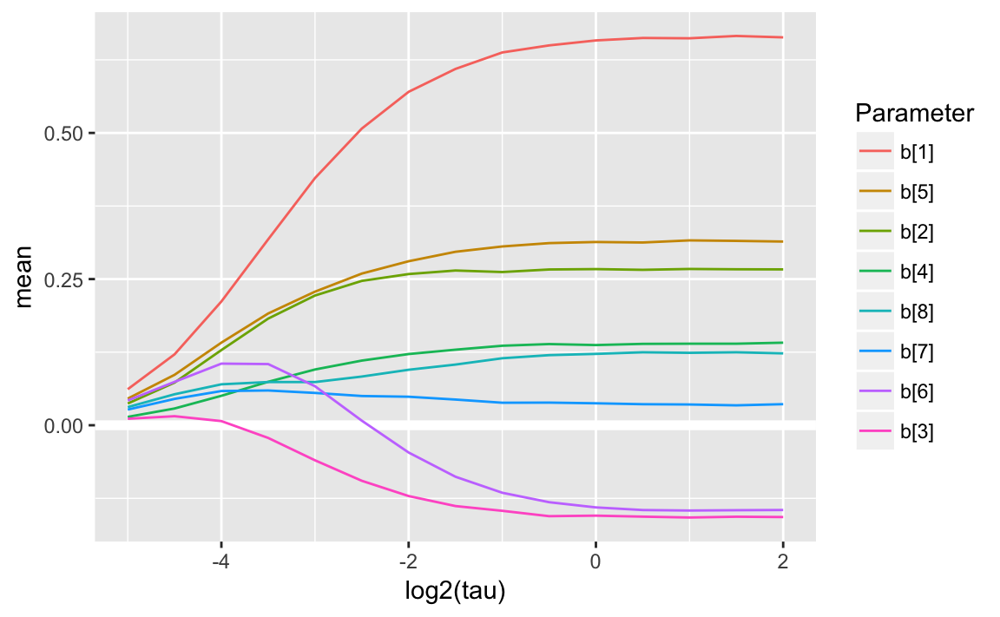


```r
plot_coefpath_loo <- function(x) {
  map_df(x,
       function(x) {
         tibble(tau = x$tau,
                elpd = x$loo$elpd_loo,
                lppd = x$lppd,
                p = x$loo$p_loo)
       }) %>%
    gather(parameter, value, -tau) %>%
    ggplot(aes(x = tau, y = value)) +
    geom_point() +
    geom_line() +
    facet_wrap(~ parameter, scale = "free_y", ncol = 1)
}
```

```r
plot_coefpath_loo(coefpath_normal)
```

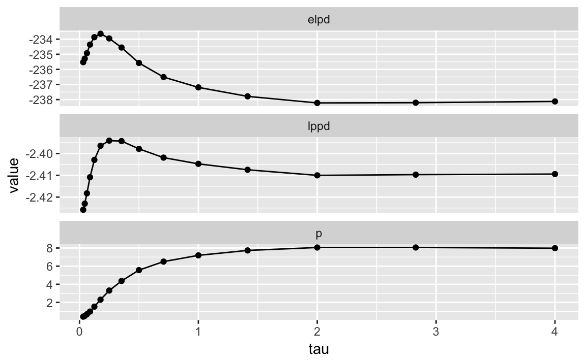


Which is the "best" $tau$?

```r
get_best_tau <- function(coefpath) {
  map_df(coefpath,
       function(x) {
         tibble(tau = x$tau,
                elpd = x$loo$elpd_loo,
                p = x$loo$p_loo)
       }) %>%
    filter(elpd == max(elpd)) 
}
```


```r
get_best_tau(coefpath_normal)
#> # A tibble: 1 × 3
#>     tau  elpd     p
#>   <dbl> <dbl> <dbl>
#> 1 0.177  -234   2.3
```

The mean estimate of $\tau$ is higher than the best estimate, and there is some uncertainty over it. 

```r
mod_lm_coef_normal_2 <- stan_model("stan/lm-coef-normal-2.stan")
#> In file included from file278426df96ec.cpp:8:
#> In file included from /Users/jrnold/Library/R/3.4/library/StanHeaders/include/src/stan/model/model_header.hpp:4:
#> In file included from /Users/jrnold/Library/R/3.4/library/StanHeaders/include/stan/math.hpp:4:
#> In file included from /Users/jrnold/Library/R/3.4/library/StanHeaders/include/stan/math/rev/mat.hpp:4:
#> In file included from /Users/jrnold/Library/R/3.4/library/StanHeaders/include/stan/math/rev/core.hpp:12:
#> In file included from /Users/jrnold/Library/R/3.4/library/StanHeaders/include/stan/math/rev/core/gevv_vvv_vari.hpp:5:
#> In file included from /Users/jrnold/Library/R/3.4/library/StanHeaders/include/stan/math/rev/core/var.hpp:7:
#> In file included from /Users/jrnold/Library/R/3.4/library/BH/include/boost/math/tools/config.hpp:13:
#> In file included from /Users/jrnold/Library/R/3.4/library/BH/include/boost/config.hpp:39:
#> /Users/jrnold/Library/R/3.4/library/BH/include/boost/config/compiler/clang.hpp:196:11: warning: 'BOOST_NO_CXX11_RVALUE_REFERENCES' macro redefined [-Wmacro-redefined]
#> #  define BOOST_NO_CXX11_RVALUE_REFERENCES
#>           ^
#> <command line>:6:9: note: previous definition is here
#> #define BOOST_NO_CXX11_RVALUE_REFERENCES 1
#>         ^
#> In file included from file278426df96ec.cpp:8:
#> In file included from /Users/jrnold/Library/R/3.4/library/StanHeaders/include/src/stan/model/model_header.hpp:4:
#> In file included from /Users/jrnold/Library/R/3.4/library/StanHeaders/include/stan/math.hpp:4:
#> In file included from /Users/jrnold/Library/R/3.4/library/StanHeaders/include/stan/math/rev/mat.hpp:4:
#> In file included from /Users/jrnold/Library/R/3.4/library/StanHeaders/include/stan/math/rev/core.hpp:42:
#> /Users/jrnold/Library/R/3.4/library/StanHeaders/include/stan/math/rev/core/set_zero_all_adjoints.hpp:14:17: warning: unused function 'set_zero_all_adjoints' [-Wunused-function]
#>     static void set_zero_all_adjoints() {
#>                 ^
#> In file included from file278426df96ec.cpp:8:
#> In file included from /Users/jrnold/Library/R/3.4/library/StanHeaders/include/src/stan/model/model_header.hpp:4:
#> In file included from /Users/jrnold/Library/R/3.4/library/StanHeaders/include/stan/math.hpp:4:
#> In file included from /Users/jrnold/Library/R/3.4/library/StanHeaders/include/stan/math/rev/mat.hpp:4:
#> In file included from /Users/jrnold/Library/R/3.4/library/StanHeaders/include/stan/math/rev/core.hpp:43:
#> /Users/jrnold/Library/R/3.4/library/StanHeaders/include/stan/math/rev/core/set_zero_all_adjoints_nested.hpp:17:17: warning: 'static' function 'set_zero_all_adjoints_nested' declared in header file should be declared 'static inline' [-Wunneeded-internal-declaration]
#>     static void set_zero_all_adjoints_nested() {
#>                 ^
#> In file included from file278426df96ec.cpp:8:
#> In file included from /Users/jrnold/Library/R/3.4/library/StanHeaders/include/src/stan/model/model_header.hpp:4:
#> In file included from /Users/jrnold/Library/R/3.4/library/StanHeaders/include/stan/math.hpp:4:
#> In file included from /Users/jrnold/Library/R/3.4/library/StanHeaders/include/stan/math/rev/mat.hpp:11:
#> In file included from /Users/jrnold/Library/R/3.4/library/StanHeaders/include/stan/math/prim/mat.hpp:59:
#> /Users/jrnold/Library/R/3.4/library/StanHeaders/include/stan/math/prim/mat/fun/autocorrelation.hpp:17:14: warning: function 'fft_next_good_size' is not needed and will not be emitted [-Wunneeded-internal-declaration]
#>       size_t fft_next_good_size(size_t N) {
#>              ^
#> In file included from file278426df96ec.cpp:8:
#> In file included from /Users/jrnold/Library/R/3.4/library/StanHeaders/include/src/stan/model/model_header.hpp:4:
#> In file included from /Users/jrnold/Library/R/3.4/library/StanHeaders/include/stan/math.hpp:4:
#> In file included from /Users/jrnold/Library/R/3.4/library/StanHeaders/include/stan/math/rev/mat.hpp:11:
#> In file included from /Users/jrnold/Library/R/3.4/library/StanHeaders/include/stan/math/prim/mat.hpp:298:
#> In file included from /Users/jrnold/Library/R/3.4/library/StanHeaders/include/stan/math/prim/arr.hpp:39:
#> In file included from /Users/jrnold/Library/R/3.4/library/StanHeaders/include/stan/math/prim/arr/functor/integrate_ode_rk45.hpp:13:
#> In file included from /Users/jrnold/Library/R/3.4/library/BH/include/boost/numeric/odeint.hpp:61:
#> In file included from /Users/jrnold/Library/R/3.4/library/BH/include/boost/numeric/odeint/util/multi_array_adaption.hpp:29:
#> In file included from /Users/jrnold/Library/R/3.4/library/BH/include/boost/multi_array.hpp:21:
#> In file included from /Users/jrnold/Library/R/3.4/library/BH/include/boost/multi_array/base.hpp:28:
#> /Users/jrnold/Library/R/3.4/library/BH/include/boost/multi_array/concept_checks.hpp:42:43: warning: unused typedef 'index_range' [-Wunused-local-typedef]
#>       typedef typename Array::index_range index_range;
#>                                           ^
#> /Users/jrnold/Library/R/3.4/library/BH/include/boost/multi_array/concept_checks.hpp:43:37: warning: unused typedef 'index' [-Wunused-local-typedef]
#>       typedef typename Array::index index;
#>                                     ^
#> /Users/jrnold/Library/R/3.4/library/BH/include/boost/multi_array/concept_checks.hpp:53:43: warning: unused typedef 'index_range' [-Wunused-local-typedef]
#>       typedef typename Array::index_range index_range;
#>                                           ^
#> /Users/jrnold/Library/R/3.4/library/BH/include/boost/multi_array/concept_checks.hpp:54:37: warning: unused typedef 'index' [-Wunused-local-typedef]
#>       typedef typename Array::index index;
#>                                     ^
#> 8 warnings generated.
```

```r
fit_normal <- sampling(mod_lm_coef_normal_2, data = prostate_data, refresh = -1,
                 control = list(adapt_delta = 0.99))
#> 
#> Gradient evaluation took 3.3e-05 seconds
#> 1000 transitions using 10 leapfrog steps per transition would take 0.33 seconds.
#> Adjust your expectations accordingly!
#> 
#> 
#> 
#>  Elapsed Time: 0.377087 seconds (Warm-up)
#>                0.244246 seconds (Sampling)
#>                0.621333 seconds (Total)
#> 
#> 
#> Gradient evaluation took 1.7e-05 seconds
#> 1000 transitions using 10 leapfrog steps per transition would take 0.17 seconds.
#> Adjust your expectations accordingly!
#> 
#> 
#> 
#>  Elapsed Time: 0.395013 seconds (Warm-up)
#>                0.219145 seconds (Sampling)
#>                0.614158 seconds (Total)
#> 
#> 
#> Gradient evaluation took 1.6e-05 seconds
#> 1000 transitions using 10 leapfrog steps per transition would take 0.16 seconds.
#> Adjust your expectations accordingly!
#> 
#> 
#> 
#>  Elapsed Time: 0.290592 seconds (Warm-up)
#>                0.233561 seconds (Sampling)
#>                0.524153 seconds (Total)
#> 
#> 
#> Gradient evaluation took 1.7e-05 seconds
#> 1000 transitions using 10 leapfrog steps per transition would take 0.17 seconds.
#> Adjust your expectations accordingly!
#> 
#> 
#> 
#>  Elapsed Time: 0.411155 seconds (Warm-up)
#>                0.273809 seconds (Sampling)
#>                0.684964 seconds (Total)
```


```r
summary(fit_normal, "tau")$summary
#>      mean se_mean    sd   2.5%   25%   50%   75% 97.5% n_eff Rhat
#> tau 0.265 0.00519 0.139 0.0542 0.167 0.245 0.339 0.603   718    1
```


```r
loo(extract_log_lik(fit_normal))
#> Computed from 4000 by 97 log-likelihood matrix
#> 
#>          Estimate  SE
#> elpd_loo   -234.6 3.0
#> p_loo         3.8 0.4
#> looic       469.2 6.0
#> 
#> All Pareto k estimates are good (k < 0.5)
#> See help('pareto-k-diagnostic') for details.
```


```r
mcmc_dens(as.array(fit_normal), "tau")
```

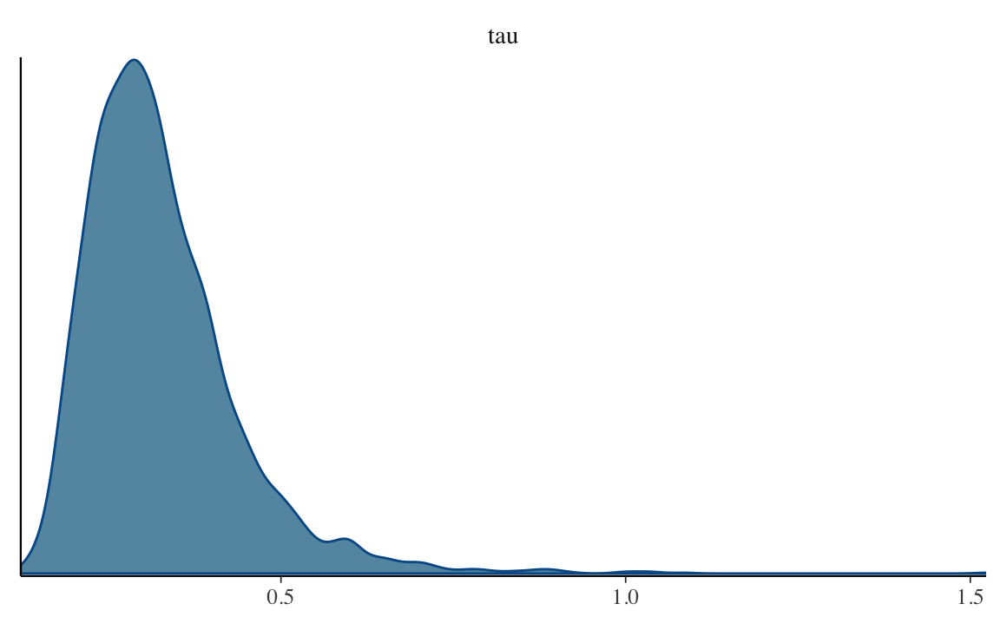


```r
mcmc_dens(as.array(fit_normal), regex_pars = "^b")
```

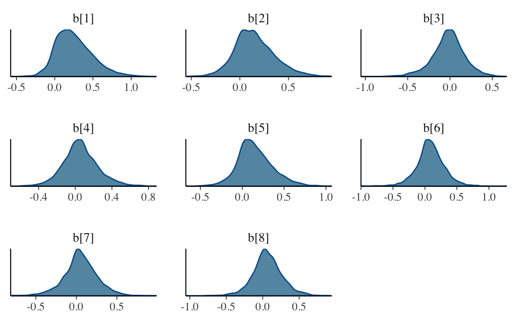

### Double Exponential (Laplace) Prior

A second prior to consider for $\vec\beta$ is the Double Exponential.


```r
mod_lasso_1 <- stan_model("stan/lm-coef-lasso-1.stan")
#> In file included from file278426ec8e21.cpp:8:
#> In file included from /Users/jrnold/Library/R/3.4/library/StanHeaders/include/src/stan/model/model_header.hpp:4:
#> In file included from /Users/jrnold/Library/R/3.4/library/StanHeaders/include/stan/math.hpp:4:
#> In file included from /Users/jrnold/Library/R/3.4/library/StanHeaders/include/stan/math/rev/mat.hpp:4:
#> In file included from /Users/jrnold/Library/R/3.4/library/StanHeaders/include/stan/math/rev/core.hpp:12:
#> In file included from /Users/jrnold/Library/R/3.4/library/StanHeaders/include/stan/math/rev/core/gevv_vvv_vari.hpp:5:
#> In file included from /Users/jrnold/Library/R/3.4/library/StanHeaders/include/stan/math/rev/core/var.hpp:7:
#> In file included from /Users/jrnold/Library/R/3.4/library/BH/include/boost/math/tools/config.hpp:13:
#> In file included from /Users/jrnold/Library/R/3.4/library/BH/include/boost/config.hpp:39:
#> /Users/jrnold/Library/R/3.4/library/BH/include/boost/config/compiler/clang.hpp:196:11: warning: 'BOOST_NO_CXX11_RVALUE_REFERENCES' macro redefined [-Wmacro-redefined]
#> #  define BOOST_NO_CXX11_RVALUE_REFERENCES
#>           ^
#> <command line>:6:9: note: previous definition is here
#> #define BOOST_NO_CXX11_RVALUE_REFERENCES 1
#>         ^
#> In file included from file278426ec8e21.cpp:8:
#> In file included from /Users/jrnold/Library/R/3.4/library/StanHeaders/include/src/stan/model/model_header.hpp:4:
#> In file included from /Users/jrnold/Library/R/3.4/library/StanHeaders/include/stan/math.hpp:4:
#> In file included from /Users/jrnold/Library/R/3.4/library/StanHeaders/include/stan/math/rev/mat.hpp:4:
#> In file included from /Users/jrnold/Library/R/3.4/library/StanHeaders/include/stan/math/rev/core.hpp:42:
#> /Users/jrnold/Library/R/3.4/library/StanHeaders/include/stan/math/rev/core/set_zero_all_adjoints.hpp:14:17: warning: unused function 'set_zero_all_adjoints' [-Wunused-function]
#>     static void set_zero_all_adjoints() {
#>                 ^
#> In file included from file278426ec8e21.cpp:8:
#> In file included from /Users/jrnold/Library/R/3.4/library/StanHeaders/include/src/stan/model/model_header.hpp:4:
#> In file included from /Users/jrnold/Library/R/3.4/library/StanHeaders/include/stan/math.hpp:4:
#> In file included from /Users/jrnold/Library/R/3.4/library/StanHeaders/include/stan/math/rev/mat.hpp:4:
#> In file included from /Users/jrnold/Library/R/3.4/library/StanHeaders/include/stan/math/rev/core.hpp:43:
#> /Users/jrnold/Library/R/3.4/library/StanHeaders/include/stan/math/rev/core/set_zero_all_adjoints_nested.hpp:17:17: warning: 'static' function 'set_zero_all_adjoints_nested' declared in header file should be declared 'static inline' [-Wunneeded-internal-declaration]
#>     static void set_zero_all_adjoints_nested() {
#>                 ^
#> In file included from file278426ec8e21.cpp:8:
#> In file included from /Users/jrnold/Library/R/3.4/library/StanHeaders/include/src/stan/model/model_header.hpp:4:
#> In file included from /Users/jrnold/Library/R/3.4/library/StanHeaders/include/stan/math.hpp:4:
#> In file included from /Users/jrnold/Library/R/3.4/library/StanHeaders/include/stan/math/rev/mat.hpp:11:
#> In file included from /Users/jrnold/Library/R/3.4/library/StanHeaders/include/stan/math/prim/mat.hpp:59:
#> /Users/jrnold/Library/R/3.4/library/StanHeaders/include/stan/math/prim/mat/fun/autocorrelation.hpp:17:14: warning: function 'fft_next_good_size' is not needed and will not be emitted [-Wunneeded-internal-declaration]
#>       size_t fft_next_good_size(size_t N) {
#>              ^
#> In file included from file278426ec8e21.cpp:8:
#> In file included from /Users/jrnold/Library/R/3.4/library/StanHeaders/include/src/stan/model/model_header.hpp:4:
#> In file included from /Users/jrnold/Library/R/3.4/library/StanHeaders/include/stan/math.hpp:4:
#> In file included from /Users/jrnold/Library/R/3.4/library/StanHeaders/include/stan/math/rev/mat.hpp:11:
#> In file included from /Users/jrnold/Library/R/3.4/library/StanHeaders/include/stan/math/prim/mat.hpp:298:
#> In file included from /Users/jrnold/Library/R/3.4/library/StanHeaders/include/stan/math/prim/arr.hpp:39:
#> In file included from /Users/jrnold/Library/R/3.4/library/StanHeaders/include/stan/math/prim/arr/functor/integrate_ode_rk45.hpp:13:
#> In file included from /Users/jrnold/Library/R/3.4/library/BH/include/boost/numeric/odeint.hpp:61:
#> In file included from /Users/jrnold/Library/R/3.4/library/BH/include/boost/numeric/odeint/util/multi_array_adaption.hpp:29:
#> In file included from /Users/jrnold/Library/R/3.4/library/BH/include/boost/multi_array.hpp:21:
#> In file included from /Users/jrnold/Library/R/3.4/library/BH/include/boost/multi_array/base.hpp:28:
#> /Users/jrnold/Library/R/3.4/library/BH/include/boost/multi_array/concept_checks.hpp:42:43: warning: unused typedef 'index_range' [-Wunused-local-typedef]
#>       typedef typename Array::index_range index_range;
#>                                           ^
#> /Users/jrnold/Library/R/3.4/library/BH/include/boost/multi_array/concept_checks.hpp:43:37: warning: unused typedef 'index' [-Wunused-local-typedef]
#>       typedef typename Array::index index;
#>                                     ^
#> /Users/jrnold/Library/R/3.4/library/BH/include/boost/multi_array/concept_checks.hpp:53:43: warning: unused typedef 'index_range' [-Wunused-local-typedef]
#>       typedef typename Array::index_range index_range;
#>                                           ^
#> /Users/jrnold/Library/R/3.4/library/BH/include/boost/multi_array/concept_checks.hpp:54:37: warning: unused typedef 'index' [-Wunused-local-typedef]
#>       typedef typename Array::index index;
#>                                     ^
#> 8 warnings generated.
```


```r
coefpath_lasso <- map(tau_values,
                      run_with_tau,
                   mod = mod_lasso_1,
                   data = prostate_data)
#> Tau =  4
#> SAMPLING FOR MODEL 'lm-coef-lasso-1' NOW (CHAIN 1).
#> 
#> Gradient evaluation took 3.2e-05 seconds
#> 1000 transitions using 10 leapfrog steps per transition would take 0.32 seconds.
#> Adjust your expectations accordingly!
#> 
#> 
#> Iteration:    1 / 2000 [  0%]  (Warmup)
#> Iteration:  200 / 2000 [ 10%]  (Warmup)
#> Iteration:  400 / 2000 [ 20%]  (Warmup)
#> Iteration:  600 / 2000 [ 30%]  (Warmup)
#> Iteration:  800 / 2000 [ 40%]  (Warmup)
#> Iteration: 1000 / 2000 [ 50%]  (Warmup)
#> Iteration: 1001 / 2000 [ 50%]  (Sampling)
#> Iteration: 1200 / 2000 [ 60%]  (Sampling)
#> Iteration: 1400 / 2000 [ 70%]  (Sampling)
#> Iteration: 1600 / 2000 [ 80%]  (Sampling)
#> Iteration: 1800 / 2000 [ 90%]  (Sampling)
#> Iteration: 2000 / 2000 [100%]  (Sampling)
#> 
#>  Elapsed Time: 0.169471 seconds (Warm-up)
#>                0.136615 seconds (Sampling)
#>                0.306086 seconds (Total)
#> 
#> 
#> SAMPLING FOR MODEL 'lm-coef-lasso-1' NOW (CHAIN 2).
#> 
#> Gradient evaluation took 1.5e-05 seconds
#> 1000 transitions using 10 leapfrog steps per transition would take 0.15 seconds.
#> Adjust your expectations accordingly!
#> 
#> 
#> Iteration:    1 / 2000 [  0%]  (Warmup)
#> Iteration:  200 / 2000 [ 10%]  (Warmup)
#> Iteration:  400 / 2000 [ 20%]  (Warmup)
#> Iteration:  600 / 2000 [ 30%]  (Warmup)
#> Iteration:  800 / 2000 [ 40%]  (Warmup)
#> Iteration: 1000 / 2000 [ 50%]  (Warmup)
#> Iteration: 1001 / 2000 [ 50%]  (Sampling)
#> Iteration: 1200 / 2000 [ 60%]  (Sampling)
#> Iteration: 1400 / 2000 [ 70%]  (Sampling)
#> Iteration: 1600 / 2000 [ 80%]  (Sampling)
#> Iteration: 1800 / 2000 [ 90%]  (Sampling)
#> Iteration: 2000 / 2000 [100%]  (Sampling)
#> 
#>  Elapsed Time: 0.160739 seconds (Warm-up)
#>                0.132459 seconds (Sampling)
#>                0.293198 seconds (Total)
#> 
#> 
#> SAMPLING FOR MODEL 'lm-coef-lasso-1' NOW (CHAIN 3).
#> 
#> Gradient evaluation took 1.5e-05 seconds
#> 1000 transitions using 10 leapfrog steps per transition would take 0.15 seconds.
#> Adjust your expectations accordingly!
#> 
#> 
#> Iteration:    1 / 2000 [  0%]  (Warmup)
#> Iteration:  200 / 2000 [ 10%]  (Warmup)
#> Iteration:  400 / 2000 [ 20%]  (Warmup)
#> Iteration:  600 / 2000 [ 30%]  (Warmup)
#> Iteration:  800 / 2000 [ 40%]  (Warmup)
#> Iteration: 1000 / 2000 [ 50%]  (Warmup)
#> Iteration: 1001 / 2000 [ 50%]  (Sampling)
#> Iteration: 1200 / 2000 [ 60%]  (Sampling)
#> Iteration: 1400 / 2000 [ 70%]  (Sampling)
#> Iteration: 1600 / 2000 [ 80%]  (Sampling)
#> Iteration: 1800 / 2000 [ 90%]  (Sampling)
#> Iteration: 2000 / 2000 [100%]  (Sampling)
#> 
#>  Elapsed Time: 0.163054 seconds (Warm-up)
#>                0.119725 seconds (Sampling)
#>                0.282779 seconds (Total)
#> 
#> 
#> SAMPLING FOR MODEL 'lm-coef-lasso-1' NOW (CHAIN 4).
#> 
#> Gradient evaluation took 3.8e-05 seconds
#> 1000 transitions using 10 leapfrog steps per transition would take 0.38 seconds.
#> Adjust your expectations accordingly!
#> 
#> 
#> Iteration:    1 / 2000 [  0%]  (Warmup)
#> Iteration:  200 / 2000 [ 10%]  (Warmup)
#> Iteration:  400 / 2000 [ 20%]  (Warmup)
#> Iteration:  600 / 2000 [ 30%]  (Warmup)
#> Iteration:  800 / 2000 [ 40%]  (Warmup)
#> Iteration: 1000 / 2000 [ 50%]  (Warmup)
#> Iteration: 1001 / 2000 [ 50%]  (Sampling)
#> Iteration: 1200 / 2000 [ 60%]  (Sampling)
#> Iteration: 1400 / 2000 [ 70%]  (Sampling)
#> Iteration: 1600 / 2000 [ 80%]  (Sampling)
#> Iteration: 1800 / 2000 [ 90%]  (Sampling)
#> Iteration: 2000 / 2000 [100%]  (Sampling)
#> 
#>  Elapsed Time: 0.156085 seconds (Warm-up)
#>                0.13623 seconds (Sampling)
#>                0.292315 seconds (Total)
#> 
#> Tau =  2.83
#> SAMPLING FOR MODEL 'lm-coef-lasso-1' NOW (CHAIN 1).
#> 
#> Gradient evaluation took 2.2e-05 seconds
#> 1000 transitions using 10 leapfrog steps per transition would take 0.22 seconds.
#> Adjust your expectations accordingly!
#> 
#> 
#> Iteration:    1 / 2000 [  0%]  (Warmup)
#> Iteration:  200 / 2000 [ 10%]  (Warmup)
#> Iteration:  400 / 2000 [ 20%]  (Warmup)
#> Iteration:  600 / 2000 [ 30%]  (Warmup)
#> Iteration:  800 / 2000 [ 40%]  (Warmup)
#> Iteration: 1000 / 2000 [ 50%]  (Warmup)
#> Iteration: 1001 / 2000 [ 50%]  (Sampling)
#> Iteration: 1200 / 2000 [ 60%]  (Sampling)
#> Iteration: 1400 / 2000 [ 70%]  (Sampling)
#> Iteration: 1600 / 2000 [ 80%]  (Sampling)
#> Iteration: 1800 / 2000 [ 90%]  (Sampling)
#> Iteration: 2000 / 2000 [100%]  (Sampling)
#> 
#>  Elapsed Time: 0.16491 seconds (Warm-up)
#>                0.131669 seconds (Sampling)
#>                0.296579 seconds (Total)
#> 
#> 
#> SAMPLING FOR MODEL 'lm-coef-lasso-1' NOW (CHAIN 2).
#> 
#> Gradient evaluation took 1.6e-05 seconds
#> 1000 transitions using 10 leapfrog steps per transition would take 0.16 seconds.
#> Adjust your expectations accordingly!
#> 
#> 
#> Iteration:    1 / 2000 [  0%]  (Warmup)
#> Iteration:  200 / 2000 [ 10%]  (Warmup)
#> Iteration:  400 / 2000 [ 20%]  (Warmup)
#> Iteration:  600 / 2000 [ 30%]  (Warmup)
#> Iteration:  800 / 2000 [ 40%]  (Warmup)
#> Iteration: 1000 / 2000 [ 50%]  (Warmup)
#> Iteration: 1001 / 2000 [ 50%]  (Sampling)
#> Iteration: 1200 / 2000 [ 60%]  (Sampling)
#> Iteration: 1400 / 2000 [ 70%]  (Sampling)
#> Iteration: 1600 / 2000 [ 80%]  (Sampling)
#> Iteration: 1800 / 2000 [ 90%]  (Sampling)
#> Iteration: 2000 / 2000 [100%]  (Sampling)
#> 
#>  Elapsed Time: 0.15949 seconds (Warm-up)
#>                0.122812 seconds (Sampling)
#>                0.282302 seconds (Total)
#> 
#> 
#> SAMPLING FOR MODEL 'lm-coef-lasso-1' NOW (CHAIN 3).
#> 
#> Gradient evaluation took 3.1e-05 seconds
#> 1000 transitions using 10 leapfrog steps per transition would take 0.31 seconds.
#> Adjust your expectations accordingly!
#> 
#> 
#> Iteration:    1 / 2000 [  0%]  (Warmup)
#> Iteration:  200 / 2000 [ 10%]  (Warmup)
#> Iteration:  400 / 2000 [ 20%]  (Warmup)
#> Iteration:  600 / 2000 [ 30%]  (Warmup)
#> Iteration:  800 / 2000 [ 40%]  (Warmup)
#> Iteration: 1000 / 2000 [ 50%]  (Warmup)
#> Iteration: 1001 / 2000 [ 50%]  (Sampling)
#> Iteration: 1200 / 2000 [ 60%]  (Sampling)
#> Iteration: 1400 / 2000 [ 70%]  (Sampling)
#> Iteration: 1600 / 2000 [ 80%]  (Sampling)
#> Iteration: 1800 / 2000 [ 90%]  (Sampling)
#> Iteration: 2000 / 2000 [100%]  (Sampling)
#> 
#>  Elapsed Time: 0.158244 seconds (Warm-up)
#>                0.128231 seconds (Sampling)
#>                0.286475 seconds (Total)
#> 
#> 
#> SAMPLING FOR MODEL 'lm-coef-lasso-1' NOW (CHAIN 4).
#> 
#> Gradient evaluation took 1.6e-05 seconds
#> 1000 transitions using 10 leapfrog steps per transition would take 0.16 seconds.
#> Adjust your expectations accordingly!
#> 
#> 
#> Iteration:    1 / 2000 [  0%]  (Warmup)
#> Iteration:  200 / 2000 [ 10%]  (Warmup)
#> Iteration:  400 / 2000 [ 20%]  (Warmup)
#> Iteration:  600 / 2000 [ 30%]  (Warmup)
#> Iteration:  800 / 2000 [ 40%]  (Warmup)
#> Iteration: 1000 / 2000 [ 50%]  (Warmup)
#> Iteration: 1001 / 2000 [ 50%]  (Sampling)
#> Iteration: 1200 / 2000 [ 60%]  (Sampling)
#> Iteration: 1400 / 2000 [ 70%]  (Sampling)
#> Iteration: 1600 / 2000 [ 80%]  (Sampling)
#> Iteration: 1800 / 2000 [ 90%]  (Sampling)
#> Iteration: 2000 / 2000 [100%]  (Sampling)
#> 
#>  Elapsed Time: 0.144683 seconds (Warm-up)
#>                0.127824 seconds (Sampling)
#>                0.272507 seconds (Total)
#> 
#> Tau =  2
#> SAMPLING FOR MODEL 'lm-coef-lasso-1' NOW (CHAIN 1).
#> 
#> Gradient evaluation took 2.3e-05 seconds
#> 1000 transitions using 10 leapfrog steps per transition would take 0.23 seconds.
#> Adjust your expectations accordingly!
#> 
#> 
#> Iteration:    1 / 2000 [  0%]  (Warmup)
#> Iteration:  200 / 2000 [ 10%]  (Warmup)
#> Iteration:  400 / 2000 [ 20%]  (Warmup)
#> Iteration:  600 / 2000 [ 30%]  (Warmup)
#> Iteration:  800 / 2000 [ 40%]  (Warmup)
#> Iteration: 1000 / 2000 [ 50%]  (Warmup)
#> Iteration: 1001 / 2000 [ 50%]  (Sampling)
#> Iteration: 1200 / 2000 [ 60%]  (Sampling)
#> Iteration: 1400 / 2000 [ 70%]  (Sampling)
#> Iteration: 1600 / 2000 [ 80%]  (Sampling)
#> Iteration: 1800 / 2000 [ 90%]  (Sampling)
#> Iteration: 2000 / 2000 [100%]  (Sampling)
#> 
#>  Elapsed Time: 0.154439 seconds (Warm-up)
#>                0.123893 seconds (Sampling)
#>                0.278332 seconds (Total)
#> 
#> 
#> SAMPLING FOR MODEL 'lm-coef-lasso-1' NOW (CHAIN 2).
#> 
#> Gradient evaluation took 1.5e-05 seconds
#> 1000 transitions using 10 leapfrog steps per transition would take 0.15 seconds.
#> Adjust your expectations accordingly!
#> 
#> 
#> Iteration:    1 / 2000 [  0%]  (Warmup)
#> Iteration:  200 / 2000 [ 10%]  (Warmup)
#> Iteration:  400 / 2000 [ 20%]  (Warmup)
#> Iteration:  600 / 2000 [ 30%]  (Warmup)
#> Iteration:  800 / 2000 [ 40%]  (Warmup)
#> Iteration: 1000 / 2000 [ 50%]  (Warmup)
#> Iteration: 1001 / 2000 [ 50%]  (Sampling)
#> Iteration: 1200 / 2000 [ 60%]  (Sampling)
#> Iteration: 1400 / 2000 [ 70%]  (Sampling)
#> Iteration: 1600 / 2000 [ 80%]  (Sampling)
#> Iteration: 1800 / 2000 [ 90%]  (Sampling)
#> Iteration: 2000 / 2000 [100%]  (Sampling)
#> 
#>  Elapsed Time: 0.151097 seconds (Warm-up)
#>                0.132078 seconds (Sampling)
#>                0.283175 seconds (Total)
#> 
#> 
#> SAMPLING FOR MODEL 'lm-coef-lasso-1' NOW (CHAIN 3).
#> 
#> Gradient evaluation took 1.6e-05 seconds
#> 1000 transitions using 10 leapfrog steps per transition would take 0.16 seconds.
#> Adjust your expectations accordingly!
#> 
#> 
#> Iteration:    1 / 2000 [  0%]  (Warmup)
#> Iteration:  200 / 2000 [ 10%]  (Warmup)
#> Iteration:  400 / 2000 [ 20%]  (Warmup)
#> Iteration:  600 / 2000 [ 30%]  (Warmup)
#> Iteration:  800 / 2000 [ 40%]  (Warmup)
#> Iteration: 1000 / 2000 [ 50%]  (Warmup)
#> Iteration: 1001 / 2000 [ 50%]  (Sampling)
#> Iteration: 1200 / 2000 [ 60%]  (Sampling)
#> Iteration: 1400 / 2000 [ 70%]  (Sampling)
#> Iteration: 1600 / 2000 [ 80%]  (Sampling)
#> Iteration: 1800 / 2000 [ 90%]  (Sampling)
#> Iteration: 2000 / 2000 [100%]  (Sampling)
#> 
#>  Elapsed Time: 0.165071 seconds (Warm-up)
#>                0.128108 seconds (Sampling)
#>                0.293179 seconds (Total)
#> 
#> 
#> SAMPLING FOR MODEL 'lm-coef-lasso-1' NOW (CHAIN 4).
#> 
#> Gradient evaluation took 2.9e-05 seconds
#> 1000 transitions using 10 leapfrog steps per transition would take 0.29 seconds.
#> Adjust your expectations accordingly!
#> 
#> 
#> Iteration:    1 / 2000 [  0%]  (Warmup)
#> Iteration:  200 / 2000 [ 10%]  (Warmup)
#> Iteration:  400 / 2000 [ 20%]  (Warmup)
#> Iteration:  600 / 2000 [ 30%]  (Warmup)
#> Iteration:  800 / 2000 [ 40%]  (Warmup)
#> Iteration: 1000 / 2000 [ 50%]  (Warmup)
#> Iteration: 1001 / 2000 [ 50%]  (Sampling)
#> Iteration: 1200 / 2000 [ 60%]  (Sampling)
#> Iteration: 1400 / 2000 [ 70%]  (Sampling)
#> Iteration: 1600 / 2000 [ 80%]  (Sampling)
#> Iteration: 1800 / 2000 [ 90%]  (Sampling)
#> Iteration: 2000 / 2000 [100%]  (Sampling)
#> 
#>  Elapsed Time: 0.165049 seconds (Warm-up)
#>                0.11433 seconds (Sampling)
#>                0.279379 seconds (Total)
#> 
#> Tau =  1.41
#> SAMPLING FOR MODEL 'lm-coef-lasso-1' NOW (CHAIN 1).
#> 
#> Gradient evaluation took 2.3e-05 seconds
#> 1000 transitions using 10 leapfrog steps per transition would take 0.23 seconds.
#> Adjust your expectations accordingly!
#> 
#> 
#> Iteration:    1 / 2000 [  0%]  (Warmup)
#> Iteration:  200 / 2000 [ 10%]  (Warmup)
#> Iteration:  400 / 2000 [ 20%]  (Warmup)
#> Iteration:  600 / 2000 [ 30%]  (Warmup)
#> Iteration:  800 / 2000 [ 40%]  (Warmup)
#> Iteration: 1000 / 2000 [ 50%]  (Warmup)
#> Iteration: 1001 / 2000 [ 50%]  (Sampling)
#> Iteration: 1200 / 2000 [ 60%]  (Sampling)
#> Iteration: 1400 / 2000 [ 70%]  (Sampling)
#> Iteration: 1600 / 2000 [ 80%]  (Sampling)
#> Iteration: 1800 / 2000 [ 90%]  (Sampling)
#> Iteration: 2000 / 2000 [100%]  (Sampling)
#> 
#>  Elapsed Time: 0.151507 seconds (Warm-up)
#>                0.128273 seconds (Sampling)
#>                0.27978 seconds (Total)
#> 
#> 
#> SAMPLING FOR MODEL 'lm-coef-lasso-1' NOW (CHAIN 2).
#> 
#> Gradient evaluation took 1.2e-05 seconds
#> 1000 transitions using 10 leapfrog steps per transition would take 0.12 seconds.
#> Adjust your expectations accordingly!
#> 
#> 
#> Iteration:    1 / 2000 [  0%]  (Warmup)
#> Iteration:  200 / 2000 [ 10%]  (Warmup)
#> Iteration:  400 / 2000 [ 20%]  (Warmup)
#> Iteration:  600 / 2000 [ 30%]  (Warmup)
#> Iteration:  800 / 2000 [ 40%]  (Warmup)
#> Iteration: 1000 / 2000 [ 50%]  (Warmup)
#> Iteration: 1001 / 2000 [ 50%]  (Sampling)
#> Iteration: 1200 / 2000 [ 60%]  (Sampling)
#> Iteration: 1400 / 2000 [ 70%]  (Sampling)
#> Iteration: 1600 / 2000 [ 80%]  (Sampling)
#> Iteration: 1800 / 2000 [ 90%]  (Sampling)
#> Iteration: 2000 / 2000 [100%]  (Sampling)
#> 
#>  Elapsed Time: 0.153933 seconds (Warm-up)
#>                0.114526 seconds (Sampling)
#>                0.268459 seconds (Total)
#> 
#> 
#> SAMPLING FOR MODEL 'lm-coef-lasso-1' NOW (CHAIN 3).
#> 
#> Gradient evaluation took 1.6e-05 seconds
#> 1000 transitions using 10 leapfrog steps per transition would take 0.16 seconds.
#> Adjust your expectations accordingly!
#> 
#> 
#> Iteration:    1 / 2000 [  0%]  (Warmup)
#> Iteration:  200 / 2000 [ 10%]  (Warmup)
#> Iteration:  400 / 2000 [ 20%]  (Warmup)
#> Iteration:  600 / 2000 [ 30%]  (Warmup)
#> Iteration:  800 / 2000 [ 40%]  (Warmup)
#> Iteration: 1000 / 2000 [ 50%]  (Warmup)
#> Iteration: 1001 / 2000 [ 50%]  (Sampling)
#> Iteration: 1200 / 2000 [ 60%]  (Sampling)
#> Iteration: 1400 / 2000 [ 70%]  (Sampling)
#> Iteration: 1600 / 2000 [ 80%]  (Sampling)
#> Iteration: 1800 / 2000 [ 90%]  (Sampling)
#> Iteration: 2000 / 2000 [100%]  (Sampling)
#> 
#>  Elapsed Time: 0.148666 seconds (Warm-up)
#>                0.13089 seconds (Sampling)
#>                0.279556 seconds (Total)
#> 
#> 
#> SAMPLING FOR MODEL 'lm-coef-lasso-1' NOW (CHAIN 4).
#> 
#> Gradient evaluation took 1.7e-05 seconds
#> 1000 transitions using 10 leapfrog steps per transition would take 0.17 seconds.
#> Adjust your expectations accordingly!
#> 
#> 
#> Iteration:    1 / 2000 [  0%]  (Warmup)
#> Iteration:  200 / 2000 [ 10%]  (Warmup)
#> Iteration:  400 / 2000 [ 20%]  (Warmup)
#> Iteration:  600 / 2000 [ 30%]  (Warmup)
#> Iteration:  800 / 2000 [ 40%]  (Warmup)
#> Iteration: 1000 / 2000 [ 50%]  (Warmup)
#> Iteration: 1001 / 2000 [ 50%]  (Sampling)
#> Iteration: 1200 / 2000 [ 60%]  (Sampling)
#> Iteration: 1400 / 2000 [ 70%]  (Sampling)
#> Iteration: 1600 / 2000 [ 80%]  (Sampling)
#> Iteration: 1800 / 2000 [ 90%]  (Sampling)
#> Iteration: 2000 / 2000 [100%]  (Sampling)
#> 
#>  Elapsed Time: 0.157489 seconds (Warm-up)
#>                0.133079 seconds (Sampling)
#>                0.290568 seconds (Total)
#> 
#> Tau =  1
#> SAMPLING FOR MODEL 'lm-coef-lasso-1' NOW (CHAIN 1).
#> 
#> Gradient evaluation took 2.5e-05 seconds
#> 1000 transitions using 10 leapfrog steps per transition would take 0.25 seconds.
#> Adjust your expectations accordingly!
#> 
#> 
#> Iteration:    1 / 2000 [  0%]  (Warmup)
#> Iteration:  200 / 2000 [ 10%]  (Warmup)
#> Iteration:  400 / 2000 [ 20%]  (Warmup)
#> Iteration:  600 / 2000 [ 30%]  (Warmup)
#> Iteration:  800 / 2000 [ 40%]  (Warmup)
#> Iteration: 1000 / 2000 [ 50%]  (Warmup)
#> Iteration: 1001 / 2000 [ 50%]  (Sampling)
#> Iteration: 1200 / 2000 [ 60%]  (Sampling)
#> Iteration: 1400 / 2000 [ 70%]  (Sampling)
#> Iteration: 1600 / 2000 [ 80%]  (Sampling)
#> Iteration: 1800 / 2000 [ 90%]  (Sampling)
#> Iteration: 2000 / 2000 [100%]  (Sampling)
#> 
#>  Elapsed Time: 0.157807 seconds (Warm-up)
#>                0.119827 seconds (Sampling)
#>                0.277634 seconds (Total)
#> 
#> 
#> SAMPLING FOR MODEL 'lm-coef-lasso-1' NOW (CHAIN 2).
#> 
#> Gradient evaluation took 1.4e-05 seconds
#> 1000 transitions using 10 leapfrog steps per transition would take 0.14 seconds.
#> Adjust your expectations accordingly!
#> 
#> 
#> Iteration:    1 / 2000 [  0%]  (Warmup)
#> Iteration:  200 / 2000 [ 10%]  (Warmup)
#> Iteration:  400 / 2000 [ 20%]  (Warmup)
#> Iteration:  600 / 2000 [ 30%]  (Warmup)
#> Iteration:  800 / 2000 [ 40%]  (Warmup)
#> Iteration: 1000 / 2000 [ 50%]  (Warmup)
#> Iteration: 1001 / 2000 [ 50%]  (Sampling)
#> Iteration: 1200 / 2000 [ 60%]  (Sampling)
#> Iteration: 1400 / 2000 [ 70%]  (Sampling)
#> Iteration: 1600 / 2000 [ 80%]  (Sampling)
#> Iteration: 1800 / 2000 [ 90%]  (Sampling)
#> Iteration: 2000 / 2000 [100%]  (Sampling)
#> 
#>  Elapsed Time: 0.152256 seconds (Warm-up)
#>                0.129752 seconds (Sampling)
#>                0.282008 seconds (Total)
#> 
#> 
#> SAMPLING FOR MODEL 'lm-coef-lasso-1' NOW (CHAIN 3).
#> 
#> Gradient evaluation took 1.6e-05 seconds
#> 1000 transitions using 10 leapfrog steps per transition would take 0.16 seconds.
#> Adjust your expectations accordingly!
#> 
#> 
#> Iteration:    1 / 2000 [  0%]  (Warmup)
#> Iteration:  200 / 2000 [ 10%]  (Warmup)
#> Iteration:  400 / 2000 [ 20%]  (Warmup)
#> Iteration:  600 / 2000 [ 30%]  (Warmup)
#> Iteration:  800 / 2000 [ 40%]  (Warmup)
#> Iteration: 1000 / 2000 [ 50%]  (Warmup)
#> Iteration: 1001 / 2000 [ 50%]  (Sampling)
#> Iteration: 1200 / 2000 [ 60%]  (Sampling)
#> Iteration: 1400 / 2000 [ 70%]  (Sampling)
#> Iteration: 1600 / 2000 [ 80%]  (Sampling)
#> Iteration: 1800 / 2000 [ 90%]  (Sampling)
#> Iteration: 2000 / 2000 [100%]  (Sampling)
#> 
#>  Elapsed Time: 0.152488 seconds (Warm-up)
#>                0.115369 seconds (Sampling)
#>                0.267857 seconds (Total)
#> 
#> 
#> SAMPLING FOR MODEL 'lm-coef-lasso-1' NOW (CHAIN 4).
#> 
#> Gradient evaluation took 2.5e-05 seconds
#> 1000 transitions using 10 leapfrog steps per transition would take 0.25 seconds.
#> Adjust your expectations accordingly!
#> 
#> 
#> Iteration:    1 / 2000 [  0%]  (Warmup)
#> Iteration:  200 / 2000 [ 10%]  (Warmup)
#> Iteration:  400 / 2000 [ 20%]  (Warmup)
#> Iteration:  600 / 2000 [ 30%]  (Warmup)
#> Iteration:  800 / 2000 [ 40%]  (Warmup)
#> Iteration: 1000 / 2000 [ 50%]  (Warmup)
#> Iteration: 1001 / 2000 [ 50%]  (Sampling)
#> Iteration: 1200 / 2000 [ 60%]  (Sampling)
#> Iteration: 1400 / 2000 [ 70%]  (Sampling)
#> Iteration: 1600 / 2000 [ 80%]  (Sampling)
#> Iteration: 1800 / 2000 [ 90%]  (Sampling)
#> Iteration: 2000 / 2000 [100%]  (Sampling)
#> 
#>  Elapsed Time: 0.138709 seconds (Warm-up)
#>                0.119415 seconds (Sampling)
#>                0.258124 seconds (Total)
#> 
#> Tau =  0.707
#> SAMPLING FOR MODEL 'lm-coef-lasso-1' NOW (CHAIN 1).
#> 
#> Gradient evaluation took 2.4e-05 seconds
#> 1000 transitions using 10 leapfrog steps per transition would take 0.24 seconds.
#> Adjust your expectations accordingly!
#> 
#> 
#> Iteration:    1 / 2000 [  0%]  (Warmup)
#> Iteration:  200 / 2000 [ 10%]  (Warmup)
#> Iteration:  400 / 2000 [ 20%]  (Warmup)
#> Iteration:  600 / 2000 [ 30%]  (Warmup)
#> Iteration:  800 / 2000 [ 40%]  (Warmup)
#> Iteration: 1000 / 2000 [ 50%]  (Warmup)
#> Iteration: 1001 / 2000 [ 50%]  (Sampling)
#> Iteration: 1200 / 2000 [ 60%]  (Sampling)
#> Iteration: 1400 / 2000 [ 70%]  (Sampling)
#> Iteration: 1600 / 2000 [ 80%]  (Sampling)
#> Iteration: 1800 / 2000 [ 90%]  (Sampling)
#> Iteration: 2000 / 2000 [100%]  (Sampling)
#> 
#>  Elapsed Time: 0.148239 seconds (Warm-up)
#>                0.130681 seconds (Sampling)
#>                0.27892 seconds (Total)
#> 
#> 
#> SAMPLING FOR MODEL 'lm-coef-lasso-1' NOW (CHAIN 2).
#> 
#> Gradient evaluation took 1.2e-05 seconds
#> 1000 transitions using 10 leapfrog steps per transition would take 0.12 seconds.
#> Adjust your expectations accordingly!
#> 
#> 
#> Iteration:    1 / 2000 [  0%]  (Warmup)
#> Iteration:  200 / 2000 [ 10%]  (Warmup)
#> Iteration:  400 / 2000 [ 20%]  (Warmup)
#> Iteration:  600 / 2000 [ 30%]  (Warmup)
#> Iteration:  800 / 2000 [ 40%]  (Warmup)
#> Iteration: 1000 / 2000 [ 50%]  (Warmup)
#> Iteration: 1001 / 2000 [ 50%]  (Sampling)
#> Iteration: 1200 / 2000 [ 60%]  (Sampling)
#> Iteration: 1400 / 2000 [ 70%]  (Sampling)
#> Iteration: 1600 / 2000 [ 80%]  (Sampling)
#> Iteration: 1800 / 2000 [ 90%]  (Sampling)
#> Iteration: 2000 / 2000 [100%]  (Sampling)
#> 
#>  Elapsed Time: 0.159341 seconds (Warm-up)
#>                0.13126 seconds (Sampling)
#>                0.290601 seconds (Total)
#> 
#> 
#> SAMPLING FOR MODEL 'lm-coef-lasso-1' NOW (CHAIN 3).
#> 
#> Gradient evaluation took 1.6e-05 seconds
#> 1000 transitions using 10 leapfrog steps per transition would take 0.16 seconds.
#> Adjust your expectations accordingly!
#> 
#> 
#> Iteration:    1 / 2000 [  0%]  (Warmup)
#> Iteration:  200 / 2000 [ 10%]  (Warmup)
#> Iteration:  400 / 2000 [ 20%]  (Warmup)
#> Iteration:  600 / 2000 [ 30%]  (Warmup)
#> Iteration:  800 / 2000 [ 40%]  (Warmup)
#> Iteration: 1000 / 2000 [ 50%]  (Warmup)
#> Iteration: 1001 / 2000 [ 50%]  (Sampling)
#> Iteration: 1200 / 2000 [ 60%]  (Sampling)
#> Iteration: 1400 / 2000 [ 70%]  (Sampling)
#> Iteration: 1600 / 2000 [ 80%]  (Sampling)
#> Iteration: 1800 / 2000 [ 90%]  (Sampling)
#> Iteration: 2000 / 2000 [100%]  (Sampling)
#> 
#>  Elapsed Time: 0.150785 seconds (Warm-up)
#>                0.132919 seconds (Sampling)
#>                0.283704 seconds (Total)
#> 
#> 
#> SAMPLING FOR MODEL 'lm-coef-lasso-1' NOW (CHAIN 4).
#> 
#> Gradient evaluation took 1.7e-05 seconds
#> 1000 transitions using 10 leapfrog steps per transition would take 0.17 seconds.
#> Adjust your expectations accordingly!
#> 
#> 
#> Iteration:    1 / 2000 [  0%]  (Warmup)
#> Iteration:  200 / 2000 [ 10%]  (Warmup)
#> Iteration:  400 / 2000 [ 20%]  (Warmup)
#> Iteration:  600 / 2000 [ 30%]  (Warmup)
#> Iteration:  800 / 2000 [ 40%]  (Warmup)
#> Iteration: 1000 / 2000 [ 50%]  (Warmup)
#> Iteration: 1001 / 2000 [ 50%]  (Sampling)
#> Iteration: 1200 / 2000 [ 60%]  (Sampling)
#> Iteration: 1400 / 2000 [ 70%]  (Sampling)
#> Iteration: 1600 / 2000 [ 80%]  (Sampling)
#> Iteration: 1800 / 2000 [ 90%]  (Sampling)
#> Iteration: 2000 / 2000 [100%]  (Sampling)
#> 
#>  Elapsed Time: 0.140309 seconds (Warm-up)
#>                0.1175 seconds (Sampling)
#>                0.257809 seconds (Total)
#> 
#> Tau =  0.5
#> SAMPLING FOR MODEL 'lm-coef-lasso-1' NOW (CHAIN 1).
#> 
#> Gradient evaluation took 3e-05 seconds
#> 1000 transitions using 10 leapfrog steps per transition would take 0.3 seconds.
#> Adjust your expectations accordingly!
#> 
#> 
#> Iteration:    1 / 2000 [  0%]  (Warmup)
#> Iteration:  200 / 2000 [ 10%]  (Warmup)
#> Iteration:  400 / 2000 [ 20%]  (Warmup)
#> Iteration:  600 / 2000 [ 30%]  (Warmup)
#> Iteration:  800 / 2000 [ 40%]  (Warmup)
#> Iteration: 1000 / 2000 [ 50%]  (Warmup)
#> Iteration: 1001 / 2000 [ 50%]  (Sampling)
#> Iteration: 1200 / 2000 [ 60%]  (Sampling)
#> Iteration: 1400 / 2000 [ 70%]  (Sampling)
#> Iteration: 1600 / 2000 [ 80%]  (Sampling)
#> Iteration: 1800 / 2000 [ 90%]  (Sampling)
#> Iteration: 2000 / 2000 [100%]  (Sampling)
#> 
#>  Elapsed Time: 0.168461 seconds (Warm-up)
#>                0.137516 seconds (Sampling)
#>                0.305977 seconds (Total)
#> 
#> 
#> SAMPLING FOR MODEL 'lm-coef-lasso-1' NOW (CHAIN 2).
#> 
#> Gradient evaluation took 2.2e-05 seconds
#> 1000 transitions using 10 leapfrog steps per transition would take 0.22 seconds.
#> Adjust your expectations accordingly!
#> 
#> 
#> Iteration:    1 / 2000 [  0%]  (Warmup)
#> Iteration:  200 / 2000 [ 10%]  (Warmup)
#> Iteration:  400 / 2000 [ 20%]  (Warmup)
#> Iteration:  600 / 2000 [ 30%]  (Warmup)
#> Iteration:  800 / 2000 [ 40%]  (Warmup)
#> Iteration: 1000 / 2000 [ 50%]  (Warmup)
#> Iteration: 1001 / 2000 [ 50%]  (Sampling)
#> Iteration: 1200 / 2000 [ 60%]  (Sampling)
#> Iteration: 1400 / 2000 [ 70%]  (Sampling)
#> Iteration: 1600 / 2000 [ 80%]  (Sampling)
#> Iteration: 1800 / 2000 [ 90%]  (Sampling)
#> Iteration: 2000 / 2000 [100%]  (Sampling)
#> 
#>  Elapsed Time: 0.178259 seconds (Warm-up)
#>                0.13673 seconds (Sampling)
#>                0.314989 seconds (Total)
#> 
#> 
#> SAMPLING FOR MODEL 'lm-coef-lasso-1' NOW (CHAIN 3).
#> 
#> Gradient evaluation took 1.3e-05 seconds
#> 1000 transitions using 10 leapfrog steps per transition would take 0.13 seconds.
#> Adjust your expectations accordingly!
#> 
#> 
#> Iteration:    1 / 2000 [  0%]  (Warmup)
#> Iteration:  200 / 2000 [ 10%]  (Warmup)
#> Iteration:  400 / 2000 [ 20%]  (Warmup)
#> Iteration:  600 / 2000 [ 30%]  (Warmup)
#> Iteration:  800 / 2000 [ 40%]  (Warmup)
#> Iteration: 1000 / 2000 [ 50%]  (Warmup)
#> Iteration: 1001 / 2000 [ 50%]  (Sampling)
#> Iteration: 1200 / 2000 [ 60%]  (Sampling)
#> Iteration: 1400 / 2000 [ 70%]  (Sampling)
#> Iteration: 1600 / 2000 [ 80%]  (Sampling)
#> Iteration: 1800 / 2000 [ 90%]  (Sampling)
#> Iteration: 2000 / 2000 [100%]  (Sampling)
#> 
#>  Elapsed Time: 0.163207 seconds (Warm-up)
#>                0.12666 seconds (Sampling)
#>                0.289867 seconds (Total)
#> 
#> 
#> SAMPLING FOR MODEL 'lm-coef-lasso-1' NOW (CHAIN 4).
#> 
#> Gradient evaluation took 1.7e-05 seconds
#> 1000 transitions using 10 leapfrog steps per transition would take 0.17 seconds.
#> Adjust your expectations accordingly!
#> 
#> 
#> Iteration:    1 / 2000 [  0%]  (Warmup)
#> Iteration:  200 / 2000 [ 10%]  (Warmup)
#> Iteration:  400 / 2000 [ 20%]  (Warmup)
#> Iteration:  600 / 2000 [ 30%]  (Warmup)
#> Iteration:  800 / 2000 [ 40%]  (Warmup)
#> Iteration: 1000 / 2000 [ 50%]  (Warmup)
#> Iteration: 1001 / 2000 [ 50%]  (Sampling)
#> Iteration: 1200 / 2000 [ 60%]  (Sampling)
#> Iteration: 1400 / 2000 [ 70%]  (Sampling)
#> Iteration: 1600 / 2000 [ 80%]  (Sampling)
#> Iteration: 1800 / 2000 [ 90%]  (Sampling)
#> Iteration: 2000 / 2000 [100%]  (Sampling)
#> 
#>  Elapsed Time: 0.148402 seconds (Warm-up)
#>                0.118888 seconds (Sampling)
#>                0.26729 seconds (Total)
#> 
#> Tau =  0.354
#> SAMPLING FOR MODEL 'lm-coef-lasso-1' NOW (CHAIN 1).
#> 
#> Gradient evaluation took 2.3e-05 seconds
#> 1000 transitions using 10 leapfrog steps per transition would take 0.23 seconds.
#> Adjust your expectations accordingly!
#> 
#> 
#> Iteration:    1 / 2000 [  0%]  (Warmup)
#> Iteration:  200 / 2000 [ 10%]  (Warmup)
#> Iteration:  400 / 2000 [ 20%]  (Warmup)
#> Iteration:  600 / 2000 [ 30%]  (Warmup)
#> Iteration:  800 / 2000 [ 40%]  (Warmup)
#> Iteration: 1000 / 2000 [ 50%]  (Warmup)
#> Iteration: 1001 / 2000 [ 50%]  (Sampling)
#> Iteration: 1200 / 2000 [ 60%]  (Sampling)
#> Iteration: 1400 / 2000 [ 70%]  (Sampling)
#> Iteration: 1600 / 2000 [ 80%]  (Sampling)
#> Iteration: 1800 / 2000 [ 90%]  (Sampling)
#> Iteration: 2000 / 2000 [100%]  (Sampling)
#> 
#>  Elapsed Time: 0.162557 seconds (Warm-up)
#>                0.138546 seconds (Sampling)
#>                0.301103 seconds (Total)
#> 
#> 
#> SAMPLING FOR MODEL 'lm-coef-lasso-1' NOW (CHAIN 2).
#> 
#> Gradient evaluation took 1.5e-05 seconds
#> 1000 transitions using 10 leapfrog steps per transition would take 0.15 seconds.
#> Adjust your expectations accordingly!
#> 
#> 
#> Iteration:    1 / 2000 [  0%]  (Warmup)
#> Iteration:  200 / 2000 [ 10%]  (Warmup)
#> Iteration:  400 / 2000 [ 20%]  (Warmup)
#> Iteration:  600 / 2000 [ 30%]  (Warmup)
#> Iteration:  800 / 2000 [ 40%]  (Warmup)
#> Iteration: 1000 / 2000 [ 50%]  (Warmup)
#> Iteration: 1001 / 2000 [ 50%]  (Sampling)
#> Iteration: 1200 / 2000 [ 60%]  (Sampling)
#> Iteration: 1400 / 2000 [ 70%]  (Sampling)
#> Iteration: 1600 / 2000 [ 80%]  (Sampling)
#> Iteration: 1800 / 2000 [ 90%]  (Sampling)
#> Iteration: 2000 / 2000 [100%]  (Sampling)
#> 
#>  Elapsed Time: 0.167166 seconds (Warm-up)
#>                0.097878 seconds (Sampling)
#>                0.265044 seconds (Total)
#> 
#> 
#> SAMPLING FOR MODEL 'lm-coef-lasso-1' NOW (CHAIN 3).
#> 
#> Gradient evaluation took 1.6e-05 seconds
#> 1000 transitions using 10 leapfrog steps per transition would take 0.16 seconds.
#> Adjust your expectations accordingly!
#> 
#> 
#> Iteration:    1 / 2000 [  0%]  (Warmup)
#> Iteration:  200 / 2000 [ 10%]  (Warmup)
#> Iteration:  400 / 2000 [ 20%]  (Warmup)
#> Iteration:  600 / 2000 [ 30%]  (Warmup)
#> Iteration:  800 / 2000 [ 40%]  (Warmup)
#> Iteration: 1000 / 2000 [ 50%]  (Warmup)
#> Iteration: 1001 / 2000 [ 50%]  (Sampling)
#> Iteration: 1200 / 2000 [ 60%]  (Sampling)
#> Iteration: 1400 / 2000 [ 70%]  (Sampling)
#> Iteration: 1600 / 2000 [ 80%]  (Sampling)
#> Iteration: 1800 / 2000 [ 90%]  (Sampling)
#> Iteration: 2000 / 2000 [100%]  (Sampling)
#> 
#>  Elapsed Time: 0.155406 seconds (Warm-up)
#>                0.10972 seconds (Sampling)
#>                0.265126 seconds (Total)
#> 
#> 
#> SAMPLING FOR MODEL 'lm-coef-lasso-1' NOW (CHAIN 4).
#> 
#> Gradient evaluation took 1.5e-05 seconds
#> 1000 transitions using 10 leapfrog steps per transition would take 0.15 seconds.
#> Adjust your expectations accordingly!
#> 
#> 
#> Iteration:    1 / 2000 [  0%]  (Warmup)
#> Iteration:  200 / 2000 [ 10%]  (Warmup)
#> Iteration:  400 / 2000 [ 20%]  (Warmup)
#> Iteration:  600 / 2000 [ 30%]  (Warmup)
#> Iteration:  800 / 2000 [ 40%]  (Warmup)
#> Iteration: 1000 / 2000 [ 50%]  (Warmup)
#> Iteration: 1001 / 2000 [ 50%]  (Sampling)
#> Iteration: 1200 / 2000 [ 60%]  (Sampling)
#> Iteration: 1400 / 2000 [ 70%]  (Sampling)
#> Iteration: 1600 / 2000 [ 80%]  (Sampling)
#> Iteration: 1800 / 2000 [ 90%]  (Sampling)
#> Iteration: 2000 / 2000 [100%]  (Sampling)
#> 
#>  Elapsed Time: 0.156223 seconds (Warm-up)
#>                0.136394 seconds (Sampling)
#>                0.292617 seconds (Total)
#> 
#> Tau =  0.25
#> SAMPLING FOR MODEL 'lm-coef-lasso-1' NOW (CHAIN 1).
#> 
#> Gradient evaluation took 2.2e-05 seconds
#> 1000 transitions using 10 leapfrog steps per transition would take 0.22 seconds.
#> Adjust your expectations accordingly!
#> 
#> 
#> Iteration:    1 / 2000 [  0%]  (Warmup)
#> Iteration:  200 / 2000 [ 10%]  (Warmup)
#> Iteration:  400 / 2000 [ 20%]  (Warmup)
#> Iteration:  600 / 2000 [ 30%]  (Warmup)
#> Iteration:  800 / 2000 [ 40%]  (Warmup)
#> Iteration: 1000 / 2000 [ 50%]  (Warmup)
#> Iteration: 1001 / 2000 [ 50%]  (Sampling)
#> Iteration: 1200 / 2000 [ 60%]  (Sampling)
#> Iteration: 1400 / 2000 [ 70%]  (Sampling)
#> Iteration: 1600 / 2000 [ 80%]  (Sampling)
#> Iteration: 1800 / 2000 [ 90%]  (Sampling)
#> Iteration: 2000 / 2000 [100%]  (Sampling)
#> 
#>  Elapsed Time: 0.176802 seconds (Warm-up)
#>                0.129965 seconds (Sampling)
#>                0.306767 seconds (Total)
#> 
#> 
#> SAMPLING FOR MODEL 'lm-coef-lasso-1' NOW (CHAIN 2).
#> 
#> Gradient evaluation took 2.2e-05 seconds
#> 1000 transitions using 10 leapfrog steps per transition would take 0.22 seconds.
#> Adjust your expectations accordingly!
#> 
#> 
#> Iteration:    1 / 2000 [  0%]  (Warmup)
#> Iteration:  200 / 2000 [ 10%]  (Warmup)
#> Iteration:  400 / 2000 [ 20%]  (Warmup)
#> Iteration:  600 / 2000 [ 30%]  (Warmup)
#> Iteration:  800 / 2000 [ 40%]  (Warmup)
#> Iteration: 1000 / 2000 [ 50%]  (Warmup)
#> Iteration: 1001 / 2000 [ 50%]  (Sampling)
#> Iteration: 1200 / 2000 [ 60%]  (Sampling)
#> Iteration: 1400 / 2000 [ 70%]  (Sampling)
#> Iteration: 1600 / 2000 [ 80%]  (Sampling)
#> Iteration: 1800 / 2000 [ 90%]  (Sampling)
#> Iteration: 2000 / 2000 [100%]  (Sampling)
#> 
#>  Elapsed Time: 0.183236 seconds (Warm-up)
#>                0.141074 seconds (Sampling)
#>                0.32431 seconds (Total)
#> 
#> 
#> SAMPLING FOR MODEL 'lm-coef-lasso-1' NOW (CHAIN 3).
#> 
#> Gradient evaluation took 1.6e-05 seconds
#> 1000 transitions using 10 leapfrog steps per transition would take 0.16 seconds.
#> Adjust your expectations accordingly!
#> 
#> 
#> Iteration:    1 / 2000 [  0%]  (Warmup)
#> Iteration:  200 / 2000 [ 10%]  (Warmup)
#> Iteration:  400 / 2000 [ 20%]  (Warmup)
#> Iteration:  600 / 2000 [ 30%]  (Warmup)
#> Iteration:  800 / 2000 [ 40%]  (Warmup)
#> Iteration: 1000 / 2000 [ 50%]  (Warmup)
#> Iteration: 1001 / 2000 [ 50%]  (Sampling)
#> Iteration: 1200 / 2000 [ 60%]  (Sampling)
#> Iteration: 1400 / 2000 [ 70%]  (Sampling)
#> Iteration: 1600 / 2000 [ 80%]  (Sampling)
#> Iteration: 1800 / 2000 [ 90%]  (Sampling)
#> Iteration: 2000 / 2000 [100%]  (Sampling)
#> 
#>  Elapsed Time: 0.163929 seconds (Warm-up)
#>                0.137625 seconds (Sampling)
#>                0.301554 seconds (Total)
#> 
#> 
#> SAMPLING FOR MODEL 'lm-coef-lasso-1' NOW (CHAIN 4).
#> 
#> Gradient evaluation took 1.4e-05 seconds
#> 1000 transitions using 10 leapfrog steps per transition would take 0.14 seconds.
#> Adjust your expectations accordingly!
#> 
#> 
#> Iteration:    1 / 2000 [  0%]  (Warmup)
#> Iteration:  200 / 2000 [ 10%]  (Warmup)
#> Iteration:  400 / 2000 [ 20%]  (Warmup)
#> Iteration:  600 / 2000 [ 30%]  (Warmup)
#> Iteration:  800 / 2000 [ 40%]  (Warmup)
#> Iteration: 1000 / 2000 [ 50%]  (Warmup)
#> Iteration: 1001 / 2000 [ 50%]  (Sampling)
#> Iteration: 1200 / 2000 [ 60%]  (Sampling)
#> Iteration: 1400 / 2000 [ 70%]  (Sampling)
#> Iteration: 1600 / 2000 [ 80%]  (Sampling)
#> Iteration: 1800 / 2000 [ 90%]  (Sampling)
#> Iteration: 2000 / 2000 [100%]  (Sampling)
#> 
#>  Elapsed Time: 0.208815 seconds (Warm-up)
#>                0.138363 seconds (Sampling)
#>                0.347178 seconds (Total)
#> 
#> Tau =  0.177
#> SAMPLING FOR MODEL 'lm-coef-lasso-1' NOW (CHAIN 1).
#> 
#> Gradient evaluation took 3.1e-05 seconds
#> 1000 transitions using 10 leapfrog steps per transition would take 0.31 seconds.
#> Adjust your expectations accordingly!
#> 
#> 
#> Iteration:    1 / 2000 [  0%]  (Warmup)
#> Iteration:  200 / 2000 [ 10%]  (Warmup)
#> Iteration:  400 / 2000 [ 20%]  (Warmup)
#> Iteration:  600 / 2000 [ 30%]  (Warmup)
#> Iteration:  800 / 2000 [ 40%]  (Warmup)
#> Iteration: 1000 / 2000 [ 50%]  (Warmup)
#> Iteration: 1001 / 2000 [ 50%]  (Sampling)
#> Iteration: 1200 / 2000 [ 60%]  (Sampling)
#> Iteration: 1400 / 2000 [ 70%]  (Sampling)
#> Iteration: 1600 / 2000 [ 80%]  (Sampling)
#> Iteration: 1800 / 2000 [ 90%]  (Sampling)
#> Iteration: 2000 / 2000 [100%]  (Sampling)
#> 
#>  Elapsed Time: 0.202964 seconds (Warm-up)
#>                0.144704 seconds (Sampling)
#>                0.347668 seconds (Total)
#> 
#> 
#> SAMPLING FOR MODEL 'lm-coef-lasso-1' NOW (CHAIN 2).
#> 
#> Gradient evaluation took 1.5e-05 seconds
#> 1000 transitions using 10 leapfrog steps per transition would take 0.15 seconds.
#> Adjust your expectations accordingly!
#> 
#> 
#> Iteration:    1 / 2000 [  0%]  (Warmup)
#> Iteration:  200 / 2000 [ 10%]  (Warmup)
#> Iteration:  400 / 2000 [ 20%]  (Warmup)
#> Iteration:  600 / 2000 [ 30%]  (Warmup)
#> Iteration:  800 / 2000 [ 40%]  (Warmup)
#> Iteration: 1000 / 2000 [ 50%]  (Warmup)
#> Iteration: 1001 / 2000 [ 50%]  (Sampling)
#> Iteration: 1200 / 2000 [ 60%]  (Sampling)
#> Iteration: 1400 / 2000 [ 70%]  (Sampling)
#> Iteration: 1600 / 2000 [ 80%]  (Sampling)
#> Iteration: 1800 / 2000 [ 90%]  (Sampling)
#> Iteration: 2000 / 2000 [100%]  (Sampling)
#> 
#>  Elapsed Time: 0.183398 seconds (Warm-up)
#>                0.133954 seconds (Sampling)
#>                0.317352 seconds (Total)
#> 
#> 
#> SAMPLING FOR MODEL 'lm-coef-lasso-1' NOW (CHAIN 3).
#> 
#> Gradient evaluation took 1.5e-05 seconds
#> 1000 transitions using 10 leapfrog steps per transition would take 0.15 seconds.
#> Adjust your expectations accordingly!
#> 
#> 
#> Iteration:    1 / 2000 [  0%]  (Warmup)
#> Iteration:  200 / 2000 [ 10%]  (Warmup)
#> Iteration:  400 / 2000 [ 20%]  (Warmup)
#> Iteration:  600 / 2000 [ 30%]  (Warmup)
#> Iteration:  800 / 2000 [ 40%]  (Warmup)
#> Iteration: 1000 / 2000 [ 50%]  (Warmup)
#> Iteration: 1001 / 2000 [ 50%]  (Sampling)
#> Iteration: 1200 / 2000 [ 60%]  (Sampling)
#> Iteration: 1400 / 2000 [ 70%]  (Sampling)
#> Iteration: 1600 / 2000 [ 80%]  (Sampling)
#> Iteration: 1800 / 2000 [ 90%]  (Sampling)
#> Iteration: 2000 / 2000 [100%]  (Sampling)
#> 
#>  Elapsed Time: 0.207131 seconds (Warm-up)
#>                0.144178 seconds (Sampling)
#>                0.351309 seconds (Total)
#> 
#> 
#> SAMPLING FOR MODEL 'lm-coef-lasso-1' NOW (CHAIN 4).
#> 
#> Gradient evaluation took 1.8e-05 seconds
#> 1000 transitions using 10 leapfrog steps per transition would take 0.18 seconds.
#> Adjust your expectations accordingly!
#> 
#> 
#> Iteration:    1 / 2000 [  0%]  (Warmup)
#> Iteration:  200 / 2000 [ 10%]  (Warmup)
#> Iteration:  400 / 2000 [ 20%]  (Warmup)
#> Iteration:  600 / 2000 [ 30%]  (Warmup)
#> Iteration:  800 / 2000 [ 40%]  (Warmup)
#> Iteration: 1000 / 2000 [ 50%]  (Warmup)
#> Iteration: 1001 / 2000 [ 50%]  (Sampling)
#> Iteration: 1200 / 2000 [ 60%]  (Sampling)
#> Iteration: 1400 / 2000 [ 70%]  (Sampling)
#> Iteration: 1600 / 2000 [ 80%]  (Sampling)
#> Iteration: 1800 / 2000 [ 90%]  (Sampling)
#> Iteration: 2000 / 2000 [100%]  (Sampling)
#> 
#>  Elapsed Time: 0.189636 seconds (Warm-up)
#>                0.147323 seconds (Sampling)
#>                0.336959 seconds (Total)
#> 
#> Tau =  0.125
#> SAMPLING FOR MODEL 'lm-coef-lasso-1' NOW (CHAIN 1).
#> 
#> Gradient evaluation took 2.4e-05 seconds
#> 1000 transitions using 10 leapfrog steps per transition would take 0.24 seconds.
#> Adjust your expectations accordingly!
#> 
#> 
#> Iteration:    1 / 2000 [  0%]  (Warmup)
#> Iteration:  200 / 2000 [ 10%]  (Warmup)
#> Iteration:  400 / 2000 [ 20%]  (Warmup)
#> Iteration:  600 / 2000 [ 30%]  (Warmup)
#> Iteration:  800 / 2000 [ 40%]  (Warmup)
#> Iteration: 1000 / 2000 [ 50%]  (Warmup)
#> Iteration: 1001 / 2000 [ 50%]  (Sampling)
#> Iteration: 1200 / 2000 [ 60%]  (Sampling)
#> Iteration: 1400 / 2000 [ 70%]  (Sampling)
#> Iteration: 1600 / 2000 [ 80%]  (Sampling)
#> Iteration: 1800 / 2000 [ 90%]  (Sampling)
#> Iteration: 2000 / 2000 [100%]  (Sampling)
#> 
#>  Elapsed Time: 0.216855 seconds (Warm-up)
#>                0.152283 seconds (Sampling)
#>                0.369138 seconds (Total)
#> 
#> 
#> SAMPLING FOR MODEL 'lm-coef-lasso-1' NOW (CHAIN 2).
#> 
#> Gradient evaluation took 1.5e-05 seconds
#> 1000 transitions using 10 leapfrog steps per transition would take 0.15 seconds.
#> Adjust your expectations accordingly!
#> 
#> 
#> Iteration:    1 / 2000 [  0%]  (Warmup)
#> Iteration:  200 / 2000 [ 10%]  (Warmup)
#> Iteration:  400 / 2000 [ 20%]  (Warmup)
#> Iteration:  600 / 2000 [ 30%]  (Warmup)
#> Iteration:  800 / 2000 [ 40%]  (Warmup)
#> Iteration: 1000 / 2000 [ 50%]  (Warmup)
#> Iteration: 1001 / 2000 [ 50%]  (Sampling)
#> Iteration: 1200 / 2000 [ 60%]  (Sampling)
#> Iteration: 1400 / 2000 [ 70%]  (Sampling)
#> Iteration: 1600 / 2000 [ 80%]  (Sampling)
#> Iteration: 1800 / 2000 [ 90%]  (Sampling)
#> Iteration: 2000 / 2000 [100%]  (Sampling)
#> 
#>  Elapsed Time: 0.240154 seconds (Warm-up)
#>                0.153379 seconds (Sampling)
#>                0.393533 seconds (Total)
#> 
#> 
#> SAMPLING FOR MODEL 'lm-coef-lasso-1' NOW (CHAIN 3).
#> 
#> Gradient evaluation took 1.4e-05 seconds
#> 1000 transitions using 10 leapfrog steps per transition would take 0.14 seconds.
#> Adjust your expectations accordingly!
#> 
#> 
#> Iteration:    1 / 2000 [  0%]  (Warmup)
#> Iteration:  200 / 2000 [ 10%]  (Warmup)
#> Iteration:  400 / 2000 [ 20%]  (Warmup)
#> Iteration:  600 / 2000 [ 30%]  (Warmup)
#> Iteration:  800 / 2000 [ 40%]  (Warmup)
#> Iteration: 1000 / 2000 [ 50%]  (Warmup)
#> Iteration: 1001 / 2000 [ 50%]  (Sampling)
#> Iteration: 1200 / 2000 [ 60%]  (Sampling)
#> Iteration: 1400 / 2000 [ 70%]  (Sampling)
#> Iteration: 1600 / 2000 [ 80%]  (Sampling)
#> Iteration: 1800 / 2000 [ 90%]  (Sampling)
#> Iteration: 2000 / 2000 [100%]  (Sampling)
#> 
#>  Elapsed Time: 0.241622 seconds (Warm-up)
#>                0.163411 seconds (Sampling)
#>                0.405033 seconds (Total)
#> 
#> 
#> SAMPLING FOR MODEL 'lm-coef-lasso-1' NOW (CHAIN 4).
#> 
#> Gradient evaluation took 2.4e-05 seconds
#> 1000 transitions using 10 leapfrog steps per transition would take 0.24 seconds.
#> Adjust your expectations accordingly!
#> 
#> 
#> Iteration:    1 / 2000 [  0%]  (Warmup)
#> Iteration:  200 / 2000 [ 10%]  (Warmup)
#> Iteration:  400 / 2000 [ 20%]  (Warmup)
#> Iteration:  600 / 2000 [ 30%]  (Warmup)
#> Iteration:  800 / 2000 [ 40%]  (Warmup)
#> Iteration: 1000 / 2000 [ 50%]  (Warmup)
#> Iteration: 1001 / 2000 [ 50%]  (Sampling)
#> Iteration: 1200 / 2000 [ 60%]  (Sampling)
#> Iteration: 1400 / 2000 [ 70%]  (Sampling)
#> Iteration: 1600 / 2000 [ 80%]  (Sampling)
#> Iteration: 1800 / 2000 [ 90%]  (Sampling)
#> Iteration: 2000 / 2000 [100%]  (Sampling)
#> 
#>  Elapsed Time: 0.276523 seconds (Warm-up)
#>                0.172288 seconds (Sampling)
#>                0.448811 seconds (Total)
#> 
#> Tau =  0.0884
#> SAMPLING FOR MODEL 'lm-coef-lasso-1' NOW (CHAIN 1).
#> 
#> Gradient evaluation took 2.8e-05 seconds
#> 1000 transitions using 10 leapfrog steps per transition would take 0.28 seconds.
#> Adjust your expectations accordingly!
#> 
#> 
#> Iteration:    1 / 2000 [  0%]  (Warmup)
#> Iteration:  200 / 2000 [ 10%]  (Warmup)
#> Iteration:  400 / 2000 [ 20%]  (Warmup)
#> Iteration:  600 / 2000 [ 30%]  (Warmup)
#> Iteration:  800 / 2000 [ 40%]  (Warmup)
#> Iteration: 1000 / 2000 [ 50%]  (Warmup)
#> Iteration: 1001 / 2000 [ 50%]  (Sampling)
#> Iteration: 1200 / 2000 [ 60%]  (Sampling)
#> Iteration: 1400 / 2000 [ 70%]  (Sampling)
#> Iteration: 1600 / 2000 [ 80%]  (Sampling)
#> Iteration: 1800 / 2000 [ 90%]  (Sampling)
#> Iteration: 2000 / 2000 [100%]  (Sampling)
#> 
#>  Elapsed Time: 0.26097 seconds (Warm-up)
#>                0.168084 seconds (Sampling)
#>                0.429054 seconds (Total)
#> 
#> 
#> SAMPLING FOR MODEL 'lm-coef-lasso-1' NOW (CHAIN 2).
#> 
#> Gradient evaluation took 2.3e-05 seconds
#> 1000 transitions using 10 leapfrog steps per transition would take 0.23 seconds.
#> Adjust your expectations accordingly!
#> 
#> 
#> Iteration:    1 / 2000 [  0%]  (Warmup)
#> Iteration:  200 / 2000 [ 10%]  (Warmup)
#> Iteration:  400 / 2000 [ 20%]  (Warmup)
#> Iteration:  600 / 2000 [ 30%]  (Warmup)
#> Iteration:  800 / 2000 [ 40%]  (Warmup)
#> Iteration: 1000 / 2000 [ 50%]  (Warmup)
#> Iteration: 1001 / 2000 [ 50%]  (Sampling)
#> Iteration: 1200 / 2000 [ 60%]  (Sampling)
#> Iteration: 1400 / 2000 [ 70%]  (Sampling)
#> Iteration: 1600 / 2000 [ 80%]  (Sampling)
#> Iteration: 1800 / 2000 [ 90%]  (Sampling)
#> Iteration: 2000 / 2000 [100%]  (Sampling)
#> 
#>  Elapsed Time: 0.24219 seconds (Warm-up)
#>                0.170399 seconds (Sampling)
#>                0.412589 seconds (Total)
#> 
#> 
#> SAMPLING FOR MODEL 'lm-coef-lasso-1' NOW (CHAIN 3).
#> 
#> Gradient evaluation took 2.4e-05 seconds
#> 1000 transitions using 10 leapfrog steps per transition would take 0.24 seconds.
#> Adjust your expectations accordingly!
#> 
#> 
#> Iteration:    1 / 2000 [  0%]  (Warmup)
#> Iteration:  200 / 2000 [ 10%]  (Warmup)
#> Iteration:  400 / 2000 [ 20%]  (Warmup)
#> Iteration:  600 / 2000 [ 30%]  (Warmup)
#> Iteration:  800 / 2000 [ 40%]  (Warmup)
#> Iteration: 1000 / 2000 [ 50%]  (Warmup)
#> Iteration: 1001 / 2000 [ 50%]  (Sampling)
#> Iteration: 1200 / 2000 [ 60%]  (Sampling)
#> Iteration: 1400 / 2000 [ 70%]  (Sampling)
#> Iteration: 1600 / 2000 [ 80%]  (Sampling)
#> Iteration: 1800 / 2000 [ 90%]  (Sampling)
#> Iteration: 2000 / 2000 [100%]  (Sampling)
#> 
#>  Elapsed Time: 0.236765 seconds (Warm-up)
#>                0.161416 seconds (Sampling)
#>                0.398181 seconds (Total)
#> 
#> 
#> SAMPLING FOR MODEL 'lm-coef-lasso-1' NOW (CHAIN 4).
#> 
#> Gradient evaluation took 1.5e-05 seconds
#> 1000 transitions using 10 leapfrog steps per transition would take 0.15 seconds.
#> Adjust your expectations accordingly!
#> 
#> 
#> Iteration:    1 / 2000 [  0%]  (Warmup)
#> Iteration:  200 / 2000 [ 10%]  (Warmup)
#> Iteration:  400 / 2000 [ 20%]  (Warmup)
#> Iteration:  600 / 2000 [ 30%]  (Warmup)
#> Iteration:  800 / 2000 [ 40%]  (Warmup)
#> Iteration: 1000 / 2000 [ 50%]  (Warmup)
#> Iteration: 1001 / 2000 [ 50%]  (Sampling)
#> Iteration: 1200 / 2000 [ 60%]  (Sampling)
#> Iteration: 1400 / 2000 [ 70%]  (Sampling)
#> Iteration: 1600 / 2000 [ 80%]  (Sampling)
#> Iteration: 1800 / 2000 [ 90%]  (Sampling)
#> Iteration: 2000 / 2000 [100%]  (Sampling)
#> 
#>  Elapsed Time: 0.27547 seconds (Warm-up)
#>                0.160869 seconds (Sampling)
#>                0.436339 seconds (Total)
#> 
#> Tau =  0.0625
#> SAMPLING FOR MODEL 'lm-coef-lasso-1' NOW (CHAIN 1).
#> 
#> Gradient evaluation took 2.3e-05 seconds
#> 1000 transitions using 10 leapfrog steps per transition would take 0.23 seconds.
#> Adjust your expectations accordingly!
#> 
#> 
#> Iteration:    1 / 2000 [  0%]  (Warmup)
#> Iteration:  200 / 2000 [ 10%]  (Warmup)
#> Iteration:  400 / 2000 [ 20%]  (Warmup)
#> Iteration:  600 / 2000 [ 30%]  (Warmup)
#> Iteration:  800 / 2000 [ 40%]  (Warmup)
#> Iteration: 1000 / 2000 [ 50%]  (Warmup)
#> Iteration: 1001 / 2000 [ 50%]  (Sampling)
#> Iteration: 1200 / 2000 [ 60%]  (Sampling)
#> Iteration: 1400 / 2000 [ 70%]  (Sampling)
#> Iteration: 1600 / 2000 [ 80%]  (Sampling)
#> Iteration: 1800 / 2000 [ 90%]  (Sampling)
#> Iteration: 2000 / 2000 [100%]  (Sampling)
#> 
#>  Elapsed Time: 0.296557 seconds (Warm-up)
#>                0.23422 seconds (Sampling)
#>                0.530777 seconds (Total)
#> 
#> 
#> SAMPLING FOR MODEL 'lm-coef-lasso-1' NOW (CHAIN 2).
#> 
#> Gradient evaluation took 1.5e-05 seconds
#> 1000 transitions using 10 leapfrog steps per transition would take 0.15 seconds.
#> Adjust your expectations accordingly!
#> 
#> 
#> Iteration:    1 / 2000 [  0%]  (Warmup)
#> Iteration:  200 / 2000 [ 10%]  (Warmup)
#> Iteration:  400 / 2000 [ 20%]  (Warmup)
#> Iteration:  600 / 2000 [ 30%]  (Warmup)
#> Iteration:  800 / 2000 [ 40%]  (Warmup)
#> Iteration: 1000 / 2000 [ 50%]  (Warmup)
#> Iteration: 1001 / 2000 [ 50%]  (Sampling)
#> Iteration: 1200 / 2000 [ 60%]  (Sampling)
#> Iteration: 1400 / 2000 [ 70%]  (Sampling)
#> Iteration: 1600 / 2000 [ 80%]  (Sampling)
#> Iteration: 1800 / 2000 [ 90%]  (Sampling)
#> Iteration: 2000 / 2000 [100%]  (Sampling)
#> 
#>  Elapsed Time: 0.259157 seconds (Warm-up)
#>                0.201577 seconds (Sampling)
#>                0.460734 seconds (Total)
#> 
#> 
#> SAMPLING FOR MODEL 'lm-coef-lasso-1' NOW (CHAIN 3).
#> 
#> Gradient evaluation took 2.1e-05 seconds
#> 1000 transitions using 10 leapfrog steps per transition would take 0.21 seconds.
#> Adjust your expectations accordingly!
#> 
#> 
#> Iteration:    1 / 2000 [  0%]  (Warmup)
#> Iteration:  200 / 2000 [ 10%]  (Warmup)
#> Iteration:  400 / 2000 [ 20%]  (Warmup)
#> Iteration:  600 / 2000 [ 30%]  (Warmup)
#> Iteration:  800 / 2000 [ 40%]  (Warmup)
#> Iteration: 1000 / 2000 [ 50%]  (Warmup)
#> Iteration: 1001 / 2000 [ 50%]  (Sampling)
#> Iteration: 1200 / 2000 [ 60%]  (Sampling)
#> Iteration: 1400 / 2000 [ 70%]  (Sampling)
#> Iteration: 1600 / 2000 [ 80%]  (Sampling)
#> Iteration: 1800 / 2000 [ 90%]  (Sampling)
#> Iteration: 2000 / 2000 [100%]  (Sampling)
#> 
#>  Elapsed Time: 0.388088 seconds (Warm-up)
#>                0.18296 seconds (Sampling)
#>                0.571048 seconds (Total)
#> 
#> 
#> SAMPLING FOR MODEL 'lm-coef-lasso-1' NOW (CHAIN 4).
#> 
#> Gradient evaluation took 1.5e-05 seconds
#> 1000 transitions using 10 leapfrog steps per transition would take 0.15 seconds.
#> Adjust your expectations accordingly!
#> 
#> 
#> Iteration:    1 / 2000 [  0%]  (Warmup)
#> Iteration:  200 / 2000 [ 10%]  (Warmup)
#> Iteration:  400 / 2000 [ 20%]  (Warmup)
#> Iteration:  600 / 2000 [ 30%]  (Warmup)
#> Iteration:  800 / 2000 [ 40%]  (Warmup)
#> Iteration: 1000 / 2000 [ 50%]  (Warmup)
#> Iteration: 1001 / 2000 [ 50%]  (Sampling)
#> Iteration: 1200 / 2000 [ 60%]  (Sampling)
#> Iteration: 1400 / 2000 [ 70%]  (Sampling)
#> Iteration: 1600 / 2000 [ 80%]  (Sampling)
#> Iteration: 1800 / 2000 [ 90%]  (Sampling)
#> Iteration: 2000 / 2000 [100%]  (Sampling)
#> 
#>  Elapsed Time: 0.282283 seconds (Warm-up)
#>                0.212218 seconds (Sampling)
#>                0.494501 seconds (Total)
#> 
#> Tau =  0.0442
#> SAMPLING FOR MODEL 'lm-coef-lasso-1' NOW (CHAIN 1).
#> 
#> Gradient evaluation took 2.5e-05 seconds
#> 1000 transitions using 10 leapfrog steps per transition would take 0.25 seconds.
#> Adjust your expectations accordingly!
#> 
#> 
#> Iteration:    1 / 2000 [  0%]  (Warmup)
#> Iteration:  200 / 2000 [ 10%]  (Warmup)
#> Iteration:  400 / 2000 [ 20%]  (Warmup)
#> Iteration:  600 / 2000 [ 30%]  (Warmup)
#> Iteration:  800 / 2000 [ 40%]  (Warmup)
#> Iteration: 1000 / 2000 [ 50%]  (Warmup)
#> Iteration: 1001 / 2000 [ 50%]  (Sampling)
#> Iteration: 1200 / 2000 [ 60%]  (Sampling)
#> Iteration: 1400 / 2000 [ 70%]  (Sampling)
#> Iteration: 1600 / 2000 [ 80%]  (Sampling)
#> Iteration: 1800 / 2000 [ 90%]  (Sampling)
#> Iteration: 2000 / 2000 [100%]  (Sampling)
#> 
#>  Elapsed Time: 0.283107 seconds (Warm-up)
#>                0.203368 seconds (Sampling)
#>                0.486475 seconds (Total)
#> 
#> 
#> SAMPLING FOR MODEL 'lm-coef-lasso-1' NOW (CHAIN 2).
#> 
#> Gradient evaluation took 1.4e-05 seconds
#> 1000 transitions using 10 leapfrog steps per transition would take 0.14 seconds.
#> Adjust your expectations accordingly!
#> 
#> 
#> Iteration:    1 / 2000 [  0%]  (Warmup)
#> Iteration:  200 / 2000 [ 10%]  (Warmup)
#> Iteration:  400 / 2000 [ 20%]  (Warmup)
#> Iteration:  600 / 2000 [ 30%]  (Warmup)
#> Iteration:  800 / 2000 [ 40%]  (Warmup)
#> Iteration: 1000 / 2000 [ 50%]  (Warmup)
#> Iteration: 1001 / 2000 [ 50%]  (Sampling)
#> Iteration: 1200 / 2000 [ 60%]  (Sampling)
#> Iteration: 1400 / 2000 [ 70%]  (Sampling)
#> Iteration: 1600 / 2000 [ 80%]  (Sampling)
#> Iteration: 1800 / 2000 [ 90%]  (Sampling)
#> Iteration: 2000 / 2000 [100%]  (Sampling)
#> 
#>  Elapsed Time: 0.319521 seconds (Warm-up)
#>                0.175834 seconds (Sampling)
#>                0.495355 seconds (Total)
#> 
#> 
#> SAMPLING FOR MODEL 'lm-coef-lasso-1' NOW (CHAIN 3).
#> 
#> Gradient evaluation took 1.6e-05 seconds
#> 1000 transitions using 10 leapfrog steps per transition would take 0.16 seconds.
#> Adjust your expectations accordingly!
#> 
#> 
#> Iteration:    1 / 2000 [  0%]  (Warmup)
#> Iteration:  200 / 2000 [ 10%]  (Warmup)
#> Iteration:  400 / 2000 [ 20%]  (Warmup)
#> Iteration:  600 / 2000 [ 30%]  (Warmup)
#> Iteration:  800 / 2000 [ 40%]  (Warmup)
#> Iteration: 1000 / 2000 [ 50%]  (Warmup)
#> Iteration: 1001 / 2000 [ 50%]  (Sampling)
#> Iteration: 1200 / 2000 [ 60%]  (Sampling)
#> Iteration: 1400 / 2000 [ 70%]  (Sampling)
#> Iteration: 1600 / 2000 [ 80%]  (Sampling)
#> Iteration: 1800 / 2000 [ 90%]  (Sampling)
#> Iteration: 2000 / 2000 [100%]  (Sampling)
#> 
#>  Elapsed Time: 0.314637 seconds (Warm-up)
#>                0.222073 seconds (Sampling)
#>                0.53671 seconds (Total)
#> 
#> 
#> SAMPLING FOR MODEL 'lm-coef-lasso-1' NOW (CHAIN 4).
#> 
#> Gradient evaluation took 2.3e-05 seconds
#> 1000 transitions using 10 leapfrog steps per transition would take 0.23 seconds.
#> Adjust your expectations accordingly!
#> 
#> 
#> Iteration:    1 / 2000 [  0%]  (Warmup)
#> Iteration:  200 / 2000 [ 10%]  (Warmup)
#> Iteration:  400 / 2000 [ 20%]  (Warmup)
#> Iteration:  600 / 2000 [ 30%]  (Warmup)
#> Iteration:  800 / 2000 [ 40%]  (Warmup)
#> Iteration: 1000 / 2000 [ 50%]  (Warmup)
#> Iteration: 1001 / 2000 [ 50%]  (Sampling)
#> Iteration: 1200 / 2000 [ 60%]  (Sampling)
#> Iteration: 1400 / 2000 [ 70%]  (Sampling)
#> Iteration: 1600 / 2000 [ 80%]  (Sampling)
#> Iteration: 1800 / 2000 [ 90%]  (Sampling)
#> Iteration: 2000 / 2000 [100%]  (Sampling)
#> 
#>  Elapsed Time: 0.309884 seconds (Warm-up)
#>                0.174977 seconds (Sampling)
#>                0.484861 seconds (Total)
#> 
#> Tau =  0.0312
#> SAMPLING FOR MODEL 'lm-coef-lasso-1' NOW (CHAIN 1).
#> 
#> Gradient evaluation took 2.3e-05 seconds
#> 1000 transitions using 10 leapfrog steps per transition would take 0.23 seconds.
#> Adjust your expectations accordingly!
#> 
#> 
#> Iteration:    1 / 2000 [  0%]  (Warmup)
#> Iteration:  200 / 2000 [ 10%]  (Warmup)
#> Iteration:  400 / 2000 [ 20%]  (Warmup)
#> Iteration:  600 / 2000 [ 30%]  (Warmup)
#> Iteration:  800 / 2000 [ 40%]  (Warmup)
#> Iteration: 1000 / 2000 [ 50%]  (Warmup)
#> Iteration: 1001 / 2000 [ 50%]  (Sampling)
#> Iteration: 1200 / 2000 [ 60%]  (Sampling)
#> Iteration: 1400 / 2000 [ 70%]  (Sampling)
#> Iteration: 1600 / 2000 [ 80%]  (Sampling)
#> Iteration: 1800 / 2000 [ 90%]  (Sampling)
#> Iteration: 2000 / 2000 [100%]  (Sampling)
#> 
#>  Elapsed Time: 0.336272 seconds (Warm-up)
#>                0.205675 seconds (Sampling)
#>                0.541947 seconds (Total)
#> 
#> 
#> SAMPLING FOR MODEL 'lm-coef-lasso-1' NOW (CHAIN 2).
#> 
#> Gradient evaluation took 2.5e-05 seconds
#> 1000 transitions using 10 leapfrog steps per transition would take 0.25 seconds.
#> Adjust your expectations accordingly!
#> 
#> 
#> Iteration:    1 / 2000 [  0%]  (Warmup)
#> Iteration:  200 / 2000 [ 10%]  (Warmup)
#> Iteration:  400 / 2000 [ 20%]  (Warmup)
#> Iteration:  600 / 2000 [ 30%]  (Warmup)
#> Iteration:  800 / 2000 [ 40%]  (Warmup)
#> Iteration: 1000 / 2000 [ 50%]  (Warmup)
#> Iteration: 1001 / 2000 [ 50%]  (Sampling)
#> Iteration: 1200 / 2000 [ 60%]  (Sampling)
#> Iteration: 1400 / 2000 [ 70%]  (Sampling)
#> Iteration: 1600 / 2000 [ 80%]  (Sampling)
#> Iteration: 1800 / 2000 [ 90%]  (Sampling)
#> Iteration: 2000 / 2000 [100%]  (Sampling)
#> 
#>  Elapsed Time: 0.314891 seconds (Warm-up)
#>                0.192009 seconds (Sampling)
#>                0.5069 seconds (Total)
#> 
#> 
#> SAMPLING FOR MODEL 'lm-coef-lasso-1' NOW (CHAIN 3).
#> 
#> Gradient evaluation took 1.6e-05 seconds
#> 1000 transitions using 10 leapfrog steps per transition would take 0.16 seconds.
#> Adjust your expectations accordingly!
#> 
#> 
#> Iteration:    1 / 2000 [  0%]  (Warmup)
#> Iteration:  200 / 2000 [ 10%]  (Warmup)
#> Iteration:  400 / 2000 [ 20%]  (Warmup)
#> Iteration:  600 / 2000 [ 30%]  (Warmup)
#> Iteration:  800 / 2000 [ 40%]  (Warmup)
#> Iteration: 1000 / 2000 [ 50%]  (Warmup)
#> Iteration: 1001 / 2000 [ 50%]  (Sampling)
#> Iteration: 1200 / 2000 [ 60%]  (Sampling)
#> Iteration: 1400 / 2000 [ 70%]  (Sampling)
#> Iteration: 1600 / 2000 [ 80%]  (Sampling)
#> Iteration: 1800 / 2000 [ 90%]  (Sampling)
#> Iteration: 2000 / 2000 [100%]  (Sampling)
#> 
#>  Elapsed Time: 0.354932 seconds (Warm-up)
#>                0.219093 seconds (Sampling)
#>                0.574025 seconds (Total)
#> 
#> 
#> SAMPLING FOR MODEL 'lm-coef-lasso-1' NOW (CHAIN 4).
#> 
#> Gradient evaluation took 4.1e-05 seconds
#> 1000 transitions using 10 leapfrog steps per transition would take 0.41 seconds.
#> Adjust your expectations accordingly!
#> 
#> 
#> Iteration:    1 / 2000 [  0%]  (Warmup)
#> Iteration:  200 / 2000 [ 10%]  (Warmup)
#> Iteration:  400 / 2000 [ 20%]  (Warmup)
#> Iteration:  600 / 2000 [ 30%]  (Warmup)
#> Iteration:  800 / 2000 [ 40%]  (Warmup)
#> Iteration: 1000 / 2000 [ 50%]  (Warmup)
#> Iteration: 1001 / 2000 [ 50%]  (Sampling)
#> Iteration: 1200 / 2000 [ 60%]  (Sampling)
#> Iteration: 1400 / 2000 [ 70%]  (Sampling)
#> Iteration: 1600 / 2000 [ 80%]  (Sampling)
#> Iteration: 1800 / 2000 [ 90%]  (Sampling)
#> Iteration: 2000 / 2000 [100%]  (Sampling)
#> 
#>  Elapsed Time: 0.281833 seconds (Warm-up)
#>                0.195115 seconds (Sampling)
#>                0.476948 seconds (Total)
```


```r
plot_coefpaths(coefpath_lasso)
```

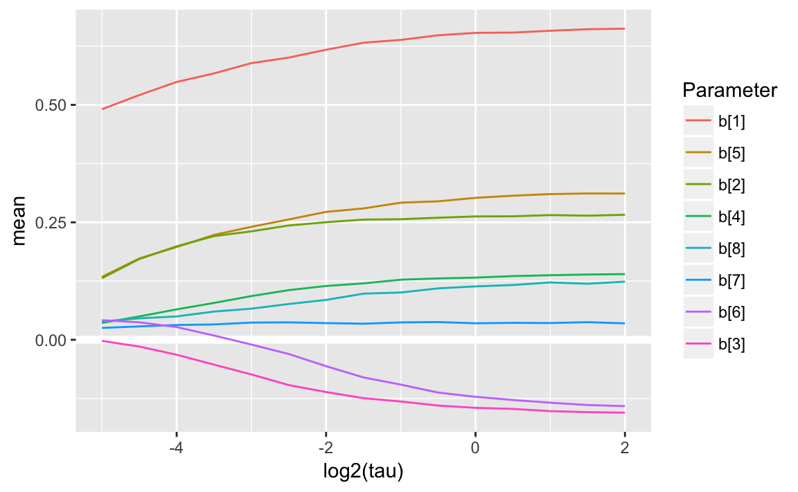

```r
plot_coefpaths(coefpath_lasso, "mode")
```

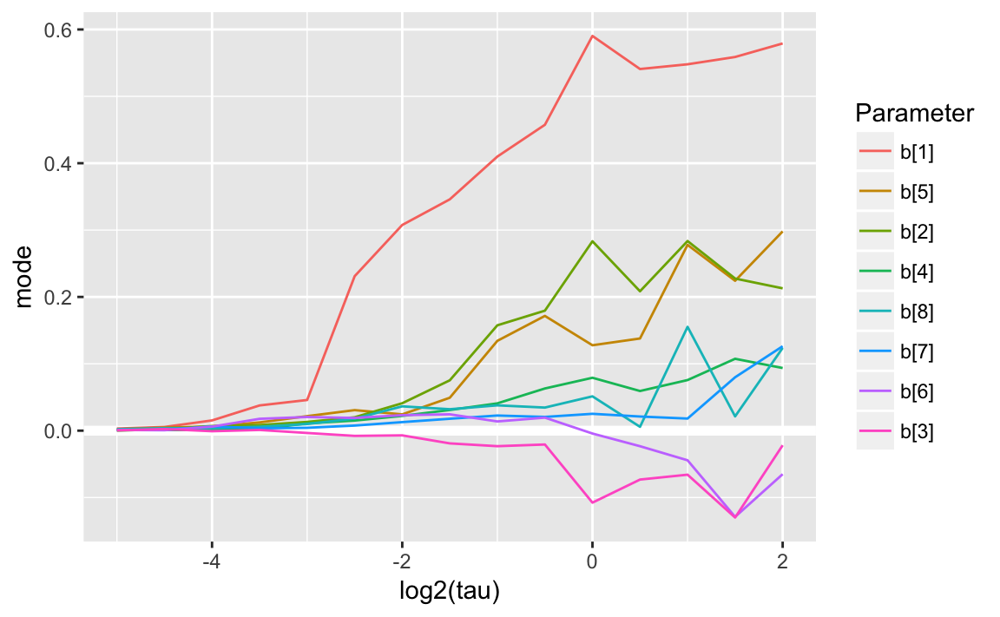


```r
plot_coefpath_pars <- function(coefpath) {
  ggplot(map_df(coefpath, "summary"), aes(x = log10(tau), y = mean)) +
    facet_wrap(~ parameter) +
    modelr::geom_ref_line(h = 0) +
    geom_ribbon(aes(ymin = `25%`, ymax = `75%`), alpha = 0.2) +
    geom_line()  
}
plot_coefpath_pars(coefpath_lasso)
```

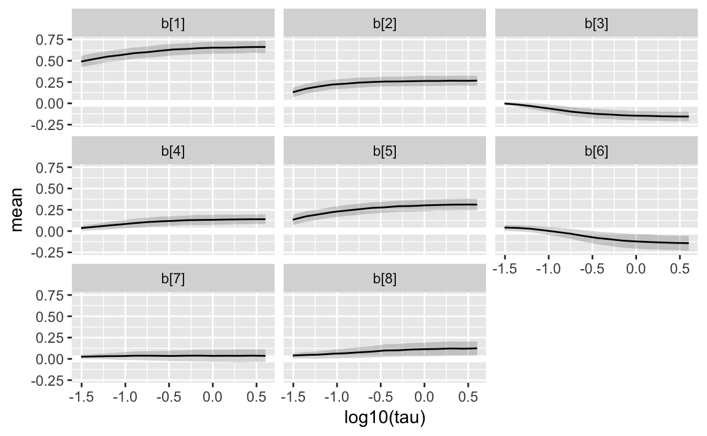


Which is the "best" $tau$?

```r
get_best_tau(coefpath_lasso)
#> # A tibble: 1 × 3
#>     tau  elpd     p
#>   <dbl> <dbl> <dbl>
#> 1 0.125  -234  2.47
```


```r
mod_lasso_2 <- stan_model("stan/lm-coef-lasso-2.stan")
#> In file included from file27846d0ff3da.cpp:8:
#> In file included from /Users/jrnold/Library/R/3.4/library/StanHeaders/include/src/stan/model/model_header.hpp:4:
#> In file included from /Users/jrnold/Library/R/3.4/library/StanHeaders/include/stan/math.hpp:4:
#> In file included from /Users/jrnold/Library/R/3.4/library/StanHeaders/include/stan/math/rev/mat.hpp:4:
#> In file included from /Users/jrnold/Library/R/3.4/library/StanHeaders/include/stan/math/rev/core.hpp:12:
#> In file included from /Users/jrnold/Library/R/3.4/library/StanHeaders/include/stan/math/rev/core/gevv_vvv_vari.hpp:5:
#> In file included from /Users/jrnold/Library/R/3.4/library/StanHeaders/include/stan/math/rev/core/var.hpp:7:
#> In file included from /Users/jrnold/Library/R/3.4/library/BH/include/boost/math/tools/config.hpp:13:
#> In file included from /Users/jrnold/Library/R/3.4/library/BH/include/boost/config.hpp:39:
#> /Users/jrnold/Library/R/3.4/library/BH/include/boost/config/compiler/clang.hpp:196:11: warning: 'BOOST_NO_CXX11_RVALUE_REFERENCES' macro redefined [-Wmacro-redefined]
#> #  define BOOST_NO_CXX11_RVALUE_REFERENCES
#>           ^
#> <command line>:6:9: note: previous definition is here
#> #define BOOST_NO_CXX11_RVALUE_REFERENCES 1
#>         ^
#> In file included from file27846d0ff3da.cpp:8:
#> In file included from /Users/jrnold/Library/R/3.4/library/StanHeaders/include/src/stan/model/model_header.hpp:4:
#> In file included from /Users/jrnold/Library/R/3.4/library/StanHeaders/include/stan/math.hpp:4:
#> In file included from /Users/jrnold/Library/R/3.4/library/StanHeaders/include/stan/math/rev/mat.hpp:4:
#> In file included from /Users/jrnold/Library/R/3.4/library/StanHeaders/include/stan/math/rev/core.hpp:42:
#> /Users/jrnold/Library/R/3.4/library/StanHeaders/include/stan/math/rev/core/set_zero_all_adjoints.hpp:14:17: warning: unused function 'set_zero_all_adjoints' [-Wunused-function]
#>     static void set_zero_all_adjoints() {
#>                 ^
#> In file included from file27846d0ff3da.cpp:8:
#> In file included from /Users/jrnold/Library/R/3.4/library/StanHeaders/include/src/stan/model/model_header.hpp:4:
#> In file included from /Users/jrnold/Library/R/3.4/library/StanHeaders/include/stan/math.hpp:4:
#> In file included from /Users/jrnold/Library/R/3.4/library/StanHeaders/include/stan/math/rev/mat.hpp:4:
#> In file included from /Users/jrnold/Library/R/3.4/library/StanHeaders/include/stan/math/rev/core.hpp:43:
#> /Users/jrnold/Library/R/3.4/library/StanHeaders/include/stan/math/rev/core/set_zero_all_adjoints_nested.hpp:17:17: warning: 'static' function 'set_zero_all_adjoints_nested' declared in header file should be declared 'static inline' [-Wunneeded-internal-declaration]
#>     static void set_zero_all_adjoints_nested() {
#>                 ^
#> In file included from file27846d0ff3da.cpp:8:
#> In file included from /Users/jrnold/Library/R/3.4/library/StanHeaders/include/src/stan/model/model_header.hpp:4:
#> In file included from /Users/jrnold/Library/R/3.4/library/StanHeaders/include/stan/math.hpp:4:
#> In file included from /Users/jrnold/Library/R/3.4/library/StanHeaders/include/stan/math/rev/mat.hpp:11:
#> In file included from /Users/jrnold/Library/R/3.4/library/StanHeaders/include/stan/math/prim/mat.hpp:59:
#> /Users/jrnold/Library/R/3.4/library/StanHeaders/include/stan/math/prim/mat/fun/autocorrelation.hpp:17:14: warning: function 'fft_next_good_size' is not needed and will not be emitted [-Wunneeded-internal-declaration]
#>       size_t fft_next_good_size(size_t N) {
#>              ^
#> In file included from file27846d0ff3da.cpp:8:
#> In file included from /Users/jrnold/Library/R/3.4/library/StanHeaders/include/src/stan/model/model_header.hpp:4:
#> In file included from /Users/jrnold/Library/R/3.4/library/StanHeaders/include/stan/math.hpp:4:
#> In file included from /Users/jrnold/Library/R/3.4/library/StanHeaders/include/stan/math/rev/mat.hpp:11:
#> In file included from /Users/jrnold/Library/R/3.4/library/StanHeaders/include/stan/math/prim/mat.hpp:298:
#> In file included from /Users/jrnold/Library/R/3.4/library/StanHeaders/include/stan/math/prim/arr.hpp:39:
#> In file included from /Users/jrnold/Library/R/3.4/library/StanHeaders/include/stan/math/prim/arr/functor/integrate_ode_rk45.hpp:13:
#> In file included from /Users/jrnold/Library/R/3.4/library/BH/include/boost/numeric/odeint.hpp:61:
#> In file included from /Users/jrnold/Library/R/3.4/library/BH/include/boost/numeric/odeint/util/multi_array_adaption.hpp:29:
#> In file included from /Users/jrnold/Library/R/3.4/library/BH/include/boost/multi_array.hpp:21:
#> In file included from /Users/jrnold/Library/R/3.4/library/BH/include/boost/multi_array/base.hpp:28:
#> /Users/jrnold/Library/R/3.4/library/BH/include/boost/multi_array/concept_checks.hpp:42:43: warning: unused typedef 'index_range' [-Wunused-local-typedef]
#>       typedef typename Array::index_range index_range;
#>                                           ^
#> /Users/jrnold/Library/R/3.4/library/BH/include/boost/multi_array/concept_checks.hpp:43:37: warning: unused typedef 'index' [-Wunused-local-typedef]
#>       typedef typename Array::index index;
#>                                     ^
#> /Users/jrnold/Library/R/3.4/library/BH/include/boost/multi_array/concept_checks.hpp:53:43: warning: unused typedef 'index_range' [-Wunused-local-typedef]
#>       typedef typename Array::index_range index_range;
#>                                           ^
#> /Users/jrnold/Library/R/3.4/library/BH/include/boost/multi_array/concept_checks.hpp:54:37: warning: unused typedef 'index' [-Wunused-local-typedef]
#>       typedef typename Array::index index;
#>                                     ^
#> 8 warnings generated.
```


```r
fit_lasso <- sampling(mod_lasso_2, 
                      data = prostate_data, 
                      refresh = -1,
                      control = list(adapt_delta = 0.9))
#> 
#> Gradient evaluation took 3.5e-05 seconds
#> 1000 transitions using 10 leapfrog steps per transition would take 0.35 seconds.
#> Adjust your expectations accordingly!
#> 
#> 
#> 
#>  Elapsed Time: 0.520379 seconds (Warm-up)
#>                0.239833 seconds (Sampling)
#>                0.760212 seconds (Total)
#> 
#> 
#> Gradient evaluation took 1.5e-05 seconds
#> 1000 transitions using 10 leapfrog steps per transition would take 0.15 seconds.
#> Adjust your expectations accordingly!
#> 
#> 
#> 
#>  Elapsed Time: 0.578325 seconds (Warm-up)
#>                0.270174 seconds (Sampling)
#>                0.848499 seconds (Total)
#> 
#> 
#> Gradient evaluation took 1.6e-05 seconds
#> 1000 transitions using 10 leapfrog steps per transition would take 0.16 seconds.
#> Adjust your expectations accordingly!
#> 
#> 
#> 
#>  Elapsed Time: 0.413246 seconds (Warm-up)
#>                0.223016 seconds (Sampling)
#>                0.636262 seconds (Total)
#> 
#> 
#> Gradient evaluation took 1.2e-05 seconds
#> 1000 transitions using 10 leapfrog steps per transition would take 0.12 seconds.
#> Adjust your expectations accordingly!
#> 
#> 
#> 
#>  Elapsed Time: 0.470348 seconds (Warm-up)
#>                0.246839 seconds (Sampling)
#>                0.717187 seconds (Total)
#> The following numerical problems occurred the indicated number of times on chain 4
#>                                                                                                   count
#> Exception thrown at line 38: double_exponential_lpdf: Scale parameter is inf, but must be finite!     1
#> When a numerical problem occurs, the Hamiltonian proposal gets rejected.
#> See http://mc-stan.org/misc/warnings.html#exception-hamiltonian-proposal-rejected
#> If the number in the 'count' column is small, there is no need to ask about this message on stan-users.
#> Warning: There were 1 chains where the estimated Bayesian Fraction of Missing Information was low. See
#> http://mc-stan.org/misc/warnings.html#bfmi-low
#> Warning: Examine the pairs() plot to diagnose sampling problems
```


```r
summary(fit_lasso, "tau")$summary
#>      mean se_mean    sd   2.5%  25%   50%   75% 97.5% n_eff Rhat
#> tau 0.216 0.00859 0.146 0.0173 0.12 0.193 0.282 0.576   288 1.01
```


```r
loo(extract_log_lik(fit_lasso))
#> Computed from 4000 by 97 log-likelihood matrix
#> 
#>          Estimate  SE
#> elpd_loo   -234.6 3.0
#> p_loo         3.7 0.4
#> looic       469.2 6.0
#> 
#> All Pareto k estimates are good (k < 0.5)
#> See help('pareto-k-diagnostic') for details.
```


```r
mcmc_dens(as.array(fit_lasso), "tau")
```

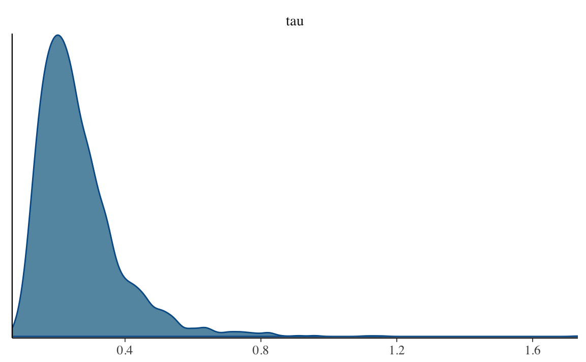


```r
mcmc_dens(as.array(fit_lasso), regex_pars = "^b")
```

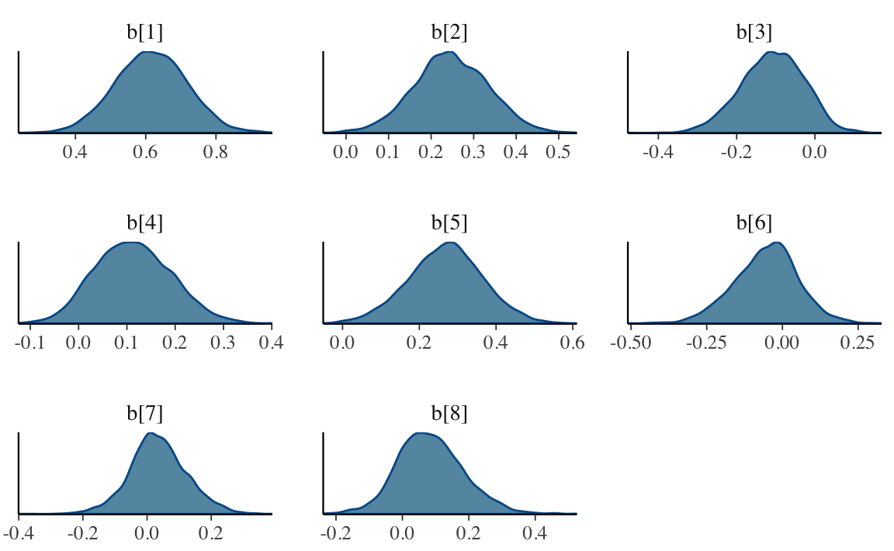


### Hierarchical Prior (HS)

The Hierarchical or Horseshoe Prior is defined as as a scale mixture of normal distributions,
$$
\begin{aligned}[t]
\lambda_i &\sim \dt{\nu}(0, 1) \\
\end{aligned}
$$
In the original formulation [@CarvalhoPolsonScott2009a,@CarvalhoPolsonScott2010a] use a half-Cauchy ($\nu = 1$), but Stan suggests and **[rstanarm](https://cran.r-project.org/package=rstanarm)** uses 
a Student-t with $\nu = 3$, finding that it has better sampling performance than the half-Cauchy.


```r
mod_lm_coef_hs_1 <- stan_model("stan/lm-coef-hs-1.stan")
#> In file included from file278478b1328d.cpp:8:
#> In file included from /Users/jrnold/Library/R/3.4/library/StanHeaders/include/src/stan/model/model_header.hpp:4:
#> In file included from /Users/jrnold/Library/R/3.4/library/StanHeaders/include/stan/math.hpp:4:
#> In file included from /Users/jrnold/Library/R/3.4/library/StanHeaders/include/stan/math/rev/mat.hpp:4:
#> In file included from /Users/jrnold/Library/R/3.4/library/StanHeaders/include/stan/math/rev/core.hpp:12:
#> In file included from /Users/jrnold/Library/R/3.4/library/StanHeaders/include/stan/math/rev/core/gevv_vvv_vari.hpp:5:
#> In file included from /Users/jrnold/Library/R/3.4/library/StanHeaders/include/stan/math/rev/core/var.hpp:7:
#> In file included from /Users/jrnold/Library/R/3.4/library/BH/include/boost/math/tools/config.hpp:13:
#> In file included from /Users/jrnold/Library/R/3.4/library/BH/include/boost/config.hpp:39:
#> /Users/jrnold/Library/R/3.4/library/BH/include/boost/config/compiler/clang.hpp:196:11: warning: 'BOOST_NO_CXX11_RVALUE_REFERENCES' macro redefined [-Wmacro-redefined]
#> #  define BOOST_NO_CXX11_RVALUE_REFERENCES
#>           ^
#> <command line>:6:9: note: previous definition is here
#> #define BOOST_NO_CXX11_RVALUE_REFERENCES 1
#>         ^
#> In file included from file278478b1328d.cpp:8:
#> In file included from /Users/jrnold/Library/R/3.4/library/StanHeaders/include/src/stan/model/model_header.hpp:4:
#> In file included from /Users/jrnold/Library/R/3.4/library/StanHeaders/include/stan/math.hpp:4:
#> In file included from /Users/jrnold/Library/R/3.4/library/StanHeaders/include/stan/math/rev/mat.hpp:4:
#> In file included from /Users/jrnold/Library/R/3.4/library/StanHeaders/include/stan/math/rev/core.hpp:42:
#> /Users/jrnold/Library/R/3.4/library/StanHeaders/include/stan/math/rev/core/set_zero_all_adjoints.hpp:14:17: warning: unused function 'set_zero_all_adjoints' [-Wunused-function]
#>     static void set_zero_all_adjoints() {
#>                 ^
#> In file included from file278478b1328d.cpp:8:
#> In file included from /Users/jrnold/Library/R/3.4/library/StanHeaders/include/src/stan/model/model_header.hpp:4:
#> In file included from /Users/jrnold/Library/R/3.4/library/StanHeaders/include/stan/math.hpp:4:
#> In file included from /Users/jrnold/Library/R/3.4/library/StanHeaders/include/stan/math/rev/mat.hpp:4:
#> In file included from /Users/jrnold/Library/R/3.4/library/StanHeaders/include/stan/math/rev/core.hpp:43:
#> /Users/jrnold/Library/R/3.4/library/StanHeaders/include/stan/math/rev/core/set_zero_all_adjoints_nested.hpp:17:17: warning: 'static' function 'set_zero_all_adjoints_nested' declared in header file should be declared 'static inline' [-Wunneeded-internal-declaration]
#>     static void set_zero_all_adjoints_nested() {
#>                 ^
#> In file included from file278478b1328d.cpp:8:
#> In file included from /Users/jrnold/Library/R/3.4/library/StanHeaders/include/src/stan/model/model_header.hpp:4:
#> In file included from /Users/jrnold/Library/R/3.4/library/StanHeaders/include/stan/math.hpp:4:
#> In file included from /Users/jrnold/Library/R/3.4/library/StanHeaders/include/stan/math/rev/mat.hpp:11:
#> In file included from /Users/jrnold/Library/R/3.4/library/StanHeaders/include/stan/math/prim/mat.hpp:59:
#> /Users/jrnold/Library/R/3.4/library/StanHeaders/include/stan/math/prim/mat/fun/autocorrelation.hpp:17:14: warning: function 'fft_next_good_size' is not needed and will not be emitted [-Wunneeded-internal-declaration]
#>       size_t fft_next_good_size(size_t N) {
#>              ^
#> In file included from file278478b1328d.cpp:8:
#> In file included from /Users/jrnold/Library/R/3.4/library/StanHeaders/include/src/stan/model/model_header.hpp:4:
#> In file included from /Users/jrnold/Library/R/3.4/library/StanHeaders/include/stan/math.hpp:4:
#> In file included from /Users/jrnold/Library/R/3.4/library/StanHeaders/include/stan/math/rev/mat.hpp:11:
#> In file included from /Users/jrnold/Library/R/3.4/library/StanHeaders/include/stan/math/prim/mat.hpp:298:
#> In file included from /Users/jrnold/Library/R/3.4/library/StanHeaders/include/stan/math/prim/arr.hpp:39:
#> In file included from /Users/jrnold/Library/R/3.4/library/StanHeaders/include/stan/math/prim/arr/functor/integrate_ode_rk45.hpp:13:
#> In file included from /Users/jrnold/Library/R/3.4/library/BH/include/boost/numeric/odeint.hpp:61:
#> In file included from /Users/jrnold/Library/R/3.4/library/BH/include/boost/numeric/odeint/util/multi_array_adaption.hpp:29:
#> In file included from /Users/jrnold/Library/R/3.4/library/BH/include/boost/multi_array.hpp:21:
#> In file included from /Users/jrnold/Library/R/3.4/library/BH/include/boost/multi_array/base.hpp:28:
#> /Users/jrnold/Library/R/3.4/library/BH/include/boost/multi_array/concept_checks.hpp:42:43: warning: unused typedef 'index_range' [-Wunused-local-typedef]
#>       typedef typename Array::index_range index_range;
#>                                           ^
#> /Users/jrnold/Library/R/3.4/library/BH/include/boost/multi_array/concept_checks.hpp:43:37: warning: unused typedef 'index' [-Wunused-local-typedef]
#>       typedef typename Array::index index;
#>                                     ^
#> /Users/jrnold/Library/R/3.4/library/BH/include/boost/multi_array/concept_checks.hpp:53:43: warning: unused typedef 'index_range' [-Wunused-local-typedef]
#>       typedef typename Array::index_range index_range;
#>                                           ^
#> /Users/jrnold/Library/R/3.4/library/BH/include/boost/multi_array/concept_checks.hpp:54:37: warning: unused typedef 'index' [-Wunused-local-typedef]
#>       typedef typename Array::index index;
#>                                     ^
#> 8 warnings generated.
```


```r
coefpath_hs <- map(tau_values,
                   run_with_tau, 
                   mod = mod_lm_coef_hs_1,
                   data = c(prostate_data, list(df_local = 3)),
                   control = list(adapt_delta = 0.999, max_treedepth = 12))
#> Tau =  4
#> SAMPLING FOR MODEL 'lm-coef-hs-1' NOW (CHAIN 1).
#> 
#> Gradient evaluation took 3.7e-05 seconds
#> 1000 transitions using 10 leapfrog steps per transition would take 0.37 seconds.
#> Adjust your expectations accordingly!
#> 
#> 
#> Iteration:    1 / 2000 [  0%]  (Warmup)
#> Iteration:  200 / 2000 [ 10%]  (Warmup)
#> Iteration:  400 / 2000 [ 20%]  (Warmup)
#> Iteration:  600 / 2000 [ 30%]  (Warmup)
#> Iteration:  800 / 2000 [ 40%]  (Warmup)
#> Iteration: 1000 / 2000 [ 50%]  (Warmup)
#> Iteration: 1001 / 2000 [ 50%]  (Sampling)
#> Iteration: 1200 / 2000 [ 60%]  (Sampling)
#> Iteration: 1400 / 2000 [ 70%]  (Sampling)
#> Iteration: 1600 / 2000 [ 80%]  (Sampling)
#> Iteration: 1800 / 2000 [ 90%]  (Sampling)
#> Iteration: 2000 / 2000 [100%]  (Sampling)
#> 
#>  Elapsed Time: 2.87611 seconds (Warm-up)
#>                6.20805 seconds (Sampling)
#>                9.08416 seconds (Total)
#> 
#> 
#> SAMPLING FOR MODEL 'lm-coef-hs-1' NOW (CHAIN 2).
#> 
#> Gradient evaluation took 1.9e-05 seconds
#> 1000 transitions using 10 leapfrog steps per transition would take 0.19 seconds.
#> Adjust your expectations accordingly!
#> 
#> 
#> Iteration:    1 / 2000 [  0%]  (Warmup)
#> Iteration:  200 / 2000 [ 10%]  (Warmup)
#> Iteration:  400 / 2000 [ 20%]  (Warmup)
#> Iteration:  600 / 2000 [ 30%]  (Warmup)
#> Iteration:  800 / 2000 [ 40%]  (Warmup)
#> Iteration: 1000 / 2000 [ 50%]  (Warmup)
#> Iteration: 1001 / 2000 [ 50%]  (Sampling)
#> Iteration: 1200 / 2000 [ 60%]  (Sampling)
#> Iteration: 1400 / 2000 [ 70%]  (Sampling)
#> Iteration: 1600 / 2000 [ 80%]  (Sampling)
#> Iteration: 1800 / 2000 [ 90%]  (Sampling)
#> Iteration: 2000 / 2000 [100%]  (Sampling)
#> 
#>  Elapsed Time: 3.52193 seconds (Warm-up)
#>                1.54883 seconds (Sampling)
#>                5.07076 seconds (Total)
#> 
#> 
#> SAMPLING FOR MODEL 'lm-coef-hs-1' NOW (CHAIN 3).
#> 
#> Gradient evaluation took 1.7e-05 seconds
#> 1000 transitions using 10 leapfrog steps per transition would take 0.17 seconds.
#> Adjust your expectations accordingly!
#> 
#> 
#> Iteration:    1 / 2000 [  0%]  (Warmup)
#> Iteration:  200 / 2000 [ 10%]  (Warmup)
#> Iteration:  400 / 2000 [ 20%]  (Warmup)
#> Iteration:  600 / 2000 [ 30%]  (Warmup)
#> Iteration:  800 / 2000 [ 40%]  (Warmup)
#> Iteration: 1000 / 2000 [ 50%]  (Warmup)
#> Iteration: 1001 / 2000 [ 50%]  (Sampling)
#> Iteration: 1200 / 2000 [ 60%]  (Sampling)
#> Iteration: 1400 / 2000 [ 70%]  (Sampling)
#> Iteration: 1600 / 2000 [ 80%]  (Sampling)
#> Iteration: 1800 / 2000 [ 90%]  (Sampling)
#> Iteration: 2000 / 2000 [100%]  (Sampling)
#> 
#>  Elapsed Time: 2.86541 seconds (Warm-up)
#>                2.61092 seconds (Sampling)
#>                5.47633 seconds (Total)
#> 
#> 
#> SAMPLING FOR MODEL 'lm-coef-hs-1' NOW (CHAIN 4).
#> 
#> Gradient evaluation took 1.8e-05 seconds
#> 1000 transitions using 10 leapfrog steps per transition would take 0.18 seconds.
#> Adjust your expectations accordingly!
#> 
#> 
#> Iteration:    1 / 2000 [  0%]  (Warmup)
#> Iteration:  200 / 2000 [ 10%]  (Warmup)
#> Iteration:  400 / 2000 [ 20%]  (Warmup)
#> Iteration:  600 / 2000 [ 30%]  (Warmup)
#> Iteration:  800 / 2000 [ 40%]  (Warmup)
#> Iteration: 1000 / 2000 [ 50%]  (Warmup)
#> Iteration: 1001 / 2000 [ 50%]  (Sampling)
#> Iteration: 1200 / 2000 [ 60%]  (Sampling)
#> Iteration: 1400 / 2000 [ 70%]  (Sampling)
#> Iteration: 1600 / 2000 [ 80%]  (Sampling)
#> Iteration: 1800 / 2000 [ 90%]  (Sampling)
#> Iteration: 2000 / 2000 [100%]  (Sampling)
#> 
#>  Elapsed Time: 2.47924 seconds (Warm-up)
#>                3.56892 seconds (Sampling)
#>                6.04816 seconds (Total)
#> Warning: There were 2 divergent transitions after warmup. Increasing adapt_delta above 0.999 may help. See
#> http://mc-stan.org/misc/warnings.html#divergent-transitions-after-warmup
#> Warning: Examine the pairs() plot to diagnose sampling problems
#> Tau =  2.83
#> SAMPLING FOR MODEL 'lm-coef-hs-1' NOW (CHAIN 1).
#> 
#> Gradient evaluation took 2.9e-05 seconds
#> 1000 transitions using 10 leapfrog steps per transition would take 0.29 seconds.
#> Adjust your expectations accordingly!
#> 
#> 
#> Iteration:    1 / 2000 [  0%]  (Warmup)
#> Iteration:  200 / 2000 [ 10%]  (Warmup)
#> Iteration:  400 / 2000 [ 20%]  (Warmup)
#> Iteration:  600 / 2000 [ 30%]  (Warmup)
#> Iteration:  800 / 2000 [ 40%]  (Warmup)
#> Iteration: 1000 / 2000 [ 50%]  (Warmup)
#> Iteration: 1001 / 2000 [ 50%]  (Sampling)
#> Iteration: 1200 / 2000 [ 60%]  (Sampling)
#> Iteration: 1400 / 2000 [ 70%]  (Sampling)
#> Iteration: 1600 / 2000 [ 80%]  (Sampling)
#> Iteration: 1800 / 2000 [ 90%]  (Sampling)
#> Iteration: 2000 / 2000 [100%]  (Sampling)
#> 
#>  Elapsed Time: 2.55465 seconds (Warm-up)
#>                5.27214 seconds (Sampling)
#>                7.82679 seconds (Total)
#> 
#> 
#> SAMPLING FOR MODEL 'lm-coef-hs-1' NOW (CHAIN 2).
#> 
#> Gradient evaluation took 1.5e-05 seconds
#> 1000 transitions using 10 leapfrog steps per transition would take 0.15 seconds.
#> Adjust your expectations accordingly!
#> 
#> 
#> Iteration:    1 / 2000 [  0%]  (Warmup)
#> Iteration:  200 / 2000 [ 10%]  (Warmup)
#> Iteration:  400 / 2000 [ 20%]  (Warmup)
#> Iteration:  600 / 2000 [ 30%]  (Warmup)
#> Iteration:  800 / 2000 [ 40%]  (Warmup)
#> Iteration: 1000 / 2000 [ 50%]  (Warmup)
#> Iteration: 1001 / 2000 [ 50%]  (Sampling)
#> Iteration: 1200 / 2000 [ 60%]  (Sampling)
#> Iteration: 1400 / 2000 [ 70%]  (Sampling)
#> Iteration: 1600 / 2000 [ 80%]  (Sampling)
#> Iteration: 1800 / 2000 [ 90%]  (Sampling)
#> Iteration: 2000 / 2000 [100%]  (Sampling)
#> 
#>  Elapsed Time: 2.32708 seconds (Warm-up)
#>                1.8418 seconds (Sampling)
#>                4.16887 seconds (Total)
#> 
#> 
#> SAMPLING FOR MODEL 'lm-coef-hs-1' NOW (CHAIN 3).
#> 
#> Gradient evaluation took 1.5e-05 seconds
#> 1000 transitions using 10 leapfrog steps per transition would take 0.15 seconds.
#> Adjust your expectations accordingly!
#> 
#> 
#> Iteration:    1 / 2000 [  0%]  (Warmup)
#> Iteration:  200 / 2000 [ 10%]  (Warmup)
#> Iteration:  400 / 2000 [ 20%]  (Warmup)
#> Iteration:  600 / 2000 [ 30%]  (Warmup)
#> Iteration:  800 / 2000 [ 40%]  (Warmup)
#> Iteration: 1000 / 2000 [ 50%]  (Warmup)
#> Iteration: 1001 / 2000 [ 50%]  (Sampling)
#> Iteration: 1200 / 2000 [ 60%]  (Sampling)
#> Iteration: 1400 / 2000 [ 70%]  (Sampling)
#> Iteration: 1600 / 2000 [ 80%]  (Sampling)
#> Iteration: 1800 / 2000 [ 90%]  (Sampling)
#> Iteration: 2000 / 2000 [100%]  (Sampling)
#> 
#>  Elapsed Time: 2.59388 seconds (Warm-up)
#>                2.63362 seconds (Sampling)
#>                5.2275 seconds (Total)
#> 
#> 
#> SAMPLING FOR MODEL 'lm-coef-hs-1' NOW (CHAIN 4).
#> 
#> Gradient evaluation took 1.9e-05 seconds
#> 1000 transitions using 10 leapfrog steps per transition would take 0.19 seconds.
#> Adjust your expectations accordingly!
#> 
#> 
#> Iteration:    1 / 2000 [  0%]  (Warmup)
#> Iteration:  200 / 2000 [ 10%]  (Warmup)
#> Iteration:  400 / 2000 [ 20%]  (Warmup)
#> Iteration:  600 / 2000 [ 30%]  (Warmup)
#> Iteration:  800 / 2000 [ 40%]  (Warmup)
#> Iteration: 1000 / 2000 [ 50%]  (Warmup)
#> Iteration: 1001 / 2000 [ 50%]  (Sampling)
#> Iteration: 1200 / 2000 [ 60%]  (Sampling)
#> Iteration: 1400 / 2000 [ 70%]  (Sampling)
#> Iteration: 1600 / 2000 [ 80%]  (Sampling)
#> Iteration: 1800 / 2000 [ 90%]  (Sampling)
#> Iteration: 2000 / 2000 [100%]  (Sampling)
#> 
#>  Elapsed Time: 2.16754 seconds (Warm-up)
#>                3.22175 seconds (Sampling)
#>                5.38929 seconds (Total)
#> 
#> Tau =  2
#> SAMPLING FOR MODEL 'lm-coef-hs-1' NOW (CHAIN 1).
#> 
#> Gradient evaluation took 3.7e-05 seconds
#> 1000 transitions using 10 leapfrog steps per transition would take 0.37 seconds.
#> Adjust your expectations accordingly!
#> 
#> 
#> Iteration:    1 / 2000 [  0%]  (Warmup)
#> Iteration:  200 / 2000 [ 10%]  (Warmup)
#> Iteration:  400 / 2000 [ 20%]  (Warmup)
#> Iteration:  600 / 2000 [ 30%]  (Warmup)
#> Iteration:  800 / 2000 [ 40%]  (Warmup)
#> Iteration: 1000 / 2000 [ 50%]  (Warmup)
#> Iteration: 1001 / 2000 [ 50%]  (Sampling)
#> Iteration: 1200 / 2000 [ 60%]  (Sampling)
#> Iteration: 1400 / 2000 [ 70%]  (Sampling)
#> Iteration: 1600 / 2000 [ 80%]  (Sampling)
#> Iteration: 1800 / 2000 [ 90%]  (Sampling)
#> Iteration: 2000 / 2000 [100%]  (Sampling)
#> 
#>  Elapsed Time: 2.41352 seconds (Warm-up)
#>                1.06254 seconds (Sampling)
#>                3.47605 seconds (Total)
#> 
#> 
#> SAMPLING FOR MODEL 'lm-coef-hs-1' NOW (CHAIN 2).
#> 
#> Gradient evaluation took 2e-05 seconds
#> 1000 transitions using 10 leapfrog steps per transition would take 0.2 seconds.
#> Adjust your expectations accordingly!
#> 
#> 
#> Iteration:    1 / 2000 [  0%]  (Warmup)
#> Iteration:  200 / 2000 [ 10%]  (Warmup)
#> Iteration:  400 / 2000 [ 20%]  (Warmup)
#> Iteration:  600 / 2000 [ 30%]  (Warmup)
#> Iteration:  800 / 2000 [ 40%]  (Warmup)
#> Iteration: 1000 / 2000 [ 50%]  (Warmup)
#> Iteration: 1001 / 2000 [ 50%]  (Sampling)
#> Iteration: 1200 / 2000 [ 60%]  (Sampling)
#> Iteration: 1400 / 2000 [ 70%]  (Sampling)
#> Iteration: 1600 / 2000 [ 80%]  (Sampling)
#> Iteration: 1800 / 2000 [ 90%]  (Sampling)
#> Iteration: 2000 / 2000 [100%]  (Sampling)
#> 
#>  Elapsed Time: 1.79026 seconds (Warm-up)
#>                1.07781 seconds (Sampling)
#>                2.86808 seconds (Total)
#> 
#> 
#> SAMPLING FOR MODEL 'lm-coef-hs-1' NOW (CHAIN 3).
#> 
#> Gradient evaluation took 2e-05 seconds
#> 1000 transitions using 10 leapfrog steps per transition would take 0.2 seconds.
#> Adjust your expectations accordingly!
#> 
#> 
#> Iteration:    1 / 2000 [  0%]  (Warmup)
#> Iteration:  200 / 2000 [ 10%]  (Warmup)
#> Iteration:  400 / 2000 [ 20%]  (Warmup)
#> Iteration:  600 / 2000 [ 30%]  (Warmup)
#> Iteration:  800 / 2000 [ 40%]  (Warmup)
#> Iteration: 1000 / 2000 [ 50%]  (Warmup)
#> Iteration: 1001 / 2000 [ 50%]  (Sampling)
#> Iteration: 1200 / 2000 [ 60%]  (Sampling)
#> Iteration: 1400 / 2000 [ 70%]  (Sampling)
#> Iteration: 1600 / 2000 [ 80%]  (Sampling)
#> Iteration: 1800 / 2000 [ 90%]  (Sampling)
#> Iteration: 2000 / 2000 [100%]  (Sampling)
#> 
#>  Elapsed Time: 1.83395 seconds (Warm-up)
#>                2.11641 seconds (Sampling)
#>                3.95036 seconds (Total)
#> 
#> 
#> SAMPLING FOR MODEL 'lm-coef-hs-1' NOW (CHAIN 4).
#> 
#> Gradient evaluation took 2e-05 seconds
#> 1000 transitions using 10 leapfrog steps per transition would take 0.2 seconds.
#> Adjust your expectations accordingly!
#> 
#> 
#> Iteration:    1 / 2000 [  0%]  (Warmup)
#> Iteration:  200 / 2000 [ 10%]  (Warmup)
#> Iteration:  400 / 2000 [ 20%]  (Warmup)
#> Iteration:  600 / 2000 [ 30%]  (Warmup)
#> Iteration:  800 / 2000 [ 40%]  (Warmup)
#> Iteration: 1000 / 2000 [ 50%]  (Warmup)
#> Iteration: 1001 / 2000 [ 50%]  (Sampling)
#> Iteration: 1200 / 2000 [ 60%]  (Sampling)
#> Iteration: 1400 / 2000 [ 70%]  (Sampling)
#> Iteration: 1600 / 2000 [ 80%]  (Sampling)
#> Iteration: 1800 / 2000 [ 90%]  (Sampling)
#> Iteration: 2000 / 2000 [100%]  (Sampling)
#> 
#>  Elapsed Time: 1.791 seconds (Warm-up)
#>                1.14265 seconds (Sampling)
#>                2.93365 seconds (Total)
#> Warning: There were 2 divergent transitions after warmup. Increasing adapt_delta above 0.999 may help. See
#> http://mc-stan.org/misc/warnings.html#divergent-transitions-after-warmup

#> Warning: Examine the pairs() plot to diagnose sampling problems
#> Tau =  1.41
#> SAMPLING FOR MODEL 'lm-coef-hs-1' NOW (CHAIN 1).
#> 
#> Gradient evaluation took 4.2e-05 seconds
#> 1000 transitions using 10 leapfrog steps per transition would take 0.42 seconds.
#> Adjust your expectations accordingly!
#> 
#> 
#> Iteration:    1 / 2000 [  0%]  (Warmup)
#> Iteration:  200 / 2000 [ 10%]  (Warmup)
#> Iteration:  400 / 2000 [ 20%]  (Warmup)
#> Iteration:  600 / 2000 [ 30%]  (Warmup)
#> Iteration:  800 / 2000 [ 40%]  (Warmup)
#> Iteration: 1000 / 2000 [ 50%]  (Warmup)
#> Iteration: 1001 / 2000 [ 50%]  (Sampling)
#> Iteration: 1200 / 2000 [ 60%]  (Sampling)
#> Iteration: 1400 / 2000 [ 70%]  (Sampling)
#> Iteration: 1600 / 2000 [ 80%]  (Sampling)
#> Iteration: 1800 / 2000 [ 90%]  (Sampling)
#> Iteration: 2000 / 2000 [100%]  (Sampling)
#> 
#>  Elapsed Time: 1.25397 seconds (Warm-up)
#>                1.20778 seconds (Sampling)
#>                2.46175 seconds (Total)
#> 
#> 
#> SAMPLING FOR MODEL 'lm-coef-hs-1' NOW (CHAIN 2).
#> 
#> Gradient evaluation took 1.9e-05 seconds
#> 1000 transitions using 10 leapfrog steps per transition would take 0.19 seconds.
#> Adjust your expectations accordingly!
#> 
#> 
#> Iteration:    1 / 2000 [  0%]  (Warmup)
#> Iteration:  200 / 2000 [ 10%]  (Warmup)
#> Iteration:  400 / 2000 [ 20%]  (Warmup)
#> Iteration:  600 / 2000 [ 30%]  (Warmup)
#> Iteration:  800 / 2000 [ 40%]  (Warmup)
#> Iteration: 1000 / 2000 [ 50%]  (Warmup)
#> Iteration: 1001 / 2000 [ 50%]  (Sampling)
#> Iteration: 1200 / 2000 [ 60%]  (Sampling)
#> Iteration: 1400 / 2000 [ 70%]  (Sampling)
#> Iteration: 1600 / 2000 [ 80%]  (Sampling)
#> Iteration: 1800 / 2000 [ 90%]  (Sampling)
#> Iteration: 2000 / 2000 [100%]  (Sampling)
#> 
#>  Elapsed Time: 1.78616 seconds (Warm-up)
#>                1.15518 seconds (Sampling)
#>                2.94134 seconds (Total)
#> 
#> 
#> SAMPLING FOR MODEL 'lm-coef-hs-1' NOW (CHAIN 3).
#> 
#> Gradient evaluation took 2.1e-05 seconds
#> 1000 transitions using 10 leapfrog steps per transition would take 0.21 seconds.
#> Adjust your expectations accordingly!
#> 
#> 
#> Iteration:    1 / 2000 [  0%]  (Warmup)
#> Iteration:  200 / 2000 [ 10%]  (Warmup)
#> Iteration:  400 / 2000 [ 20%]  (Warmup)
#> Iteration:  600 / 2000 [ 30%]  (Warmup)
#> Iteration:  800 / 2000 [ 40%]  (Warmup)
#> Iteration: 1000 / 2000 [ 50%]  (Warmup)
#> Iteration: 1001 / 2000 [ 50%]  (Sampling)
#> Iteration: 1200 / 2000 [ 60%]  (Sampling)
#> Iteration: 1400 / 2000 [ 70%]  (Sampling)
#> Iteration: 1600 / 2000 [ 80%]  (Sampling)
#> Iteration: 1800 / 2000 [ 90%]  (Sampling)
#> Iteration: 2000 / 2000 [100%]  (Sampling)
#> 
#>  Elapsed Time: 2.0846 seconds (Warm-up)
#>                0.736958 seconds (Sampling)
#>                2.82156 seconds (Total)
#> 
#> 
#> SAMPLING FOR MODEL 'lm-coef-hs-1' NOW (CHAIN 4).
#> 
#> Gradient evaluation took 1.8e-05 seconds
#> 1000 transitions using 10 leapfrog steps per transition would take 0.18 seconds.
#> Adjust your expectations accordingly!
#> 
#> 
#> Iteration:    1 / 2000 [  0%]  (Warmup)
#> Iteration:  200 / 2000 [ 10%]  (Warmup)
#> Iteration:  400 / 2000 [ 20%]  (Warmup)
#> Iteration:  600 / 2000 [ 30%]  (Warmup)
#> Iteration:  800 / 2000 [ 40%]  (Warmup)
#> Iteration: 1000 / 2000 [ 50%]  (Warmup)
#> Iteration: 1001 / 2000 [ 50%]  (Sampling)
#> Iteration: 1200 / 2000 [ 60%]  (Sampling)
#> Iteration: 1400 / 2000 [ 70%]  (Sampling)
#> Iteration: 1600 / 2000 [ 80%]  (Sampling)
#> Iteration: 1800 / 2000 [ 90%]  (Sampling)
#> Iteration: 2000 / 2000 [100%]  (Sampling)
#> 
#>  Elapsed Time: 2.22619 seconds (Warm-up)
#>                0.638367 seconds (Sampling)
#>                2.86456 seconds (Total)
#> Warning: There were 3 divergent transitions after warmup. Increasing adapt_delta above 0.999 may help. See
#> http://mc-stan.org/misc/warnings.html#divergent-transitions-after-warmup

#> Warning: Examine the pairs() plot to diagnose sampling problems
#> Tau =  1
#> SAMPLING FOR MODEL 'lm-coef-hs-1' NOW (CHAIN 1).
#> 
#> Gradient evaluation took 2.8e-05 seconds
#> 1000 transitions using 10 leapfrog steps per transition would take 0.28 seconds.
#> Adjust your expectations accordingly!
#> 
#> 
#> Iteration:    1 / 2000 [  0%]  (Warmup)
#> Iteration:  200 / 2000 [ 10%]  (Warmup)
#> Iteration:  400 / 2000 [ 20%]  (Warmup)
#> Iteration:  600 / 2000 [ 30%]  (Warmup)
#> Iteration:  800 / 2000 [ 40%]  (Warmup)
#> Iteration: 1000 / 2000 [ 50%]  (Warmup)
#> Iteration: 1001 / 2000 [ 50%]  (Sampling)
#> Iteration: 1200 / 2000 [ 60%]  (Sampling)
#> Iteration: 1400 / 2000 [ 70%]  (Sampling)
#> Iteration: 1600 / 2000 [ 80%]  (Sampling)
#> Iteration: 1800 / 2000 [ 90%]  (Sampling)
#> Iteration: 2000 / 2000 [100%]  (Sampling)
#> 
#>  Elapsed Time: 1.15944 seconds (Warm-up)
#>                1.33754 seconds (Sampling)
#>                2.49697 seconds (Total)
#> 
#> 
#> SAMPLING FOR MODEL 'lm-coef-hs-1' NOW (CHAIN 2).
#> 
#> Gradient evaluation took 2e-05 seconds
#> 1000 transitions using 10 leapfrog steps per transition would take 0.2 seconds.
#> Adjust your expectations accordingly!
#> 
#> 
#> Iteration:    1 / 2000 [  0%]  (Warmup)
#> Iteration:  200 / 2000 [ 10%]  (Warmup)
#> Iteration:  400 / 2000 [ 20%]  (Warmup)
#> Iteration:  600 / 2000 [ 30%]  (Warmup)
#> Iteration:  800 / 2000 [ 40%]  (Warmup)
#> Iteration: 1000 / 2000 [ 50%]  (Warmup)
#> Iteration: 1001 / 2000 [ 50%]  (Sampling)
#> Iteration: 1200 / 2000 [ 60%]  (Sampling)
#> Iteration: 1400 / 2000 [ 70%]  (Sampling)
#> Iteration: 1600 / 2000 [ 80%]  (Sampling)
#> Iteration: 1800 / 2000 [ 90%]  (Sampling)
#> Iteration: 2000 / 2000 [100%]  (Sampling)
#> 
#>  Elapsed Time: 1.18318 seconds (Warm-up)
#>                1.75236 seconds (Sampling)
#>                2.93555 seconds (Total)
#> 
#> 
#> SAMPLING FOR MODEL 'lm-coef-hs-1' NOW (CHAIN 3).
#> 
#> Gradient evaluation took 2e-05 seconds
#> 1000 transitions using 10 leapfrog steps per transition would take 0.2 seconds.
#> Adjust your expectations accordingly!
#> 
#> 
#> Iteration:    1 / 2000 [  0%]  (Warmup)
#> Iteration:  200 / 2000 [ 10%]  (Warmup)
#> Iteration:  400 / 2000 [ 20%]  (Warmup)
#> Iteration:  600 / 2000 [ 30%]  (Warmup)
#> Iteration:  800 / 2000 [ 40%]  (Warmup)
#> Iteration: 1000 / 2000 [ 50%]  (Warmup)
#> Iteration: 1001 / 2000 [ 50%]  (Sampling)
#> Iteration: 1200 / 2000 [ 60%]  (Sampling)
#> Iteration: 1400 / 2000 [ 70%]  (Sampling)
#> Iteration: 1600 / 2000 [ 80%]  (Sampling)
#> Iteration: 1800 / 2000 [ 90%]  (Sampling)
#> Iteration: 2000 / 2000 [100%]  (Sampling)
#> 
#>  Elapsed Time: 1.11993 seconds (Warm-up)
#>                0.755497 seconds (Sampling)
#>                1.87542 seconds (Total)
#> 
#> 
#> SAMPLING FOR MODEL 'lm-coef-hs-1' NOW (CHAIN 4).
#> 
#> Gradient evaluation took 2e-05 seconds
#> 1000 transitions using 10 leapfrog steps per transition would take 0.2 seconds.
#> Adjust your expectations accordingly!
#> 
#> 
#> Iteration:    1 / 2000 [  0%]  (Warmup)
#> Iteration:  200 / 2000 [ 10%]  (Warmup)
#> Iteration:  400 / 2000 [ 20%]  (Warmup)
#> Iteration:  600 / 2000 [ 30%]  (Warmup)
#> Iteration:  800 / 2000 [ 40%]  (Warmup)
#> Iteration: 1000 / 2000 [ 50%]  (Warmup)
#> Iteration: 1001 / 2000 [ 50%]  (Sampling)
#> Iteration: 1200 / 2000 [ 60%]  (Sampling)
#> Iteration: 1400 / 2000 [ 70%]  (Sampling)
#> Iteration: 1600 / 2000 [ 80%]  (Sampling)
#> Iteration: 1800 / 2000 [ 90%]  (Sampling)
#> Iteration: 2000 / 2000 [100%]  (Sampling)
#> 
#>  Elapsed Time: 1.63862 seconds (Warm-up)
#>                1.18794 seconds (Sampling)
#>                2.82656 seconds (Total)
#> 
#> Tau =  0.707
#> SAMPLING FOR MODEL 'lm-coef-hs-1' NOW (CHAIN 1).
#> 
#> Gradient evaluation took 3.5e-05 seconds
#> 1000 transitions using 10 leapfrog steps per transition would take 0.35 seconds.
#> Adjust your expectations accordingly!
#> 
#> 
#> Iteration:    1 / 2000 [  0%]  (Warmup)
#> Iteration:  200 / 2000 [ 10%]  (Warmup)
#> Iteration:  400 / 2000 [ 20%]  (Warmup)
#> Iteration:  600 / 2000 [ 30%]  (Warmup)
#> Iteration:  800 / 2000 [ 40%]  (Warmup)
#> Iteration: 1000 / 2000 [ 50%]  (Warmup)
#> Iteration: 1001 / 2000 [ 50%]  (Sampling)
#> Iteration: 1200 / 2000 [ 60%]  (Sampling)
#> Iteration: 1400 / 2000 [ 70%]  (Sampling)
#> Iteration: 1600 / 2000 [ 80%]  (Sampling)
#> Iteration: 1800 / 2000 [ 90%]  (Sampling)
#> Iteration: 2000 / 2000 [100%]  (Sampling)
#> 
#>  Elapsed Time: 1.13553 seconds (Warm-up)
#>                1.44398 seconds (Sampling)
#>                2.57951 seconds (Total)
#> 
#> 
#> SAMPLING FOR MODEL 'lm-coef-hs-1' NOW (CHAIN 2).
#> 
#> Gradient evaluation took 1.7e-05 seconds
#> 1000 transitions using 10 leapfrog steps per transition would take 0.17 seconds.
#> Adjust your expectations accordingly!
#> 
#> 
#> Iteration:    1 / 2000 [  0%]  (Warmup)
#> Iteration:  200 / 2000 [ 10%]  (Warmup)
#> Iteration:  400 / 2000 [ 20%]  (Warmup)
#> Iteration:  600 / 2000 [ 30%]  (Warmup)
#> Iteration:  800 / 2000 [ 40%]  (Warmup)
#> Iteration: 1000 / 2000 [ 50%]  (Warmup)
#> Iteration: 1001 / 2000 [ 50%]  (Sampling)
#> Iteration: 1200 / 2000 [ 60%]  (Sampling)
#> Iteration: 1400 / 2000 [ 70%]  (Sampling)
#> Iteration: 1600 / 2000 [ 80%]  (Sampling)
#> Iteration: 1800 / 2000 [ 90%]  (Sampling)
#> Iteration: 2000 / 2000 [100%]  (Sampling)
#> 
#>  Elapsed Time: 1.22404 seconds (Warm-up)
#>                1.56945 seconds (Sampling)
#>                2.79349 seconds (Total)
#> 
#> 
#> SAMPLING FOR MODEL 'lm-coef-hs-1' NOW (CHAIN 3).
#> 
#> Gradient evaluation took 2e-05 seconds
#> 1000 transitions using 10 leapfrog steps per transition would take 0.2 seconds.
#> Adjust your expectations accordingly!
#> 
#> 
#> Iteration:    1 / 2000 [  0%]  (Warmup)
#> Iteration:  200 / 2000 [ 10%]  (Warmup)
#> Iteration:  400 / 2000 [ 20%]  (Warmup)
#> Iteration:  600 / 2000 [ 30%]  (Warmup)
#> Iteration:  800 / 2000 [ 40%]  (Warmup)
#> Iteration: 1000 / 2000 [ 50%]  (Warmup)
#> Iteration: 1001 / 2000 [ 50%]  (Sampling)
#> Iteration: 1200 / 2000 [ 60%]  (Sampling)
#> Iteration: 1400 / 2000 [ 70%]  (Sampling)
#> Iteration: 1600 / 2000 [ 80%]  (Sampling)
#> Iteration: 1800 / 2000 [ 90%]  (Sampling)
#> Iteration: 2000 / 2000 [100%]  (Sampling)
#> 
#>  Elapsed Time: 0.908564 seconds (Warm-up)
#>                0.78698 seconds (Sampling)
#>                1.69554 seconds (Total)
#> 
#> 
#> SAMPLING FOR MODEL 'lm-coef-hs-1' NOW (CHAIN 4).
#> 
#> Gradient evaluation took 1.9e-05 seconds
#> 1000 transitions using 10 leapfrog steps per transition would take 0.19 seconds.
#> Adjust your expectations accordingly!
#> 
#> 
#> Iteration:    1 / 2000 [  0%]  (Warmup)
#> Iteration:  200 / 2000 [ 10%]  (Warmup)
#> Iteration:  400 / 2000 [ 20%]  (Warmup)
#> Iteration:  600 / 2000 [ 30%]  (Warmup)
#> Iteration:  800 / 2000 [ 40%]  (Warmup)
#> Iteration: 1000 / 2000 [ 50%]  (Warmup)
#> Iteration: 1001 / 2000 [ 50%]  (Sampling)
#> Iteration: 1200 / 2000 [ 60%]  (Sampling)
#> Iteration: 1400 / 2000 [ 70%]  (Sampling)
#> Iteration: 1600 / 2000 [ 80%]  (Sampling)
#> Iteration: 1800 / 2000 [ 90%]  (Sampling)
#> Iteration: 2000 / 2000 [100%]  (Sampling)
#> 
#>  Elapsed Time: 1.45544 seconds (Warm-up)
#>                0.707461 seconds (Sampling)
#>                2.1629 seconds (Total)
#> 
#> Tau =  0.5
#> SAMPLING FOR MODEL 'lm-coef-hs-1' NOW (CHAIN 1).
#> 
#> Gradient evaluation took 3.2e-05 seconds
#> 1000 transitions using 10 leapfrog steps per transition would take 0.32 seconds.
#> Adjust your expectations accordingly!
#> 
#> 
#> Iteration:    1 / 2000 [  0%]  (Warmup)
#> Iteration:  200 / 2000 [ 10%]  (Warmup)
#> Iteration:  400 / 2000 [ 20%]  (Warmup)
#> Iteration:  600 / 2000 [ 30%]  (Warmup)
#> Iteration:  800 / 2000 [ 40%]  (Warmup)
#> Iteration: 1000 / 2000 [ 50%]  (Warmup)
#> Iteration: 1001 / 2000 [ 50%]  (Sampling)
#> Iteration: 1200 / 2000 [ 60%]  (Sampling)
#> Iteration: 1400 / 2000 [ 70%]  (Sampling)
#> Iteration: 1600 / 2000 [ 80%]  (Sampling)
#> Iteration: 1800 / 2000 [ 90%]  (Sampling)
#> Iteration: 2000 / 2000 [100%]  (Sampling)
#> 
#>  Elapsed Time: 0.873706 seconds (Warm-up)
#>                0.612853 seconds (Sampling)
#>                1.48656 seconds (Total)
#> 
#> 
#> SAMPLING FOR MODEL 'lm-coef-hs-1' NOW (CHAIN 2).
#> 
#> Gradient evaluation took 1.5e-05 seconds
#> 1000 transitions using 10 leapfrog steps per transition would take 0.15 seconds.
#> Adjust your expectations accordingly!
#> 
#> 
#> Iteration:    1 / 2000 [  0%]  (Warmup)
#> Iteration:  200 / 2000 [ 10%]  (Warmup)
#> Iteration:  400 / 2000 [ 20%]  (Warmup)
#> Iteration:  600 / 2000 [ 30%]  (Warmup)
#> Iteration:  800 / 2000 [ 40%]  (Warmup)
#> Iteration: 1000 / 2000 [ 50%]  (Warmup)
#> Iteration: 1001 / 2000 [ 50%]  (Sampling)
#> Iteration: 1200 / 2000 [ 60%]  (Sampling)
#> Iteration: 1400 / 2000 [ 70%]  (Sampling)
#> Iteration: 1600 / 2000 [ 80%]  (Sampling)
#> Iteration: 1800 / 2000 [ 90%]  (Sampling)
#> Iteration: 2000 / 2000 [100%]  (Sampling)
#> 
#>  Elapsed Time: 0.821891 seconds (Warm-up)
#>                0.668755 seconds (Sampling)
#>                1.49065 seconds (Total)
#> 
#> 
#> SAMPLING FOR MODEL 'lm-coef-hs-1' NOW (CHAIN 3).
#> 
#> Gradient evaluation took 1.8e-05 seconds
#> 1000 transitions using 10 leapfrog steps per transition would take 0.18 seconds.
#> Adjust your expectations accordingly!
#> 
#> 
#> Iteration:    1 / 2000 [  0%]  (Warmup)
#> Iteration:  200 / 2000 [ 10%]  (Warmup)
#> Iteration:  400 / 2000 [ 20%]  (Warmup)
#> Iteration:  600 / 2000 [ 30%]  (Warmup)
#> Iteration:  800 / 2000 [ 40%]  (Warmup)
#> Iteration: 1000 / 2000 [ 50%]  (Warmup)
#> Iteration: 1001 / 2000 [ 50%]  (Sampling)
#> Iteration: 1200 / 2000 [ 60%]  (Sampling)
#> Iteration: 1400 / 2000 [ 70%]  (Sampling)
#> Iteration: 1600 / 2000 [ 80%]  (Sampling)
#> Iteration: 1800 / 2000 [ 90%]  (Sampling)
#> Iteration: 2000 / 2000 [100%]  (Sampling)
#> 
#>  Elapsed Time: 1.4445 seconds (Warm-up)
#>                0.50983 seconds (Sampling)
#>                1.95433 seconds (Total)
#> 
#> 
#> SAMPLING FOR MODEL 'lm-coef-hs-1' NOW (CHAIN 4).
#> 
#> Gradient evaluation took 1.8e-05 seconds
#> 1000 transitions using 10 leapfrog steps per transition would take 0.18 seconds.
#> Adjust your expectations accordingly!
#> 
#> 
#> Iteration:    1 / 2000 [  0%]  (Warmup)
#> Iteration:  200 / 2000 [ 10%]  (Warmup)
#> Iteration:  400 / 2000 [ 20%]  (Warmup)
#> Iteration:  600 / 2000 [ 30%]  (Warmup)
#> Iteration:  800 / 2000 [ 40%]  (Warmup)
#> Iteration: 1000 / 2000 [ 50%]  (Warmup)
#> Iteration: 1001 / 2000 [ 50%]  (Sampling)
#> Iteration: 1200 / 2000 [ 60%]  (Sampling)
#> Iteration: 1400 / 2000 [ 70%]  (Sampling)
#> Iteration: 1600 / 2000 [ 80%]  (Sampling)
#> Iteration: 1800 / 2000 [ 90%]  (Sampling)
#> Iteration: 2000 / 2000 [100%]  (Sampling)
#> 
#>  Elapsed Time: 0.882806 seconds (Warm-up)
#>                0.749524 seconds (Sampling)
#>                1.63233 seconds (Total)
#> 
#> Tau =  0.354
#> SAMPLING FOR MODEL 'lm-coef-hs-1' NOW (CHAIN 1).
#> 
#> Gradient evaluation took 2.8e-05 seconds
#> 1000 transitions using 10 leapfrog steps per transition would take 0.28 seconds.
#> Adjust your expectations accordingly!
#> 
#> 
#> Iteration:    1 / 2000 [  0%]  (Warmup)
#> Iteration:  200 / 2000 [ 10%]  (Warmup)
#> Iteration:  400 / 2000 [ 20%]  (Warmup)
#> Iteration:  600 / 2000 [ 30%]  (Warmup)
#> Iteration:  800 / 2000 [ 40%]  (Warmup)
#> Iteration: 1000 / 2000 [ 50%]  (Warmup)
#> Iteration: 1001 / 2000 [ 50%]  (Sampling)
#> Iteration: 1200 / 2000 [ 60%]  (Sampling)
#> Iteration: 1400 / 2000 [ 70%]  (Sampling)
#> Iteration: 1600 / 2000 [ 80%]  (Sampling)
#> Iteration: 1800 / 2000 [ 90%]  (Sampling)
#> Iteration: 2000 / 2000 [100%]  (Sampling)
#> 
#>  Elapsed Time: 0.904845 seconds (Warm-up)
#>                1.21261 seconds (Sampling)
#>                2.11746 seconds (Total)
#> 
#> 
#> SAMPLING FOR MODEL 'lm-coef-hs-1' NOW (CHAIN 2).
#> 
#> Gradient evaluation took 2.9e-05 seconds
#> 1000 transitions using 10 leapfrog steps per transition would take 0.29 seconds.
#> Adjust your expectations accordingly!
#> 
#> 
#> Iteration:    1 / 2000 [  0%]  (Warmup)
#> Iteration:  200 / 2000 [ 10%]  (Warmup)
#> Iteration:  400 / 2000 [ 20%]  (Warmup)
#> Iteration:  600 / 2000 [ 30%]  (Warmup)
#> Iteration:  800 / 2000 [ 40%]  (Warmup)
#> Iteration: 1000 / 2000 [ 50%]  (Warmup)
#> Iteration: 1001 / 2000 [ 50%]  (Sampling)
#> Iteration: 1200 / 2000 [ 60%]  (Sampling)
#> Iteration: 1400 / 2000 [ 70%]  (Sampling)
#> Iteration: 1600 / 2000 [ 80%]  (Sampling)
#> Iteration: 1800 / 2000 [ 90%]  (Sampling)
#> Iteration: 2000 / 2000 [100%]  (Sampling)
#> 
#>  Elapsed Time: 0.967748 seconds (Warm-up)
#>                1.14564 seconds (Sampling)
#>                2.11338 seconds (Total)
#> 
#> 
#> SAMPLING FOR MODEL 'lm-coef-hs-1' NOW (CHAIN 3).
#> 
#> Gradient evaluation took 2e-05 seconds
#> 1000 transitions using 10 leapfrog steps per transition would take 0.2 seconds.
#> Adjust your expectations accordingly!
#> 
#> 
#> Iteration:    1 / 2000 [  0%]  (Warmup)
#> Iteration:  200 / 2000 [ 10%]  (Warmup)
#> Iteration:  400 / 2000 [ 20%]  (Warmup)
#> Iteration:  600 / 2000 [ 30%]  (Warmup)
#> Iteration:  800 / 2000 [ 40%]  (Warmup)
#> Iteration: 1000 / 2000 [ 50%]  (Warmup)
#> Iteration: 1001 / 2000 [ 50%]  (Sampling)
#> Iteration: 1200 / 2000 [ 60%]  (Sampling)
#> Iteration: 1400 / 2000 [ 70%]  (Sampling)
#> Iteration: 1600 / 2000 [ 80%]  (Sampling)
#> Iteration: 1800 / 2000 [ 90%]  (Sampling)
#> Iteration: 2000 / 2000 [100%]  (Sampling)
#> 
#>  Elapsed Time: 0.824583 seconds (Warm-up)
#>                0.614315 seconds (Sampling)
#>                1.4389 seconds (Total)
#> 
#> 
#> SAMPLING FOR MODEL 'lm-coef-hs-1' NOW (CHAIN 4).
#> 
#> Gradient evaluation took 1.8e-05 seconds
#> 1000 transitions using 10 leapfrog steps per transition would take 0.18 seconds.
#> Adjust your expectations accordingly!
#> 
#> 
#> Iteration:    1 / 2000 [  0%]  (Warmup)
#> Iteration:  200 / 2000 [ 10%]  (Warmup)
#> Iteration:  400 / 2000 [ 20%]  (Warmup)
#> Iteration:  600 / 2000 [ 30%]  (Warmup)
#> Iteration:  800 / 2000 [ 40%]  (Warmup)
#> Iteration: 1000 / 2000 [ 50%]  (Warmup)
#> Iteration: 1001 / 2000 [ 50%]  (Sampling)
#> Iteration: 1200 / 2000 [ 60%]  (Sampling)
#> Iteration: 1400 / 2000 [ 70%]  (Sampling)
#> Iteration: 1600 / 2000 [ 80%]  (Sampling)
#> Iteration: 1800 / 2000 [ 90%]  (Sampling)
#> Iteration: 2000 / 2000 [100%]  (Sampling)
#> 
#>  Elapsed Time: 0.751391 seconds (Warm-up)
#>                0.580313 seconds (Sampling)
#>                1.3317 seconds (Total)
#> 
#> Tau =  0.25
#> SAMPLING FOR MODEL 'lm-coef-hs-1' NOW (CHAIN 1).
#> 
#> Gradient evaluation took 2.8e-05 seconds
#> 1000 transitions using 10 leapfrog steps per transition would take 0.28 seconds.
#> Adjust your expectations accordingly!
#> 
#> 
#> Iteration:    1 / 2000 [  0%]  (Warmup)
#> Iteration:  200 / 2000 [ 10%]  (Warmup)
#> Iteration:  400 / 2000 [ 20%]  (Warmup)
#> Iteration:  600 / 2000 [ 30%]  (Warmup)
#> Iteration:  800 / 2000 [ 40%]  (Warmup)
#> Iteration: 1000 / 2000 [ 50%]  (Warmup)
#> Iteration: 1001 / 2000 [ 50%]  (Sampling)
#> Iteration: 1200 / 2000 [ 60%]  (Sampling)
#> Iteration: 1400 / 2000 [ 70%]  (Sampling)
#> Iteration: 1600 / 2000 [ 80%]  (Sampling)
#> Iteration: 1800 / 2000 [ 90%]  (Sampling)
#> Iteration: 2000 / 2000 [100%]  (Sampling)
#> 
#>  Elapsed Time: 0.958892 seconds (Warm-up)
#>                0.630532 seconds (Sampling)
#>                1.58942 seconds (Total)
#> 
#> 
#> SAMPLING FOR MODEL 'lm-coef-hs-1' NOW (CHAIN 2).
#> 
#> Gradient evaluation took 1.9e-05 seconds
#> 1000 transitions using 10 leapfrog steps per transition would take 0.19 seconds.
#> Adjust your expectations accordingly!
#> 
#> 
#> Iteration:    1 / 2000 [  0%]  (Warmup)
#> Iteration:  200 / 2000 [ 10%]  (Warmup)
#> Iteration:  400 / 2000 [ 20%]  (Warmup)
#> Iteration:  600 / 2000 [ 30%]  (Warmup)
#> Iteration:  800 / 2000 [ 40%]  (Warmup)
#> Iteration: 1000 / 2000 [ 50%]  (Warmup)
#> Iteration: 1001 / 2000 [ 50%]  (Sampling)
#> Iteration: 1200 / 2000 [ 60%]  (Sampling)
#> Iteration: 1400 / 2000 [ 70%]  (Sampling)
#> Iteration: 1600 / 2000 [ 80%]  (Sampling)
#> Iteration: 1800 / 2000 [ 90%]  (Sampling)
#> Iteration: 2000 / 2000 [100%]  (Sampling)
#> 
#>  Elapsed Time: 0.819902 seconds (Warm-up)
#>                0.632382 seconds (Sampling)
#>                1.45228 seconds (Total)
#> 
#> 
#> SAMPLING FOR MODEL 'lm-coef-hs-1' NOW (CHAIN 3).
#> 
#> Gradient evaluation took 1.8e-05 seconds
#> 1000 transitions using 10 leapfrog steps per transition would take 0.18 seconds.
#> Adjust your expectations accordingly!
#> 
#> 
#> Iteration:    1 / 2000 [  0%]  (Warmup)
#> Iteration:  200 / 2000 [ 10%]  (Warmup)
#> Iteration:  400 / 2000 [ 20%]  (Warmup)
#> Iteration:  600 / 2000 [ 30%]  (Warmup)
#> Iteration:  800 / 2000 [ 40%]  (Warmup)
#> Iteration: 1000 / 2000 [ 50%]  (Warmup)
#> Iteration: 1001 / 2000 [ 50%]  (Sampling)
#> Iteration: 1200 / 2000 [ 60%]  (Sampling)
#> Iteration: 1400 / 2000 [ 70%]  (Sampling)
#> Iteration: 1600 / 2000 [ 80%]  (Sampling)
#> Iteration: 1800 / 2000 [ 90%]  (Sampling)
#> Iteration: 2000 / 2000 [100%]  (Sampling)
#> 
#>  Elapsed Time: 0.707015 seconds (Warm-up)
#>                0.607349 seconds (Sampling)
#>                1.31436 seconds (Total)
#> 
#> 
#> SAMPLING FOR MODEL 'lm-coef-hs-1' NOW (CHAIN 4).
#> 
#> Gradient evaluation took 1.8e-05 seconds
#> 1000 transitions using 10 leapfrog steps per transition would take 0.18 seconds.
#> Adjust your expectations accordingly!
#> 
#> 
#> Iteration:    1 / 2000 [  0%]  (Warmup)
#> Iteration:  200 / 2000 [ 10%]  (Warmup)
#> Iteration:  400 / 2000 [ 20%]  (Warmup)
#> Iteration:  600 / 2000 [ 30%]  (Warmup)
#> Iteration:  800 / 2000 [ 40%]  (Warmup)
#> Iteration: 1000 / 2000 [ 50%]  (Warmup)
#> Iteration: 1001 / 2000 [ 50%]  (Sampling)
#> Iteration: 1200 / 2000 [ 60%]  (Sampling)
#> Iteration: 1400 / 2000 [ 70%]  (Sampling)
#> Iteration: 1600 / 2000 [ 80%]  (Sampling)
#> Iteration: 1800 / 2000 [ 90%]  (Sampling)
#> Iteration: 2000 / 2000 [100%]  (Sampling)
#> 
#>  Elapsed Time: 0.792171 seconds (Warm-up)
#>                0.603033 seconds (Sampling)
#>                1.3952 seconds (Total)
#> 
#> Tau =  0.177
#> SAMPLING FOR MODEL 'lm-coef-hs-1' NOW (CHAIN 1).
#> 
#> Gradient evaluation took 3.2e-05 seconds
#> 1000 transitions using 10 leapfrog steps per transition would take 0.32 seconds.
#> Adjust your expectations accordingly!
#> 
#> 
#> Iteration:    1 / 2000 [  0%]  (Warmup)
#> Iteration:  200 / 2000 [ 10%]  (Warmup)
#> Iteration:  400 / 2000 [ 20%]  (Warmup)
#> Iteration:  600 / 2000 [ 30%]  (Warmup)
#> Iteration:  800 / 2000 [ 40%]  (Warmup)
#> Iteration: 1000 / 2000 [ 50%]  (Warmup)
#> Iteration: 1001 / 2000 [ 50%]  (Sampling)
#> Iteration: 1200 / 2000 [ 60%]  (Sampling)
#> Iteration: 1400 / 2000 [ 70%]  (Sampling)
#> Iteration: 1600 / 2000 [ 80%]  (Sampling)
#> Iteration: 1800 / 2000 [ 90%]  (Sampling)
#> Iteration: 2000 / 2000 [100%]  (Sampling)
#> 
#>  Elapsed Time: 1.37449 seconds (Warm-up)
#>                0.360441 seconds (Sampling)
#>                1.73493 seconds (Total)
#> 
#> 
#> SAMPLING FOR MODEL 'lm-coef-hs-1' NOW (CHAIN 2).
#> 
#> Gradient evaluation took 2e-05 seconds
#> 1000 transitions using 10 leapfrog steps per transition would take 0.2 seconds.
#> Adjust your expectations accordingly!
#> 
#> 
#> Iteration:    1 / 2000 [  0%]  (Warmup)
#> Iteration:  200 / 2000 [ 10%]  (Warmup)
#> Iteration:  400 / 2000 [ 20%]  (Warmup)
#> Iteration:  600 / 2000 [ 30%]  (Warmup)
#> Iteration:  800 / 2000 [ 40%]  (Warmup)
#> Iteration: 1000 / 2000 [ 50%]  (Warmup)
#> Iteration: 1001 / 2000 [ 50%]  (Sampling)
#> Iteration: 1200 / 2000 [ 60%]  (Sampling)
#> Iteration: 1400 / 2000 [ 70%]  (Sampling)
#> Iteration: 1600 / 2000 [ 80%]  (Sampling)
#> Iteration: 1800 / 2000 [ 90%]  (Sampling)
#> Iteration: 2000 / 2000 [100%]  (Sampling)
#> 
#>  Elapsed Time: 0.710186 seconds (Warm-up)
#>                0.748483 seconds (Sampling)
#>                1.45867 seconds (Total)
#> 
#> 
#> SAMPLING FOR MODEL 'lm-coef-hs-1' NOW (CHAIN 3).
#> 
#> Gradient evaluation took 1.9e-05 seconds
#> 1000 transitions using 10 leapfrog steps per transition would take 0.19 seconds.
#> Adjust your expectations accordingly!
#> 
#> 
#> Iteration:    1 / 2000 [  0%]  (Warmup)
#> Iteration:  200 / 2000 [ 10%]  (Warmup)
#> Iteration:  400 / 2000 [ 20%]  (Warmup)
#> Iteration:  600 / 2000 [ 30%]  (Warmup)
#> Iteration:  800 / 2000 [ 40%]  (Warmup)
#> Iteration: 1000 / 2000 [ 50%]  (Warmup)
#> Iteration: 1001 / 2000 [ 50%]  (Sampling)
#> Iteration: 1200 / 2000 [ 60%]  (Sampling)
#> Iteration: 1400 / 2000 [ 70%]  (Sampling)
#> Iteration: 1600 / 2000 [ 80%]  (Sampling)
#> Iteration: 1800 / 2000 [ 90%]  (Sampling)
#> Iteration: 2000 / 2000 [100%]  (Sampling)
#> 
#>  Elapsed Time: 1.33735 seconds (Warm-up)
#>                1.07732 seconds (Sampling)
#>                2.41467 seconds (Total)
#> 
#> 
#> SAMPLING FOR MODEL 'lm-coef-hs-1' NOW (CHAIN 4).
#> 
#> Gradient evaluation took 1.9e-05 seconds
#> 1000 transitions using 10 leapfrog steps per transition would take 0.19 seconds.
#> Adjust your expectations accordingly!
#> 
#> 
#> Iteration:    1 / 2000 [  0%]  (Warmup)
#> Iteration:  200 / 2000 [ 10%]  (Warmup)
#> Iteration:  400 / 2000 [ 20%]  (Warmup)
#> Iteration:  600 / 2000 [ 30%]  (Warmup)
#> Iteration:  800 / 2000 [ 40%]  (Warmup)
#> Iteration: 1000 / 2000 [ 50%]  (Warmup)
#> Iteration: 1001 / 2000 [ 50%]  (Sampling)
#> Iteration: 1200 / 2000 [ 60%]  (Sampling)
#> Iteration: 1400 / 2000 [ 70%]  (Sampling)
#> Iteration: 1600 / 2000 [ 80%]  (Sampling)
#> Iteration: 1800 / 2000 [ 90%]  (Sampling)
#> Iteration: 2000 / 2000 [100%]  (Sampling)
#> 
#>  Elapsed Time: 0.661162 seconds (Warm-up)
#>                0.730974 seconds (Sampling)
#>                1.39214 seconds (Total)
#> 
#> Tau =  0.125
#> SAMPLING FOR MODEL 'lm-coef-hs-1' NOW (CHAIN 1).
#> 
#> Gradient evaluation took 2.6e-05 seconds
#> 1000 transitions using 10 leapfrog steps per transition would take 0.26 seconds.
#> Adjust your expectations accordingly!
#> 
#> 
#> Iteration:    1 / 2000 [  0%]  (Warmup)
#> Iteration:  200 / 2000 [ 10%]  (Warmup)
#> Iteration:  400 / 2000 [ 20%]  (Warmup)
#> Iteration:  600 / 2000 [ 30%]  (Warmup)
#> Iteration:  800 / 2000 [ 40%]  (Warmup)
#> Iteration: 1000 / 2000 [ 50%]  (Warmup)
#> Iteration: 1001 / 2000 [ 50%]  (Sampling)
#> Iteration: 1200 / 2000 [ 60%]  (Sampling)
#> Iteration: 1400 / 2000 [ 70%]  (Sampling)
#> Iteration: 1600 / 2000 [ 80%]  (Sampling)
#> Iteration: 1800 / 2000 [ 90%]  (Sampling)
#> Iteration: 2000 / 2000 [100%]  (Sampling)
#> 
#>  Elapsed Time: 1.25579 seconds (Warm-up)
#>                0.4392 seconds (Sampling)
#>                1.69499 seconds (Total)
#> 
#> 
#> SAMPLING FOR MODEL 'lm-coef-hs-1' NOW (CHAIN 2).
#> 
#> Gradient evaluation took 1.9e-05 seconds
#> 1000 transitions using 10 leapfrog steps per transition would take 0.19 seconds.
#> Adjust your expectations accordingly!
#> 
#> 
#> Iteration:    1 / 2000 [  0%]  (Warmup)
#> Iteration:  200 / 2000 [ 10%]  (Warmup)
#> Iteration:  400 / 2000 [ 20%]  (Warmup)
#> Iteration:  600 / 2000 [ 30%]  (Warmup)
#> Iteration:  800 / 2000 [ 40%]  (Warmup)
#> Iteration: 1000 / 2000 [ 50%]  (Warmup)
#> Iteration: 1001 / 2000 [ 50%]  (Sampling)
#> Iteration: 1200 / 2000 [ 60%]  (Sampling)
#> Iteration: 1400 / 2000 [ 70%]  (Sampling)
#> Iteration: 1600 / 2000 [ 80%]  (Sampling)
#> Iteration: 1800 / 2000 [ 90%]  (Sampling)
#> Iteration: 2000 / 2000 [100%]  (Sampling)
#> 
#>  Elapsed Time: 0.78691 seconds (Warm-up)
#>                0.378782 seconds (Sampling)
#>                1.16569 seconds (Total)
#> 
#> 
#> SAMPLING FOR MODEL 'lm-coef-hs-1' NOW (CHAIN 3).
#> 
#> Gradient evaluation took 2.7e-05 seconds
#> 1000 transitions using 10 leapfrog steps per transition would take 0.27 seconds.
#> Adjust your expectations accordingly!
#> 
#> 
#> Iteration:    1 / 2000 [  0%]  (Warmup)
#> Iteration:  200 / 2000 [ 10%]  (Warmup)
#> Iteration:  400 / 2000 [ 20%]  (Warmup)
#> Iteration:  600 / 2000 [ 30%]  (Warmup)
#> Iteration:  800 / 2000 [ 40%]  (Warmup)
#> Iteration: 1000 / 2000 [ 50%]  (Warmup)
#> Iteration: 1001 / 2000 [ 50%]  (Sampling)
#> Iteration: 1200 / 2000 [ 60%]  (Sampling)
#> Iteration: 1400 / 2000 [ 70%]  (Sampling)
#> Iteration: 1600 / 2000 [ 80%]  (Sampling)
#> Iteration: 1800 / 2000 [ 90%]  (Sampling)
#> Iteration: 2000 / 2000 [100%]  (Sampling)
#> 
#>  Elapsed Time: 0.868063 seconds (Warm-up)
#>                0.598435 seconds (Sampling)
#>                1.4665 seconds (Total)
#> 
#> 
#> SAMPLING FOR MODEL 'lm-coef-hs-1' NOW (CHAIN 4).
#> 
#> Gradient evaluation took 1.8e-05 seconds
#> 1000 transitions using 10 leapfrog steps per transition would take 0.18 seconds.
#> Adjust your expectations accordingly!
#> 
#> 
#> Iteration:    1 / 2000 [  0%]  (Warmup)
#> Iteration:  200 / 2000 [ 10%]  (Warmup)
#> Iteration:  400 / 2000 [ 20%]  (Warmup)
#> Iteration:  600 / 2000 [ 30%]  (Warmup)
#> Iteration:  800 / 2000 [ 40%]  (Warmup)
#> Iteration: 1000 / 2000 [ 50%]  (Warmup)
#> Iteration: 1001 / 2000 [ 50%]  (Sampling)
#> Iteration: 1200 / 2000 [ 60%]  (Sampling)
#> Iteration: 1400 / 2000 [ 70%]  (Sampling)
#> Iteration: 1600 / 2000 [ 80%]  (Sampling)
#> Iteration: 1800 / 2000 [ 90%]  (Sampling)
#> Iteration: 2000 / 2000 [100%]  (Sampling)
#> 
#>  Elapsed Time: 0.95026 seconds (Warm-up)
#>                0.914547 seconds (Sampling)
#>                1.86481 seconds (Total)
#> 
#> Tau =  0.0884
#> SAMPLING FOR MODEL 'lm-coef-hs-1' NOW (CHAIN 1).
#> 
#> Gradient evaluation took 4.1e-05 seconds
#> 1000 transitions using 10 leapfrog steps per transition would take 0.41 seconds.
#> Adjust your expectations accordingly!
#> 
#> 
#> Iteration:    1 / 2000 [  0%]  (Warmup)
#> Iteration:  200 / 2000 [ 10%]  (Warmup)
#> Iteration:  400 / 2000 [ 20%]  (Warmup)
#> Iteration:  600 / 2000 [ 30%]  (Warmup)
#> Iteration:  800 / 2000 [ 40%]  (Warmup)
#> Iteration: 1000 / 2000 [ 50%]  (Warmup)
#> Iteration: 1001 / 2000 [ 50%]  (Sampling)
#> Iteration: 1200 / 2000 [ 60%]  (Sampling)
#> Iteration: 1400 / 2000 [ 70%]  (Sampling)
#> Iteration: 1600 / 2000 [ 80%]  (Sampling)
#> Iteration: 1800 / 2000 [ 90%]  (Sampling)
#> Iteration: 2000 / 2000 [100%]  (Sampling)
#> 
#>  Elapsed Time: 0.898391 seconds (Warm-up)
#>                0.627058 seconds (Sampling)
#>                1.52545 seconds (Total)
#> 
#> 
#> SAMPLING FOR MODEL 'lm-coef-hs-1' NOW (CHAIN 2).
#> 
#> Gradient evaluation took 1.5e-05 seconds
#> 1000 transitions using 10 leapfrog steps per transition would take 0.15 seconds.
#> Adjust your expectations accordingly!
#> 
#> 
#> Iteration:    1 / 2000 [  0%]  (Warmup)
#> Iteration:  200 / 2000 [ 10%]  (Warmup)
#> Iteration:  400 / 2000 [ 20%]  (Warmup)
#> Iteration:  600 / 2000 [ 30%]  (Warmup)
#> Iteration:  800 / 2000 [ 40%]  (Warmup)
#> Iteration: 1000 / 2000 [ 50%]  (Warmup)
#> Iteration: 1001 / 2000 [ 50%]  (Sampling)
#> Iteration: 1200 / 2000 [ 60%]  (Sampling)
#> Iteration: 1400 / 2000 [ 70%]  (Sampling)
#> Iteration: 1600 / 2000 [ 80%]  (Sampling)
#> Iteration: 1800 / 2000 [ 90%]  (Sampling)
#> Iteration: 2000 / 2000 [100%]  (Sampling)
#> 
#>  Elapsed Time: 0.590551 seconds (Warm-up)
#>                0.639761 seconds (Sampling)
#>                1.23031 seconds (Total)
#> 
#> 
#> SAMPLING FOR MODEL 'lm-coef-hs-1' NOW (CHAIN 3).
#> 
#> Gradient evaluation took 1.9e-05 seconds
#> 1000 transitions using 10 leapfrog steps per transition would take 0.19 seconds.
#> Adjust your expectations accordingly!
#> 
#> 
#> Iteration:    1 / 2000 [  0%]  (Warmup)
#> Iteration:  200 / 2000 [ 10%]  (Warmup)
#> Iteration:  400 / 2000 [ 20%]  (Warmup)
#> Iteration:  600 / 2000 [ 30%]  (Warmup)
#> Iteration:  800 / 2000 [ 40%]  (Warmup)
#> Iteration: 1000 / 2000 [ 50%]  (Warmup)
#> Iteration: 1001 / 2000 [ 50%]  (Sampling)
#> Iteration: 1200 / 2000 [ 60%]  (Sampling)
#> Iteration: 1400 / 2000 [ 70%]  (Sampling)
#> Iteration: 1600 / 2000 [ 80%]  (Sampling)
#> Iteration: 1800 / 2000 [ 90%]  (Sampling)
#> Iteration: 2000 / 2000 [100%]  (Sampling)
#> 
#>  Elapsed Time: 0.632818 seconds (Warm-up)
#>                0.425219 seconds (Sampling)
#>                1.05804 seconds (Total)
#> 
#> 
#> SAMPLING FOR MODEL 'lm-coef-hs-1' NOW (CHAIN 4).
#> 
#> Gradient evaluation took 2.2e-05 seconds
#> 1000 transitions using 10 leapfrog steps per transition would take 0.22 seconds.
#> Adjust your expectations accordingly!
#> 
#> 
#> Iteration:    1 / 2000 [  0%]  (Warmup)
#> Iteration:  200 / 2000 [ 10%]  (Warmup)
#> Iteration:  400 / 2000 [ 20%]  (Warmup)
#> Iteration:  600 / 2000 [ 30%]  (Warmup)
#> Iteration:  800 / 2000 [ 40%]  (Warmup)
#> Iteration: 1000 / 2000 [ 50%]  (Warmup)
#> Iteration: 1001 / 2000 [ 50%]  (Sampling)
#> Iteration: 1200 / 2000 [ 60%]  (Sampling)
#> Iteration: 1400 / 2000 [ 70%]  (Sampling)
#> Iteration: 1600 / 2000 [ 80%]  (Sampling)
#> Iteration: 1800 / 2000 [ 90%]  (Sampling)
#> Iteration: 2000 / 2000 [100%]  (Sampling)
#> 
#>  Elapsed Time: 0.72216 seconds (Warm-up)
#>                0.629402 seconds (Sampling)
#>                1.35156 seconds (Total)
#> 
#> Tau =  0.0625
#> SAMPLING FOR MODEL 'lm-coef-hs-1' NOW (CHAIN 1).
#> 
#> Gradient evaluation took 2.6e-05 seconds
#> 1000 transitions using 10 leapfrog steps per transition would take 0.26 seconds.
#> Adjust your expectations accordingly!
#> 
#> 
#> Iteration:    1 / 2000 [  0%]  (Warmup)
#> Iteration:  200 / 2000 [ 10%]  (Warmup)
#> Iteration:  400 / 2000 [ 20%]  (Warmup)
#> Iteration:  600 / 2000 [ 30%]  (Warmup)
#> Iteration:  800 / 2000 [ 40%]  (Warmup)
#> Iteration: 1000 / 2000 [ 50%]  (Warmup)
#> Iteration: 1001 / 2000 [ 50%]  (Sampling)
#> Iteration: 1200 / 2000 [ 60%]  (Sampling)
#> Iteration: 1400 / 2000 [ 70%]  (Sampling)
#> Iteration: 1600 / 2000 [ 80%]  (Sampling)
#> Iteration: 1800 / 2000 [ 90%]  (Sampling)
#> Iteration: 2000 / 2000 [100%]  (Sampling)
#> 
#>  Elapsed Time: 0.586961 seconds (Warm-up)
#>                1.1543 seconds (Sampling)
#>                1.74126 seconds (Total)
#> 
#> 
#> SAMPLING FOR MODEL 'lm-coef-hs-1' NOW (CHAIN 2).
#> 
#> Gradient evaluation took 1.8e-05 seconds
#> 1000 transitions using 10 leapfrog steps per transition would take 0.18 seconds.
#> Adjust your expectations accordingly!
#> 
#> 
#> Iteration:    1 / 2000 [  0%]  (Warmup)
#> Iteration:  200 / 2000 [ 10%]  (Warmup)
#> Iteration:  400 / 2000 [ 20%]  (Warmup)
#> Iteration:  600 / 2000 [ 30%]  (Warmup)
#> Iteration:  800 / 2000 [ 40%]  (Warmup)
#> Iteration: 1000 / 2000 [ 50%]  (Warmup)
#> Iteration: 1001 / 2000 [ 50%]  (Sampling)
#> Iteration: 1200 / 2000 [ 60%]  (Sampling)
#> Iteration: 1400 / 2000 [ 70%]  (Sampling)
#> Iteration: 1600 / 2000 [ 80%]  (Sampling)
#> Iteration: 1800 / 2000 [ 90%]  (Sampling)
#> Iteration: 2000 / 2000 [100%]  (Sampling)
#> 
#>  Elapsed Time: 0.61856 seconds (Warm-up)
#>                0.32033 seconds (Sampling)
#>                0.93889 seconds (Total)
#> 
#> 
#> SAMPLING FOR MODEL 'lm-coef-hs-1' NOW (CHAIN 3).
#> 
#> Gradient evaluation took 2.7e-05 seconds
#> 1000 transitions using 10 leapfrog steps per transition would take 0.27 seconds.
#> Adjust your expectations accordingly!
#> 
#> 
#> Iteration:    1 / 2000 [  0%]  (Warmup)
#> Iteration:  200 / 2000 [ 10%]  (Warmup)
#> Iteration:  400 / 2000 [ 20%]  (Warmup)
#> Iteration:  600 / 2000 [ 30%]  (Warmup)
#> Iteration:  800 / 2000 [ 40%]  (Warmup)
#> Iteration: 1000 / 2000 [ 50%]  (Warmup)
#> Iteration: 1001 / 2000 [ 50%]  (Sampling)
#> Iteration: 1200 / 2000 [ 60%]  (Sampling)
#> Iteration: 1400 / 2000 [ 70%]  (Sampling)
#> Iteration: 1600 / 2000 [ 80%]  (Sampling)
#> Iteration: 1800 / 2000 [ 90%]  (Sampling)
#> Iteration: 2000 / 2000 [100%]  (Sampling)
#> 
#>  Elapsed Time: 0.607866 seconds (Warm-up)
#>                0.625017 seconds (Sampling)
#>                1.23288 seconds (Total)
#> 
#> 
#> SAMPLING FOR MODEL 'lm-coef-hs-1' NOW (CHAIN 4).
#> 
#> Gradient evaluation took 1.8e-05 seconds
#> 1000 transitions using 10 leapfrog steps per transition would take 0.18 seconds.
#> Adjust your expectations accordingly!
#> 
#> 
#> Iteration:    1 / 2000 [  0%]  (Warmup)
#> Iteration:  200 / 2000 [ 10%]  (Warmup)
#> Iteration:  400 / 2000 [ 20%]  (Warmup)
#> Iteration:  600 / 2000 [ 30%]  (Warmup)
#> Iteration:  800 / 2000 [ 40%]  (Warmup)
#> Iteration: 1000 / 2000 [ 50%]  (Warmup)
#> Iteration: 1001 / 2000 [ 50%]  (Sampling)
#> Iteration: 1200 / 2000 [ 60%]  (Sampling)
#> Iteration: 1400 / 2000 [ 70%]  (Sampling)
#> Iteration: 1600 / 2000 [ 80%]  (Sampling)
#> Iteration: 1800 / 2000 [ 90%]  (Sampling)
#> Iteration: 2000 / 2000 [100%]  (Sampling)
#> 
#>  Elapsed Time: 0.515886 seconds (Warm-up)
#>                0.443247 seconds (Sampling)
#>                0.959133 seconds (Total)
#> 
#> Tau =  0.0442
#> SAMPLING FOR MODEL 'lm-coef-hs-1' NOW (CHAIN 1).
#> 
#> Gradient evaluation took 2.7e-05 seconds
#> 1000 transitions using 10 leapfrog steps per transition would take 0.27 seconds.
#> Adjust your expectations accordingly!
#> 
#> 
#> Iteration:    1 / 2000 [  0%]  (Warmup)
#> Iteration:  200 / 2000 [ 10%]  (Warmup)
#> Iteration:  400 / 2000 [ 20%]  (Warmup)
#> Iteration:  600 / 2000 [ 30%]  (Warmup)
#> Iteration:  800 / 2000 [ 40%]  (Warmup)
#> Iteration: 1000 / 2000 [ 50%]  (Warmup)
#> Iteration: 1001 / 2000 [ 50%]  (Sampling)
#> Iteration: 1200 / 2000 [ 60%]  (Sampling)
#> Iteration: 1400 / 2000 [ 70%]  (Sampling)
#> Iteration: 1600 / 2000 [ 80%]  (Sampling)
#> Iteration: 1800 / 2000 [ 90%]  (Sampling)
#> Iteration: 2000 / 2000 [100%]  (Sampling)
#> 
#>  Elapsed Time: 1.00163 seconds (Warm-up)
#>                0.45284 seconds (Sampling)
#>                1.45447 seconds (Total)
#> 
#> 
#> SAMPLING FOR MODEL 'lm-coef-hs-1' NOW (CHAIN 2).
#> 
#> Gradient evaluation took 1.6e-05 seconds
#> 1000 transitions using 10 leapfrog steps per transition would take 0.16 seconds.
#> Adjust your expectations accordingly!
#> 
#> 
#> Iteration:    1 / 2000 [  0%]  (Warmup)
#> Iteration:  200 / 2000 [ 10%]  (Warmup)
#> Iteration:  400 / 2000 [ 20%]  (Warmup)
#> Iteration:  600 / 2000 [ 30%]  (Warmup)
#> Iteration:  800 / 2000 [ 40%]  (Warmup)
#> Iteration: 1000 / 2000 [ 50%]  (Warmup)
#> Iteration: 1001 / 2000 [ 50%]  (Sampling)
#> Iteration: 1200 / 2000 [ 60%]  (Sampling)
#> Iteration: 1400 / 2000 [ 70%]  (Sampling)
#> Iteration: 1600 / 2000 [ 80%]  (Sampling)
#> Iteration: 1800 / 2000 [ 90%]  (Sampling)
#> Iteration: 2000 / 2000 [100%]  (Sampling)
#> 
#>  Elapsed Time: 0.489896 seconds (Warm-up)
#>                0.544579 seconds (Sampling)
#>                1.03448 seconds (Total)
#> 
#> 
#> SAMPLING FOR MODEL 'lm-coef-hs-1' NOW (CHAIN 3).
#> 
#> Gradient evaluation took 1.9e-05 seconds
#> 1000 transitions using 10 leapfrog steps per transition would take 0.19 seconds.
#> Adjust your expectations accordingly!
#> 
#> 
#> Iteration:    1 / 2000 [  0%]  (Warmup)
#> Iteration:  200 / 2000 [ 10%]  (Warmup)
#> Iteration:  400 / 2000 [ 20%]  (Warmup)
#> Iteration:  600 / 2000 [ 30%]  (Warmup)
#> Iteration:  800 / 2000 [ 40%]  (Warmup)
#> Iteration: 1000 / 2000 [ 50%]  (Warmup)
#> Iteration: 1001 / 2000 [ 50%]  (Sampling)
#> Iteration: 1200 / 2000 [ 60%]  (Sampling)
#> Iteration: 1400 / 2000 [ 70%]  (Sampling)
#> Iteration: 1600 / 2000 [ 80%]  (Sampling)
#> Iteration: 1800 / 2000 [ 90%]  (Sampling)
#> Iteration: 2000 / 2000 [100%]  (Sampling)
#> 
#>  Elapsed Time: 0.54948 seconds (Warm-up)
#>                0.589965 seconds (Sampling)
#>                1.13944 seconds (Total)
#> 
#> 
#> SAMPLING FOR MODEL 'lm-coef-hs-1' NOW (CHAIN 4).
#> 
#> Gradient evaluation took 2.1e-05 seconds
#> 1000 transitions using 10 leapfrog steps per transition would take 0.21 seconds.
#> Adjust your expectations accordingly!
#> 
#> 
#> Iteration:    1 / 2000 [  0%]  (Warmup)
#> Iteration:  200 / 2000 [ 10%]  (Warmup)
#> Iteration:  400 / 2000 [ 20%]  (Warmup)
#> Iteration:  600 / 2000 [ 30%]  (Warmup)
#> Iteration:  800 / 2000 [ 40%]  (Warmup)
#> Iteration: 1000 / 2000 [ 50%]  (Warmup)
#> Iteration: 1001 / 2000 [ 50%]  (Sampling)
#> Iteration: 1200 / 2000 [ 60%]  (Sampling)
#> Iteration: 1400 / 2000 [ 70%]  (Sampling)
#> Iteration: 1600 / 2000 [ 80%]  (Sampling)
#> Iteration: 1800 / 2000 [ 90%]  (Sampling)
#> Iteration: 2000 / 2000 [100%]  (Sampling)
#> 
#>  Elapsed Time: 0.562241 seconds (Warm-up)
#>                0.527688 seconds (Sampling)
#>                1.08993 seconds (Total)
#> 
#> Tau =  0.0312
#> SAMPLING FOR MODEL 'lm-coef-hs-1' NOW (CHAIN 1).
#> 
#> Gradient evaluation took 2.7e-05 seconds
#> 1000 transitions using 10 leapfrog steps per transition would take 0.27 seconds.
#> Adjust your expectations accordingly!
#> 
#> 
#> Iteration:    1 / 2000 [  0%]  (Warmup)
#> Iteration:  200 / 2000 [ 10%]  (Warmup)
#> Iteration:  400 / 2000 [ 20%]  (Warmup)
#> Iteration:  600 / 2000 [ 30%]  (Warmup)
#> Iteration:  800 / 2000 [ 40%]  (Warmup)
#> Iteration: 1000 / 2000 [ 50%]  (Warmup)
#> Iteration: 1001 / 2000 [ 50%]  (Sampling)
#> Iteration: 1200 / 2000 [ 60%]  (Sampling)
#> Iteration: 1400 / 2000 [ 70%]  (Sampling)
#> Iteration: 1600 / 2000 [ 80%]  (Sampling)
#> Iteration: 1800 / 2000 [ 90%]  (Sampling)
#> Iteration: 2000 / 2000 [100%]  (Sampling)
#> 
#>  Elapsed Time: 0.897725 seconds (Warm-up)
#>                0.414058 seconds (Sampling)
#>                1.31178 seconds (Total)
#> 
#> 
#> SAMPLING FOR MODEL 'lm-coef-hs-1' NOW (CHAIN 2).
#> 
#> Gradient evaluation took 1.9e-05 seconds
#> 1000 transitions using 10 leapfrog steps per transition would take 0.19 seconds.
#> Adjust your expectations accordingly!
#> 
#> 
#> Iteration:    1 / 2000 [  0%]  (Warmup)
#> Iteration:  200 / 2000 [ 10%]  (Warmup)
#> Iteration:  400 / 2000 [ 20%]  (Warmup)
#> Iteration:  600 / 2000 [ 30%]  (Warmup)
#> Iteration:  800 / 2000 [ 40%]  (Warmup)
#> Iteration: 1000 / 2000 [ 50%]  (Warmup)
#> Iteration: 1001 / 2000 [ 50%]  (Sampling)
#> Iteration: 1200 / 2000 [ 60%]  (Sampling)
#> Iteration: 1400 / 2000 [ 70%]  (Sampling)
#> Iteration: 1600 / 2000 [ 80%]  (Sampling)
#> Iteration: 1800 / 2000 [ 90%]  (Sampling)
#> Iteration: 2000 / 2000 [100%]  (Sampling)
#> 
#>  Elapsed Time: 0.697267 seconds (Warm-up)
#>                0.458762 seconds (Sampling)
#>                1.15603 seconds (Total)
#> 
#> 
#> SAMPLING FOR MODEL 'lm-coef-hs-1' NOW (CHAIN 3).
#> 
#> Gradient evaluation took 1.6e-05 seconds
#> 1000 transitions using 10 leapfrog steps per transition would take 0.16 seconds.
#> Adjust your expectations accordingly!
#> 
#> 
#> Iteration:    1 / 2000 [  0%]  (Warmup)
#> Iteration:  200 / 2000 [ 10%]  (Warmup)
#> Iteration:  400 / 2000 [ 20%]  (Warmup)
#> Iteration:  600 / 2000 [ 30%]  (Warmup)
#> Iteration:  800 / 2000 [ 40%]  (Warmup)
#> Iteration: 1000 / 2000 [ 50%]  (Warmup)
#> Iteration: 1001 / 2000 [ 50%]  (Sampling)
#> Iteration: 1200 / 2000 [ 60%]  (Sampling)
#> Iteration: 1400 / 2000 [ 70%]  (Sampling)
#> Iteration: 1600 / 2000 [ 80%]  (Sampling)
#> Iteration: 1800 / 2000 [ 90%]  (Sampling)
#> Iteration: 2000 / 2000 [100%]  (Sampling)
#> 
#>  Elapsed Time: 0.605598 seconds (Warm-up)
#>                0.328416 seconds (Sampling)
#>                0.934014 seconds (Total)
#> 
#> 
#> SAMPLING FOR MODEL 'lm-coef-hs-1' NOW (CHAIN 4).
#> 
#> Gradient evaluation took 1.8e-05 seconds
#> 1000 transitions using 10 leapfrog steps per transition would take 0.18 seconds.
#> Adjust your expectations accordingly!
#> 
#> 
#> Iteration:    1 / 2000 [  0%]  (Warmup)
#> Iteration:  200 / 2000 [ 10%]  (Warmup)
#> Iteration:  400 / 2000 [ 20%]  (Warmup)
#> Iteration:  600 / 2000 [ 30%]  (Warmup)
#> Iteration:  800 / 2000 [ 40%]  (Warmup)
#> Iteration: 1000 / 2000 [ 50%]  (Warmup)
#> Iteration: 1001 / 2000 [ 50%]  (Sampling)
#> Iteration: 1200 / 2000 [ 60%]  (Sampling)
#> Iteration: 1400 / 2000 [ 70%]  (Sampling)
#> Iteration: 1600 / 2000 [ 80%]  (Sampling)
#> Iteration: 1800 / 2000 [ 90%]  (Sampling)
#> Iteration: 2000 / 2000 [100%]  (Sampling)
#> 
#>  Elapsed Time: 0.576019 seconds (Warm-up)
#>                0.642967 seconds (Sampling)
#>                1.21899 seconds (Total)
#> Warning: Some Pareto k diagnostic values are slightly high. See
#> help('pareto-k-diagnostic') for details.
```


```r
plot_coefpaths(coefpath_hs)
```

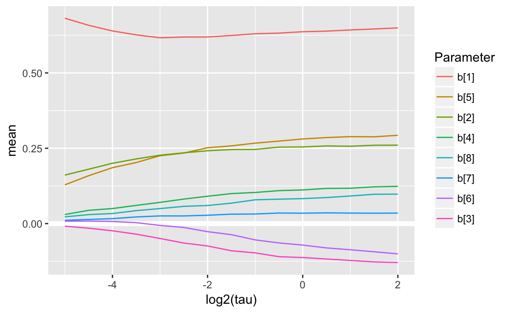

```r
plot_coefpaths(coefpath_hs, "mode")
```

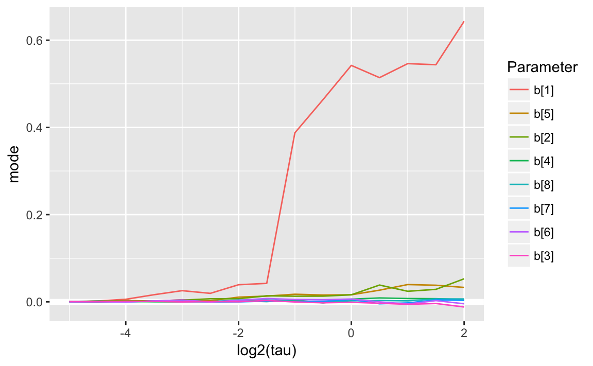

```r
get_best_tau(coefpath_hs)
#> # A tibble: 1 × 3
#>     tau  elpd     p
#>   <dbl> <dbl> <dbl>
#> 1 0.125  -234  2.51
```


```r
plot_coefpath_loo(coefpath_hs)
```

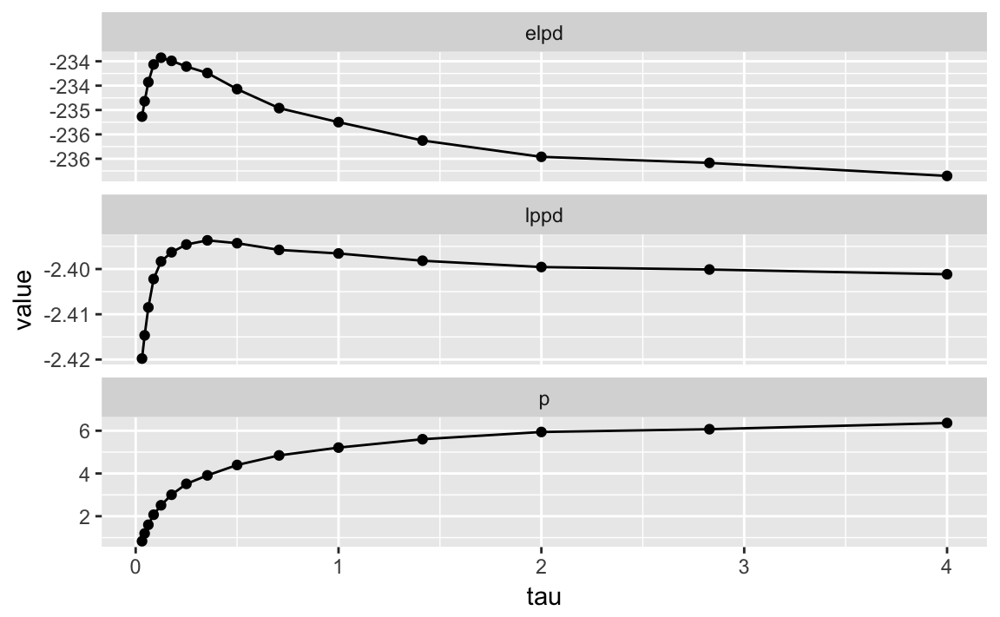


```r
mod_lm_coef_hs_2 <- stan_model("stan/lm-coef-hs-2.stan")
#> In file included from file27845219544d.cpp:8:
#> In file included from /Users/jrnold/Library/R/3.4/library/StanHeaders/include/src/stan/model/model_header.hpp:4:
#> In file included from /Users/jrnold/Library/R/3.4/library/StanHeaders/include/stan/math.hpp:4:
#> In file included from /Users/jrnold/Library/R/3.4/library/StanHeaders/include/stan/math/rev/mat.hpp:4:
#> In file included from /Users/jrnold/Library/R/3.4/library/StanHeaders/include/stan/math/rev/core.hpp:12:
#> In file included from /Users/jrnold/Library/R/3.4/library/StanHeaders/include/stan/math/rev/core/gevv_vvv_vari.hpp:5:
#> In file included from /Users/jrnold/Library/R/3.4/library/StanHeaders/include/stan/math/rev/core/var.hpp:7:
#> In file included from /Users/jrnold/Library/R/3.4/library/BH/include/boost/math/tools/config.hpp:13:
#> In file included from /Users/jrnold/Library/R/3.4/library/BH/include/boost/config.hpp:39:
#> /Users/jrnold/Library/R/3.4/library/BH/include/boost/config/compiler/clang.hpp:196:11: warning: 'BOOST_NO_CXX11_RVALUE_REFERENCES' macro redefined [-Wmacro-redefined]
#> #  define BOOST_NO_CXX11_RVALUE_REFERENCES
#>           ^
#> <command line>:6:9: note: previous definition is here
#> #define BOOST_NO_CXX11_RVALUE_REFERENCES 1
#>         ^
#> In file included from file27845219544d.cpp:8:
#> In file included from /Users/jrnold/Library/R/3.4/library/StanHeaders/include/src/stan/model/model_header.hpp:4:
#> In file included from /Users/jrnold/Library/R/3.4/library/StanHeaders/include/stan/math.hpp:4:
#> In file included from /Users/jrnold/Library/R/3.4/library/StanHeaders/include/stan/math/rev/mat.hpp:4:
#> In file included from /Users/jrnold/Library/R/3.4/library/StanHeaders/include/stan/math/rev/core.hpp:42:
#> /Users/jrnold/Library/R/3.4/library/StanHeaders/include/stan/math/rev/core/set_zero_all_adjoints.hpp:14:17: warning: unused function 'set_zero_all_adjoints' [-Wunused-function]
#>     static void set_zero_all_adjoints() {
#>                 ^
#> In file included from file27845219544d.cpp:8:
#> In file included from /Users/jrnold/Library/R/3.4/library/StanHeaders/include/src/stan/model/model_header.hpp:4:
#> In file included from /Users/jrnold/Library/R/3.4/library/StanHeaders/include/stan/math.hpp:4:
#> In file included from /Users/jrnold/Library/R/3.4/library/StanHeaders/include/stan/math/rev/mat.hpp:4:
#> In file included from /Users/jrnold/Library/R/3.4/library/StanHeaders/include/stan/math/rev/core.hpp:43:
#> /Users/jrnold/Library/R/3.4/library/StanHeaders/include/stan/math/rev/core/set_zero_all_adjoints_nested.hpp:17:17: warning: 'static' function 'set_zero_all_adjoints_nested' declared in header file should be declared 'static inline' [-Wunneeded-internal-declaration]
#>     static void set_zero_all_adjoints_nested() {
#>                 ^
#> In file included from file27845219544d.cpp:8:
#> In file included from /Users/jrnold/Library/R/3.4/library/StanHeaders/include/src/stan/model/model_header.hpp:4:
#> In file included from /Users/jrnold/Library/R/3.4/library/StanHeaders/include/stan/math.hpp:4:
#> In file included from /Users/jrnold/Library/R/3.4/library/StanHeaders/include/stan/math/rev/mat.hpp:11:
#> In file included from /Users/jrnold/Library/R/3.4/library/StanHeaders/include/stan/math/prim/mat.hpp:59:
#> /Users/jrnold/Library/R/3.4/library/StanHeaders/include/stan/math/prim/mat/fun/autocorrelation.hpp:17:14: warning: function 'fft_next_good_size' is not needed and will not be emitted [-Wunneeded-internal-declaration]
#>       size_t fft_next_good_size(size_t N) {
#>              ^
#> In file included from file27845219544d.cpp:8:
#> In file included from /Users/jrnold/Library/R/3.4/library/StanHeaders/include/src/stan/model/model_header.hpp:4:
#> In file included from /Users/jrnold/Library/R/3.4/library/StanHeaders/include/stan/math.hpp:4:
#> In file included from /Users/jrnold/Library/R/3.4/library/StanHeaders/include/stan/math/rev/mat.hpp:11:
#> In file included from /Users/jrnold/Library/R/3.4/library/StanHeaders/include/stan/math/prim/mat.hpp:298:
#> In file included from /Users/jrnold/Library/R/3.4/library/StanHeaders/include/stan/math/prim/arr.hpp:39:
#> In file included from /Users/jrnold/Library/R/3.4/library/StanHeaders/include/stan/math/prim/arr/functor/integrate_ode_rk45.hpp:13:
#> In file included from /Users/jrnold/Library/R/3.4/library/BH/include/boost/numeric/odeint.hpp:61:
#> In file included from /Users/jrnold/Library/R/3.4/library/BH/include/boost/numeric/odeint/util/multi_array_adaption.hpp:29:
#> In file included from /Users/jrnold/Library/R/3.4/library/BH/include/boost/multi_array.hpp:21:
#> In file included from /Users/jrnold/Library/R/3.4/library/BH/include/boost/multi_array/base.hpp:28:
#> /Users/jrnold/Library/R/3.4/library/BH/include/boost/multi_array/concept_checks.hpp:42:43: warning: unused typedef 'index_range' [-Wunused-local-typedef]
#>       typedef typename Array::index_range index_range;
#>                                           ^
#> /Users/jrnold/Library/R/3.4/library/BH/include/boost/multi_array/concept_checks.hpp:43:37: warning: unused typedef 'index' [-Wunused-local-typedef]
#>       typedef typename Array::index index;
#>                                     ^
#> /Users/jrnold/Library/R/3.4/library/BH/include/boost/multi_array/concept_checks.hpp:53:43: warning: unused typedef 'index_range' [-Wunused-local-typedef]
#>       typedef typename Array::index_range index_range;
#>                                           ^
#> /Users/jrnold/Library/R/3.4/library/BH/include/boost/multi_array/concept_checks.hpp:54:37: warning: unused typedef 'index' [-Wunused-local-typedef]
#>       typedef typename Array::index index;
#>                                     ^
#> 8 warnings generated.
```


```r
fit_hs <- sampling(mod_lm_coef_hs_2, refresh = -1,
                   data = c(prostate_data, list(df_local = 3, df_global = 3)),
                 control = list(adapt_delta = 0.995))
#> 
#> Gradient evaluation took 4.1e-05 seconds
#> 1000 transitions using 10 leapfrog steps per transition would take 0.41 seconds.
#> Adjust your expectations accordingly!
#> 
#> 
#> 
#>  Elapsed Time: 1.00399 seconds (Warm-up)
#>                0.582382 seconds (Sampling)
#>                1.58637 seconds (Total)
#> The following numerical problems occurred the indicated number of times on chain 1
#>                                                                          count
#> Exception thrown at line 39: multiply: B[1] is nan, but must not be nan!     2
#> Exception thrown at line 39: multiply: B[8] is nan, but must not be nan!     1
#> When a numerical problem occurs, the Hamiltonian proposal gets rejected.
#> See http://mc-stan.org/misc/warnings.html#exception-hamiltonian-proposal-rejected
#> If the number in the 'count' column is small, there is no need to ask about this message on stan-users.
#> 
#> Gradient evaluation took 2e-05 seconds
#> 1000 transitions using 10 leapfrog steps per transition would take 0.2 seconds.
#> Adjust your expectations accordingly!
#> 
#> 
#> 
#>  Elapsed Time: 0.988918 seconds (Warm-up)
#>                0.412526 seconds (Sampling)
#>                1.40144 seconds (Total)
#> The following numerical problems occurred the indicated number of times on chain 2
#>                                                                          count
#> Exception thrown at line 39: multiply: B[1] is nan, but must not be nan!     5
#> Exception thrown at line 39: multiply: B[5] is nan, but must not be nan!     1
#> Exception thrown at line 39: multiply: B[7] is nan, but must not be nan!     1
#> When a numerical problem occurs, the Hamiltonian proposal gets rejected.
#> See http://mc-stan.org/misc/warnings.html#exception-hamiltonian-proposal-rejected
#> If the number in the 'count' column is small, there is no need to ask about this message on stan-users.
#> 
#> Gradient evaluation took 1.9e-05 seconds
#> 1000 transitions using 10 leapfrog steps per transition would take 0.19 seconds.
#> Adjust your expectations accordingly!
#> 
#> 
#> 
#>  Elapsed Time: 1.15877 seconds (Warm-up)
#>                1.16426 seconds (Sampling)
#>                2.32303 seconds (Total)
#> 
#> 
#> Gradient evaluation took 1.6e-05 seconds
#> 1000 transitions using 10 leapfrog steps per transition would take 0.16 seconds.
#> Adjust your expectations accordingly!
#> 
#> 
#> 
#>  Elapsed Time: 0.90871 seconds (Warm-up)
#>                0.473369 seconds (Sampling)
#>                1.38208 seconds (Total)
#> The following numerical problems occurred the indicated number of times on chain 4
#>                                                                          count
#> Exception thrown at line 39: multiply: B[1] is nan, but must not be nan!     1
#> When a numerical problem occurs, the Hamiltonian proposal gets rejected.
#> See http://mc-stan.org/misc/warnings.html#exception-hamiltonian-proposal-rejected
#> If the number in the 'count' column is small, there is no need to ask about this message on stan-users.
```


```r
summary(fit_hs, "tau")$summary
#>      mean se_mean    sd   2.5%   25%  50%   75% 97.5% n_eff Rhat
#> tau 0.298 0.00459 0.223 0.0361 0.147 0.24 0.382 0.885  2359    1
```


```r
loo(extract_log_lik(fit_hs))
#> Computed from 4000 by 97 log-likelihood matrix
#> 
#>          Estimate  SE
#> elpd_loo   -234.5 3.0
#> p_loo         3.7 0.4
#> looic       469.0 5.9
#> 
#> All Pareto k estimates are good (k < 0.5)
#> See help('pareto-k-diagnostic') for details.
```


```r
mcmc_dens(as.array(fit_hs), "tau")
```

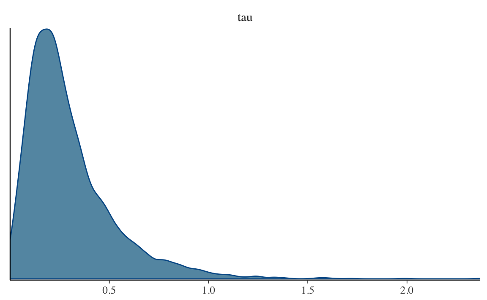


```r
mcmc_dens(as.array(fit_hs), regex_pars = "^b\\[\\d+\\]$")
```

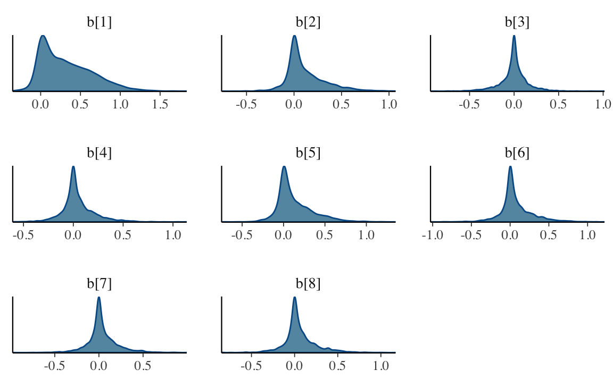


```r
mod_lm_coef_hs_3 <- stan_model("stan/lm-coef-hs-3.stan")
#> In file included from file278473f93038.cpp:8:
#> In file included from /Users/jrnold/Library/R/3.4/library/StanHeaders/include/src/stan/model/model_header.hpp:4:
#> In file included from /Users/jrnold/Library/R/3.4/library/StanHeaders/include/stan/math.hpp:4:
#> In file included from /Users/jrnold/Library/R/3.4/library/StanHeaders/include/stan/math/rev/mat.hpp:4:
#> In file included from /Users/jrnold/Library/R/3.4/library/StanHeaders/include/stan/math/rev/core.hpp:12:
#> In file included from /Users/jrnold/Library/R/3.4/library/StanHeaders/include/stan/math/rev/core/gevv_vvv_vari.hpp:5:
#> In file included from /Users/jrnold/Library/R/3.4/library/StanHeaders/include/stan/math/rev/core/var.hpp:7:
#> In file included from /Users/jrnold/Library/R/3.4/library/BH/include/boost/math/tools/config.hpp:13:
#> In file included from /Users/jrnold/Library/R/3.4/library/BH/include/boost/config.hpp:39:
#> /Users/jrnold/Library/R/3.4/library/BH/include/boost/config/compiler/clang.hpp:196:11: warning: 'BOOST_NO_CXX11_RVALUE_REFERENCES' macro redefined [-Wmacro-redefined]
#> #  define BOOST_NO_CXX11_RVALUE_REFERENCES
#>           ^
#> <command line>:6:9: note: previous definition is here
#> #define BOOST_NO_CXX11_RVALUE_REFERENCES 1
#>         ^
#> In file included from file278473f93038.cpp:8:
#> In file included from /Users/jrnold/Library/R/3.4/library/StanHeaders/include/src/stan/model/model_header.hpp:4:
#> In file included from /Users/jrnold/Library/R/3.4/library/StanHeaders/include/stan/math.hpp:4:
#> In file included from /Users/jrnold/Library/R/3.4/library/StanHeaders/include/stan/math/rev/mat.hpp:4:
#> In file included from /Users/jrnold/Library/R/3.4/library/StanHeaders/include/stan/math/rev/core.hpp:42:
#> /Users/jrnold/Library/R/3.4/library/StanHeaders/include/stan/math/rev/core/set_zero_all_adjoints.hpp:14:17: warning: unused function 'set_zero_all_adjoints' [-Wunused-function]
#>     static void set_zero_all_adjoints() {
#>                 ^
#> In file included from file278473f93038.cpp:8:
#> In file included from /Users/jrnold/Library/R/3.4/library/StanHeaders/include/src/stan/model/model_header.hpp:4:
#> In file included from /Users/jrnold/Library/R/3.4/library/StanHeaders/include/stan/math.hpp:4:
#> In file included from /Users/jrnold/Library/R/3.4/library/StanHeaders/include/stan/math/rev/mat.hpp:4:
#> In file included from /Users/jrnold/Library/R/3.4/library/StanHeaders/include/stan/math/rev/core.hpp:43:
#> /Users/jrnold/Library/R/3.4/library/StanHeaders/include/stan/math/rev/core/set_zero_all_adjoints_nested.hpp:17:17: warning: 'static' function 'set_zero_all_adjoints_nested' declared in header file should be declared 'static inline' [-Wunneeded-internal-declaration]
#>     static void set_zero_all_adjoints_nested() {
#>                 ^
#> In file included from file278473f93038.cpp:8:
#> In file included from /Users/jrnold/Library/R/3.4/library/StanHeaders/include/src/stan/model/model_header.hpp:4:
#> In file included from /Users/jrnold/Library/R/3.4/library/StanHeaders/include/stan/math.hpp:4:
#> In file included from /Users/jrnold/Library/R/3.4/library/StanHeaders/include/stan/math/rev/mat.hpp:11:
#> In file included from /Users/jrnold/Library/R/3.4/library/StanHeaders/include/stan/math/prim/mat.hpp:59:
#> /Users/jrnold/Library/R/3.4/library/StanHeaders/include/stan/math/prim/mat/fun/autocorrelation.hpp:17:14: warning: function 'fft_next_good_size' is not needed and will not be emitted [-Wunneeded-internal-declaration]
#>       size_t fft_next_good_size(size_t N) {
#>              ^
#> In file included from file278473f93038.cpp:8:
#> In file included from /Users/jrnold/Library/R/3.4/library/StanHeaders/include/src/stan/model/model_header.hpp:4:
#> In file included from /Users/jrnold/Library/R/3.4/library/StanHeaders/include/stan/math.hpp:4:
#> In file included from /Users/jrnold/Library/R/3.4/library/StanHeaders/include/stan/math/rev/mat.hpp:11:
#> In file included from /Users/jrnold/Library/R/3.4/library/StanHeaders/include/stan/math/prim/mat.hpp:298:
#> In file included from /Users/jrnold/Library/R/3.4/library/StanHeaders/include/stan/math/prim/arr.hpp:39:
#> In file included from /Users/jrnold/Library/R/3.4/library/StanHeaders/include/stan/math/prim/arr/functor/integrate_ode_rk45.hpp:13:
#> In file included from /Users/jrnold/Library/R/3.4/library/BH/include/boost/numeric/odeint.hpp:61:
#> In file included from /Users/jrnold/Library/R/3.4/library/BH/include/boost/numeric/odeint/util/multi_array_adaption.hpp:29:
#> In file included from /Users/jrnold/Library/R/3.4/library/BH/include/boost/multi_array.hpp:21:
#> In file included from /Users/jrnold/Library/R/3.4/library/BH/include/boost/multi_array/base.hpp:28:
#> /Users/jrnold/Library/R/3.4/library/BH/include/boost/multi_array/concept_checks.hpp:42:43: warning: unused typedef 'index_range' [-Wunused-local-typedef]
#>       typedef typename Array::index_range index_range;
#>                                           ^
#> /Users/jrnold/Library/R/3.4/library/BH/include/boost/multi_array/concept_checks.hpp:43:37: warning: unused typedef 'index' [-Wunused-local-typedef]
#>       typedef typename Array::index index;
#>                                     ^
#> /Users/jrnold/Library/R/3.4/library/BH/include/boost/multi_array/concept_checks.hpp:53:43: warning: unused typedef 'index_range' [-Wunused-local-typedef]
#>       typedef typename Array::index_range index_range;
#>                                           ^
#> /Users/jrnold/Library/R/3.4/library/BH/include/boost/multi_array/concept_checks.hpp:54:37: warning: unused typedef 'index' [-Wunused-local-typedef]
#>       typedef typename Array::index index;
#>                                     ^
#> 8 warnings generated.
```


```r
fit_hs3 <- sampling(mod_lm_coef_hs_3,
                    refresh = -1,
                    data = c(prostate_data, list(df_local = 3, df_global = 3, p0 = 2)),
                    control = list(adapt_delta = 0.995))
#> 
#> Gradient evaluation took 3.8e-05 seconds
#> 1000 transitions using 10 leapfrog steps per transition would take 0.38 seconds.
#> Adjust your expectations accordingly!
#> 
#> 
#> 
#>  Elapsed Time: 7.08115 seconds (Warm-up)
#>                9.70287 seconds (Sampling)
#>                16.784 seconds (Total)
#> The following numerical problems occurred the indicated number of times on chain 1
#>                                                                                          count
#> Exception thrown at line 51: student_t_lpdf: Scale parameter is inf, but must be finite!     4
#> When a numerical problem occurs, the Hamiltonian proposal gets rejected.
#> See http://mc-stan.org/misc/warnings.html#exception-hamiltonian-proposal-rejected
#> If the number in the 'count' column is small, there is no need to ask about this message on stan-users.
#> 
#> Gradient evaluation took 1.9e-05 seconds
#> 1000 transitions using 10 leapfrog steps per transition would take 0.19 seconds.
#> Adjust your expectations accordingly!
#> 
#> 
#> 
#>  Elapsed Time: 5.45486 seconds (Warm-up)
#>                9.76004 seconds (Sampling)
#>                15.2149 seconds (Total)
#> 
#> 
#> Gradient evaluation took 1.9e-05 seconds
#> 1000 transitions using 10 leapfrog steps per transition would take 0.19 seconds.
#> Adjust your expectations accordingly!
#> 
#> 
#> 
#>  Elapsed Time: 9.2612 seconds (Warm-up)
#>                9.87074 seconds (Sampling)
#>                19.1319 seconds (Total)
#> The following numerical problems occurred the indicated number of times on chain 3
#>                                                                                          count
#> Exception thrown at line 44: multiply: B[1] is nan, but must not be nan!                     1
#> Exception thrown at line 51: student_t_lpdf: Scale parameter is inf, but must be finite!     1
#> When a numerical problem occurs, the Hamiltonian proposal gets rejected.
#> See http://mc-stan.org/misc/warnings.html#exception-hamiltonian-proposal-rejected
#> If the number in the 'count' column is small, there is no need to ask about this message on stan-users.
#> 
#> Gradient evaluation took 2.1e-05 seconds
#> 1000 transitions using 10 leapfrog steps per transition would take 0.21 seconds.
#> Adjust your expectations accordingly!
#> 
#> 
#> 
#>  Elapsed Time: 2.91756 seconds (Warm-up)
#>                5.69903 seconds (Sampling)
#>                8.61659 seconds (Total)
#> Warning: There were 531 divergent transitions after warmup. Increasing adapt_delta above 0.995 may help. See
#> http://mc-stan.org/misc/warnings.html#divergent-transitions-after-warmup
#> Warning: There were 3342 transitions after warmup that exceeded the maximum treedepth. Increase max_treedepth above 10. See
#> http://mc-stan.org/misc/warnings.html#maximum-treedepth-exceeded
#> Warning: Examine the pairs() plot to diagnose sampling problems
```

### Comparison

Let's compare the various coefficient paths:


```r
all_coefpaths <-
  bind_rows(mutate(map_df(coefpath_normal, "summary"), model = "normal"),
          mutate(map_df(coefpath_lasso, "summary"), model = "lasso"),
          mutate(map_df(coefpath_hs, "summary"), model = "hs"))
ggplot(all_coefpaths, aes(x = log2(tau), y = mean, colour = model)) + 
  modelr::geom_ref_line(h = 0) +
  geom_line() +
  facet_wrap(~ parameter)
```

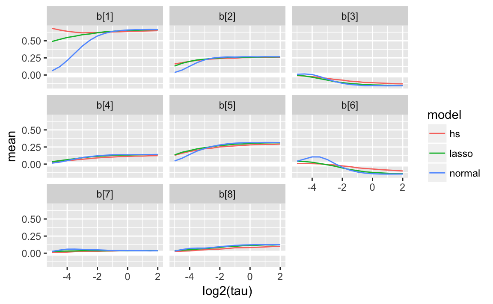


## Shrinkage Parameters

Given the linear Gaussian regression model
$$
y_i \sim \dnorm(\vec{\beta}\T \vec{x}, \sigma^2)
$$
for $i = 1, \dots, n$, where $\vec{x}$ is the $K$ dimensional vector of predictors.
Suppose a prior
$$
\begin{aligned}[t]
\beta_j | \lambda_j, \tau &\sim \dnorm(0, \lambda_j^2 \tau^2)
\end{aligned}
$$
The $\lambda_j$ are local scales - it allows some weights to escape the shrinkage.
The global parameter $\tau$ pulls all weights towards zero, and effectively controls the sparsity.

The posterior distribution is
$$
\begin{aligned}[t]
p(\vec{\beta} | \mat{\Lambda}, \tau, \sigma^2, \mat{X}, \vec{y}) &= \dnorm(\vec{\beta}, \bar{\vec{\beta}}, \mat{\Sigma}) \\
\bar{\vec{\beta}} &= \tau^2 \mat{\Lambda}(\tau^2 \mat{\Lambda} + \sigma^2 (\mat{X}\T \mat{X})^{-1})^{-1} \hat{\vec{\beta}} \\
\mat{\Sigma} &= (\tau^{-2} \mat{\Lambda}^{-1} + \frac{1}{\sigma^2} \mat{X}\T \mat{X})^{-1},
\end{aligned}
$$
where 
$$
\mat{\Lambda} = \diag(\lambda_1^2, \dots, \lambda_K^2) 
$$
and 
$$
\hat{\vec{\beta}} = (\mat{X}\T \mat{X})^{-1} \mat{X}\T \vec{y}
$$
is the MLE solution if $(\mat{X}\T \mat{X})^{-1}$ exists.

It the predictors are uncorrelated with zero mean and unit variance, then $\mat{X}\T \mat{X} \approx n \mat{I}$, and approximate
$$
\bar{\beta}_j = (1 - \kappa_j) \hat{\beta}_j
$$
where $\kappa_j$ is the shrinkage factor for coefficient $j$,
$$
\kappa_j = \frac{1}{1 + n \sigma^{-2} \tau^2 \lambda^2_j}
$$
When $\kappa = 1$, it is complete shrinkage, and the coefficient is zero.
When $\kappa = 0$, then there is no shrinkage, and the coefficient is equal to the MLE solution.
As $\tau \to 0$, then $\bar{\beta} \to 0$, and as $\tau \to \infty$, then $\bar{\beta} \to \hat{\beta}$.

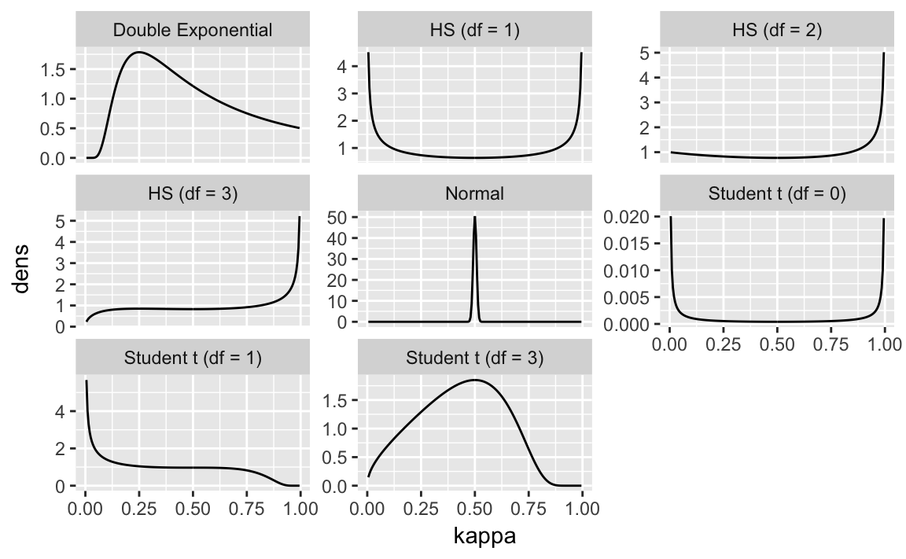

Note that for these distributions:

- Normal: prior puts weight only on a single point
- HS for df = 0: prior on shrinkage parameter puts weight on either completely shrunk ($\kappa = 1$) or un-shrunk ($\kappa = 0$)
- HS for df = 3: prior on shrinkage parameter puts a lo of weight on it being completely shrunk ($\kappa = 1$), but truncates the density for completely un-shrunk.


## Choice of Hyperparameter on $\tau$

The value of $\tau$ and the choice of its hyper-parameter has a big influence on the sparsity of the coefficients.

@CarvalhoPolsonScott2009a suggest 
$$
\tau \sim \dhalfcauchy(0, \sigma),
$$
while @PolsonScott2011a suggest,
$$
\tau \sim \dhalfcauchy(0, 1) .
$$

@PasKleijnVaart2014a suggest 
$$
\tau \sim \dhalfcauchy(0, p^* / n)
$$
where $p^*$ is the true number of non-zero parameters,
and $n$ is the number of observations.
They suggest $\tau = p^* / n$ or $\tau p^*  / n \sqrt{log(n / p^*)}$.
Additionally, they suggest restricting $\tau$ to $[0, 1]$.

@PiironenVehtari2016a understand the choice of the prior on $\tau$ as the implied prior on the number of effective parameters.
The shrinkage can be understood as its influence on the number of effective parameters, $m_{eff}$,
$$
m_{eff} = \sum_{j = 1}^K (1 - \kappa_j) .
$$
This is a measure of effective model size.

The mean and variance of $m_{eff}$ given $\tau$ and $\sigma$ are,
$$
\begin{aligned}[t]
\E[m_{eff} | \tau, \sigma] &= \frac{\sigma^{-1} \tau \sqrt{n}}{1 + \sigma^{-1} \tau \sqrt{n}} K , \\
\Var[m_{eff} | \tau, \sigma] &= \frac{\sigma^{-1} \tau \sqrt{n}}{2 (1 + \sigma^{-1} \tau \sqrt{n})2} K .
\end{aligned}
$$

Based on this, a prior should be chosen so that the prior mass is located near,
$$
\tau_0 = \frac{p_0}{K - p_0}\frac{\sigma}{\sqrt{n}}
$$

Densities of the shrinkage parameter, $\kappa$, for various shrinkage distributions where $\sigma^2 = 1$, $\tau = 1$, for $n = 1$.

@DattaGhosh2013a warn against empirical Bayes estimators of $\tau$ for the horseshoe prior as it can collapse to 0.
@ScottBerger2010a consider marginal maximum likelihood estimates of $\tau$.
@PasKleijnVaart2014a suggest that an empirical Bayes estimator truncated below at $1 / n$.

## R Implementations

See 

- **[rstanarm](https://cran.r-project.org/package=rstanarm)**: estimates GLM regressions with various priors
- **[rmonomvn](https://cran.r-project.org/package=rmonomvn)**: estimates Bayesian ridge, lasso, horseshoe, and ridge regression.
- **[bayesreg](https://cran.r-project.org/package=bayesreg)**: See @MakalicSchmidt2016a for documentation and a good review of Bayesian regularized regression.
- [fastHorseshoe]( http://jingyuhe.com/fastHorseshoe.html)

## Bayesian Model Averaging

*Bayesian model averaging (BMA)* is method that calculates a posterior distribution of parameters by averaging over a discrete set of models, weighting them by their model evidence.

Suppose there are $K$ models, $M_k$, $k = 1, \dots, K$ with the likelihood function $L(y | \theta_k, M_k)$ for observed data $y$.
The posterior distribution of parameters $\theta$, conditional on each model is,
$$
p(\theta_k | y, M_k) = \frac{L(y | \theta_k | M_k) p(\theta_k | M_k)}{\int L(y | \theta_k, M_k) p(\theta_k | M_k) d\,\theta_k}
$$

The essential quality for BMA applications is the denominator of this equation is the the *marginal likelihood* or *model evidence*,
$$
p(y | M_k) = \int L(y | \theta_k, M_k) p(\theta_k | M_k) d\,\theta_k .
$$

From this, derive the posterior probability of models given the data,
$$
p(M_k | y) = \frac{p(y | M_k) p(M_k)}{\sum_{m = 1}^K p(y | M_m) p(M_m)}
$$
The posterior probability of a model requires specifying a prior $p(M_k)$ for each model.

Bayes Factors can be used to calculate model probabilities for BMA and vice-versa.
The Bayes Factor for models $l$ and $m$ is
$$
BF_{lm} = \frac{p(M_l | y)}{p(M_m | y)} .
$$
Given a baseline model, $M_1$, the model evidence can be written in terms of Bayes Factors relative to that model,
$$
p(M_l|y) = \frac{BF_{1l} p(M_l)}{\sum_{m = 1}^K BF_{m1} p(M_m)} .
$$

**marginal probabilities of a parameter:** The marginal probability of a parameter ($\theta$), averaged across all models is,
$$
p(\theta | y) = \sum_{k = 1}^K p(\theta | y, M_k) p(M_k | y) .
$$
The posterior distribution of $\Delta$ averaged across all models is the average of $\Delta$ weighted by each posterior model probability.
The mean and variance of the posterior models are,
$$
\begin{aligned}[t]
\E[\theta | y] &= \sum_{k = 1}^K \bar{\theta} p(M_k | y) \\
\Var[\theta | y] &= \sum_{k = 1}^K 
(\Var(\theta | y, M_k) + \bar{\theta}_k^2) p(M_k | y) - \E(\theta | y)^2
\end{aligned}
$$


Why is BMA difficult? 

- The posterior is sensitive to the model prior, $p(M_k)$.
- Calculating the model evidence, $p(y | M_k)$, is computationally difficult, except in special cases
- The model space can be very large. In regression, it is $2^K$. This means that it may be impossible to compute model probabilities for the full set of models. Thus, it may require sampling from the (discrete) model space.

Uses of BMA:

1. model selection or choice: select the most likely model
2. average posterior estimates
3. average prediction. Generally predictions from models using BMA have lower risk (Raftery) 

For the common case of linear regression,
$$
\begin{aligned}[t]
y &= \alpha + X \beta + \epsilon & \epsilon &\sim \dnorm(0, \sigma^2 I)
\end{aligned}
$$
where $X$ is a $N \times K$ matrix and $\beta$ is a $K \times 1$ vector.
The model selection problem in this case is the choice of the $K$ variables to include in the regression model.
Thus, there are $2^K$ models to consider.
Very quickly, 

See @FragosoNeto2015a for a recent review. See @VolinskyRafteryMadiganEtAl1999a for an earlier review.

There are several R packages that implement BMA. See @AminiShahramParmeterChristopher2011a for a review of R packages.

- **[BAS](https://cran.r-project.org/package=BAS)** See its vignette @Zeugner2011a.
- **[BMA](https://cran.r-project.org/package=BMA)** See its vignette @RafteryHoetingVolinskyEtAl2017a.
- **[BMS](https://cran.r-project.org/package=BMS)** See its vignette @Clyde2017a.
- **[ensembleBMA](https://cran.r-project.org/package=ensembleBMA)** uses *BMA* to generates ensemble BMA forecasts

### Zellner's g-prior

An alternative prior is the Zellner's g-prior.
Consider the regression,
$$
y_i | \alpha, \vec{\beta}, \sigma \sim \dnorm(\alpha + \mat{X} \vec{\beta}, \sigma^2)
$$
The $g$-prior is a non-informative, data-dependent prior,
$$
\vec{\beta} \sim \dnorm(0, \sigma^2 g \mat{X}\T \mat{X})
$$
It depends on only a single parameter $g$.
The prior for $g$ must be proper. Some common choices include,
$$
\begin{aligned}
g &= n \\
g &= k^2 \\
g &= \max(n, k^2)
\end{aligned}
$$
or putting a hyperprior on $g$.

See @LeySteel2012a for a recent overview of g-priors.


## Slab and Spike Priors

In the case of the linear regression, an alternative to BMA is to use a spike-and-slab prior [@MitchellBeauchamp1988a, @GeorgeMcCulloch1993a, @IshwaranRao2005a], which is a prior that is a discrete mixture of a point mass at 0 and a non-informative distribution. The weight over these who alternatives is similar to a 

The spike and slab prior is a "two-group" solution

$$
p(\beta_k) = (1 - w) \delta_0 + w \pi(\beta_k)
$$
where $\delta_0$ is a Dirac delta function putting a point mass at 0, and $\pi(\beta_k)$ is an uninformative distribution, e.g. $\pi(\beta_k) = \dnorm(\beta_k | 0, \sigma^2)$ where $\sigma$ is large.

The posterior distribution of $w$ is the probability that $\beta_k \neq 0$, and the conditional posterior distribution $p(\beta_k | y, w = 1)$ is the distribution of $\beta_k$ given that $\beta_k \neq 0$.

See the R package **[spikeslab](https://cran.r-project.org/package=spikeslab)** and he accompanying article [@IshwaranKogalurRao2010a] for an implementation and review of spike-and-slab regressions.

## Technical Notes

Marginal density of the horseshoe+ prior @CarvalhoPolsonScott2010a has no closed form but some bounds
are available.
If $\tau^2 = 1$, then the marginal density of the horseshoe+ prior has the following properties:
$$
\begin{aligned}[t]
\frac{K}{2} \log \left(1 + \frac{4}{\theta^2} \right) < p_{HS}(\theta) \leq K \log \left(1 + \frac{2}{\theta^2} \right) \\
\lim_{|\theta| \to 0} p_{HS}(\theta) = \infty
\end{aligned}
$$
where $K = 1 / \sqrt{2 \pi^3}$.

Marginal density of the horseshoe+ prior @BhadraDattaPolsonEtAl2015a:
If $\tau^2 = 1$, then the marginal density of the horseshoe+ prior has the following properties:
$$
\begin{aligned}[t]
\frac{1}{\pi^2 \sqrt{2 \pi}} \log \left(1 + \frac{4}{\theta^2} \right) < p_{HS+}(\theta) \leq \frac{1}{\pi^2 |\theta|} \\
\lim_{|\theta| \to 0} p_{HS+}(\theta) = \infty
\end{aligned}
$$

**rstanarm** uses a slightly different parameterization for the Bayeian lasso [^rstanarm-lasso]
$$
\begin{aligned}[t]
\beta_k &\sim b + s \frac{1}{\lambda} \sqrt{2 \omega} \beta_k^*  \\
\frac{1}{\lambda} &\sim \dchisq(df) \\
\omega &\sim \dexp(1) \\
\beta^*_k &\sim \dnorm(0, 1)
\end{aligned}
$$
Apart from the decomponsition into a scale-location family, this is simply putting a $\chi^2$ prior on the penalization parameter, $\frac{1}{\lambda}$.


[^rstanarm-lasso]: See the source code [here](https://github.com/stan-dev/rstanarm/blob/b78c2b5190db8b62da93f0c686d0c78da4e5bb9b/inst/chunks/tparameters_glm.stan#L22) 
and [here](https://github.com/stan-dev/rstanarm/blob/b78c2b5190db8b62da93f0c686d0c78da4e5bb9b/inst/chunks/priors_glm.stan#L25).


Prior for $\theta_i$               Density for $\lambda_i$                      Density for $\kappa_i$
---------------------------------- -------------------------------------------- -------------------------------------------------------------------------------
Double-exponential                 $\lambda_i \exp(\lambda_i^2 / 2)             $\kappa_i^{-2} \exp\left( \frac{- 1}{2 \kappa_i} \right)$
Cauchy                             $\lambda_i^{-2} \exp(-1 / \lambda_i^2)$      $\kappa_i^{-\frac{1}{2}} (1 - \kappa_i)^{- \frac{3}{2}} \exp \left(\frac{\kappa_i}{2 (1 - \kappa_i)}\right)$
Strawderman-Berger                 $\lambda_i (1 + \lambda_i^2)^{-\frac{3}{2}}$ $\kappa_i^{-\frac{1}{2}}$
Normal-exponential-gamma           $\lambda_i (1 + \lambda_i^2)^{-(c + 1)}$     $\kappa_i^{c - 1}$
Normal-Jeffreys                    $1 / \lambda_i$                              $\kappa_i^{-1} (1 - \kappa_i)^{-1}$
Horseshoe                           $(1 + \lambda_i^2)^{-1}$                     $\kappa_i^{-1/2} (1 - \kappa_i)^{-1/2}$


Thresh-holding. The horseshoe has an implicit threshold of $|T_\tau(y) - y| < \sqrt{2 \sigma ^ 2 \log (1 / \tau))$ [@PasKleijnVaart2014a].


## Multiple Comparisons and Thresholding rules

Multiple comparisons, family-wise error rate, and false discovery rates are frequentist 
concepts. There are some attempts to bridge these two worlds - see Efron in particular.  However, even if methodologically different, shrinkage addresses some of broadest
concerns about making multiple comparisons.

Although discussing hierarchical models, @GelmanHillYajima2012a compares the shrinkage in hierarchical models to multiple comparisons, also see this [post](http://andrewgelman.com/2013/08/20/correcting-for-multiple-comparisons-in-a-bayesian-regression-model/).

Another (related) issue is sparsification. The decision rule as to whether a variable
is 0 (included), or not.

- The sparse-shrinkage priors from @CarvalhoPolsonScott2010a are motivated by a two-group
model (either $\beta = 0$ or $\beta \neq 0$). They suggest a decision rule of considering
$\beta \neq 0$ when $E(\kappa_j) < 0.5$ where $\kappa_j$ is a shrinkage parameter described in the paper.
- @HahnCarvalho2015a propose estimating the posterior distribution via shrinkage, and then summarizing the posterior distribution.
- @PiironenVehtari2015a propose something similar in spirit, in which a second step projects the initial shrinkage model to a sparse model

## Examples of Applications of Sensitivity Analysis

The memorably titled "Let's Take the Con Out of Econometrics" [@Leamer1983a] argues that economic models fail to account for model uncertainty. It prposes using an ensemble-like method called extreme-bounds. On economic growth: (confidence bounds) @Sala-I-Martin1997a, (Bayesian model averaging) @FernandezLeySteel2001a, @LeySteel2009a, @EicherPapageorgiouRaftery2009a, @BrockDurlaufWest2003a. Wars: @HegreSambanis2006a use extreme bounds for civil war onset. @WardGreenhillBakke2010a use model comparison and a step-wise method, but are focused on the difference between p-values and prediction; @Goenner2004a use BMA for inter-state wars (democratic peace). @MontgomeryHollenbachWard2012a and @MontgomeryNyhan2010a apply BMA to multiple political science issues including voting, presidential elections, and civil war onset. @TobiasLi2004a use BMA with returns to schooling. See @FragosoNeto2015a for a recent(ish) and comprehensive review of BMA applications across a variety of domains.

Also, not that many of these analyses are slightly older as empirical research in economics and political science has been moving to place less emphasis on model-based inference 
(all-cause regressions) and more on design-based (causal) inference methods. As noted earlier, regularization techniques are also applicable in these cases, but is different.

**Variable selection:**  See @PiironenVehtari2016b and  @BayarriBergerForteEtAl2012a.
